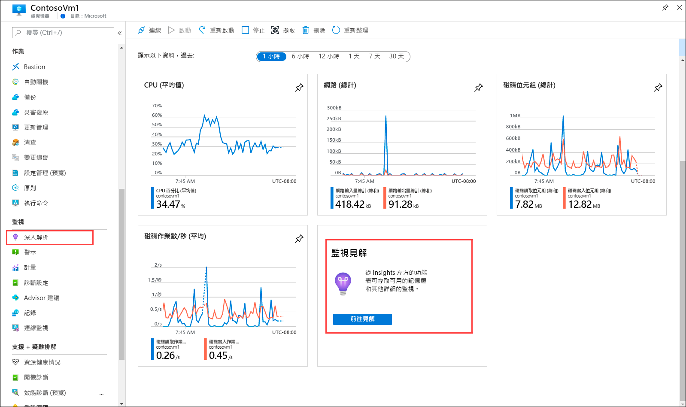
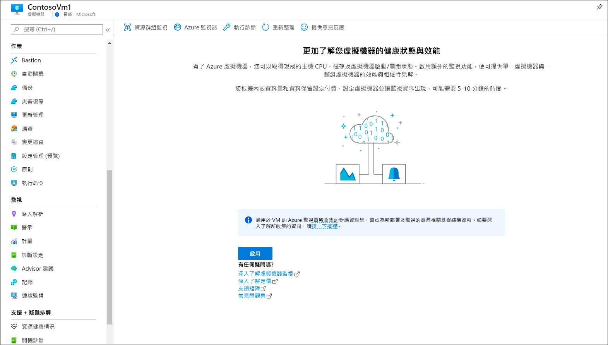
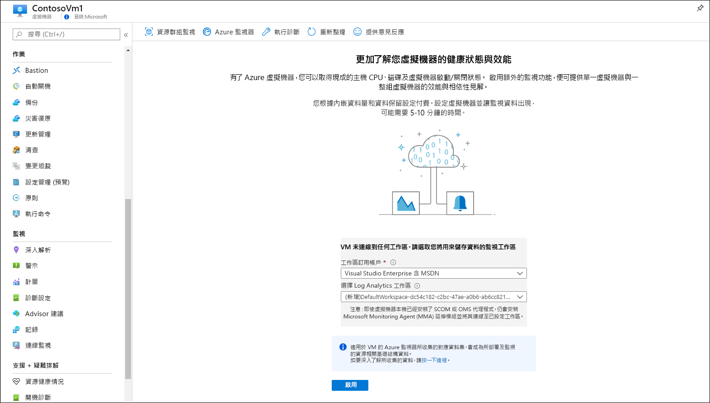
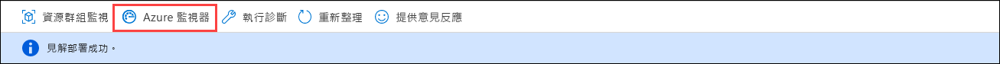
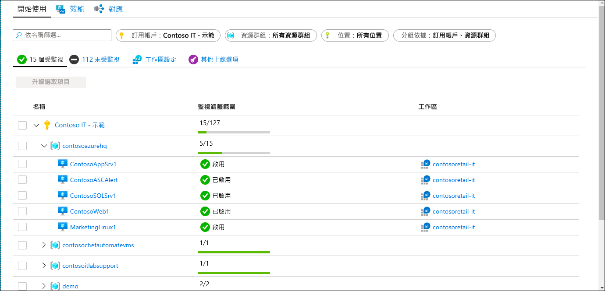
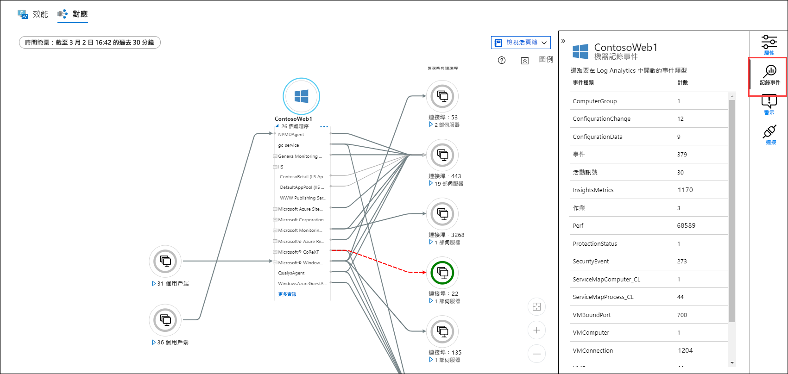
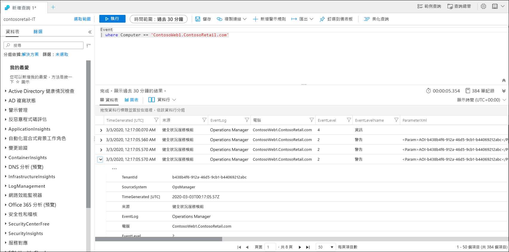

# 使用 Azure 監視器來監視 Azure 虛擬機器。
[Azure 監視器](../overview.md)會在 Azure 虛擬機器建立時便開始從中收集資料。 在本快速入門中，我們會簡單扼要地逐步對您說明針對 Azure VM 所自動收集的資料，以及如何在 Azure 入口網站中加以檢視。 接著，您會為 VM 啟用[適用於 VM 的 Azure 監視器](../insights/vminsights-overview.md)，讓 VM 上的代理程式能夠收集和分析來自客體作業系統的資料，包括流程及其相依性。

本快速入門假設您有現有的 Azure 虛擬機器。 如果沒有，您可以遵循 VM 快速入門來[建立 Windows VM](../../virtual-machines/windows/quick-create-portal.md) 或[建立 Linux VM](../../virtual-machines/linux/quick-create-cli.md)。

若要深入了解如何監視從 Azure 資源收集的資料，請參閱[使用 Azure 監視器來監視 Azure 虛擬機器](../insights/monitor-vm-azure.md)。

## 完成「監視 Azure 資源」快速入門。
完成[使用 Azure 監視器監視 Azure 資源](quick-monitor-azure-resource.md)，以檢視您訂用帳戶中 VM 的概觀頁面、活動記錄和計量。 Azure VM 所收集的監視資料和任何其他 Azure 資源一樣，但這只適用於主機 VM。 本快速入門的其餘部分將著重於監視客體作業系統和其工作負載。

## 啟用適用於 VM 的 Azure 監視器
系統會收集主機 VM 的計量和活動記錄，但您需要代理程式並進行某些設定，才能收集並分析客體作業系統及其工作負載的監視資料。 適用於 VM 的 Azure 監視器會安裝這些代理程式，並額外提供可用於監視虛擬機器的強大功能。

1. 移至虛擬機器的功能表。
2. 從 [概觀] 頁面中的圖格按一下 [移至深入解析]，或從 [監視] 功能表按一下 [深入解析]。

    

3. 如果虛擬機器尚未啟用適用於 VM 的 Azure 監視器，請按一下 [啟用]。 

    

4. 如果虛擬機器尚未連結到 Log Analytics 工作區，系統會提示您選取現有工作區或新建工作區。 選取預設值，也就是和虛擬機器位於相同區域，且具有唯一名稱的工作區。

    

5. 因為已啟用擴充功能，且虛擬機器上已安裝代理程式，所以需要幾分鐘的時間才能上線。 完成時，您會收到一則訊息，內容指出深入解析已成功完成部署。 按一下 [Azure 監視器] 以開啟適用於 VM 的 Azure 監視器。

    

6. 您會看到您的 VM，以及訂用帳戶中已上線的任何其他 VM。 如果您想要檢視訂用帳戶中未上線的虛擬機器，請選取 [未受監視] 索引標籤。

    

## 設定工作區
您在建立新的 Log Analytics 工作區時，必須將其設定為要收集記錄。 此設定只需要執行一次，因為設定內容會傳送至任何與其連線的虛擬機器。

1. 選取 [工作區設定]，然後選取您的工作區。

2. 選取 [進階設定]

    

### 從 Windows VM 收集資料

2. 選取 [資料]，然後選取 [Windows 事件記錄]。

3. 輸入記錄的名稱來新增事件記錄。  輸入 **System**，然後選取加號 **+**。

4. 在表格中，檢查 [錯誤] 和 [警告] 嚴重性。

5. 選取頁面頂端的 [儲存] 來儲存設定。

### 從 Linux VM 收集資料

1. 選取 [Syslog]。  

2. 輸入記錄的名稱來新增事件記錄。  輸入 **Syslog**，然後選取加號 **+**。  

3. 在表格中，取消選取 [資訊]、[注意] 和 [偵錯] 嚴重性。 

4. 選取頁面頂端的 [儲存] 來儲存設定。

## 檢視收集的資料

7. 按一下您的虛擬機器，然後選取 [監視] 功能表 [Insights] 圖格底下的 [效能] 索引標籤。 這會顯示從 VM 的客體作業系統所收集到的一組選定效能計數器群組。 向下捲動可檢視更多計數器，將滑鼠移至圖表上則可檢視不同時間的平均值和百分位數。

    ![螢幕擷取畫面顯示 [效能] 窗格。](media/quick-monitor-azure-vm/performance.png)

9. 選取 [對應] 可開啟對應功能，以顯示虛擬機器上正在執行的流程及其相依性。 選取 [屬性] 以開啟 [屬性] 窗格 (如果尚未開啟)。

    ![螢幕擷取畫面顯示 [地圖] 窗格。](media/quick-monitor-azure-vm/map.png)

11. 展開虛擬機器的流程。 選取其中一個流程來檢視其詳細資料，並醒目提示其相依性。

    ![螢幕擷取畫面顯示 [地圖] 窗格和已展開的虛擬機器流程。](media/quick-monitor-azure-vm/processes.png)

12. 再次選取您的虛擬機器，然後選取 [記錄事件]。 

    

13. 您會看到適用於虛擬機器而儲存在 Log Analytics 工作區中的資料表清單。 這份清單會因為您使用的是 Windows 或 Linux 虛擬機器而有所不同。 按一下 [事件] 資料表。 這包括 Windows 事件記錄中的所有事件。 Log Analytics 隨即會開啟，其中會有可供擷取事件記錄項目的簡單查詢。

    

## 後續步驟
在本快速入門中，您已為虛擬機器啟用適用於 VM 的 Azure 監視器，並已設定 Log Analytics 工作區以收集客體作業系統的事件。 若要了解如何檢視和分析資料，請繼續進行本教學課程。

> [!div class="nextstepaction"]
> [在 Log Analytics 中檢視或分析資料](../log-query/log-analytics-tutorial.md)