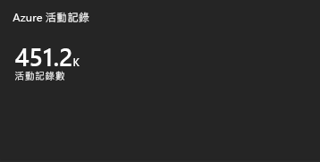
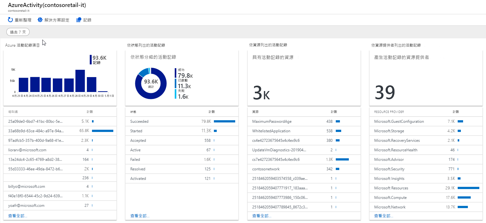

# <a name="collect-and-analyze-azure-activity-log-in-azure-monitor"></a>收集並分析 Azure 監視器中的 Azure 活動記錄
[Azure 活動記錄](platform-logs-overview.md)是一個[平臺記錄](platform-logs-overview.md)，可讓您深入瞭解 Azure 中發生的訂用帳戶層級事件。 雖然您可以在 Azure 入口網站中查看活動記錄，但您應該將它設定為傳送至 Log Analytics 工作區，以啟用 Azure 監視器的其他功能。 本文說明如何執行這項設定，以及如何將活動記錄傳送至 Azure 儲存體和事件中樞。

在 Log Analytics 工作區中收集活動記錄可提供下列優點：

- 儲存在 Log Analytics 工作區中的活動記錄資料不會有任何資料內嵌或資料保留費用。
- 將活動記錄資料與 Azure 監視器所收集的其他監視資料相互關聯。
- 使用記錄查詢來執行複雜的分析，並取得活動記錄專案的深入見解。
- 使用記錄警示搭配活動專案，以允許更複雜的警示邏輯。
- 儲存活動記錄專案超過90天。
- 將多個 Azure 訂用帳戶和租使用者中的記錄專案合併成一個位置，以供分析一起進行。

> [!IMPORTANT]
> 跨租使用者收集記錄需要[Azure 燈塔](/azure/lighthouse)。

## <a name="collecting-activity-log"></a>正在收集活動記錄
系統會自動收集活動記錄，以便[在 Azure 入口網站中進行查看](activity-log-view.md)。 若要在 Log Analytics 工作區中收集該檔案，或將它傳送至 Azure 儲存體或事件中樞，請建立[診斷設定](diagnostic-settings.md)。 這是資源記錄檔所使用的相同方法，使其對所有[平臺記錄](platform-logs-overview.md)檔都是一致的。  

若要建立活動記錄的診斷設定，請從 Azure 監視器的 [**活動記錄**] 功能表中選取 [**診斷設定**]。 如需建立設定的詳細資訊，請參閱[建立診斷設定以收集 Azure 中的平臺記錄和計量](diagnostic-settings.md)。 如需您可以篩選之類別的描述，請參閱[活動記錄中的類別](activity-log-view.md#categories-in-the-activity-log)。 如果您有任何舊版設定，請務必在建立診斷設定之前將它們停用。 啟用這兩個可能會導致重複的資料。


> [!NOTE]
> 目前，您只能使用 [Azure 入口網站] 和 [Resource Manager] 範本來建立訂用帳戶層級的診斷設定。 


## <a name="legacy-settings"></a>舊版設定 
雖然診斷設定是將活動記錄傳送至不同目的地的慣用方法，但如果您不選擇以診斷設定取代，舊版方法仍會繼續工作。 診斷設定與舊版方法相比具有下列優點，建議您更新設定：

- 收集所有平臺記錄的一致方法。
- 跨多個訂用帳戶和租使用者收集活動記錄。
- 篩選集合，只收集特定類別的記錄。
- 收集所有活動記錄類別。 某些分類不會使用舊版方法收集。
- 記錄內嵌的延遲較快。 先前的方法大約會有15分鐘的延遲，而診斷設定只會加上1分鐘。


### <a name="log-profiles"></a>記錄檔的設定檔
記錄檔設定檔是將活動記錄傳送至 Azure 儲存體或事件中樞的舊版方法。 使用下列程式繼續使用記錄檔設定檔，或在準備遷移至診斷設定時加以停用。

1. 從 Azure 入口網站的 [ **Azure 監視器**] 功能表中，選取 [**活動記錄**]。
3. 按一下 [**診斷設定**]。

   

4. 按一下 [紫色] 橫幅以取得舊版體驗。

    

### <a name="log-analytics-workspace"></a>Log Analytics 工作區
將活動記錄收集到 Log Analytics 工作區的舊版方法，是連接工作區設定中的記錄。 

1. 從 [Azure 入口網站中的 [ **Log Analytics 工作區**] 功能表，選取要收集活動記錄的工作區。
1. 在工作區功能表的 [**工作區資料來源**] 區段中，選取 [ **Azure 活動記錄**]。
1. 按一下您要連接的訂用帳戶。

    

1. 按一下 [連線 **]** ，將訂用帳戶中的活動記錄連接到選取的工作區。 如果訂用帳戶已連接到另一個工作區，請按一下 [先**中斷**連線] 將其中斷連接。

    


若要停用此設定，請執行相同的程式，然後按一下 **[中斷連線]** ，從工作區移除訂用帳戶。


## <a name="analyze-activity-log-in-log-analytics-workspace"></a>分析 Log Analytics 工作區中的活動記錄
當您將活動記錄檔連接到 Log Analytics 工作區時，專案會寫入至名為*AzureActivity*的資料表，您可以使用[記錄查詢](../log-query/log-query-overview.md)來加以抓取。 這個資料表的結構會根據[記錄專案的類別](activity-log-view.md#categories-in-the-activity-log)而有所不同。 如需每個類別的說明，請參閱[Azure 活動記錄事件架構](activity-log-schema.md)。


### <a name="data-structure-changes"></a>資料結構變更
診斷設定會收集與用來收集活動記錄檔的舊版方法相同的資料，其中包含*AzureActivity*資料表結構的某些變更。

下表中的資料行已在更新的架構中被取代。 它們仍然存在於*AzureActivity*中，但不會有任何資料。 這些資料行的取代並不是新的，但它們包含與已被取代資料行相同的資料。 它們的格式不同，因此您可能需要修改使用它們的記錄查詢。 

| 已取代的資料行 | 取代資料行 |
|:---|:---|
| ActivityStatus    | ActivityStatusValue    |
| ActivitySubstatus | ActivitySubstatusValue |
| OperationName     | OperationNameValue     |
| ResourceProvider  | ResourceProviderValue  |

> [!IMPORTANT]
> 在某些情況下，這些資料行中的值可能全部大寫。 如果您有包含這些資料行的查詢，您應該使用[= ~ 運算子](https://docs.microsoft.com/azure/kusto/query/datatypes-string-operators)來執行不區分大小寫的比較。

下列資料行已新增至已更新之架構中的*AzureActivity* ：

- Authorization_d
- Claims_d
- Properties_d


## <a name="activity-logs-analytics-monitoring-solution"></a>活動記錄分析監視解決方案
Azure Log Analytics 監視解決方案即將淘汰，並由使用 Log Analytics 工作區中更新架構的活頁簿所取代。 如果您已經啟用解決方案，您仍然可以使用它，但只有在使用舊版設定收集活動記錄檔時，才可以使用它。 


### <a name="use-the-solution"></a>使用解決方案
監視解決方案可從 Azure 入口網站中的 [**監視**] 功能表存取。 在 [**深入**解析] 區段中選取 [**更多**]，以開啟具有方案磚的 [**總覽**] 頁面。 [ **Azure 活動記錄**] 圖格會顯示工作區中**AzureActivity**記錄的數目。




按一下 [ **Azure 活動記錄**] 圖格，以開啟 [ **azure 活動記錄**] 視圖。 此視圖包含下表中的視覺效果元件。 每個部分會列出最多10個專案，符合所指定時間範圍內的部分準則。 您可以按一下元件底部的 [**查看全部**]，來執行記錄查詢，以傳回所有相符的記錄。




### <a name="enable-the-solution-for-new-subscriptions"></a>為新訂閱啟用解決方案
您很快就無法再使用 Azure 入口網站將活動記錄分析解決方案新增至您的訂用帳戶。 您可以使用下列程式搭配 resource manager 範本來新增它。 

1. 將下列 json 複製到名為*ActivityLogTemplate*的檔案中。

    ```json
    {
    "$schema": "https://schema.management.azure.com/schemas/2014-04-01-preview/deploymentTemplate.json#",
    "contentVersion": "1.0.0.0",
    "parameters": {
        "workspaceName": {
            "type": "String",
            "defaultValue": "my-workspace",
            "metadata": {
              "description": "Specifies the name of the workspace."
            }
        },
        "location": {
            "type": "String",
            "allowedValues": [
              "east us",
              "west us",
              "australia central",
              "west europe"
            ],
            "defaultValue": "australia central",
            "metadata": {
              "description": "Specifies the location in which to create the workspace."
            }
        }
      },
        "resources": [
        {
            "type": "Microsoft.OperationalInsights/workspaces",
            "name": "[parameters('workspaceName')]",
            "apiVersion": "2015-11-01-preview",
            "location": "[parameters('location')]",
            "properties": {
                "features": {
                    "searchVersion": 2
                }
            }
        },
        {
            "type": "Microsoft.OperationsManagement/solutions",
            "apiVersion": "2015-11-01-preview",
            "name": "[concat('AzureActivity(', parameters('workspaceName'),')')]",
            "location": "[parameters('location')]",
            "dependsOn": [
                "[resourceId('microsoft.operationalinsights/workspaces', parameters('workspaceName'))]"
            ],
            "plan": {
                "name": "[concat('AzureActivity(', parameters('workspaceName'),')')]",
                "promotionCode": "",
                "product": "OMSGallery/AzureActivity",
                "publisher": "Microsoft"
            },
            "properties": {
                "workspaceResourceId": "[resourceId('microsoft.operationalinsights/workspaces', parameters('workspaceName'))]",
                "containedResources": [
                    "[concat(resourceId('microsoft.operationalinsights/workspaces', parameters('workspaceName')), '/views/AzureActivity(',parameters('workspaceName'))]"
                ]
            }
        },
        {
          "type": "Microsoft.OperationalInsights/workspaces/datasources",
          "kind": "AzureActivityLog",
          "name": "[concat(parameters('workspaceName'), '/', subscription().subscriptionId)]",
          "apiVersion": "2015-11-01-preview",
          "location": "[parameters('location')]",
          "dependsOn": [
              "[parameters('WorkspaceName')]"
          ],
          "properties": {
              "linkedResourceId": "[concat(subscription().Id, '/providers/microsoft.insights/eventTypes/management')]"
          }
        }
      ]
    }    
    ```

2. 使用下列 PowerShell 命令來部署範本：

    ```PowerShell
    Connect-AzAccount
    Select-AzSubscription <SubscriptionName>
    New-AzResourceGroupDeployment -Name activitysolution -ResourceGroupName <ResourceGroup> -TemplateFile <Path to template file>
    ```


## <a name="next-steps"></a>後續步驟

- 深入瞭解[活動記錄](platform-logs-overview.md)。
- 深入瞭解[Azure 監視器資料平臺](data-platform.md)。
- 使用[記錄查詢](../log-query/log-query-overview.md)，從您的活動記錄中查看詳細資訊。
