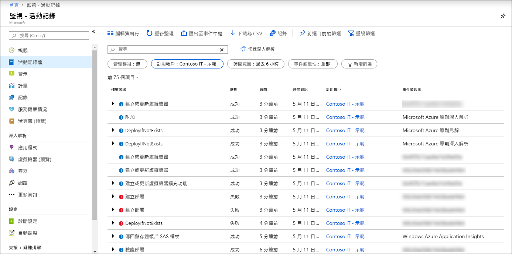
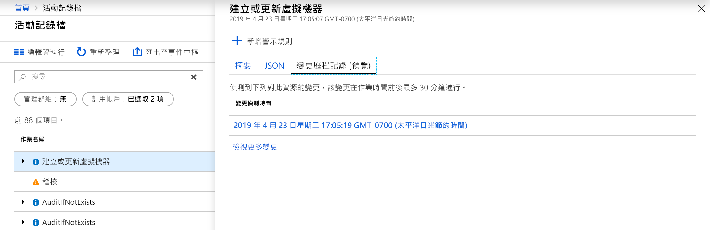
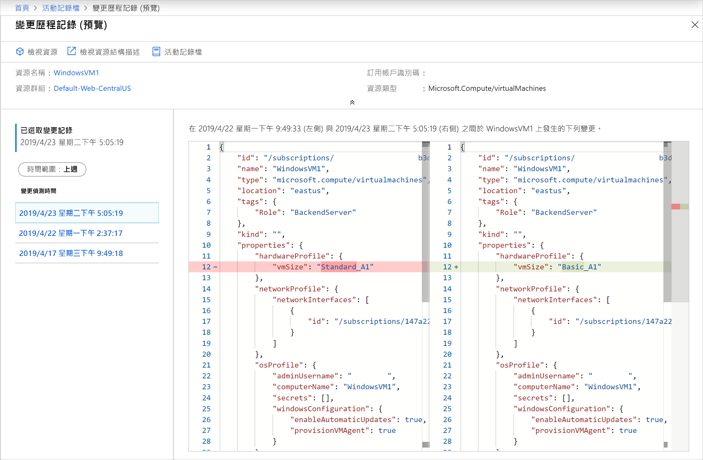

# <a name="view-and-retrieve-azure-activity-log-events"></a>檢視並檢索 Azure 活動紀錄事件

[Azure 活動日誌](platform-logs-overview.md)提供對 Azure 中發生的訂閱級事件的見解。 本文詳細介紹了查看和檢索活動日誌事件的不同方法。

## <a name="azure-portal"></a>Azure 入口網站
檢視 Azure 門戶中的 **「監視器」** 選單中所有資源的活動日誌。 從該資源選單中的 **「活動日誌」** 選項查看特定資源的活動日誌。



您可以按以下欄位篩選活動紀錄事件:

* **時間跨度**:事件的開始和結束時間。
* **類別**:[活動紀錄中的類別中](activity-log-view.md#categories-in-the-activity-log)所述的事件類別。
* **訂閱**:一個或多個 Azure 訂閱名稱。
* **資源組**:所選訂閱中的一個或多個資源組。
* **資源(名稱):**- 特定資源的名稱。
* **資源類型**:資源類型,例如_Microsoft.計算/虛擬機器_。
* **操作名稱**- Azure 資源管理員操作的名稱,例如_Microsoft.SQL/伺服器/寫入_。
* **嚴重性**:事件的嚴重性級別。 可用值為 _「資訊」。、」__警告_「、」_錯誤_「、」_嚴重_"
* **由啟動的事件 :** 執行操作的使用者。
* **開啟搜尋**:打開文字搜尋框,該框在所有事件中的所有欄位中搜索該字串。

## <a name="categories-in-the-activity-log"></a>作用紀錄中類別
活動日誌中的每個事件都有下表中介紹的特定類別。 如需這些類別結構描述的完整詳細資料，請參閱 [Azure 活動記錄事件結構描述](activity-log-schema.md)。 

| 類別 | 描述 |
|:---|:---|
| 管理 | 包含透過資源管理員執行的所有創建、更新、刪除和操作操作的記錄。 管理事件的範例包括_建立虛擬機器_與_移除網路安全群組_。<br><br>使用者或應用程式使用資源管理器執行的每個操作都建模為對特定資源類型的操作。 如果操作類型為 _「寫入_」、_刪除_或_操作_,則該操作的開始和成功或失敗的記錄將記錄在"管理" 類別中。 管理事件還包括對訂閱中基於角色的訪問控制的任何更改。 |
| 服務健康情況 | 包含 Azure 中發生的任何服務運行狀況事件的記錄。 美國東部服務執行狀況事件 SQL Azure 的一個範例_遇到停機_。 <br><br>服務健康事件有六個品種:_行動要求_,_輔助恢復_,_事件_,_維護_,_資訊_,或_安全_。 僅當訂閱中的資源受事件影響時,才會創建這些事件。
| 資源健全狀況 | 包含 Azure 資源發生的任何資源運行狀況事件的記錄。 資源執行狀況事件的範例是_虛擬機器執行狀況狀態改變為不可用_。<br><br>資源執行狀況事件可以表示四種執行狀況之一:_可用_,_無法用_、_降級_與_未知_。 此外,資源執行狀況事件可以歸類為_平台啟動_或_使用者啟動_。 |
| 警示 | 包含 Azure 警報的啟動記錄。 警報事件的一個範例是 _,在過去 5 分鐘中,myVM 上的 CPU % 超過 80。_|
| Autoscale | 包含與自動縮放引擎操作相關的任何事件的記錄,這些事件基於您在訂閱中定義的任何自動縮放設置。 自動縮放事件的範例是_自動縮放向上操作失敗_。 |
| 建議 | 包含 Azure 顧問的建議事件。 |
| 安全性 | 包含 Azure 安全中心生成的任何警報的記錄。 安全事件的範例是_執行了可疑雙延伸檔_。 |
| 原則 | 包含 Azure 策略執行的所有效果操作操作的記錄。 原則事件的範例包括_稽核_和_拒絕_。 原則所採取的每個動作會模型化為資源上的作業。 |

## <a name="view-change-history"></a>檢視變更記錄

查看活動日誌時,它可以説明查看該事件期間發生的更改。 您可以使用**更改歷史記錄**查看此資訊。 從要深入瞭解的活動日誌中選擇事件。 選擇 **「更改歷史記錄(預覽)」** 選項卡以查看與該事件相關的任何更改。



如果事件有任何關聯的更改,您將看到您可以選擇的更改清單。 這將打開**更改歷史記錄(預覽)** 頁面。 在此頁上,您可以看到對資源的更改。 從以下示例中可以看出,我們不僅能夠看到 VM 更改了大小,而且可以看到更改之前以前的 VM 大小以及更改了哪些大小。



要瞭解有關變更歷史紀錄的更多資訊,請參考[資源變更](../../governance/resource-graph/how-to/get-resource-changes.md)。


## <a name="powershell"></a>PowerShell
使用[獲取-AzLog](https://docs.microsoft.com/powershell/module/az.monitor/get-azlog) cmdlet 從 PowerShell 檢索活動日誌。 下面是一些常見的示例。

> [!NOTE]
> `Get-AzLog` 只提供 15 天的歷程記錄。 使用 **-MaxEvents**參數查詢超過 15 天的最後 N 個事件。 要造訪超過 15 天的事件,請使用 REST API 或 SDK。 如果您未包含 **StartTime**，則預設值是 **EndTime** 減去一小時。 如果您未包含 **EndTime**，則預設值是目前的時間。 所有時間都是採用 UTC 格式。


取得在特定日期時間之後建立的紀錄項目:

```powershell
Get-AzLog -StartTime 2016-03-01T10:30
```

取得日期時間範圍之間的紀錄項目:

```powershell
Get-AzLog -StartTime 2015-01-01T10:30 -EndTime 2015-01-01T11:30
```

取得特定資源群組中的記錄檔項目︰

```powershell
Get-AzLog -ResourceGroup 'myrg1'
```

在日期時間範圍之間從特定資源提供程式取得紀錄項目:

```powershell
Get-AzLog -ResourceProvider 'Microsoft.Web' -StartTime 2015-01-01T10:30 -EndTime 2015-01-01T11:30
```

取得有特定呼叫方的紀錄項目:

```powershell
Get-AzLog -Caller 'myname@company.com'
```

取得最後 1000 個事件:

```powershell
Get-AzLog -MaxEvents 1000
```


## <a name="cli"></a>CLI
使用[az 監視器活動日誌](cli-samples.md#view-activity-log-for-a-subscription)從 CLI 檢索活動日誌。 下面是一些常見的示例。


查看所有可用選項。

```azurecli
az monitor activity-log list -h
```

取得特定資源群組中的記錄檔項目︰

```azurecli
az monitor activity-log list --resource-group <group name>
```

取得有特定呼叫方的紀錄項目:

```azurecli
az monitor activity-log list --caller myname@company.com
```

依資源類型的呼叫者取得紀錄,在日期範圍內:

```azurecli
az monitor activity-log list --resource-provider Microsoft.Web \
    --caller myname@company.com \
    --start-time 2016-03-08T00:00:00Z \
    --end-time 2016-03-16T00:00:00Z
```

## <a name="rest-api"></a>REST API
使用[Azure 監視器 REST API](https://docs.microsoft.com/rest/api/monitor/)從 REST 用戶端檢索活動日誌。 下面是一些常見的示例。

使用篩選器取得活動紀錄:

``` HTTP
GET https://management.azure.com/subscriptions/089bd33f-d4ec-47fe-8ba5-0753aa5c5b33/providers/microsoft.insights/eventtypes/management/values?api-version=2015-04-01&$filter=eventTimestamp ge '2018-01-21T20:00:00Z' and eventTimestamp le '2018-01-23T20:00:00Z' and resourceGroupName eq 'MSSupportGroup'
```

使用篩選器取得活動紀錄並選擇:

```HTTP
GET https://management.azure.com/subscriptions/089bd33f-d4ec-47fe-8ba5-0753aa5c5b33/providers/microsoft.insights/eventtypes/management/values?api-version=2015-04-01&$filter=eventTimestamp ge '2015-01-21T20:00:00Z' and eventTimestamp le '2015-01-23T20:00:00Z' and resourceGroupName eq 'MSSupportGroup'&$select=eventName,id,resourceGroupName,resourceProviderName,operationName,status,eventTimestamp,correlationId,submissionTimestamp,level
```

取得活動紀錄,選擇:

```HTTP
GET https://management.azure.com/subscriptions/089bd33f-d4ec-47fe-8ba5-0753aa5c5b33/providers/microsoft.insights/eventtypes/management/values?api-version=2015-04-01&$select=eventName,id,resourceGroupName,resourceProviderName,operationName,status,eventTimestamp,correlationId,submissionTimestamp,level
```

取得活動紀錄,無需篩選或選擇:

```HTTP
GET https://management.azure.com/subscriptions/089bd33f-d4ec-47fe-8ba5-0753aa5c5b33/providers/microsoft.insights/eventtypes/management/values?api-version=2015-04-01
```


## <a name="next-steps"></a>後續步驟

* [閱讀平台紀錄概述](platform-logs-overview.md)
* [建立診斷設定以將活動紀錄傳送到其他目標](diagnostic-settings.md)
