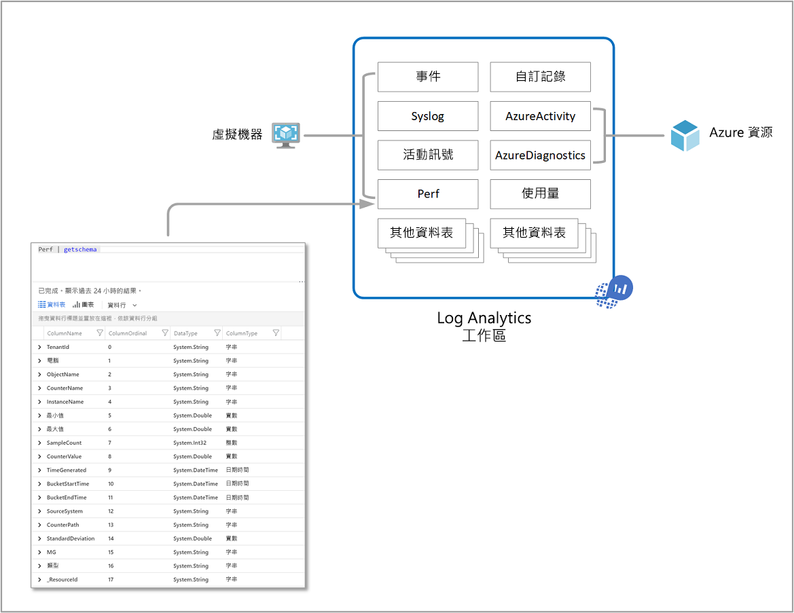
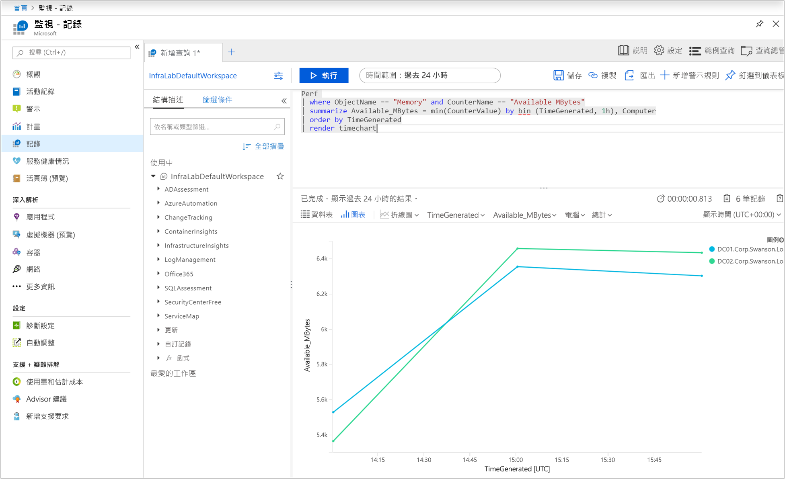
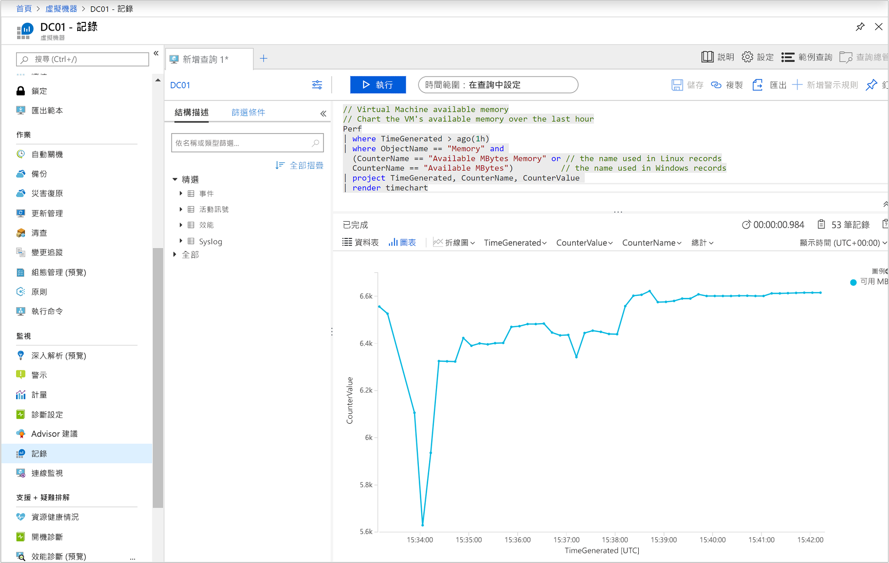
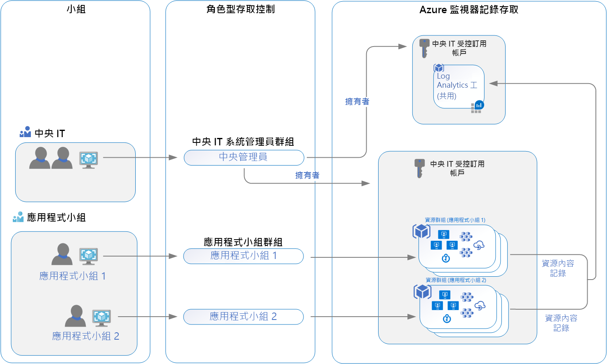

# 設計 Azure 監視器記錄部署

Azure 監視器會將 [記錄](data-platform-logs.md) 資料儲存在 log Analytics 工作區中，也就是 Azure 資源和資料收集、匯總及作為系統管理界限的容器。 雖然您可以在 Azure 訂用帳戶中部署一或多個工作區，但您應該瞭解幾個考慮，以確保您的初始部署遵循我們的指導方針，以提供符合您組織需求的符合成本效益、可管理且可調整的部署。

工作區中的資料會組織成資料表，每個資料表都會儲存不同類型的資料，並根據產生資料的資源，擁有自己的唯一屬性集。 大部分的資料來源都會寫入至 Log Analytics 工作區中的資料表。

Log Analytics 工作區提供：

* 資料存放區的地理位置。
* 依建議的其中一個設計策略授與不同的使用者存取權限，來隔離資料。
* 設定的範圍，例如 [定價層](./manage-cost-storage.md#changing-pricing-tier)、 [保留期](./manage-cost-storage.md#change-the-data-retention-period)和 [資料上限](./manage-cost-storage.md#manage-your-maximum-daily-data-volume)。

工作區是裝載在實體叢集上。 根據預設，系統會建立和管理這些群集。 4TB/天以外的客戶必須為其工作區建立專屬的叢集，讓他們能夠更妥善控制和提高內嵌費率。

本文詳細說明設計和遷移考慮、存取控制的總覽，以及對您的 IT 組織建議的設計實現。

## 存取控制策略的重要考慮

識別您需要的工作區數目會受到下列一或多項需求所影響：

* 您是一家全球性公司，基於資料主權或合規性理由，您需要將記錄資料儲存在特定區域。
* 您使用 Azure，想要將工作區和它所管理的 Azure 資源放在相同區域中，以避免輸出資料傳輸費用。
* 您可以管理多個部門或商務群組，並希望每個部門都能看到自己的資料，而不是其他人的資料。 此外，合併的跨部門或商務群組視圖不需要任何商務需求。

現今的 IT 組織會依照集中、非集中式或兩個結構之間的混合式來進行模型化。 因此，下列工作區部署模型經常用來對應到下列其中一個組織結構：

* **集中式**：所有記錄都會儲存在中央工作區中，並由單一小組管理，Azure 監視器提供每個小組的差異存取。 在此案例中，很容易管理、跨資源搜尋，以及跨相互關聯記錄。 視您訂用帳戶中的多個資源收集的資料量而定，工作區的成長可能會大幅增加，並額外管理額外負荷，以維護不同使用者的存取控制。 此模型稱為「中樞和輪輻」。
* 非集中**式：每**個小組都有自己的工作區在其所擁有和管理的資源群組中建立，且記錄資料會依資源隔離。 在此案例中，工作區可保持安全，且存取控制與資源存取一致，但很難相互關聯記錄。 需要廣泛查看許多資源的使用者，無法以有意義的方式分析資料。
* **混合**式：安全性審核合規性需求會進一步使此案例變得複雜，因為許多組織會平行執行這兩種部署模型。 這通常會導致複雜、昂貴且難以維護的設定，並有記錄涵蓋範圍中的間距。

使用 Log Analytics 代理程式來收集資料時，您必須了解下列事項才能規劃代理程式的部署：

* 若要從 Windows 代理程式收集資料，您可以[將每個代理程式設定為向一或多個工作區報告](./agent-windows.md)，即使其同時會向 System Center Operations Manager 管理群組報告也沒關係。 Windows 代理程式最多可以向四個工作區報告。
* Linux 代理程式不支援多重主目錄，只能向單一工作區報告。

如果您使用 System Center Operations Manager 2012 R2 或更新版本：

* 每個 Operations Manager 管理群組[只能連線到一個工作區](./om-agents.md)。 
* 向管理群組報告的 Linux 電腦必須設定為直接向 Log Analytics 工作區報告。 如果您的 Linux 電腦已直接向工作區報告，而您想要使用 Operations Manager 來監視這些電腦，請遵循這些步驟來[向 Operations Manager 管理群組報告](agent-manage.md#configure-agent-to-report-to-an-operations-manager-management-group)。 
* 您可以在 Windows 電腦上安裝 Log Analytics Windows 代理程式，並讓其同時向已與工作區整合的 Operations Manager 以及不同工作區報告。

## 存取控制概觀

使用角色型存取控制 (RBAC) ，您可以只授與使用者和群組在工作區中使用監視資料所需的存取權數量。 這可讓您使用單一工作區與您的 IT 組織作業模型保持一致，以將收集的資料儲存在所有資源上。 例如，您會將負責 Azure 虛擬機器上裝載之基礎結構服務的存取權授與您的小組， (Vm) ，因此它們只能存取 Vm 所產生的記錄。 這會遵循新的資源內容記錄模型。 此模型的基礎是針對 Azure 資源所發出的每個記錄檔記錄，它會自動與此資源相關聯。 記錄會轉送至中央工作區，以遵循資源的範圍和 RBAC。

使用者可存取的資料是由下表所列的因素組合所決定。 以下各節將說明每個步驟。

| 因素 | 描述 |
|:---|:---|
| [存取模式](#access-mode) | 使用者用來存取工作區的方法。  定義可用資料的範圍以及套用的存取控制模式。 |
| [存取控制模式](#access-control-mode) | 在工作區上設定，定義是否要在工作區或資源層級套用許可權。 |
| [權限](manage-access.md) | 適用于工作區或資源的個人或使用者群組的許可權。 定義使用者可存取的資料。 |
| [資料表層級 RBAC](manage-access.md#table-level-rbac) | 適用于所有使用者的選擇性細微許可權，不論其存取模式或存取控制模式為何。 定義使用者可以存取的資料類型。 |

## 存取模式

*存取模式*指的是使用者如何存取 Log Analytics 工作區，並定義可存取的資料範圍。 

使用者有兩個存取資料的選項：

* **工作區-內容**：您可以在工作區中查看您有權使用的所有記錄。 在此模式中的查詢會限定為工作區中所有資料表的所有資料。 這是以工作區作為範圍存取記錄時所使用的存取模式，例如當您從 Azure 入口網站的 [ **Azure 監視器**] 功能表中選取 [**記錄**] 時。

    

* **資源**內容：當您存取特定資源、資源群組或訂用帳戶的工作區時（例如，當您從 Azure 入口網站中的 [資源] 功能表選取 [ **記錄** ] 時），您可以只針對您有權存取的所有資料表中的資源來查看記錄。 在此模式中的查詢範圍僅限於與該資源相關聯的資料。 這個模式也會啟用更細微的 RBAC。

    

    > [!NOTE]
    > 只有當記錄已正確與相關資源相關聯時，才可供資源內容查詢使用。 目前，下列資源有限制：
    > - Azure 外部的電腦
    > - Service Fabric
    > - Application Insights
    >
    > 您可以藉由執行查詢並檢查您感興趣的記錄，來測試記錄是否已正確與資源相關聯。 如果 [_ResourceId](./log-standard-columns.md#_resourceid) 屬性中有正確的資源識別碼，則資料可供以資源為中心的查詢使用。

Azure 監視器會根據您執行記錄搜尋的內容，自動決定正確的模式。 範圍一律會顯示在 Log Analytics 的左上方區段中。

### 比較存取模式

下表摘要說明存取模式：

| 問題 | 工作區內容 | 資源內容 |
|:---|:---|:---|
| 每個模型的用途為何？ | 管理中心。 需要設定資料收集的系統管理員，以及需要存取各種資源的使用者。 目前也需要存取 Azure 外部資源記錄的使用者。 | 應用程式小組。 受監視的 Azure 資源系統管理員。 |
| 使用者需要什麼來查看記錄？ | 工作區的許可權。 請參閱[使用工作區版權管理存取權](manage-access.md#manage-access-using-workspace-permissions)中的**工作區許可權**。 | 資源的讀取權限。 請參閱[使用 Azure 版權管理存取權](manage-access.md#manage-access-using-azure-permissions)中的**資源許可權**。 許可權可以繼承 (例如從包含的資源群組) 或直接指派給資源。 將會自動指派資源記錄的許可權。 |
| 許可權的範圍為何？ | 工作。 具有工作區存取權的使用者可以從他們有許可權的資料表查詢工作區中的所有記錄。 請參閱 [資料表存取控制](manage-access.md#table-level-rbac) | Azure 資源。 使用者可以從任何工作區查詢具有存取權的特定資源、資源群組或訂用帳戶的記錄，但無法查詢記錄中的其他資源。 |
| 如何使用使用者存取記錄？ | <ul><li>從**Azure 監視器**] 功能表啟動**記錄**。</li></ul> <ul><li>從**Log Analytics 工作區**啟動**記錄**。</li></ul> <ul><li>從 Azure 監視器的活頁 [簿](../visualizations.md#workbooks)。</li></ul> | <ul><li>從 Azure 資源的功能表啟動**記錄**</li></ul> <ul><li>從**Azure 監視器**] 功能表啟動**記錄**。</li></ul> <ul><li>從**Log Analytics 工作區**啟動**記錄**。</li></ul> <ul><li>從 Azure 監視器的活頁 [簿](../visualizations.md#workbooks)。</li></ul> |

## 存取控制模式

*存取控制模式*是每個工作區的設定，可定義如何決定工作區的許可權。

* **需要工作區許可權**：此控制模式不允許細微的 RBAC。 若要讓使用者存取工作區，必須將工作區或特定資料表的許可權授與他們。

    如果使用者在工作區內容模式之後存取工作區，他們就可以存取已被授與存取權之任何資料表中的所有資料。 如果使用者在資源內容模式之後存取工作區，則他們只能在其已被授與存取權的任何資料表中存取該資源的資料。

    這是在2019年3月之前建立之所有工作區的預設設定。

* **使用資源或工作區許可權**：此控制模式可允許細微的 RBAC。 您可以藉由指派 Azure 許可權，授與使用者只能存取資源的相關資料 `read` 。 

    當使用者存取工作區內容模式中的工作區時，適用工作區許可權。 當使用者存取資源內容模式中的工作區時，只會驗證資源許可權，而且會忽略工作區許可權。 為使用者啟用 RBAC，方法是將他們從工作區許可權中移除，並允許其資源許可權被辨識。

    這是在2019年3月之後建立的所有工作區的預設設定。

    > [!NOTE]
    > 如果使用者只有工作區的資源許可權，則只有在工作區存取模式設定為 **使用資源或工作區許可權**時，才能使用資源內容模式來存取工作區。

若要瞭解如何使用 PowerShell 或 Resource Manager 範本來變更入口網站中的存取控制模式，請參閱 [設定存取控制模式](manage-access.md#configure-access-control-mode)。

## 調整和內嵌磁片區速率限制

Azure 監視器是一種大規模的資料服務，可提供數千個客戶每個月傳送數 pb 資料的速度。 工作區在其儲存空間中並無限制，而且可以成長至數 pb 的資料。 由於調整規模，因此不需要分割工作區。

為了保護和隔離 Azure 監視器的客戶與其後端基礎結構，有一個預設的內嵌速率限制，其設計目的是要防止尖峰和洪水的情況。 速率限制預設值約為 **6 GB/分鐘** ，其設計目的是為了啟用一般內嵌。 如需有關內嵌磁片區限制測量的詳細資訊，請參閱 [Azure 監視器服務限制](../service-limits.md#data-ingestion-volume-rate)。

小於 4TB/天的客戶通常不會符合這些限制。 如果客戶內嵌了較高的磁片區，或在其正常作業中有尖峰的客戶，則應該考慮移至可能引發內嵌速率限制的 [專用](../log-query/logs-dedicated-clusters.md) 叢集。

當內建速率限制已啟用，或達到80% 的閾值時，就會將事件新增至工作區中的*作業資料表。* 建議您監視並建立警示。 請參閱資料內嵌 [大量速率](../service-limits.md#data-ingestion-volume-rate)中的詳細資料。

## 建議

此案例涵蓋您 IT 組織的訂用帳戶中，不受資料主權或法規合規性限制的單一工作區設計，或需要對應至您的資源部署所在的區域。 它可讓您組織的安全性和 IT 系統管理員團隊能夠利用改良的 Azure 存取管理整合，以及更安全的存取控制。

所有資源、監視解決方案和深入解析（例如 Application Insights 和適用於 VM 的 Azure 監視器）都會設定為將其收集的記錄資料轉送到 IT 組織的集中式共用工作區，以支援不同小組所維護的基礎結構和應用程式。 每個小組的使用者會被授與存取權，以取得其已獲得存取權的資源記錄。

部署工作區架構之後，您可以使用 [Azure 原則](../../governance/policy/overview.md)在 Azure 資源上強制執行此操作。 它提供一種方式來定義原則，並確保符合您的 Azure 資源，使其將其所有資源記錄傳送至特定的工作區。 例如，使用 Azure 虛擬機器或虛擬機器擴展集，您可以使用現有的原則來評估工作區合規性和報告結果，或自訂以進行補救（如果不符合規範）。  

## 工作區合併遷移策略

如果客戶已部署多個工作區，而且有興趣合併至資源內容存取模型，建議您採用漸進式方法來遷移至建議的存取模型，而且不會嘗試快速或積極地達成此目的。 遵循可在合理時間軸進行規劃、遷移、驗證和淘汰的階段式方法，可協助避免任何未規劃的事件，或對您的雲端作業造成非預期的影響。 如果您沒有合規性或商務原因的資料保留原則，您必須評估適當的時間長度，以在程式進行期間，將資料保留在您要遷移的工作區中。 當您要重新設定資源以報告至共用工作區時，您仍然可以視需要在原始工作區中分析資料。 完成遷移之後，如果您要在保留期限結束之前將資料保留在原始工作區中，請勿將其刪除。

在規劃遷移至此模型時，請考慮下列事項：

* 瞭解您必須符合之資料保留期的產業法規和內部原則。
* 請確定您的應用程式小組可以在現有的資源內容功能中工作。
* 識別授與應用程式小組資源的存取權，並在開發環境中進行測試，然後才在生產環境中執行。
* 設定工作區以啟用 [ **使用資源] 或 [工作區] 許可權**。
* 移除應用程式小組讀取和查詢工作區的許可權。
* 啟用並設定任何監視解決方案、深入解析（例如容器和/或適用於 VM 的 Azure 監視器的 Azure 監視器、您的自動化帳戶 () ，以及部署在原始工作區中的管理解決方案，例如更新管理、啟動/停止 Vm 等）。

## 後續步驟

若要執行本指南中所建議的安全性許可權和控制項，請參閱 [記錄管理的存取權](manage-access.md)。