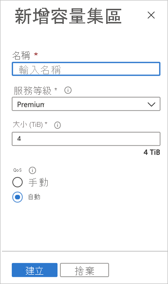

# 設定容量集區

設定容量集區可讓您在其中建立磁碟區。  

## 開始之前 

您必須已經建立 NetApp 帳戶。   

[建立 NetApp 帳戶](azure-netapp-files-create-netapp-account.md)

## 步驟 

1. 請移至 NetApp 帳戶的 [管理] 刀鋒視窗，然後在導覽窗格中按一下 [容量集區]****。  
    
    

2. 按一下 [+ 新增集區]**** 來建立新的容量集區。   
    [新增容量集區] 視窗隨即出現。

3. 請提供新容量集區的下列資訊：  
   * **名稱**  
     指定容量集區的名稱。  
     每個 NetApp 帳戶的容量集區名稱必須是唯一的。

   * **服務層級**   
     此欄位會顯示容量集區的目標效能。  
     指定容量集區的服務層級： [**Ultra**](azure-netapp-files-service-levels.md#Ultra)、 [**Premium**](azure-netapp-files-service-levels.md#Premium)或 [**Standard**](azure-netapp-files-service-levels.md#Standard)。

    * **大小**     
     指定您購買的容量集區大小。        
     最小容量集區大小是 4 TB。 您可以建立大小是 4 TB 倍數的集區。   

   * **Qos**   
     指定容量集區是否應使用 **手動** 或 **自動** QoS 類型。  

     請參閱 [儲存體](azure-netapp-files-understand-storage-hierarchy.md) 階層和 [效能考慮](azure-netapp-files-performance-considerations.md) ，以瞭解 QoS 類型。  

     > [!IMPORTANT] 
     > 將 **QoS 類型** 設定為 [ **手動** ] 是永久性的。 您無法轉換手動 QoS 容量集區以使用自動 QoS。 不過，您可以轉換自動 QoS 容量集區以使用手動 QoS。 請參閱 [變更容量集區以使用手動 QoS](manage-manual-qos-capacity-pool.md#change-to-qos)。   
     > 將手動 QoS 類型用於容量集區需要註冊。 請參閱[管理手動 QoS 容量集區](manage-manual-qos-capacity-pool.md#register-the-feature)。 

    

4. 按一下 [建立]。

## 後續步驟 

- [儲存體階層](azure-netapp-files-understand-storage-hierarchy.md) 
- [Azure NetApp Files 的服務等級](azure-netapp-files-service-levels.md)
- [Azure NetApp Files 定價頁面](https://azure.microsoft.com/pricing/details/storage/netapp/)
- [管理手動 QoS 容量集區](manage-manual-qos-capacity-pool.md)
- [將子網路委派至 Azure NetApp Files](azure-netapp-files-delegate-subnet.md)
