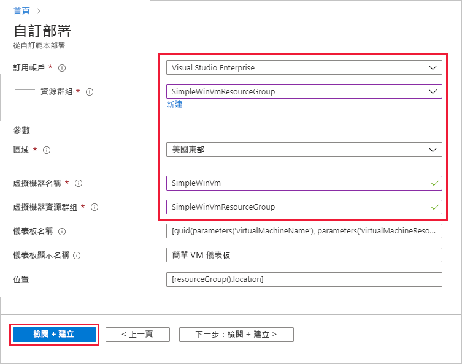
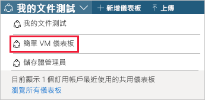
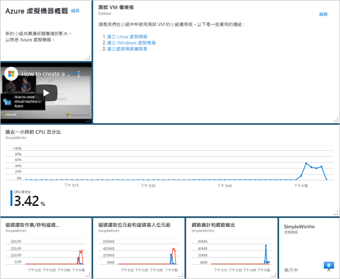
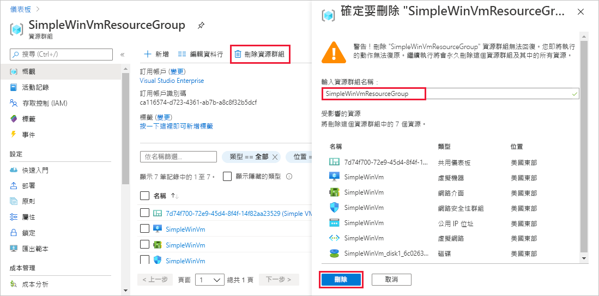

# <a name="quickstart-create-a-dashboard-in-the-azure-portal-by-using-an-arm-template"></a>快速入門：使用 ARM 範本在 Azure 入口網站中建立儀表板

Azure 入口網站中的儀表板是您雲端資源的聚焦及經過組織的檢視。 本快速入門著重於部署 Azure Resource Manager 範本 (ARM 範本) 來建立儀表板的程序。 儀表板會顯示虛擬機器 (VM) 的效能，以及一些靜態資訊和連結。

[!INCLUDE [About Azure Resource Manager](../../includes/resource-manager-quickstart-introduction.md)]

如果您的環境符合必要條件，而且您很熟悉 ARM 範本，請選取 [部署至 Azure] 按鈕。 範本會在 Azure 入口網站中開啟。

[](https://portal.azure.com/#create/Microsoft.Template/uri/https%3A%2F%2Fraw.githubusercontent.com%2FAzure%2Fazure-quickstart-templates%2Fmaster%2F101-azure-portal-dashboard%2Fazuredeploy.json)

## <a name="prerequisites"></a>必要條件

- 如果您沒有 Azure 訂用帳戶，請在開始前建立[免費帳戶](https://azure.microsoft.com/free/?WT.mc_id=A261C142F)。
- 現有的 VM。

## <a name="create-a-virtual-machine"></a>建立虛擬機器

您在本快速入門下一個部分中所建立的儀表板需要現有的 VM。 依照下列步驟建立 VM。

1. 在 Azure 入口網站中選取 [Cloud Shell]。

    ![從 Azure 入口網站功能區選取 [Azure Cloud Shell]](media/quick-create-template/cloud-shell.png)

1. 複製下列命令，並且在命令提示字元中輸入，以建立資源群組。

    ```powershell
    New-AzResourceGroup -Name SimpleWinVmResourceGroup -Location EastUS
    ```

    

1. 複製下列命令，並且在命令提示字元中輸入，以在資源群組中建立 VM。

    ```powershell
    New-AzVm `
        -ResourceGroupName "SimpleWinVmResourceGroup" `
        -Name "SimpleWinVm" `
        -Location "East US" 
    ```

1. 輸入 VM 的使用者名稱和密碼。 這是新的使用者名稱和密碼；而不是您用來登入 Azure 的帳戶。 如需詳細資訊，請參閱[使用者名稱需求](../virtual-machines/windows/faq.md#what-are-the-username-requirements-when-creating-a-vm)和[密碼需求](../virtual-machines/windows/faq.md#what-are-the-password-requirements-when-creating-a-vm)。

    VM 部署現在開始，通常需要數分鐘的時間才能完成。 部署完成之後，請移至下一節。

## <a name="review-the-template"></a>檢閱範本

本快速入門中使用的範本是來自 [Azure 快速入門範本](https://azure.microsoft.com/resources/templates/101-azure-portal-dashboard/)。 本文的範本太長，無法在此完整顯示。 若要檢視範本，請參閱 [azuredeploy.json](https://raw.githubusercontent.com/Azure/azure-quickstart-templates/master/101-azure-portal-dashboard/azuredeploy.json)。 範本中定義了一個 Azure 資源，[Microsoft.Portal/dashboards](/azure/templates/microsoft.portal/dashboards) - 在 Azure 入口網站中建立儀表板。

## <a name="deploy-the-template"></a>部署範本

1. 選取以下影像來登入 Azure 並開啟範本。

    [](https://portal.azure.com/#create/Microsoft.Template/uri/https%3A%2F%2Fraw.githubusercontent.com%2FAzure%2Fazure-quickstart-templates%2Fmaster%2F101-azure-portal-dashboard%2Fazuredeploy.json)

1. 選取或輸入下列值，然後選取 [檢閱 + 建立]。

    

    除非有指定，否則請使用預設值來建立儀表板。

    * **訂用帳戶**：選取 Azure 訂用帳戶。
    * **資源群組**：選取 **SimpleWinVmResourceGroup**。
    * **位置**：選取 [美國東部]。
    * **虛擬機器名稱**：輸入 **SimpleWinVm**。
    * **虛擬機器資源群組**：輸入 **SimpleWinVmResourceGroup**。

1. 選取 [建立] 或 [購買]。 成功部署儀表板之後，您會收到通知：

    

Azure 入口網站用於部署範本。 除了 Azure 入口網站以外，您也可以使用 Azure PowerShell、Azure CLI 和 REST API。 若要了解其他部署方法，請參閱[部署範本](../azure-resource-manager/templates/deploy-powershell.md)。

## <a name="review-deployed-resources"></a>檢閱已部署的資源

檢查是否已成功建立儀表板，以及您是否可以查看 VM 中的資料。

1. 在 Azure 入口網站中，選取 [儀表板]。

    

1. 在儀表板頁面上，選取 [簡單的 VM 儀表板]。

    

1. 檢閱 ARM 範本所建立的儀表板。 您可以看到某些內容是靜態的，但是也有圖表顯示您在一開始建立的 VM 效能。

    

## <a name="clean-up-resources"></a>清除資源

如果您想要移除 VM 和相關聯的儀表板，請刪除包含上述項目的資源群組。

1. 在 Azure 入口網站中，搜尋 **SimpleWinVmResourceGroup**，然後在搜尋結果中加以選取。

1. 在 [SimpleWinVmResourceGroup] 頁面上選取 [刪除資源群組]，輸入資源群組名稱進行確認，然後選取 [刪除]。

    

## <a name="next-steps"></a>後續步驟

如需 Azure 入口網站中儀表板的詳細資訊，請參閱：

> [!div class="nextstepaction"]
> [在 Azure 入口網站中建立和共用儀表板](azure-portal-dashboards.md)