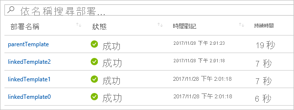

# <a name="using-linked-and-nested-templates-when-deploying-azure-resources"></a>部署 Azure 資源時使用連結和巢狀的範本

若要部署複雜的解決方案，您可以將 Azure Resource Manager 範本 (ARM 範本) 分成許多相關的範本，然後透過主要範本將它們部署在一起。 相關的範本可以是內嵌于主要範本內的個別檔案或範本語法。 本文使用「連結的 **範本** 」一詞來參考另一個範本檔案，該檔案是透過主要範本中的連結所參考。 它使用「 **嵌套** 」一詞來參考主要範本內的內嵌範本語法。

若為小型至中型的解決方案，單一範本會比較容易了解和維護。 您可以在單一檔案中看到所有的資源和值。 針對進階案例，連結範本可供將解決方案拆解為目標元件。 您可在其他案例中，輕鬆地重複使用這些範本。

如需教學課程，請參閱 [教學課程：部署連結的範本](./deployment-tutorial-linked-template.md)。

> [!NOTE]
> 針對連結或嵌套的範本，您只能將部署模式設定為累加 [式](deployment-modes.md)。 不過，您可以在完整模式中部署主要範本。 如果您以完整模式部署主要範本，而連結或嵌套的範本以相同的資源群組為目標，則部署在連結或嵌套範本中的資源會包含在完整模式部署的評估中。 在主要範本中部署的資源集合和連結或嵌套範本會與資源群組中現有的資源進行比較。 此組合集合中未包含的任何資源都會遭到刪除。
>
> 如果連結或嵌套式範本以不同的資源群組為目標，則該部署會使用累加模式。
>

## <a name="nested-template"></a>巢狀範本

若要嵌套範本，請將 [部署資源](/azure/templates/microsoft.resources/deployments) 新增至您的主要範本。 在 `template` 屬性中，指定範本語法。

```json
{
  "$schema": "https://schema.management.azure.com/schemas/2019-04-01/deploymentTemplate.json#",
  "contentVersion": "1.0.0.0",
  "parameters": {},
  "variables": {},
  "resources": [
    {
      "type": "Microsoft.Resources/deployments",
      "apiVersion": "2019-10-01",
      "name": "nestedTemplate1",
      "properties": {
        "mode": "Incremental",
        "template": {
          <nested-template-syntax>
        }
      }
    }
  ],
  "outputs": {
  }
}
```

下列範例會透過嵌套的範本部署儲存體帳戶。

```json
{
  "$schema": "https://schema.management.azure.com/schemas/2019-04-01/deploymentTemplate.json#",
  "contentVersion": "1.0.0.0",
  "parameters": {
    "storageAccountName": {
      "type": "string"
    }
  },
  "resources": [
    {
      "type": "Microsoft.Resources/deployments",
      "apiVersion": "2019-10-01",
      "name": "nestedTemplate1",
      "properties": {
        "mode": "Incremental",
        "template": {
          "$schema": "https://schema.management.azure.com/schemas/2019-04-01/deploymentTemplate.json#",
          "contentVersion": "1.0.0.0",
          "resources": [
            {
              "type": "Microsoft.Storage/storageAccounts",
              "apiVersion": "2019-04-01",
              "name": "[parameters('storageAccountName')]",
              "location": "West US",
              "sku": {
                "name": "Standard_LRS"
              },
              "kind": "StorageV2"
            }
          ]
        }
      }
    }
  ],
  "outputs": {
  }
}
```

### <a name="expression-evaluation-scope-in-nested-templates"></a>嵌套範本中的運算式評估範圍

使用巢狀範本時，您可指定是否要在父範本或巢狀範本的範圍內評估範本運算式。 範圍會決定如何解析參數、變數和函式（例如 [resourceGroup](template-functions-resource.md#resourcegroup) 和 [訂閱](template-functions-resource.md#subscription) ）。

您可以透過屬性來設定範圍 `expressionEvaluationOptions` 。 根據預設， `expressionEvaluationOptions` 屬性會設定為 `outer` ，這表示它會使用父範本範圍。 將值設為，可 `inner` 讓運算式在嵌套樣板的範圍內進行評估。

```json
{
  "type": "Microsoft.Resources/deployments",
  "apiVersion": "2019-10-01",
  "name": "nestedTemplate1",
  "properties": {
  "expressionEvaluationOptions": {
    "scope": "inner"
  },
  ...
```

下列範本會示範如何根據範圍解析範本運算式。 它包含名為的變數，該變數 `exampleVar` 定義于父範本和嵌套範本中。 它會傳回變數的值。

```json
{
  "$schema": "https://schema.management.azure.com/schemas/2019-04-01/deploymentTemplate.json#",
  "contentVersion": "1.0.0.0",
  "parameters": {
  },
  "variables": {
    "exampleVar": "from parent template"
  },
  "resources": [
    {
      "type": "Microsoft.Resources/deployments",
      "apiVersion": "2019-10-01",
      "name": "nestedTemplate1",
      "properties": {
        "expressionEvaluationOptions": {
          "scope": "inner"
        },
        "mode": "Incremental",
        "template": {
          "$schema": "https://schema.management.azure.com/schemas/2019-04-01/deploymentTemplate.json#",
          "contentVersion": "1.0.0.0",
          "variables": {
            "exampleVar": "from nested template"
          },
          "resources": [
          ],
          "outputs": {
            "testVar": {
              "type": "string",
              "value": "[variables('exampleVar')]"
            }
          }
        }
      }
    }
  ],
  "outputs": {
    "messageFromLinkedTemplate": {
      "type": "string",
      "value": "[reference('nestedTemplate1').outputs.testVar.value]"
    }
  }
}
```

`exampleVar`根據中的屬性值，變更的值 `scope` `expressionEvaluationOptions` 。 下表顯示這兩個範圍的結果。

| 評估範圍 | 輸出 |
| ----- | ------ |
| inner | 從嵌套的範本 |
| 外部 (或預設)  | 從父範本 |

下列範例會部署 SQL server，並抓取金鑰保存庫密碼以供密碼使用。 範圍設定為， `inner` 因為它會動態建立金鑰保存庫識別碼 (請參閱 `adminPassword.reference.keyVault` 外部範本 `parameters`) ，並將它當作參數傳遞給嵌套的範本。

```json
{
  "$schema": "https://schema.management.azure.com/schemas/2019-04-01/deploymentTemplate.json#",
  "contentVersion": "1.0.0.0",
  "parameters": {
    "location": {
      "type": "string",
      "defaultValue": "[resourceGroup().location]",
      "metadata": {
        "description": "The location where the resources will be deployed."
      }
    },
    "vaultName": {
      "type": "string",
      "metadata": {
        "description": "The name of the keyvault that contains the secret."
      }
    },
    "secretName": {
      "type": "string",
      "metadata": {
        "description": "The name of the secret."
      }
    },
    "vaultResourceGroupName": {
      "type": "string",
      "metadata": {
        "description": "The name of the resource group that contains the keyvault."
      }
    },
    "vaultSubscription": {
      "type": "string",
      "defaultValue": "[subscription().subscriptionId]",
      "metadata": {
        "description": "The name of the subscription that contains the keyvault."
      }
    }
  },
  "resources": [
    {
      "type": "Microsoft.Resources/deployments",
      "apiVersion": "2019-10-01",
      "name": "dynamicSecret",
      "properties": {
        "mode": "Incremental",
        "expressionEvaluationOptions": {
          "scope": "inner"
        },
        "parameters": {
          "location": {
            "value": "[parameters('location')]"
          },
          "adminLogin": {
            "value": "ghuser"
          },
          "adminPassword": {
            "reference": {
              "keyVault": {
                "id": "[resourceId(parameters('vaultSubscription'), parameters('vaultResourceGroupName'), 'Microsoft.KeyVault/vaults', parameters('vaultName'))]"
              },
              "secretName": "[parameters('secretName')]"
            }
          }
        },
        "template": {
          "$schema": "https://schema.management.azure.com/schemas/2019-04-01/deploymentTemplate.json#",
          "contentVersion": "1.0.0.0",
          "parameters": {
            "adminLogin": {
              "type": "string"
            },
            "adminPassword": {
              "type": "securestring"
            },
            "location": {
              "type": "string"
            }
          },
          "variables": {
            "sqlServerName": "[concat('sql-', uniqueString(resourceGroup().id, 'sql'))]"
          },
          "resources": [
            {
              "type": "Microsoft.Sql/servers",
              "apiVersion": "2018-06-01-preview",
              "name": "[variables('sqlServerName')]",
              "location": "[parameters('location')]",
              "properties": {
                "administratorLogin": "[parameters('adminLogin')]",
                "administratorLoginPassword": "[parameters('adminPassword')]"
              }
            }
          ],
          "outputs": {
            "sqlFQDN": {
              "type": "string",
              "value": "[reference(variables('sqlServerName')).fullyQualifiedDomainName]"
            }
          }
        }
      }
    }
  ],
  "outputs": {
  }
}
```

在嵌套的範本中使用安全參數值時，請務必小心。 如果您將範圍設定為 [外部]，安全值就會以純文字的形式儲存在部署歷程記錄中。 在部署歷程記錄中查看範本的使用者，可以看到安全的值。 相反地，請使用內部範圍，或將需要安全值的資源加入父範本中。

下列摘錄顯示哪些是安全且不安全的值。

```json
{
  "$schema": "https://schema.management.azure.com/schemas/2019-04-01/deploymentTemplate.json#",
  "contentVersion": "1.0.0.0",
  "parameters": {
    "adminUsername": {
      "type": "string",
      "metadata": {
        "description": "Username for the Virtual Machine."
      }
    },
    "adminPasswordOrKey": {
      "type": "securestring",
      "metadata": {
        "description": "SSH Key or password for the Virtual Machine. SSH key is recommended."
      }
    }
  },
  ...
  "resources": [
    {
      "type": "Microsoft.Compute/virtualMachines",
      "apiVersion": "2020-06-01",
      "name": "mainTemplate",
      "properties": {
        ...
        "osProfile": {
          "computerName": "mainTemplate",
          "adminUsername": "[parameters('adminUsername')]",
          "adminPassword": "[parameters('adminPasswordOrKey')]" // Yes, secure because resource is in parent template
        }
      }
    },
    {
      "name": "outer",
      "type": "Microsoft.Resources/deployments",
      "apiVersion": "2019-10-01",
      "properties": {
        "expressionEvaluationOptions": {
          "scope": "outer"
        },
        "mode": "Incremental",
        "template": {
          "$schema": "https://schema.management.azure.com/schemas/2019-04-01/deploymentTemplate.json#",
          "contentVersion": "1.0.0.0",
          "resources": [
            {
              "type": "Microsoft.Compute/virtualMachines",
              "apiVersion": "2020-06-01",
              "name": "outer",
              "properties": {
                ...
                "osProfile": {
                  "computerName": "outer",
                  "adminUsername": "[parameters('adminUsername')]",
                  "adminPassword": "[parameters('adminPasswordOrKey')]" // No, not secure because resource is in nested template with outer scope
                }
              }
            }
          ]
        }
      }
    },
    {
      "name": "inner",
      "type": "Microsoft.Resources/deployments",
      "apiVersion": "2019-10-01",
      "properties": {
        "expressionEvaluationOptions": {
          "scope": "inner"
        },
        "mode": "Incremental",
        "parameters": {
          "adminPasswordOrKey": {
              "value": "[parameters('adminPasswordOrKey')]"
          },
          "adminUsername": {
              "value": "[parameters('adminUsername')]"
          }
        },
        "template": {
          "$schema": "https://schema.management.azure.com/schemas/2019-04-01/deploymentTemplate.json#",
          "contentVersion": "1.0.0.0",
          "parameters": {
            "adminUsername": {
              "type": "string",
              "metadata": {
                "description": "Username for the Virtual Machine."
              }
            },
            "adminPasswordOrKey": {
              "type": "securestring",
              "metadata": {
                "description": "SSH Key or password for the Virtual Machine. SSH key is recommended."
              }
            }
          },
          "resources": [
            {
              "type": "Microsoft.Compute/virtualMachines",
              "apiVersion": "2020-06-01",
              "name": "inner",
              "properties": {
                ...
                "osProfile": {
                  "computerName": "inner",
                  "adminUsername": "[parameters('adminUsername')]",
                  "adminPassword": "[parameters('adminPasswordOrKey')]" // Yes, secure because resource is in nested template and scope is inner
                }
              }
            }
          ]
        }
      }
    }
  ]
}
```

> [!NOTE]
>
> 當範圍設定為時 `outer` ，您不能 `reference` 在已在嵌套範本中部署的資源之嵌套範本的輸出區段中使用函數。 若要在嵌套的範本中傳回已部署之資源的值，請使用 `inner` 範圍，或將您的嵌套範本轉換成連結的範本。

## <a name="linked-template"></a>連結的範本

若要連結範本，請將 [部署資源](/azure/templates/microsoft.resources/deployments) 新增至您的主要範本。 在 `templateLink` 屬性中，指定要包含之範本的 URI。 下列範例會連結至儲存體帳戶中的範本。

```json
{
  "$schema": "https://schema.management.azure.com/schemas/2019-04-01/deploymentTemplate.json#",
  "contentVersion": "1.0.0.0",
  "parameters": {},
  "variables": {},
  "resources": [
    {
      "type": "Microsoft.Resources/deployments",
      "apiVersion": "2019-10-01",
      "name": "linkedTemplate",
      "properties": {
        "mode": "Incremental",
        "templateLink": {
          "uri":"https://mystorageaccount.blob.core.windows.net/AzureTemplates/newStorageAccount.json",
          "contentVersion":"1.0.0.0"
        }
      }
    }
  ],
  "outputs": {
  }
}
```

參考連結的範本時，的值不能是 `uri` 本機檔案或只能在區域網路上使用的檔案。 Azure Resource Manager 必須能夠存取範本。 提供可下載為 HTTP 或 HTTPS 的 URI 值。

您可以使用包含 HTTP 或 HTTPS 的參數參考範本。 例如，常見的模式是使用 `_artifactsLocation` 參數。 您可以使用類似下列的運算式來設定連結的範本：

```json
"uri": "[concat(parameters('_artifactsLocation'), '/shared/os-disk-parts-md.json', parameters('_artifactsLocationSasToken'))]"
```

如果您要連結至 GitHub 中的範本，請使用原始 URL。 連結的格式為： `https://raw.githubusercontent.com/Azure/azure-docs-json-samples/master/get-started-with-templates/quickstart-template/azuredeploy.json` 。 若要取得原始連結，請選取 [ **raw**]。

:::image type="content" source="./media/linked-templates/select-raw.png" alt-text="選取原始 URL":::

### <a name="parameters-for-linked-template"></a>連結範本的參數

您可以在外部檔案或內嵌中提供連結範本的參數。 提供外部參數檔案時，請使用 `parametersLink` 屬性：

```json
"resources": [
  {
    "type": "Microsoft.Resources/deployments",
    "apiVersion": "2019-10-01",
    "name": "linkedTemplate",
    "properties": {
      "mode": "Incremental",
      "templateLink": {
        "uri": "https://mystorageaccount.blob.core.windows.net/AzureTemplates/newStorageAccount.json",
        "contentVersion": "1.0.0.0"
      },
      "parametersLink": {
        "uri": "https://mystorageaccount.blob.core.windows.net/AzureTemplates/newStorageAccount.parameters.json",
        "contentVersion": "1.0.0.0"
      }
    }
  }
]
```

若要以內嵌方式傳遞參數值，請使用 `parameters` 屬性。

```json
"resources": [
  {
    "type": "Microsoft.Resources/deployments",
    "apiVersion": "2019-10-01",
    "name": "linkedTemplate",
    "properties": {
      "mode": "Incremental",
      "templateLink": {
        "uri": "https://mystorageaccount.blob.core.windows.net/AzureTemplates/newStorageAccount.json",
        "contentVersion": "1.0.0.0"
      },
      "parameters": {
        "storageAccountName": {
          "value": "[parameters('storageAccountName')]"
        }
      }
    }
  }
]
```

您無法對參數檔案同時使用內嵌參數和連結。 同時指定 `parametersLink` 和 `parameters` 時，部署將會失敗並發生錯誤。

## <a name="template-specs"></a>範本規格

您可以建立 [範本規格](template-specs.md) ，將主要範本和其連結的範本封裝到您可以部署的單一實體，而不是在可存取的端點上維護連結的範本。 範本規格是您 Azure 訂用帳戶中的資源。 這可讓您輕鬆安全地與組織中的使用者共用範本。 您可以使用 Azure 角色型存取控制 (Azure RBAC) 來授與範本規格的存取權。這項功能目前為預覽狀態。

如需詳細資訊，請參閱

- [教學課程：使用連結的範本建立範本規格](./template-specs-create-linked.md)。
- [教學課程：將範本規格部署為連結的範本](./template-specs-deploy-linked-template.md)。

## <a name="dependencies"></a>相依性

如同其他資源類型，您可以設定連結的範本之間的相依性。 如果某個連結範本中的資源必須先部署在第二個連結範本中的資源之前，請設定第二個範本（相依于第一個範本）。

:::code language="json" source="~/resourcemanager-templates/azure-resource-manager/linkedtemplates/linked-dependency.json" highlight="10,22,24":::

## <a name="contentversion"></a>contentVersion

您不需要提供 `contentVersion` `templateLink` 或屬性的屬性 `parametersLink` 。 如果您未提供 `contentVersion` ，則會部署範本的目前版本。 如果您提供內容版本值，它必須符合所連結範本中的版本；否則，部署會因為錯誤而失敗。

## <a name="using-variables-to-link-templates"></a>使用變數來連結範本

先前的範例示範了範本連結的硬式編碼 URL 值。 這種方法可能適用于簡單的範本，但不適用於一組大型的模組化範本。 不過，您可以建立一個儲存主要範本之基底 URL 的靜態變數，然後再從該基底 URL 連結動態建立連結的範本之 URL。 這種方法的優點是您可以輕鬆地移動或派生範本，因為您只需要變更主要範本中的靜態變數。 主要範本會於整個分解的範本傳遞正確的 URI。

下列範例示範如何使用基底 URL 來建立 (和) 連結之範本的兩個 Url `sharedTemplateUrl` `vmTemplateUrl` 。

```json
"variables": {
  "templateBaseUrl": "https://raw.githubusercontent.com/Azure/azure-quickstart-templates/master/postgresql-on-ubuntu/",
  "sharedTemplateUrl": "[uri(variables('templateBaseUrl'), 'shared-resources.json')]",
  "vmTemplateUrl": "[uri(variables('templateBaseUrl'), 'database-2disk-resources.json')]"
}
```

您也可以使用 [deployment()](template-functions-deployment.md#deployment) 取得目前範本的基底 URL，用來取得相同位置中其他範本的 URL。 如果您的範本位置變更，或您想要避免在範本檔案中使用硬式編碼 URL，這十分實用。 `templateLink`只有在連結至具有 URL 的遠端範本時，才會傳回此屬性。 如果您使用本機範本，就無法使用該屬性。

```json
"variables": {
  "sharedTemplateUrl": "[uri(deployment().properties.templateLink.uri, 'shared-resources.json')]"
}
```

最後，您會在屬性（property）的屬性（property）中使用變數 `uri` `templateLink` 。

```json
"templateLink": {
 "uri": "[variables('sharedTemplateUrl')]",
 "contentVersion":"1.0.0.0"
}
```

## <a name="using-copy"></a>使用複製

若要使用嵌套的範本來建立資源的多個實例，請 `copy` 在資源層級新增元素 `Microsoft.Resources/deployments` 。 或者，如果範圍為 `inner` ，您可以在嵌套的範本內加入複本。

下列範例範本會示範如何搭配使用 `copy` 與嵌套的範本。

```json
"resources": [
  {
    "type": "Microsoft.Resources/deployments",
    "apiVersion": "2019-10-01",
    "name": "[concat('nestedTemplate', copyIndex())]",
    // yes, copy works here
    "copy": {
      "name": "storagecopy",
      "count": 2
    },
    "properties": {
      "mode": "Incremental",
      "expressionEvaluationOptions": {
        "scope": "inner"
      },
      "template": {
        "$schema": "https://schema.management.azure.com/schemas/2019-04-01/deploymentTemplate.json#",
        "contentVersion": "1.0.0.0",
        "resources": [
          {
            "type": "Microsoft.Storage/storageAccounts",
            "apiVersion": "2019-04-01",
            "name": "[concat(variables('storageName'), copyIndex())]",
            "location": "West US",
            "sku": {
              "name": "Standard_LRS"
            },
            "kind": "StorageV2"
            // Copy works here when scope is inner
            // But, when scope is default or outer, you get an error
            //"copy":{
            //  "name": "storagecopy",
            //  "count": 2
            //}
          }
        ]
      }
    }
  }
]
```

## <a name="get-values-from-linked-template"></a>從連結的範本取得值

若要從連結的範本取得輸出值，請使用如下語法擷取屬性值：`"[reference('deploymentName').outputs.propertyName.value]"`。

從連結的範本取得輸出屬性時，屬性名稱不能包含虛線。

下列範例會示範如何參考連結的範本，並擷取輸出值。 連結的範本會傳回簡單的訊息。 首先，連結的範本：

:::code language="json" source="~/resourcemanager-templates/azure-resource-manager/linkedtemplates/helloworld.json":::

主要範本會部署連結的範本，並取得傳回的值。 請注意，它會依名稱參考部署資源，並使用連結的範本所傳回之屬性的名稱。

:::code language="json" source="~/resourcemanager-templates/azure-resource-manager/linkedtemplates/helloworldparent.json" highlight="10,23":::

下列範例顯示的範本會部署公用 IP 位址，並傳回該公用 IP 的 Azure 資源資源識別碼：

:::code language="json" source="~/resourcemanager-templates/azure-resource-manager/linkedtemplates/public-ip.json" highlight="27":::

若要在部署負載平衡器時使用上述範本中的公用 IP 位址，請連結至範本並宣告資源的相依性 `Microsoft.Resources/deployments` 。 負載平衡器上的公用 IP 位址會設定為從連結的範本傳回的輸出值。

:::code language="json" source="~/resourcemanager-templates/azure-resource-manager/linkedtemplates/public-ip-parentloadbalancer.json" highlight="28,41":::

## <a name="deployment-history"></a>部署歷程記錄

在部署歷程記錄中，Resource Manager 會以個別部署的方式處理每一個範本。 在部署歷程記錄中，具有三個連結或嵌套範本的主要範本會顯示為：



您可以使用歷程記錄中的這些個別項目，以在部署後擷取輸出值。 下列範本會建立公用 IP 位址，並輸出 IP 位址：

```json
{
  "$schema": "https://schema.management.azure.com/schemas/2019-04-01/deploymentTemplate.json#",
  "contentVersion": "1.0.0.0",
  "parameters": {
    "publicIPAddresses_name": {
      "type": "string"
    }
  },
  "variables": {},
  "resources": [
    {
      "type": "Microsoft.Network/publicIPAddresses",
      "apiVersion": "2018-11-01",
      "name": "[parameters('publicIPAddresses_name')]",
      "location": "southcentralus",
      "properties": {
        "publicIPAddressVersion": "IPv4",
        "publicIPAllocationMethod": "Static",
        "idleTimeoutInMinutes": 4,
        "dnsSettings": {
          "domainNameLabel": "[concat(parameters('publicIPAddresses_name'), uniqueString(resourceGroup().id))]"
        }
      },
      "dependsOn": []
    }
  ],
  "outputs": {
    "returnedIPAddress": {
      "type": "string",
      "value": "[reference(parameters('publicIPAddresses_name')).ipAddress]"
    }
  }
}
```

下列範本會連結至先前的範本。 它會建立三個公用 IP 位址。

```json
{
  "$schema": "https://schema.management.azure.com/schemas/2019-04-01/deploymentTemplate.json#",
  "contentVersion": "1.0.0.0",
  "parameters": {
  },
  "variables": {},
  "resources": [
    {
      "type": "Microsoft.Resources/deployments",
      "apiVersion": "2019-10-01",
      "name": "[concat('linkedTemplate', copyIndex())]",
      "copy": {
        "count": 3,
        "name": "ip-loop"
      },
      "properties": {
        "mode": "Incremental",
        "templateLink": {
        "uri": "[uri(deployment().properties.templateLink.uri, 'static-public-ip.json')]",
        "contentVersion": "1.0.0.0"
        },
        "parameters":{
          "publicIPAddresses_name":{"value": "[concat('myip-', copyIndex())]"}
        }
      }
    }
  ]
}
```

在部署後，您可以使用下列 PowerShell 指令碼擷取輸出值：

```azurepowershell-interactive
$loopCount = 3
for ($i = 0; $i -lt $loopCount; $i++)
{
  $name = 'linkedTemplate' + $i;
  $deployment = Get-AzResourceGroupDeployment -ResourceGroupName examplegroup -Name $name
  Write-Output "deployment $($deployment.DeploymentName) returned $($deployment.Outputs.returnedIPAddress.value)"
}
```

或者，在 Bash 殼層中使用 Azure CLI 指令碼：

```azurecli-interactive
#!/bin/bash

for i in 0 1 2;
do
  name="linkedTemplate$i";
  deployment=$(az deployment group show -g examplegroup -n $name);
  ip=$(echo $deployment | jq .properties.outputs.returnedIPAddress.value);
  echo "deployment $name returned $ip";
done
```

## <a name="securing-an-external-template"></a>保護外部範本

雖然連結的範本必須可從外部存取，但它不必供大眾存取。 您可以將您的範本新增至只有儲存體帳戶擁有者可以存取的私人儲存體帳戶。 接著，在部署期間建立共用存取簽章 (SAS) Token 來啟用存取權。 您會將該 SAS Token 加入連結範本的 URI。 即使該 Token 是以安全字串來傳遞，連結範本的 URI (包括 SAS Token) 還是會記錄在部署作業中。 為了限制公開的程度，請為該 Token 設定到期日。

當然，也可以將參數檔案限制為透過 SAS Token 存取。

目前，您無法連結到位於 [Azure 儲存體防火牆](../../storage/common/storage-network-security.md)後方之儲存體帳戶中的範本。

> [!IMPORTANT]
> 請考慮建立 [範本規格](template-specs.md)，而不是使用 SAS 權杖保護連結的範本。範本規格會將主要範本和其連結的範本安全地儲存為 Azure 訂用帳戶中的資源。 您可以使用 Azure RBAC，將存取權授與需要部署範本的使用者。

下列範例顯示如何在連結到範本時傳遞 SAS 權杖：

```json
{
  "$schema": "https://schema.management.azure.com/schemas/2019-04-01/deploymentTemplate.json#",
  "contentVersion": "1.0.0.0",
  "parameters": {
    "containerSasToken": { "type": "securestring" }
  },
  "resources": [
    {
      "type": "Microsoft.Resources/deployments",
      "apiVersion": "2019-10-01",
      "name": "linkedTemplate",
      "properties": {
        "mode": "Incremental",
        "templateLink": {
          "uri": "[concat(uri(deployment().properties.templateLink.uri, 'helloworld.json'), parameters('containerSasToken'))]",
          "contentVersion": "1.0.0.0"
        }
      }
    }
  ],
  "outputs": {
  }
}
```

在 PowerShell 中，您會取得容器的 Token 並使用下列命令部署範本。 請注意， `containerSasToken` 參數是在範本中定義。 它不是命令中的參數 `New-AzResourceGroupDeployment` 。

```azurepowershell-interactive
Set-AzCurrentStorageAccount -ResourceGroupName ManageGroup -Name storagecontosotemplates
$token = New-AzStorageContainerSASToken -Name templates -Permission r -ExpiryTime (Get-Date).AddMinutes(30.0)
$url = (Get-AzStorageBlob -Container templates -Blob parent.json).ICloudBlob.uri.AbsoluteUri
New-AzResourceGroupDeployment -ResourceGroupName ExampleGroup -TemplateUri ($url + $token) -containerSasToken $token
```

如果在 Bash 殼層中使用 Azure CLI，您應取得容器的權杖，並使用下列指令碼部署範本：

```azurecli-interactive
#!/bin/bash

expiretime=$(date -u -d '30 minutes' +%Y-%m-%dT%H:%MZ)
connection=$(az storage account show-connection-string \
  --resource-group ManageGroup \
  --name storagecontosotemplates \
  --query connectionString)
token=$(az storage container generate-sas \
  --name templates \
  --expiry $expiretime \
  --permissions r \
  --output tsv \
  --connection-string $connection)
url=$(az storage blob url \
  --container-name templates \
  --name parent.json \
  --output tsv \
  --connection-string $connection)
parameter='{"containerSasToken":{"value":"?'$token'"}}'
az deployment group create --resource-group ExampleGroup --template-uri $url?$token --parameters $parameter
```

## <a name="example-templates"></a>範本的範例

下列範例顯示連結範本的一般用途。

|主要的範本  |連結的範本 |描述  |
|---------|---------| ---------|
|[Hello World](https://github.com/Azure/azure-docs-json-samples/blob/master/azure-resource-manager/linkedtemplates/helloworldparent.json) |[連結的範本](https://github.com/Azure/azure-docs-json-samples/blob/master/azure-resource-manager/linkedtemplates/helloworld.json) | 從連結的範本傳回字串。 |
|[使用公用 IP 位址的負載平衡器](https://github.com/Azure/azure-docs-json-samples/blob/master/azure-resource-manager/linkedtemplates/public-ip-parentloadbalancer.json) |[連結的範本](https://github.com/Azure/azure-docs-json-samples/blob/master/azure-resource-manager/linkedtemplates/public-ip.json) |從連結的範本傳回公用 IP 位址，並且在負載平衡器中設定該值。 |
|[多個 IP 位址](https://github.com/Azure/azure-docs-json-samples/blob/master/azure-resource-manager/linkedtemplates/static-public-ip-parent.json) | [連結的範本](https://github.com/Azure/azure-docs-json-samples/blob/master/azure-resource-manager/linkedtemplates/static-public-ip.json) |在連結的範本中建立數個公用 IP 位址。  |

## <a name="next-steps"></a>後續步驟

* 若要進行教學課程，請參閱 [教學課程：部署連結的範本](./deployment-tutorial-linked-template.md)。
* 若要瞭解如何定義您資源的部署順序，請參閱 [定義在 ARM 範本中部署資源的順序](define-resource-dependency.md)。
* 若要瞭解如何定義一個資源，但建立它的多個實例，請參閱 [ARM 範本中的資源反復](copy-resources.md)專案。
* 如需在儲存體帳戶中設定範本以及產生 SAS 權杖的步驟，請參閱 [使用 arm 範本部署資源和 Azure PowerShell](deploy-powershell.md) 或 [使用 arm 範本部署資源和 Azure CLI](deploy-cli.md)。
