# <a name="quickstart-create-arm-templates-with-visual-studio-code"></a>快速入門：使用 Visual Studio Code 建立 ARM 範本

適用於 Visual Studio Code 的 Azure Resource Manager 工具可提供語言支援、資原始程式碼段和資源自動完成。 這些工具可協助建立和驗證 Azure Resource Manager 範本 (ARM 範本)。 在本快速入門中，您將使用擴充功能從頭開始建立 ARM 範本。 執行此作業時，您會用到 ARM 範本程式碼片段、驗證、完成和參數檔案支援等擴充功能。

若要完成本快速入門，您需要已安裝 [Azure Resource Manager 工具擴充功能](https://marketplace.visualstudio.com/items?itemName=msazurermtools.azurerm-vscode-tools)的 [Visual Studio Code](https://code.visualstudio.com/)。 您也需要安裝 [Azure CLI](/cli/azure/?view=azure-cli-latest) 或 [Azure PowerShell 模組](/powershell/azure/new-azureps-module-az?view=azps-3.7.0)，並且通過驗證。

如果您沒有 Azure 訂用帳戶，請在開始之前先[建立免費帳戶](https://azure.microsoft.com/free/)。

## <a name="create-an-arm-template"></a>建立 ARM 範本

使用 Visual Studio Code 建立並開啟名為 azuredeploy.json  的新檔案。 在程式碼編輯器中輸入 `arm`，以起始用於建立 ARM 範本 Scaffolding 的 Azure Resource Manager 程式碼片段。

選取 `arm!` 以建立 Azure 資源群組部署範圍內的範本。

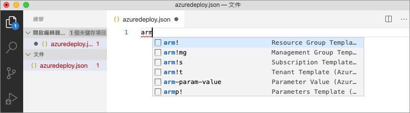

此程式碼片段會建立 ARM 範本的基本構成要素。

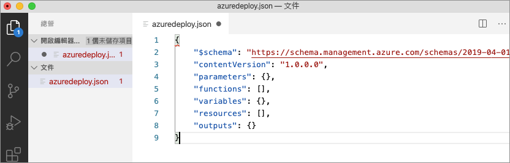

請注意，Visual Studio Code 語言模式已從 JSON  變更為 Azure Resource Manager 範本  。 擴充功能包含 ARM 範本特有的語言伺服器，可提供專屬於 ARM 範本的驗證、完成和其他語言服務。

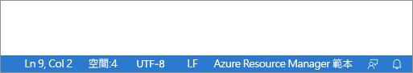

## <a name="add-an-azure-resource"></a>新增 Azure 資源

擴充功能包含許多適用於 Azure 資源的程式碼片段。 這些程式碼片段可讓您輕鬆地將資源新增至範本部署。

將游標放在範本的 **resources** 區塊中，輸入 `storage`，然後選取 [arm-storage]  程式碼片段。

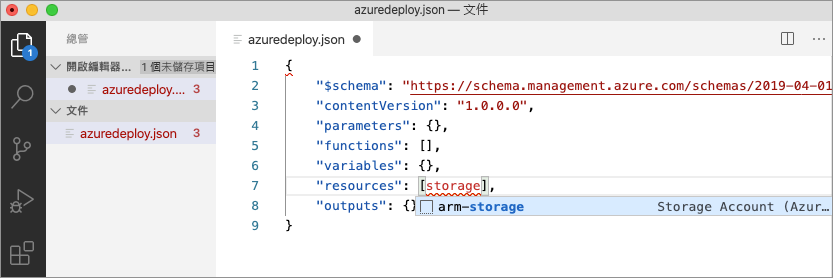

此動作會將儲存體資源新增至範本。

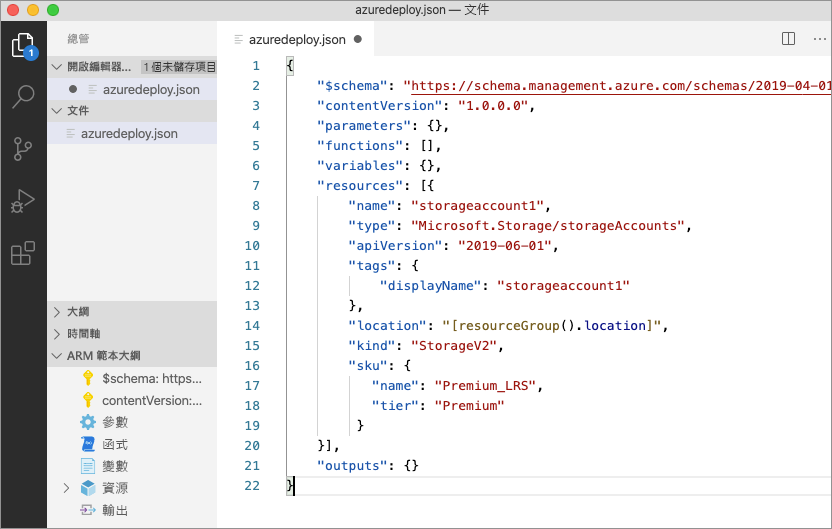

您可以使用 **tab** 鍵來瀏覽儲存體帳戶上可設定的屬性。

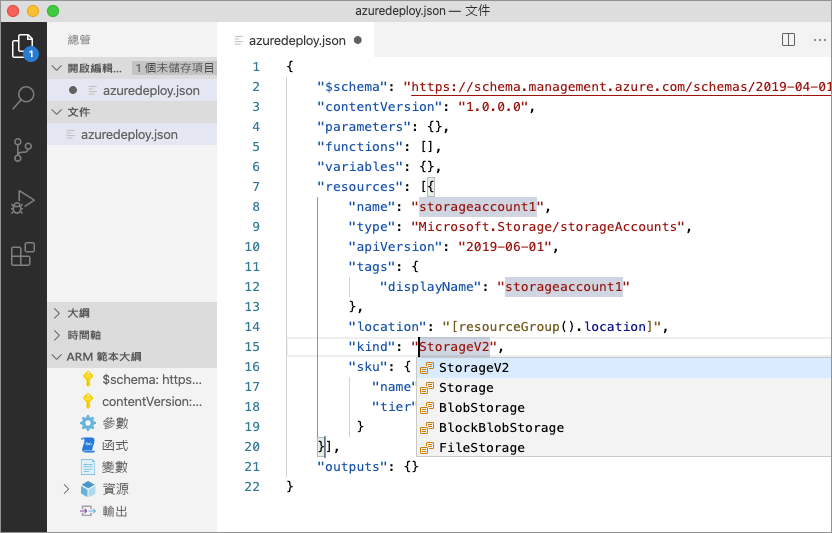

## <a name="completion-and-validation"></a>完成和驗證

擴充功能最強大的功能之一，就是與 Azure 結構描述整合。 Azure 結構描述提供具有驗證和資源感知完成功能的擴充功能。 讓我們修改儲存體帳戶，以查看驗證和完成如何進行。

首先，將儲存體帳戶種類更新為不正確的值，例如 `megaStorage`。 請注意，此動作會產生一則警告，指出 `megaStorage` 不是有效的值。

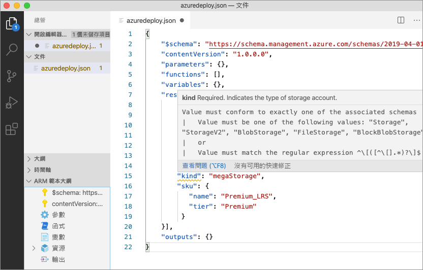

若要使用完成功能，請移除 `megaStorage`，將游標放在雙引號內，然後按 `ctrl` + `space`。 此動作會顯示有效值的自動完成清單。


## <a name="add-template-parameters"></a>新增範本參數

現在，請建立並使用參數來指定儲存體帳戶名稱。

將游標放在參數區塊中，新增一個歸位字元，輸入 `"`，然後選取 `new-parameter` 程式碼片段。 此動作會將泛型參數新增至範本。

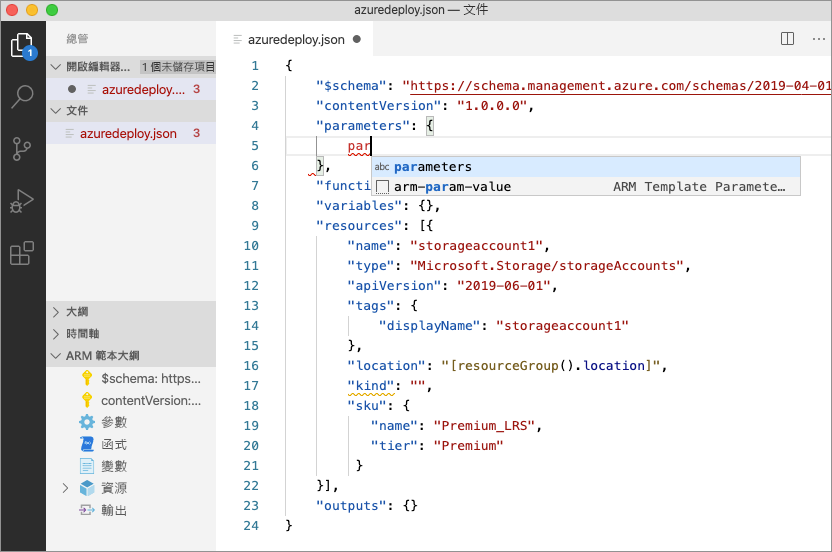

將參數的名稱更新為 `storageAccountName`，並將描述更新為 `Storage Account Name`。

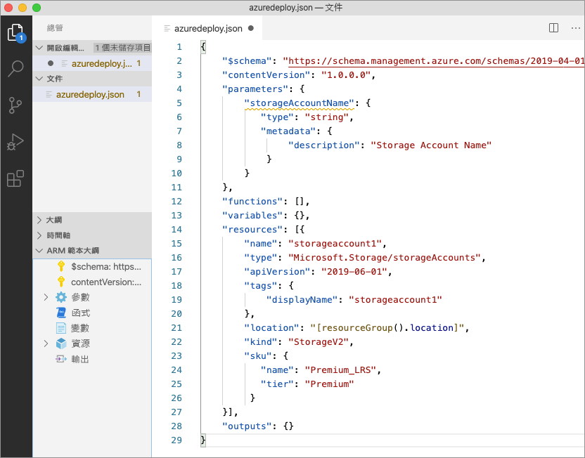

Azure 儲存體帳戶名稱最少為 3 個字元長，最多為 24 個字元長。 將 `minLength` 和 `maxLength` 新增至參數，並提供適當的值。


現在，在儲存體資源上，將 name 屬性更新為使用該參數。 若要這麼做，請移除目前的名稱。 輸入雙引號和左方括弧 `[`，這會產生 ARM 範本函式的清單。 從清單中選取 parameters  。

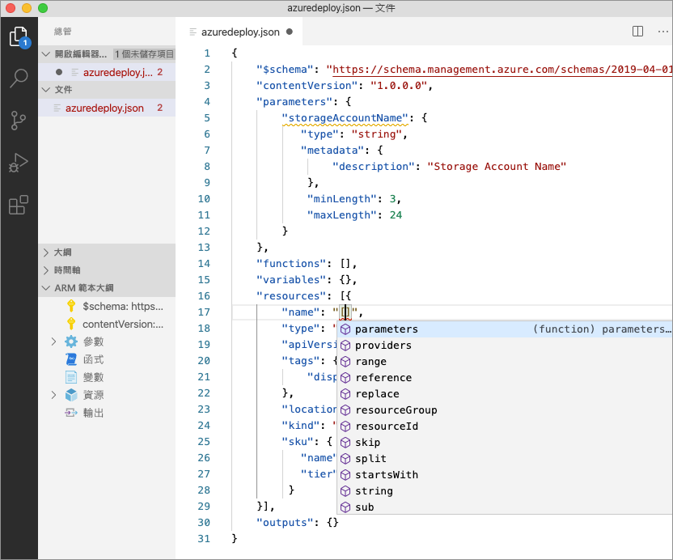

在括弧內輸入單引號 `'` 會產生範本中定義的所有參數清單，在此案例中為 storageAccountName  。 選取參數。

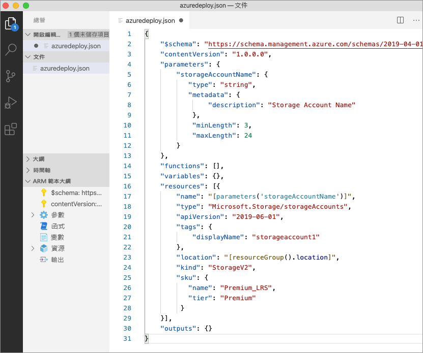

## <a name="create-a-parameter-file"></a>建立參數檔案

ARM 範本參數檔案可讓您儲存環境特有的參數值，並在部署階段以群組的形式傳遞這些值。 例如，您可能有一個包含測試環境特有值的參數檔案，以及另一個用於生產環境的參數檔案。

擴充功能可讓您輕鬆地從現有範本建立參數檔案。 若要這麼做，請在程式碼編輯器中的範本上按一下滑鼠右鍵，然後選取 [`Select/Create Parameter File`]。

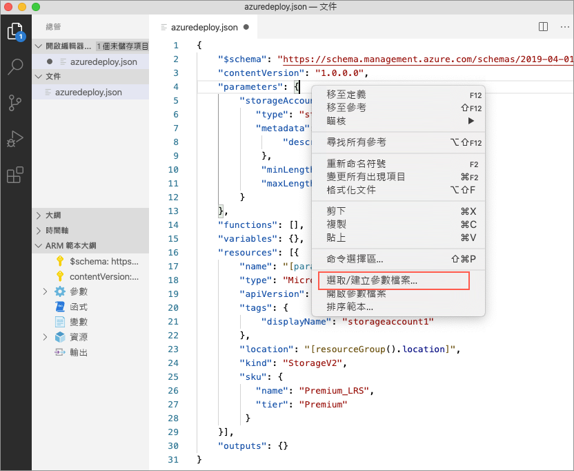

選取 [`New`]  >  [`All Parameters`] > 選取參數檔案的名稱和位置。

![顯示從 ARM 範本建立參數檔案時，[名稱] 和 [儲存檔案] 對話方塊的影像](./media/quickstart-create-templates-use-visual-studio-code/15.png)

此動作會建立新的參數檔案，並將其與建立該檔案的範本對應。 選取範本時，您可以在 Visual Studio Code 狀態列中查看和修改目前的範本/參數檔案對應。


現在，參數檔案已對應至範本，接著擴充功能會同時驗證範本和參數檔案。 若要查看此驗證實務，請將兩個字元的值新增至參數檔案中的 `storageAccountName` 參數，並儲存檔案。

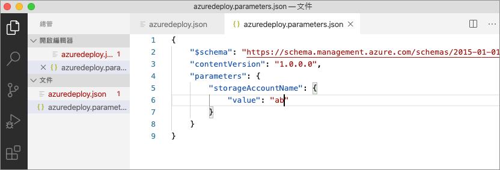

瀏覽回 ARM 範本，您會看到指出值不符合參數準則的錯誤。

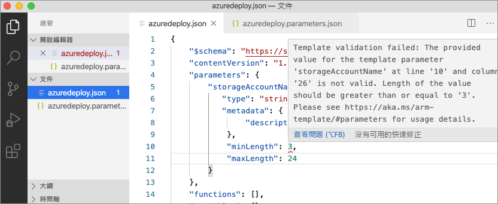

將值更新為適當的內容，儲存檔案，然後瀏覽回範本。 您會發現參數上的錯誤已解決。

## <a name="deploy-the-template"></a>部署範本

使用 `ctrl` + ```` ` ```` 按鍵組合開啟整合式 Visual Studio Code 終端，並使用 Azure CLI 或 Azure PowerShell 模組來部署範本。

# <a name="cli"></a>[CLI](#tab/CLI)

```azurecli
az group create --name arm-vscode --location eastus

az deployment group create --resource-group arm-vscode --template-file azuredeploy.json --parameters azuredeploy.parameters.json
```

# <a name="powershell"></a>[PowerShell](#tab/PowerShell)

```azurepowershell
New-AzResourceGroup -Name arm-vscode -Location eastus

New-AzResourceGroupDeployment -ResourceGroupName arm-vscode -TemplateFile ./azuredeploy.json -TemplateParameterFile ./azuredeploy.parameters.json
```
---

## <a name="clean-up-resources"></a>清除資源

如果不再需要 Azure 資源，請使用 Azure CLI 或 Azure PowerShell 模組來刪除快速入門資源群組。

# <a name="cli"></a>[CLI](#tab/CLI)

```azurecli
az group delete --name arm-vscode
```

# <a name="powershell"></a>[PowerShell](#tab/PowerShell)

```azurepowershell
Remove-AzResourceGroup -Name arm-vscode
```
---

## <a name="next-steps"></a>後續步驟

> [!div class="nextstepaction"]
> [初學者教學課程](./template-tutorial-create-first-template.md)
