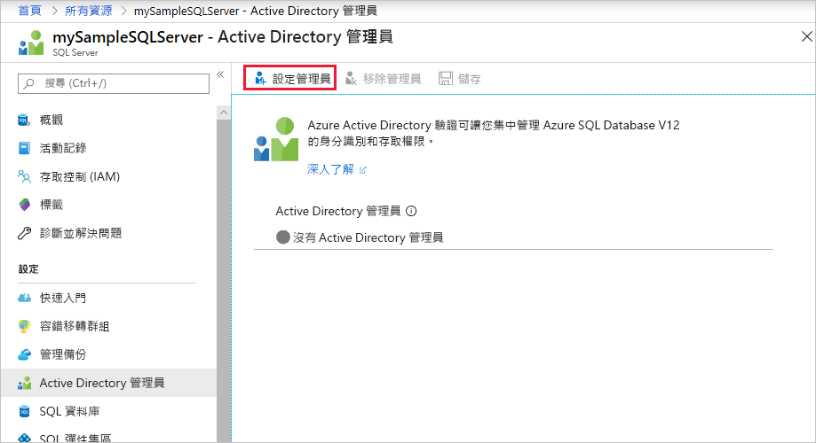
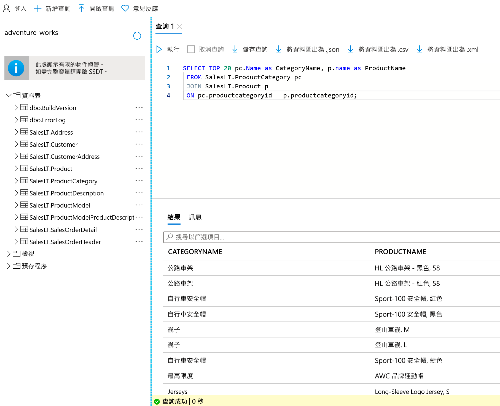

# <a name="quickstart-use-the-azure-portals-query-editor-to-query-an-azure-sql-database"></a>快速入門：使用 Azure 入口網站的查詢編輯器來查詢 Azure SQL Database
[!INCLUDE[appliesto-sqldb](../includes/appliesto-sqldb.md)]

查詢編輯器是 Azure 入口網站中的一項工具，可針對 Azure SQL Database 中的資料庫或 Azure Synapse Analytics 中的資料倉儲執行 SQL 查詢。 

在本快速入門中，您將使用查詢編輯器對資料庫執行 Transact-SQL (T-SQL) 查詢。

## <a name="prerequisites"></a>必要條件

完成本快速入門需要 AdventureWorksLT 範例資料庫。 如果您沒有 SQL Database 中 AdventureWorksLT 範例資料庫的工作複本，下列快速入門會快速建立一個：

- [快速入門：使用 Azure 入口網站、PowerShell 或 Azure CLI 在 Azure SQL Database 中建立一個資料庫](single-database-create-quickstart.md) 

### <a name="configure-network-settings"></a>設定網路設定

如果您在查詢編輯器中遇到下列其中一個錯誤：*您的區域網路設定可能造成查詢編輯器無法發出查詢。如需有關如何設定網路設定的指示，請按一下這裡*，或是*無法建立與伺服器的連線。這可能表示您的本機防火牆設定或網路 Proxy 設定發生問題*，下列重要資訊應該有助於解決問題：

> [!IMPORTANT]
> 查詢編輯器會使用連接埠 443 和 1443 來進行通訊。 請確定您已在這些連接埠上啟用輸出 HTTPS 流量。 您也必須[將輸出 IP 位址新增至伺服器的允許防火牆規則](firewall-create-server-level-portal-quickstart.md)，以存取您的資料庫和資料倉儲。


## <a name="open-the-sql-database-query-editor"></a>開啟 SQL Database 查詢編輯器

1. 登入 [Azure 入口網站](https://portal.azure.com/)並選取您想要查詢的資料庫。

2. 在 [SQL 資料庫] 功能表中，選取 [查詢編輯器 (預覽)]。

    


## <a name="establish-a-connection-to-the-database"></a>建立資料庫的連線

即使您已登入入口網站，您仍然需要提供認證來存取資料庫。 您可以使用 SQL 驗證或 Azure Active Directory 來連線到您的資料庫。

### <a name="connect-using-sql-authentication"></a>使用 SQL 驗證進行連線

1. 在 [登入] 頁面的 [SQL 伺服器驗證] 底下，為具有資料庫存取權的使用者輸入 [登入] 和 [密碼]。 如果您不確定，請使用資料庫伺服器的伺服器管理員身分來填入登入和密碼。

    

2. 選取 [確定]。


### <a name="connect-using-azure-active-directory"></a>使用 Azure Active Directory 連線

設定 Azure Active Directory (Azure AD) 系統管理員，可讓您使用單一身分識別來登入 Azure 入口網站和您的資料庫。 若要使用 Azure AD 連線到您的資料庫，請遵循下列步驟來為您的 SQL Server 執行個體設定 Azure AD 系統管理員。

> [!NOTE]
> * Azure AD 系統管理員尚未支援電子郵件帳戶 (例如 outlook.com、gmail.com、yahoo.com 等)。 請務必選擇在 Azure AD 中原生建立的使用者，或 Azure AD 中的同盟使用者。
> * Azure AD 系統管理員登入無法搭配已啟用 2 雙因素驗證的帳戶使用。

#### <a name="set-an-active-directory-admin-for-the-server"></a>設定伺服器的 Active Directory 系統管理員

1. 在 Azure 入口網站中，選取您的 SQL Server 執行個體。

2. 在 [SQL 伺服器] 功能表上，選取 [Active Directory 系統管理員]。

3. 在 SQL Server 的 [Active Directory 系統管理員] 頁面工具列中，選取 [設定系統管理員]，然後選擇使用者或群組作為您的 Azure AD 系統管理員。

    

4. 在 [新增系統管理員] 頁面的搜尋方塊中，輸入要尋找的使用者或群組、將其選取來作為系統管理員，然後選擇 [選取] 按鈕。

5. 返回 SQL Server 的 [Active Directory 系統管理員] 頁面工具列，選取 [儲存]。

### <a name="connect-to-the-database"></a>連接至資料庫

6. 在 [SQL Server] 功能表中，選取 [SQL 資料庫]，然後選取您的資料庫。

7. 在 [SQL 資料庫] 功能表中，選取 [查詢編輯器 (預覽)]。 在 [登入] 頁面的 [Active Directory 驗證] 標籤下方，如果您是 Azure AD 系統管理員，即會顯示一則訊息，指出您已登入。然後選取 [以 *\<your user or group ID>* 的身分繼續] 按鈕。 如果頁面指出您尚未成功登入，您可能需要重新整理頁面。

## <a name="query-a-database-in-sql-database"></a>在 SQL Database 中查詢資料庫

下列範例查詢應該會順利地對 AdventureWorksLT 範例資料庫執行。

### <a name="run-a-select-query"></a>執行 SELECT 查詢

1. 將下列查詢貼到查詢編輯器：

   ```sql
    SELECT TOP 20 pc.Name as CategoryName, p.name as ProductName
    FROM SalesLT.ProductCategory pc
    JOIN SalesLT.Product p
    ON pc.productcategoryid = p.productcategoryid;
   ```

2. 選取 [執行]，然後檢閱 [結果] 窗格中的輸出結果。

   

3. (選擇性) 您可以將查詢儲存為 .sql 檔案，或將傳回的資料匯出為 json、.csv 或 .xml 檔案。

### <a name="run-an-insert-query"></a>執行 INSERT 查詢

執行以下 [INSERT](/sql/t-sql/statements/insert-transact-sql/) T-SQL 陳述式，在 `SalesLT.Product` 資料表中加入新產品。

1. 使用此查詢取代先前的查詢。

    ```sql
    INSERT INTO [SalesLT].[Product]
           ( [Name]
           , [ProductNumber]
           , [Color]
           , [ProductCategoryID]
           , [StandardCost]
           , [ListPrice]
           , [SellStartDate]
           )
    VALUES
           ('myNewProduct'
           ,123456789
           ,'NewColor'
           ,1
           ,100
           ,100
           ,GETDATE() );
   ```


2. 選取 [執行] 以在 `Product` 資料表中插入新資料列。 [訊息] 窗格會顯示**成功的查詢：受影響的資料列：1**。


### <a name="run-an-update-query"></a>執行 UPDATE 查詢

執行以下 [UPDATE](/sql/t-sql/queries/update-transact-sql/) T-SQL 陳述式修改您的新產品。

1. 使用此查詢取代先前的查詢。

   ```sql
   UPDATE [SalesLT].[Product]
   SET [ListPrice] = 125
   WHERE Name = 'myNewProduct';
   ```

2. 選取 [執行] 以在 `Product` 資料表中更新指定的資料列。 [訊息] 窗格會顯示**成功的查詢：受影響的資料列：1**。

### <a name="run-a-delete-query"></a>執行 DELETE 詢

執行以下 [DELETE](/sql/t-sql/statements/delete-transact-sql/) T-SQL 陳述式移除您的新產品。

1. 使用此查詢取代先前的查詢：

   ```sql
   DELETE FROM [SalesLT].[Product]
   WHERE Name = 'myNewProduct';
   ```

2. 選取 [執行] 以在 `Product` 資料表中刪除指定的資料列。 [訊息] 窗格會顯示**成功的查詢：受影響的資料列：1**。


## <a name="query-editor-considerations"></a>查詢編輯器考量

使用查詢編輯器時，有一些使用事項須注意。

* 查詢編輯器會使用連接埠 443 和 1443 來進行通訊。 請確定您已在這些連接埠上啟用輸出 HTTPS 流量。 您也必須將輸出 IP 位址新增至伺服器的允許防火牆規則，以存取您的資料庫和資料倉儲。

* 若您具有 Private Link 連線，則不需要將用戶端 IP 位址新增至 SQL Database 防火牆，查詢編輯器即可運作。

* 按下 **F5** 可重新整理查詢編輯器頁面，而且任何正在進行的查詢都會遺失。

* 查詢編輯器不支援連線到 `master` 資料庫。

* 查詢執行的逾時時間是 5 分鐘。

* 查詢編輯器僅支援地理資料類型的圓柱形投影。

* 資料庫資料表和檢視不支援 IntelliSense，但編輯器可支援已輸入名稱的自動完成功能。


## <a name="next-steps"></a>後續步驟

若要深入了解 Azure SQL Database 中支援的 Transact-SQL (T-SQL)，請參閱[解決移轉至 SQL Database 期間的 Transact-SQL 差異](transact-sql-tsql-differences-sql-server.md)。
