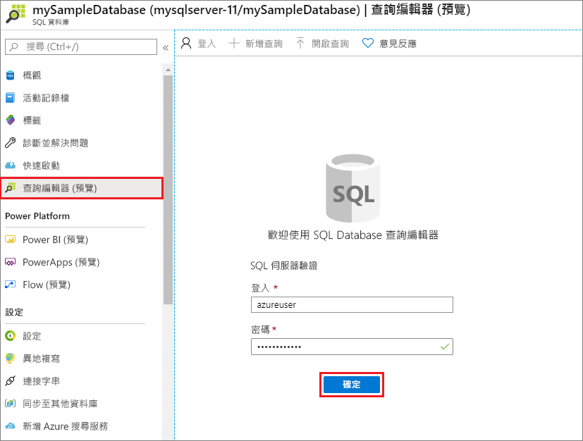
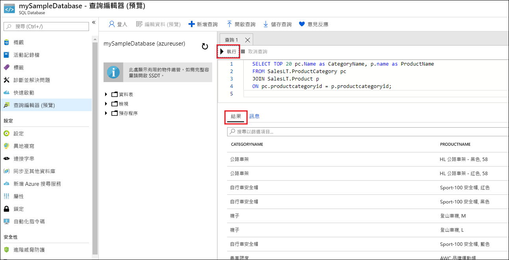

# <a name="quickstart-create-an-azure-sql-database-single-database"></a>快速入門：建立 Azure SQL Database 單一資料庫

在此快速入門中，您可以使用 Azure 入口網站、PowerShell 指令碼或 Azure CLI 指令碼，在 Azure SQL Database 中建立[單一資料庫](single-database-overview.md)。 接著，您可以使用 Azure 入口網站中的 **查詢編輯器** 來查詢資料庫。


## <a name="prerequisite"></a>必要條件

- 有效的 Azure 訂用帳戶。 如果您沒有訂用帳戶，請[建立免費帳戶](https://azure.microsoft.com/free/)。

## <a name="create-a-single-database"></a>建立單一資料庫

本快速入門會在[無伺服器計算層](serverless-tier-overview.md)中建立單一資料庫。

# <a name="portal"></a>[入口網站](#tab/azure-portal)

若要在 Azure 入口網站中建立單一資料庫，本快速入門會從 Azure SQL 頁面開始。

1. 瀏覽至[選取 SQL 部署選項](https://portal.azure.com/#create/Microsoft.AzureSQL)頁面。
1. 在 **SQL 資料庫** 下，將 **資源類型** 設定為 **單一資料庫**，然後選取 [建立]。

   

1. 在 **建立 SQL 資料庫** 表單的 **基本資料** 索引標籤上，在 **專案詳細資料** 下，選取想要的 Azure **訂用帳戶**。
1. 針對 **資源群組** 選取 [建立新的]，輸入 myResourceGroup，然後選取 [確定]。
1. 針對 **資料庫名稱** 輸入 mySampleDatabase。
1. 在 **伺服器** 中，選取 [建立新的]，並以下列值填寫 **新伺服器** 表單：
   - **伺服器名稱**：輸入 mysqlserver 並新增一些字元來表示唯一性。 由於伺服器名稱必須是 Azure 中所有伺服器的全域唯一名稱，而不只是訂用帳戶中的唯一名稱，因此我們無法提供要使用的確切伺服器名稱。 因此，請輸入類似 mysqlserver12345 的值，入口網站會讓您知道您輸入的值是否可以使用。
   - **伺服器管理員登入**：輸入 azureuser。
   - **密碼**：輸入符合需求的密碼，然後在 [確認密碼] 欄位中再次輸入。
   - **位置**：從下拉式清單中選取位置。

   選取 [確定]。

1. 將 **您要使用 SQL 彈性集區** 設為 **否**。
1. 在 **計算 + 儲存體** 下，選取 [設定資料庫]。
1. 本快速入門會使用無伺服器資料庫，因此請選取 [無伺服器]，然後選取 [套用]。 

      

1. 完成時，選取 [下一步:網路功能]，為於頁面底部。

   

1. 在 **網路功能** 索引標籤的 **連線方法** 中，選取 [公用端點]。
1. 針對 **防火牆規則**，將 [新增目前的用戶端 IP 位址] 設定為 **是**。 將 **允許 Azure 服務和資源存取此伺服器群組** 保留為 **否**。
1. 完成時，選取 [下一步:其他設定]，位於頁面底部。

   
  

1. 在 [其他設定] 索引標籤的 [資料來源] 區段中，針對 [使用現有的資料]，選取 [範例]。 這會建立 AdventureWorksLT 範例資料庫，同時提供一些可供查詢和實驗的資料表和資料，而不是空的空白資料庫。
1. 選取頁面底部的 [檢閱 + 建立]：

   

1. 檢閱 [檢閱 + 建立] 頁面之後，選取 [建立]。

# <a name="azure-cli"></a>[Azure CLI](#tab/azure-cli)

## <a name="launch-azure-cloud-shell"></a>啟動 Azure Cloud Shell

Azure Cloud Shell 是免費的互動式 Shell，可讓您用來執行本文中的步驟。 它具有預先安裝和設定的共用 Azure 工具，可與您的帳戶搭配使用。 

若要開啟 Cloud Shell，只要選取程式碼區塊右上角的 [試試看] 即可。 您也可以移至 [https://shell.azure.com](https://shell.azure.com)，從另一個瀏覽器索引標籤啟動 Cloud Shell。 選取 [複製]  即可複製程式碼區塊，將它貼到 Cloud Shell 中，然後按 **Enter** 鍵加以執行。

## <a name="set-parameter-values"></a>設定參數值

後續的命令會使用下列值來建立資料庫和所需的資源。 伺服器名稱在所有 Azure 中必須是全域唯一的名稱，因此會使用 $RANDOM 函式來建立伺服器名稱。 取代 IP 位址範圍中的 0.0.0.0 值，以符合您的特定環境。

```azurecli-interactive
# Set the resource group name and location for your server
resourceGroupName=myResourceGroup
location=eastus

# Set an admin login and password for your database
adminlogin=azureuser
password=Azure1234567!

# Set a server name that is unique to Azure DNS (<server_name>.database.windows.net)
serverName=server-$RANDOM

# Set the ip address range that can access your database
startip=0.0.0.0
endip=0.0.0.0
```

## <a name="create-a-resource-group"></a>建立資源群組

使用 [az group create](/cli/azure/group) 命令來建立資源群組。 Azure 資源群組是在其中部署與管理 Azure 資源的邏輯容器。 下列範例會在 eastus  位置建立名為 myResourceGroup  的資源群組：

```azurecli-interactive
az group create --name $resourceGroupName --location $location
```

## <a name="create-a-server"></a>建立伺服器

使用 [az sql server create](/cli/azure/sql/server) 命令建立伺服器。

```azurecli-interactive
az sql server create \
    --name $serverName \
    --resource-group $resourceGroupName \
    --location $location  \
    --admin-user $adminlogin \
    --admin-password $password
```


## <a name="configure-a-firewall-rule-for-the-server"></a>設定伺服器的防火牆規則

使用 [az sql server firewall-rule create](/cli/azure/sql/server/firewall-rule) 命令建立防火牆規則。

```azurecli-interactive
az sql server firewall-rule create \
    --resource-group $resourceGroupName \
    --server $serverName \
    -n AllowYourIp \
    --start-ip-address $startip \
    --end-ip-address $endip
```


## <a name="create-a-single-database"></a>建立單一資料庫

使用 [az sql db create](/cli/azure/sql/db) 命令建立資料庫。 下列程式碼會建立


```azurecli-interactive
az sql db create \
    --resource-group $resourceGroupName \
    --server $serverName \
    --name mySampleDatabase \
    --sample-name AdventureWorksLT \
    --edition GeneralPurpose \
    --compute-model Serverless \
    --family Gen5 \
    --capacity 2
```


# <a name="powershell"></a>[PowerShell](#tab/azure-powershell)

您可以使用 Windows PowerShell 來建立資源群組、伺服器及單一資料庫。

## <a name="launch-azure-cloud-shell"></a>啟動 Azure Cloud Shell

Azure Cloud Shell 是免費的互動式 Shell，可讓您用來執行本文中的步驟。 它具有預先安裝和設定的共用 Azure 工具，可與您的帳戶搭配使用。 

若要開啟 Cloud Shell，只要選取程式碼區塊右上角的 [試試看] 即可。 您也可以移至 [https://shell.azure.com](https://shell.azure.com)，從另一個瀏覽器索引標籤啟動 Cloud Shell。 選取 [複製]  即可複製程式碼區塊，將它貼到 Cloud Shell 中，然後按 **Enter** 鍵加以執行。

## <a name="set-parameter-values"></a>設定參數值

後續的命令會使用下列值來建立資料庫和所需的資源。 伺服器名稱在所有 Azure 中必須是全域唯一的名稱，因此會使用 Get-Random Cmdlet 來建立伺服器名稱。 取代 IP 位址範圍中的 0.0.0.0 值，以符合您的特定環境。

```azurepowershell-interactive
   # Set variables for your server and database
   $resourceGroupName = "myResourceGroup"
   $location = "eastus"
   $adminLogin = "azureuser"
   $password = "Azure1234567!"
   $serverName = "mysqlserver-$(Get-Random)"
   $databaseName = "mySampleDatabase"

   # The ip address range that you want to allow to access your server
   $startIp = "0.0.0.0"
   $endIp = "0.0.0.0"

   # Show randomized variables
   Write-host "Resource group name is" $resourceGroupName
   Write-host "Server name is" $serverName
```


## <a name="create-resource-group"></a>建立資源群組

使用 [New-AzResourceGroup](/powershell/module/az.resources/new-azresourcegroup) 來建立 Azure 資源群組。 資源群組是在其中部署與管理 Azure 資源的邏輯容器。

```azurepowershell-interactive
   Write-host "Creating resource group..."
   $resourceGroup = New-AzResourceGroup -Name $resourceGroupName -Location $location -Tag @{Owner="SQLDB-Samples"}
   $resourceGroup
```


## <a name="create-a-server"></a>建立伺服器

使用 [New-AzSqlServer](/powershell/module/az.sql/new-azsqlserver) Cmdlet 建立伺服器。

```azurepowershell-interactive
  Write-host "Creating primary server..."
   $server = New-AzSqlServer -ResourceGroupName $resourceGroupName `
      -ServerName $serverName `
      -Location $location `
      -SqlAdministratorCredentials $(New-Object -TypeName System.Management.Automation.PSCredential `
      -ArgumentList $adminLogin, $(ConvertTo-SecureString -String $password -AsPlainText -Force))
   $server
```

## <a name="create-a-firewall-rule"></a>建立防火牆規則

使用 [New-AzSqlServerFirewallRule](/powershell/module/az.sql/new-azsqlserverfirewallrule) Cmdlet 建立伺服器防火牆規則。

```azurepowershell-interactive
   Write-host "Configuring server firewall rule..."
   $serverFirewallRule = New-AzSqlServerFirewallRule -ResourceGroupName $resourceGroupName `
      -ServerName $serverName `
      -FirewallRuleName "AllowedIPs" -StartIpAddress $startIp -EndIpAddress $endIp
   $serverFirewallRule
```


## <a name="create-a-single-database"></a>建立單一資料庫

使用 [New-AzSqlDatabase](/powershell/module/az.sql/new-azsqldatabase) Cmdlet 建立單一資料庫。

```azurepowershell-interactive
   Write-host "Creating a gen5 2 vCore serverless database..."
   $database = New-AzSqlDatabase  -ResourceGroupName $resourceGroupName `
      -ServerName $serverName `
      -DatabaseName $databaseName `
      -Edition GeneralPurpose `
      -ComputeModel Serverless `
      -ComputeGeneration Gen5 `
      -VCore 2 `
      -MinimumCapacity 2 `
      -SampleName "AdventureWorksLT"
   $database
```

---


## <a name="query-the-database"></a>查詢資料庫

資料庫建好之後，您可以使用 Azure 入口網站中的 **查詢編輯器 (預覽)** 連線到資料庫，並查詢資料。

1. 在入口網站中，搜尋並選取 [SQL 資料庫]，然後從清單中選取您的資料庫。
1. 在資料庫頁面面上，選取左側功能表中的 [查詢編輯器 (預覽)]。
1. 輸入您的伺服器系統管理員登入資訊，然後選取 [確定]。

   

1. 在 [查詢編輯器] 窗格中輸入下列查詢。

   ```sql
   SELECT TOP 20 pc.Name as CategoryName, p.name as ProductName
   FROM SalesLT.ProductCategory pc
   JOIN SalesLT.Product p
   ON pc.productcategoryid = p.productcategoryid;
   ```

1. 選取 [執行]，然後在 [結果] 窗格中檢閱查詢結果。

   

1. 關閉 [查詢編輯器] 頁面，並在系統提示是否要捨棄未儲存的編輯時選取 [確定]。

## <a name="clean-up-resources"></a>清除資源

請保留資源群組、伺服器和單一資料庫，以繼續進行後續步驟，並了解如何使用不同的方法來連線及查詢您的資料庫。

當您使用完這些資源時，您可以刪除所建立的資源群組，而這也會刪除其中的伺服器和單一資料庫。

### <a name="portal"></a>[入口網站](#tab/azure-portal)

使用 Azure 入口網站來刪除 **myResourceGroup** 和其所有資源：

1. 在入口網站中，搜尋並選取 [資源群組]，然後從清單中選取 [myResourceGroup]。
1. 在 [資源群組] 頁面中，選取 [刪除資源群組]。
1. 在 [輸入資源群組名稱] 底下，輸入 myResourceGroup，然後選取 [刪除]。

### <a name="azure-cli"></a>[Azure CLI](#tab/azure-cli)

若要刪除資源群組及其所有資源，請使用您的資源組名稱來執行下列 Azure CLI 命令：

```azurecli-interactive
az group delete --name $resourceGroupName
```

### <a name="powershell"></a>[PowerShell](#tab/azure-powershell)

若要刪除資源群組及其所有資源，請使用您的資源組名稱來執行下列 PowerShell Cmdlet：

```azurepowershell-interactive
Remove-AzResourceGroup -Name $resourceGroupName
```

---

## <a name="next-steps"></a>後續步驟

使用不同的工具和語言來[連線及查詢](connect-query-content-reference-guide.md)您的資料庫：
> [!div class="nextstepaction"]
> [使用 SQL Server Management Studio 進行連線和查詢](connect-query-ssms.md)
>
> [使用 Azure Data Studio 進行連線及查詢](/sql/azure-data-studio/quickstart-sql-database?toc=/azure/sql-database/toc.json)

想要最佳化並節省您的雲端費用嗎？

> [!div class="nextstepaction"]
> [使用成本管理開始分析成本](../../cost-management-billing/costs/quick-acm-cost-analysis.md?WT.mc_id=costmanagementcontent_docsacmhorizontal_-inproduct-learn)