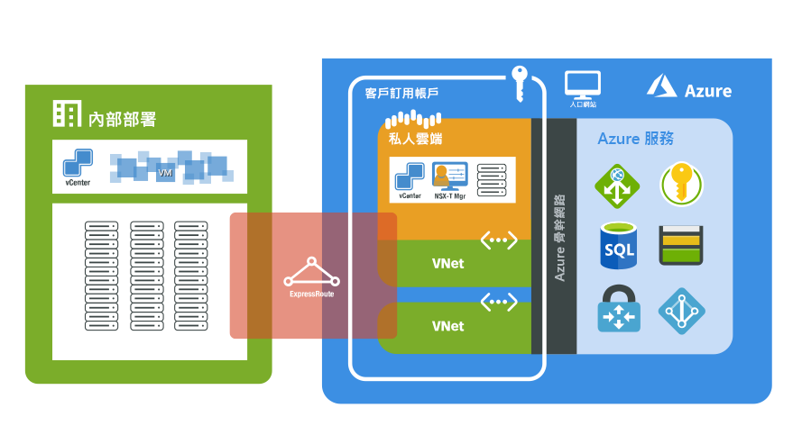

# 什麼是 Azure VMware 解決方案 (AVS) 預覽？

Azure VMware 解決方案 (AVS) 可在 Azure 為您提供私人雲端。 私人雲端包含 vSphere 叢集，從專用的裸機 Azure 基礎結構加以建置。 由於單一私人雲端中可擁有多個叢集，您可以將私人雲端叢集從 3 個主機調整為 16 個。 所有私人雲端都會以 vCenter Server、VSAN、vSphere 和 NSX-T 佈建。 您可以從內部部署環境遷移工作負載、建立或部署新的虛擬機器，以及從您的私人雲端使用 Azure 服務。

AVS 是一項 VMware 驗證解決方案，其中包含進行中的增強功能與升級驗證和測試。 私人雲端基礎結構和軟體由 Microsoft 所管理和維護，可讓您專注於在私人雲端中開發及執行工作負載。

下圖顯示 Azure、Azure 服務和內部部署環境中私人雲端和 VNet 之間的相鄰關係。 從私人雲端到 Azure 服務或 VNet 的網路存取，會提供 Azure 服務端點的 SLA 驅動整合。 來自內部部署環境的私人雲端存取會使用 ExpressRoute Global Reach 來進行私人且安全的連線。

## 主機、叢集和私人雲端

AVS 私人雲端和叢集是從裸機、超融合的 Azure 基礎結構主機所建立。 高階主機具有 576 GB 的 RAM，以及兩顆 Intel 18 核心和 2.3 GHz 的處理器。 HE 主機具有兩個 vSAN 磁碟群組，其中包含總共 15.36 TB (SSD) 的原始 vSAN 容量層級，以及 3.2 TB (NVMe) 的 vSAN 快取層。

新的私人雲端會透過 Azure 入口網站或 Azure CLI 部署。

## 網路功能

部署私人雲端時，會建立用於管理、佈建和 vMotion 的私人網路。 這些私人網路是用來存取 vCenter 和 NSX-T 管理員，以及用於虛擬機器 vMotion 或部署。 所有的私人網路都可以從 Azure 的 VNet 或從內部部署環境存取。 ExpressRoute Global Reach 用來將私人雲端連線到內部部署環境，而此連線需要在您的訂用帳戶中具有 ExpressRoute 線路的 VNet 才能運作。

部署私人雲端時，會佈建網際網路和 Azure 服務的存取權。 系統會提供存取權，讓生產工作負載網路上的 VM 可以取用 Azure 或以網際網路為基礎的服務。 預設會停用新私人雲端的網際網路存取，而且可以隨時啟用或停用。

如需網路和互連能力的詳細資訊，請參閱[網路概念](concepts-networking.md)一文。

## 存取和安全性

為了加強安全性，AVS 私人雲端會使用 vSphere 角色型存取控制。 vSphere SSO LDAP 功能可以與 Azure Active Directory 整合。 如需有關身分識別和使用權限的詳細資訊，請參閱[存取和身分識別概念](concepts-identity.md)一文。

vSAN 待用資料加密預設為啟用，並用來提供 vSAN 資料存放區的安全性。 [儲存體概念](concepts-storage.md)一文中會更詳細地說明。

## 主機和軟體生命週期維護

以一般方式升級 AVS 私人雲端和 VMware 軟體，可確保在您的私人雲端中執行最新的安全性、穩定性和功能集。 如需有關平台維護和升級的詳細資訊，請參閱[升級概念](concepts-upgrades.md)一文。

## 監視為您的私人雲端

您可以使用[ Azure 監視器中的記錄](../azure-monitor/overview.md)，在 AVS 私人雲端中執行的虛擬機器上收集記錄。 您可以使用在內部部署 VM 上執行的相同查詢，[下載並安裝在您的 AVS 私人雲端中執行之 Linux 和 Windows 虛擬機器上的 MMA 代理程式](../azure-monitor/platform/log-analytics-agent.md#installation-and-configuration)。 您可以執行通常會在虛擬機器上執行的相同查詢。 若要深入了解如何建立查詢，請參閱[如何撰寫查詢](../azure-monitor/log-query/log-query-overview.md#how-can-i-learn-how-to-write-queries)。

## 後續步驟

下一步是了解主要的 [私人雲端和叢集概念](concepts-private-clouds-clusters.md)。

<!-- LINKS - external -->

<!-- LINKS - internal -->
[concepts-private-clouds-clusters]: ./concepts-private-clouds-clusters.md
