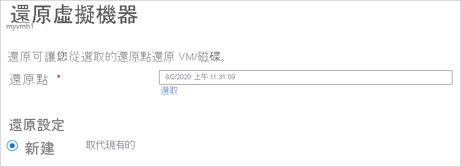
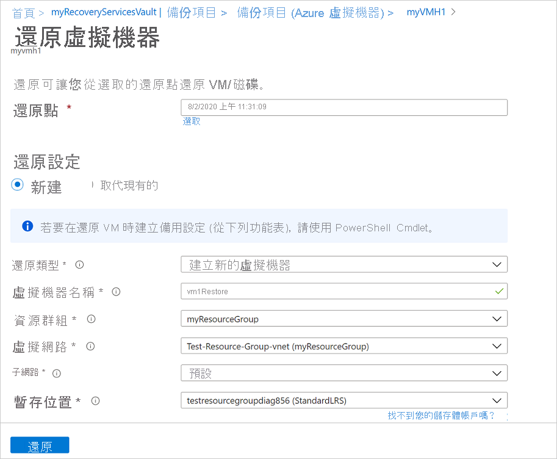
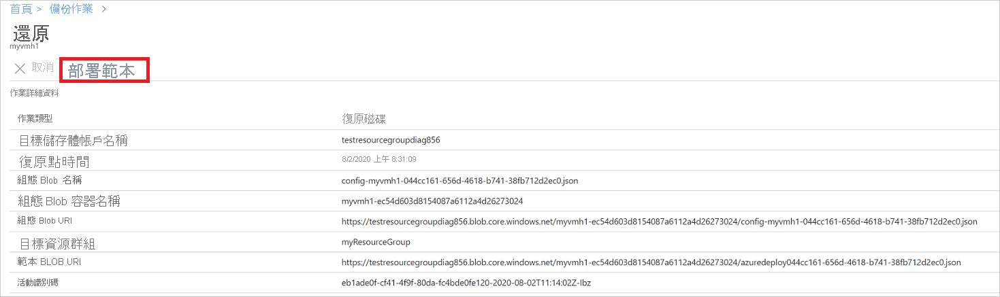
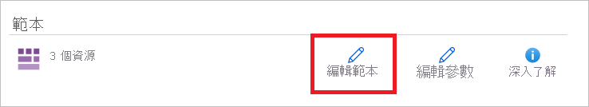
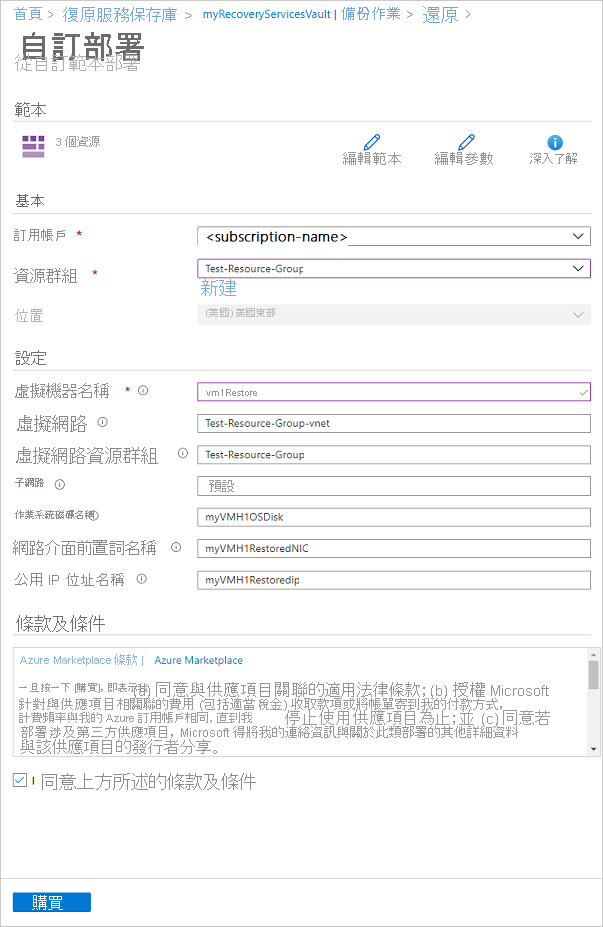
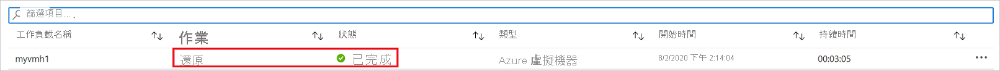

# <a name="how-to-restore-azure-vm-data-in-azure-portal"></a>如何在 Azure 入口網站中還原 Azure VM 資料

本文說明如何從儲存在 [Azure 備份](backup-overview.md)復原服務保存庫的復原點還原 Azure VM 資料。

## <a name="restore-options"></a>還原選項

Azure 備份提供數種方式來還原 VM。

**還原選項** | **詳細資料**
--- | ---
**建立新的 VM** | 從還原點快速建立及啟動基本 VM 並加以執行。<br/><br/> 您可指定 VM 的名稱，選取要放置 VM 的資源群組和虛擬網路 (VNet)，以及為已還原的 VM 指定儲存體帳戶。 建立新 VM 的區域必須與來源 VM 相同。<br><br>如果 VM 還原失敗，因為 azure 的指定區域中沒有 Azure VM SKU，或有任何其他問題，Azure 備份仍會還原指定資源群組中的磁片。
**還原磁碟** | 還原 VM 磁碟，以便後續用於建立新 VM。<br/><br/> Azure 備份提供一個範本，協助您自訂和建立 VM。 <br/><br> 還原作業會產生範本，您可以下載並使用該範本來指定自訂 VM 設定，並建立 VM。<br/><br/> 磁碟會複製到所指定的資源群組。<br/><br/> 或者，您可以將磁碟連結至現有 VM，或使用 PowerShell 建立新的 VM。<br/><br/> 此選項十分適用於自訂 VM、新增備份時沒有的組態設定，或新增必須使用範本或 PowerShell 來配置的設定。
**取代現有的** | 您可以還原磁碟，然後使用該磁碟來取代現有 VM 上的磁碟。<br/><br/> 目前的 VM 必須存在。 如果已刪除，則無法使用此選項。<br/><br/> Azure 備份會在取代磁碟前，取得現有 VM 的快照集，並儲存於所指定的暫存位置， 然後使用所選還原點來取代連線到 VM 的現有磁碟。<br/><br/> 快照集會複製到保存庫，並根據保留原則加以保留。 <br/><br/> 完成取代磁碟作業之後，原始磁碟會保留在資源群組中。 如果不需要，您可以選擇手動刪除原始磁片。 <br/><br/>未加密的受控 Vm （包括 [使用自訂映射建立](https://azure.microsoft.com/resources/videos/create-a-custom-virtual-machine-image-in-azure-resource-manager-with-powershell/)的 vm）支援取代現有的。 傳統 Vm 不支援。<br/><br/> 如果還原點中的磁碟數目多於或少於目前的 VM，則還原點中的磁碟數目只會反映該 VM 組態。<br><br> 具有連結資源的 Vm （例如 [使用者指派的受控識別](../active-directory/managed-identities-azure-resources/overview.md) 或 [Key Vault](../key-vault/general/overview.md)）也支援「取代現有」。
**跨區域 (次要區域)** | 跨區域還原可用來還原次要區域 (即 [Azure 配對區域](../best-practices-availability-paired-regions.md#what-are-paired-regions) (機器翻譯)) 中的 Azure VM。<br><br> 如果備份是在次要區域中完成，即可將所有 Azure VM 還原至選取的復原點。<br><br> 這項功能適用於下列選項：<br> <li> [建立 VM](#create-a-vm) <br> <li> [還原磁碟](#restore-disks) (機器翻譯) <br><br> 目前不支援[取代現有磁碟](#replace-existing-disks) (機器翻譯) 選項。<br><br> 權限<br> 次要地區的還原作業可由備份管理員和應用程式管理員執行。

> [!NOTE]
> 您也可以復原 Azure VM 上的特定檔案和資料夾。 [深入了解](backup-azure-restore-files-from-vm.md)。

## <a name="storage-accounts"></a>儲存體帳戶

關於儲存體帳戶的一些詳細資料：

- **建立 vm**：當您建立新的 vm 時，vm 會放在您指定的儲存體帳戶中。
- **復原磁碟**：復原磁碟時，會將磁碟複製到您指定的儲存體帳戶。 還原作業會產生可供您下載並用來指定自訂 VM 設定的範本。 此範本會放在指定的儲存體帳戶中。
- **取代磁片**：當您取代現有 vm 中的磁片時，Azure 備份會先取得現有 vm 的快照集，再更換磁片。 快照集也會透過資料傳輸，以背景進程的形式複製到復原服務保存庫。 不過，在快照集階段完成後，就會觸發「取代磁片」作業。 更換磁片作業之後，來源 Azure VM 的磁片會留在您的作業所指定的資源群組中，而 Vhd 會儲存在指定的儲存體帳戶中。 您可以選擇刪除或保留這些 Vhd 和磁片。
- **儲存體帳戶位置**：儲存體帳戶必須位於與保存庫相同的區域中。 只會顯示這些帳戶。 如果位置中沒有任何儲存體帳戶，您需要建立一個。
- **儲存體類型**：不支援 Blob 儲存體。
- **儲存體冗余**：不支援區域冗余儲存體 (ZRS) 。 帳戶名稱後面的括弧中會顯示帳戶的複寫和重複資訊。
- **Premium 儲存體**：
  - 還原非 premium Vm 時，不支援 premium 儲存體帳戶。
  - 還原受管理的 Vm 時，不支援以網路規則設定的 premium 儲存體帳戶。

## <a name="before-you-start"></a>開始之前

若要 (建立新的 VM) 來還原 VM，請確定您有正確的 Azure 角色型存取控制 (Azure RBAC) 還原 VM 操作的 [許可權](backup-rbac-rs-vault.md#mapping-backup-built-in-roles-to-backup-management-actions) 。

如果您沒有許可權，您可以 [復原磁碟](#restore-disks)，然後在復原磁碟之後，您可以使用在還原作業中所產生 [的範本](#use-templates-to-customize-a-restored-vm) 來建立新的 VM。

[!INCLUDE [backup-center.md](../../includes/backup-center.md)]

## <a name="select-a-restore-point"></a>選取還原點

1. 在與您想要還原之 VM 相關聯的保存庫中，選取 [  >  **Azure 虛擬機器** 備份專案]。
1. 選取 VM。 根據預設，VM 儀表板上會顯示過去 30 天內的復原點。 您可以根據日期、時間範圍和不同類型的快照集一致性來顯示或篩選出超過 30 天的復原點。
1. 若要還原 VM，請選取 [ **還原 vm**]。

    

1. 選取要用於復原的還原點。

## <a name="choose-a-vm-restore-configuration"></a>選擇 VM 還原組態

1. 在 [ **還原虛擬機器**] 中，選取還原選項：
    - **建立新** 的：如果您想要建立新的 VM，請使用此選項。 您可以使用簡單的設定來建立 VM，或還原磁碟並建立自訂 VM。
    - **取代現有** 的：如果您想要取代現有 VM 上的磁片，請使用此選項。

        

1. 為您所選的還原選項指定設定。

## <a name="create-a-vm"></a>建立 VM

其中一個[還原選項](#restore-options)可讓您從還原點快速建立具有基本設定的 VM。

1. 在 [**還原虛擬機器**] 的 [  >  **建立新**  >  的 **還原類型**] 中，選取 [**建立虛擬機器**]。
1. 在 [ **虛擬機器名稱**] 中，指定訂用帳戶中不存在的 VM。
1. 在 [資源群組] 中，選取新 VM 的現有資源群組，或使用全域的唯一名稱來建立新的資源群組。 如果您指派已經存在的名稱，Azure 就會為群組指派與 VM 相同的名稱。
1. 在 [虛擬網路] 中，選取將放置 VM 的 VNet。 與訂用帳戶相關聯的所有 VNet 均會顯示。 選取子網路。 預設會選取第一個子網路。
1. 在 [ **預備位置**] 中，指定 VM 的儲存體帳戶。 [深入了解](#storage-accounts)。

    

1. 選取 [ **還原** ] 以觸發還原作業。

## <a name="restore-disks"></a>還原磁碟

其中一個[還原選項](#restore-options)可讓您從還原點建立磁碟。 然後，您可以使用磁片來執行下列其中一個動作：

- 使用還原作業期間所產生的範本來自訂設定，並觸發 VM 部署。 您會編輯預設範本設定，並提交範本以進行 VM 部署。
- [將還原的磁碟](../virtual-machines/windows/attach-managed-disk-portal.md)連結至現有 VM。
- 使用 PowerShell 從還原的磁片[建立新的 VM](./backup-azure-vms-automation.md#create-a-vm-from-restored-disks) 。

1. 在 [**還原** 設定] 的 [  >  **建立新**  >  的 **還原類型**] 中選取 [**復原磁碟**]。
1. 在 [資源群組] 中，選取已還原磁碟的現有資源群組，或使用全域的唯一名稱來建立新的資源群組。
1. 在 [ **預備位置**] 中，指定要將 vhd 複製到其中的儲存體帳戶。 [深入了解](#storage-accounts)。

    

1. 選取 [ **還原** ] 以觸發還原作業。

當您的虛擬機器使用受控磁片，而您選取 [ **建立虛擬機器** ] 選項時，Azure 備份不會使用指定的儲存體帳戶。 在 **復原磁碟** 和 **立即還原** 的情況下，儲存體帳戶只會用來儲存範本。 系統會在指定的資源群組中建立受控磁片。
當您的虛擬機器使用非受控磁片時，它們會以 blob 的形式還原至儲存體帳戶。

### <a name="use-templates-to-customize-a-restored-vm"></a>使用範本自訂還原的 VM

還原磁碟後，使用還原作業期間所產生的範本來自訂和建立新 VM：

1. 在 [ **備份工作**] 中，選取相關的還原作業。

1. 在 [ **還原**] 中，選取 [ **部署範本** ] 以起始範本部署。

    

1. 若要自訂範本中提供的 VM 設定，請選取 [ **編輯範本**]。 如果您想要新增更多自訂專案，請選取 [ **編輯參數**]。
    - [深入了解](../azure-resource-manager/templates/deploy-portal.md#deploy-resources-from-custom-template)自訂範本中的部署資源。
    - [深入了解](../azure-resource-manager/templates/template-syntax.md)編寫範本。

   

1. 輸入 VM 的自訂值、接受 **條款及條件** ，然後選取 [ **購買**]。

   

## <a name="replace-existing-disks"></a>取代現有的磁碟

其中一個[還原選項](#restore-options)可讓您使用選取的還原點取代現有 VM 磁碟。 [檢閱](#restore-options)所有還原選項。

1. 在 [ **還原** 設定] 中，選取 [ **取代現有** 的]。
1. 在 [還原類型] 中，選取 [取代磁碟]。 這是將用來取代現有 VM 磁碟的還原點。
1. 在 [ **暫存位置**] 中，指定在還原程式期間應儲存目前受控磁片快照集的位置。 [深入了解](#storage-accounts)。

   

## <a name="cross-region-restore"></a>跨區域還原

作為其中一個 [還原選項](#restore-options)，跨區域還原 (CRR) 可讓您在次要區域（也就是 Azure 配對的區域）中還原 azure vm。

若要在預覽期間登入功能，請閱讀 [ [開始之前] 區段](./backup-create-rs-vault.md#set-cross-region-restore)。

若要查看是否已啟用 CRR，請依照「 [設定跨區域還原](backup-create-rs-vault.md#configure-cross-region-restore)」中的指示進行。

### <a name="view-backup-items-in-secondary-region"></a>查看次要區域中的備份專案

如果已啟用 CRR，您可以在次要區域中查看備份專案。

1. 從入口網站移至 [復原 **服務保存庫**  >  **備份專案**]。
1. 選取 **次要區域** 以查看次要區域中的專案。

>[!NOTE]
>清單中只會顯示支援 CRR 功能的備份管理類型。 目前，僅支援將次要區域資料還原至次要區域。


### <a name="restore-in-secondary-region"></a>在次要區域中還原

次要區域還原使用者體驗將類似于主要區域還原使用者體驗。 在 [還原設定] 窗格中設定詳細資料來設定您的還原時，系統會提示您只提供次要區域參數。


- 若要還原和建立 VM，請參閱 [建立 vm](#create-a-vm)。
- 若要還原為磁片，請參閱 [復原磁碟](#restore-disks)。

>[!NOTE]
>
>- 在觸發還原並且在資料傳輸階段中，無法取消還原作業。
>- 跨區域還原功能可還原 CMK (客戶管理的金鑰) 啟用的 Azure Vm，這些 Vm 不會備份到啟用 CMK 的復原服務保存庫中，而是在次要區域中以非 CMK 啟用的 Vm 進行備份。
>- 在次要區域中還原所需的 Azure 角色與主要區域中的角色相同。

### <a name="monitoring-secondary-region-restore-jobs"></a>監視次要區域還原作業

1. 從入口網站移至復原 **服務保存庫**  >  **備份作業**
1. 選取 **次要區域** 以查看次要區域中的專案。

    

## <a name="restoring-unmanaged-vms-and-disks-as-managed"></a>將非受控 Vm 和磁片還原為受控

系統會提供選項，在還原期間將 [非受控磁片](../storage/common/storage-disaster-recovery-guidance.md#azure-unmanaged-disks) 還原為 [受控磁片](../virtual-machines/managed-disks-overview.md) 。 依預設，非受控 Vm/磁片會還原為非受控 Vm/磁片。 但是，如果您選擇還原為受管理的 Vm/磁片，現在可以這麼做。 這些還原不會從快照集階段觸發，而只會從保存庫階段觸發。 這項功能不適用於未受管理的加密 Vm。


## <a name="restore-vms-with-special-configurations"></a>還原具有特殊設定的 Vm

有幾個可能需要還原 VM 的常見案例。

**案例** | **指引**
--- | ---
**使用 Hybrid Use Benefit 還原 VM** | 如果 Windows VM 使用 [Hybrid Use Benefit (HUB) 授權](../virtual-machines/windows/hybrid-use-benefit-licensing.md)，請使用提供的範本 (將 **授權類型** 設定為 **Windows_Server**) 或 PowerShell 來還原磁碟並建立新 VM。  此設定也可以在建立 VM 之後套用。
**在 Azure 資料中心發生災害時還原 VM** | 如果保存庫使用 GRS 和主要資料中心來因應 VM 的停機狀況，則 Azure 備份可支援將備份的 VM 還原至配對的資料中心。 您可以在配對的資料中心內選取儲存體帳戶，然後依正常程序進行還原。 Azure 備份使用配對區域中的計算服務來建立還原的 VM。 [深入了解](/azure/architecture/resiliency/recovery-loss-azure-region)資料中心復原。<br><br> 如果保存庫使用 GRS，您可以選擇「 [跨區域還原](#cross-region-restore)」的新功能。 這可讓您在完整或部分中斷的情況下還原至第二個區域，或甚至完全不中斷。
**裸機還原** | Azure VM 與內部部署 Hypervisor 的主要差異是，Azure 沒有提供 VM 主控台。 在某些情況下，您必須使用主控台，例如使用裸機復原 (BMR) 類型的備份進行復原。 不過，從保存庫來還原 VM 可完整取代 BMR。
**還原具有特殊網路組態的 VM** | 特殊網路組態包含使用內部或外部負載平衡、使用多個 NIC 或多個保留 IP 位址的 VM。 您可以使用[還原磁碟選項](#restore-disks)來還原這些 VM。 此選項會將 Vhd 的複本複製到指定的儲存體帳戶，然後您可以根據您的設定，建立具有 [內部](../load-balancer/quickstart-load-balancer-standard-internal-powershell.md) 或 [外部](../load-balancer/quickstart-load-balancer-standard-public-powershell.md) 負載平衡器、 [多個 NIC](../virtual-machines/windows/multiple-nics.md)或 [多個保留 IP 位址](../virtual-network/virtual-network-multiple-ip-addresses-powershell.md)的 VM。
**NIC/子網上 (NSG) 的網路安全性群組** | Azure VM 備份支援在 vnet、子網和 NIC 層級備份和還原 NSG 資訊。
**區域固定的 Vm** | 如果您備份的 Azure VM 已釘選到具有 Azure 備份) 的區域 (，則您可以在其釘選所在的相同區域中進行還原。 [深入了解](../availability-zones/az-overview.md)
**還原任何可用性設定組中的 VM** | 從入口網站還原 VM 時，沒有選擇可用性設定組的選項。 還原的 VM 不會有可用性設定值組。 如果您使用 [復原磁碟] 選項，則您可以在使用提供的範本或 PowerShell 從磁片建立 VM 時， [指定可用性設定組](../virtual-machines/windows/tutorial-availability-sets.md) 。
**還原特殊 Vm，例如 SQL Vm** | 如果您要使用 Azure VM 備份來備份 SQL VM，然後在復原磁碟之後使用 [還原 VM] 選項或建立 VM，則必須向 SQL 提供者註冊新建立的 VM [，如下所述。](../azure-sql/virtual-machines/windows/sql-agent-extension-manually-register-single-vm.md?tabs=azure-cli%2cbash) 這會將還原的 VM 轉換成 SQL VM。

### <a name="restore-domain-controller-vms"></a>還原網域控制站 VM

**案例** | **指引**
--- | ---
**還原單一網域中的單一網域控制站 VM** | 像任何其他 VM 一樣地還原 VM。 請注意：<br/><br/> 從 Active Directory 的觀點來看，Azure VM 就像任何其他 VM 一樣。<br/><br/> 我們也提供了目錄服務還原模式 (DSRM)，因此，您可以進行所有的 Active Directory 復原案例。 [深入了解](#post-restore-steps)虛擬化網域控制站的備份與還原考量。
**還原單一網域中的多個網域控制站 Vm** | 如果可以透過網路連線到相同網域中的其他網域控制站，則可以像任何 VM 一樣還原網域控制站。 如果該網域控制站是網域內剩餘的最後一個網域控制站，或者您是在隔離的網路中進行復原，請使用[樹系復原](/windows-server/identity/ad-ds/manage/ad-forest-recovery-single-domain-in-multidomain-recovery)。
**還原多重網域設定中的單一網域控制站 VM** |  [使用 PowerShell](backup-azure-vms-automation.md#restore-the-disks)復原磁碟並建立 VM  
**還原單一樹系中的多個網域** | 我們建議使用[樹系復原](/windows-server/identity/ad-ds/manage/ad-forest-recovery-single-domain-in-multidomain-recovery)。

如需詳細資訊，請參閱 [備份和還原 Active Directory 網域控制站](active-directory-backup-restore.md)。

## <a name="track-the-restore-operation"></a>追蹤還原作業

在觸發還原作業之後，備份服務會建立用於追蹤的作業。 Azure 備份會在入口網站中顯示作業的相關通知。 如果看不到，請選取 [ **通知** ] 符號，然後選取 **[活動記錄檔] 中的 [更多事件** ]，以查看還原處理的狀態。


 透過以下方式來追蹤還原：

1. 若要查看作業的作業，請選取 [通知] 超連結。 或者，在保存庫中選取 [ **備份作業**]，然後選取相關的 VM。

    

1. 若要監視還原進度，請選取狀態為 [ **進行中**] 的任何還原作業。 這會顯示進度列，其中顯示還原進度的相關資訊：

    - **預估還原時間：一** 開始會提供完成還原作業所花費的時間。 作業進行時，所花費的時間會減少，並在還原作業完成時到達零。
    - **還原的百分比**。 顯示已完成的還原作業百分比。
    - **傳輸的位元組數**：如果您要透過建立新的 VM 來進行還原，則會顯示已針對要傳送的位元組總數傳送的位元組。

## <a name="post-restore-steps"></a>還原後的步驟

還原 VM 之後有些要注意的事項：

- 系統會安裝出現在備份組態期間的擴充功能，但不會加以啟用。 如果您發現問題，請重新安裝擴充功能。
- 如果備份的 VM 具有靜態 IP 位址，則還原的 VM 會有動態 IP 位址，這是為了避免發生衝突。 您可以[將靜態 IP 位址新增至已還原的 VM](/powershell/module/az.network/set-aznetworkinterfaceipconfig#description)。
- 還原的 VM 不會有可用性設定值組。 如果您使用 [復原磁碟] 選項，則您可以在使用提供的範本或 PowerShell 從磁片建立 VM 時， [指定可用性設定組](../virtual-machines/windows/tutorial-availability-sets.md) 。
- 如果您使用 cloud-init 型 Linux 散發套件 (例如 Ubuntu)，基於安全理由，還原後會封鎖密碼。 請在還原的 VM 上使用 VMAccess 擴充功能[重設密碼](../virtual-machines/troubleshooting/reset-password.md)。 我們建議您在這些散發套件中使用 SSH 金鑰，如此一來，您就不需要在還原後重設密碼。
- 如果您在還原後無法存取 VM，因為 VM 與網域控制站有中斷的關聯性，請遵循下列步驟來啟動 VM：
  - 將 OS 磁片做為資料磁片連結至已復原的 VM。
  - 如果 Azure 代理程式透過下列 [連結](../virtual-machines/troubleshooting/install-vm-agent-offline.md)而無法回應，請手動安裝 VM 代理程式。
  - 在 VM 上啟用序列主控台存取，以允許命令列存取 VM

  ```cmd
    bcdedit /store <drive letter>:\boot\bcd /enum
    bcdedit /store <VOLUME LETTER WHERE THE BCD FOLDER IS>:\boot\bcd /set {bootmgr} displaybootmenu yes
    bcdedit /store <VOLUME LETTER WHERE THE BCD FOLDER IS>:\boot\bcd /set {bootmgr} timeout 5
    bcdedit /store <VOLUME LETTER WHERE THE BCD FOLDER IS>:\boot\bcd /set {bootmgr} bootems yes
    bcdedit /store <VOLUME LETTER WHERE THE BCD FOLDER IS>:\boot\bcd /ems {<<BOOT LOADER IDENTIFIER>>} ON
    bcdedit /store <VOLUME LETTER WHERE THE BCD FOLDER IS>:\boot\bcd /emssettings EMSPORT:1 EMSBAUDRATE:115200
    ```

  - 重建 VM 時，請使用 Azure 入口網站來重設本機系統管理員帳戶和密碼
  - 使用序列主控台存取和 CMD 從網域退出 VM

    ```cmd
    cmd /c "netdom remove <<MachineName>> /domain:<<DomainName>> /userD:<<DomainAdminhere>> /passwordD:<<PasswordHere>> /reboot:10 /Force"
    ```

- 一旦將 VM 脫離並重新啟動之後，您將能夠成功地使用本機系統管理員認證 RDP 至 VM，並成功將 VM 重新加入網域。

## <a name="backing-up-restored-vms"></a>備份已還原的 VM

- 如果您將 VM 還原至相同的資源群組，並使用與原始備份 VM 相同的名稱，則會在還原後於 VM 上繼續進行備份。
- 如果您將 VM 還原到不同的資源群組，或為還原的 VM 指定了不同的名稱，則您必須為還原的 VM 設定備份。

## <a name="next-steps"></a>後續步驟

- 如果您在還原過程中遇到困難，[請檢閱](backup-azure-vms-troubleshoot.md#restore)常見問題和錯誤。
- 還原 VM 之後，深入了解[管理虛擬機器](backup-azure-manage-vms.md)
