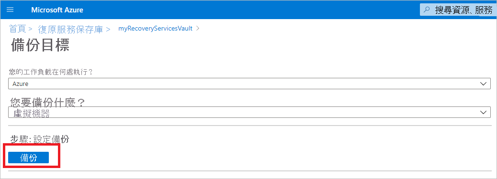
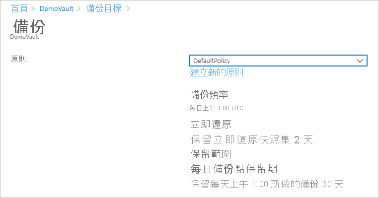
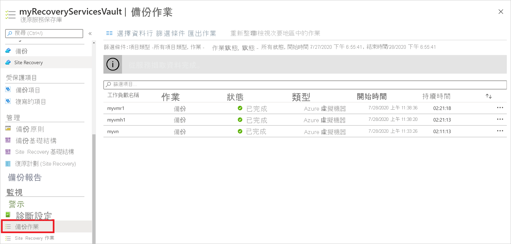
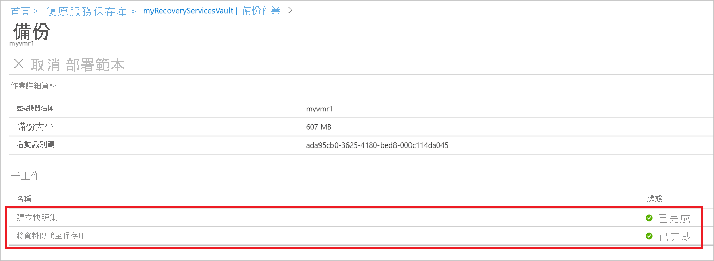

# 備份復原服務保存庫中的 Azure VM

本文說明如何使用 [Azure 備份](backup-overview.md)服務，將 Azure VM 備份到備份復原服務保存庫。

在本文中，您將學會如何：

> [!div class="checklist"]
>
> * 準備 Azure VM。
> * 建立保存庫。
> * 探索 VM 並設定備份原則。
> * 啟用 Azure VM 的備份。
> * 執行初始備份。

> [!NOTE]
> 本文說明如何設定保存庫，並選取要備份的 VM。 這有助於您備份多個 VM。 或者，您可以直接根據 VM 設定來[備份單一 Azure VM](backup-azure-vms-first-look-arm.md)。

## 開始之前

* [檢閱](backup-architecture.md#architecture-built-in-azure-vm-backup) Azure VM 備份架構。
* [深入了解](backup-azure-vms-introduction.md) Azure VM 備份和備份擴充功能。
* 設定備份之前，請[檢閱支援矩陣](backup-support-matrix-iaas.md)。

此外，在某些情況下，您可能還需要做幾件事：

* **在 VM 上安裝 VM 代理程式**：為機器上執行的 Azure VM 代理程式安裝擴充功能，以 Azure 備份來備份 Azure VM。 如果您的 VM 是從 Azure Marketplace 映像建立，則代理程式已安裝且正在執行。 如果您建立自訂 VM，或遷移內部部署機器，您可能需要[手動安裝代理程式](#install-the-vm-agent)。

[!INCLUDE [How to create a Recovery Services vault](../../includes/backup-create-rs-vault.md)]

### 修改儲存體複寫

根據預設，保存庫會使用[異地備援儲存體 (GRS)](../storage/common/storage-redundancy.md)。

* 如果保存庫是您的主要備份機制，則建議使用 GRS。
* 您可以使用 [本機冗余儲存體 (LRS) ](../storage/common/storage-redundancy.md?toc=/azure/storage/blobs/toc.json) 提供更便宜的選項。

修改儲存體複寫類型，如下所示：

1. 在新的保存庫中，選取 [**設定**] 區段中的 [**屬性**]。
2. 在 [ **屬性**] 中的 [ **備份**設定] 下，選取 [ **更新**]。
3. 選取儲存體複寫類型，然後選取 [**儲存]。**

      

> [!NOTE]
   > 當保存庫設定完成且包含備份項目之後，您就無法修改儲存體複寫類型。 如果想要修改，則必須重新建立保存庫。

## 套用備份原則

設定保存庫的備份原則。

1. 在保存庫中，選取 [**總覽**] 區段中的 [ **+ 備份**]。

   

1. 在 [備份目標] > [您的工作負載在何處執行?] 中，選取 [Azure]。 在 [您要備份什麼?] 中，選取 [虛擬機器] >  [確定]。 這會在保存庫中註冊 VM 擴充功能。

   

1. 在 [備份原則] 中，選取要與保存庫產生關聯的原則。
    * 預設原則每天備份一次 VM。 每日備份保留 30 天。 立即復原快照集保留兩天。

      

    * 如果您不要使用預設原則，請選取 [建立新項目]，然後建立自訂原則，如下一個程序所述。

1. 在 [虛擬機器] 下，選取 [新增]。

      

1. [選取虛擬機器] 窗格隨即開啟。 使用原則來選取您想要備份的 Vm。 然後選取 [確定]。

   * 選取的 VM 會經過驗證。
   * 您只能選取與保存庫位於相同區域中的 VM。
   * VM 只能在單一保存庫中備份。

     ![[選取虛擬機器] 窗格](./media/backup-azure-arm-vms-prepare/select-vms-to-backup.png)

    >[!NOTE]
    > 與保存庫位於相同區域和訂用帳戶中的所有 Vm 都可用於設定備份。 設定備份時，您可以流覽至虛擬機器名稱及其資源群組，即使您沒有這些 Vm 的必要許可權也一樣。 如果您的 VM 處於虛刪除狀態，則不會顯示在此清單中。 如果您需要重新保護 VM，則需要等候虛刪除期間過期，或從虛刪除清單中取消刪除 VM。 如需詳細資訊，請參閱「虛 [刪除 vm](soft-delete-virtual-machines.md#soft-delete-for-vms-using-azure-portal)」一文。

1. 在 [備份] 中，選取 [啟用備份]。 這會將原則部署到保存庫和 VM，並在執行於 Azure VM 的 VM 代理程式上安裝備份擴充功能。

啟用備份後：

* 無論 VM 是否在執行，備份服務都會安裝備份擴充功能。
* 初始備份會根據備份排程執行。
* 當備份執行時，請注意：
  * 執行中的 VM 有最大機會可以捕獲應用程式一致的復原點。
  * 不過，即使 VM 已關閉，也會進行備份。 這種 VM 稱為離線 VM。 在此情況下，復原點是「當機時保持一致」。
* 不需要明確的輸出連線以允許備份 Azure Vm。

### 建立自訂原則

如果您選擇建立新的備份原則，請填寫原則設定。

1. 在 [原則名稱] 中，指定有意義的名稱。
2. 在 [備份排程] 中，指定應該何時備份。 您可以每日或每週備份 Azure VM。
3. 在 [立即還原] 中，指定快照集要在本機保留多久，以供立即還原。
    * 還原時，已備份的 VM 磁碟會從儲存體經由網路，複製到復原儲存位置。 有了立即還原，您就可以在備份作業期間運用在本機儲存的快照集，而不需等待備份資料傳輸至保存庫。
    * 可供立即還原的快照集可以保留一到五天。 預設值是兩天。
4. 在 [保留期間] 中，指定每日或每週備份點要保留多久。
5. 在 **每月備份點保留** 和 **每年備份點保留**期間，指定您是否要保留每日或每週備份的每月或每年備份。
6. 選取 **[確定]** 以儲存原則。

    

> [!NOTE]
   > Azure 備份在進行 Azure VM 備份時不支援依據日光節約變更而自動調整時鐘。 當時間變更時，請視需要手動修改備份原則。

## 觸發初始備份

初始備份會根據排程執行，但也可以立即執行，如下所示：

1. 在保存庫功能表中，選取 [ **備份專案**]。
2. 在 [ **備份專案**] 中，選取 [ **Azure 虛擬機器**]。
3. 在 [ **備份專案** ] 清單中，選取省略號 ( ... ) 。
4. 選取 [ **立即備份**]。
5. 在 [立即備份] 中，使用行事曆控制項來選取復原點應該保留的最後一天。 然後選取 [確定]。
6. 監視入口網站通知。 您可以在保存庫儀表板中監視作業進度 > [備份作業] > [進行中]。 根據您的 VM 大小，建立初始備份可能需要花一點時間。

## 驗證備份作業狀態

每個 VM 備份的備份作業詳細資料包含兩個階段：**快照集** 階段，接著**將資料傳輸至保存庫**階段。 
快照集階段保證隨磁碟一起儲存的復原點可供**立即還原**，而且最多保留五天，視使用者所設定的快照集保留期而定。 「將資料傳輸至保存庫」在保存庫中建立復原點以長期保留。 只有在快照集階段完成之後，才會開始「將資料傳輸至保存庫」。

  

在後端執行兩 **個子** 工作，一個用於前端備份工作，可從 [ **備份作業** 詳細資料] 窗格檢查，如下所示：

  

**將資料傳輸至保存庫**階段可能需要很多天才能完成，視磁碟大小、每個磁碟的變換和其他幾個因素而定。

作業狀態根據下列情況而有所不同：

**快照式** | **將資料傳輸至保存庫** | **作業狀態**
--- | --- | ---
Completed | 進行中 | 進行中
Completed | 已略過 | Completed
Completed | Completed | Completed
Completed | 失敗 | 已完成但有警告
失敗 | 失敗 | 失敗

現在透過這項功能，對於相同的 VM，可以平行執行兩個備份，但在任一階段 (快照集、將資料傳輸至保存庫)，只有一個子工作可以執行。 因此，在備份作業進行中的備份作業導致下一天的備份失敗時，將會使用這項分離功能來避免此情況。 後續幾天的備份可以完成快照集，但如果早的備份作業處於進行中狀態，則會略過將 **資料傳輸至保存庫** 。
在保存庫中建立的增量復原點將會從保存庫中建立的最新復原點捕獲所有變換。 使用者不會產生任何費用。

## 選擇性步驟

### 安裝 VM 代理程式

為機器上執行的 Azure VM 代理程式安裝擴充功能，以 Azure 備份來備份 Azure VM。 如果您的 VM 是從 Azure Marketplace 映像建立，則代理程式已安裝且正在執行。 如果您建立自訂 VM，或遷移內部部署機器，您可能需要手動安裝代理程式，如下表概述。

**VM** | **詳細資料**
--- | ---
**Windows** | 1.[下載並安裝](https://go.microsoft.com/fwlink/?LinkID=394789&clcid=0x409)代理程式 MSI 檔案。   2.以機器的系統管理員權限安裝。   3.驗證安裝。 在 VM 的 *C:\WindowsAzure\Packages* 中，以滑鼠右鍵按一下 **WaAppAgent.exe** > [內容]。 在 [詳細資料] 索引標籤上，[產品版本] 應該為 2.6.1198.718 或更高版本。   如果您要更新代理程式，請確定沒有任何備份作業正在執行，然後[重新安裝代理程式](https://go.microsoft.com/fwlink/?LinkID=394789&clcid=0x409)。
**Linux** | 從散發套件中存放庫，使用 RPM 或 DEB 套件進行安裝。 這是安裝和升級 Azure Linux 代理程式的慣用方法。 所有[認可的散發套件提供者](../virtual-machines/linux/endorsed-distros.md)都會將 Azure Linux 代理程式套件整合於本身的映像和儲存機制中。 代理程式可從 [GitHub](https://github.com/Azure/WALinuxAgent) 取得，但不建議從該處安裝。   如果您要更新代理程式，請確定沒有任何備份作業正在執行，然後更新二進位檔。

## 後續步驟

* 對 [Azure VM 代理程式](backup-azure-troubleshoot-vm-backup-fails-snapshot-timeout.md)或 [Azure VM 備份](backup-azure-vms-troubleshoot.md)的任何問題進行疑難排解。
* [還原](backup-azure-arm-restore-vms.md) Azure VM。
