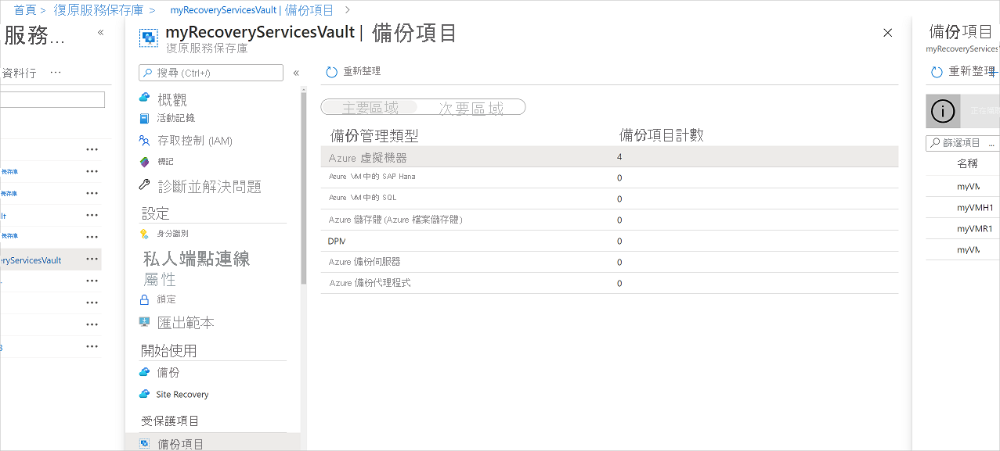
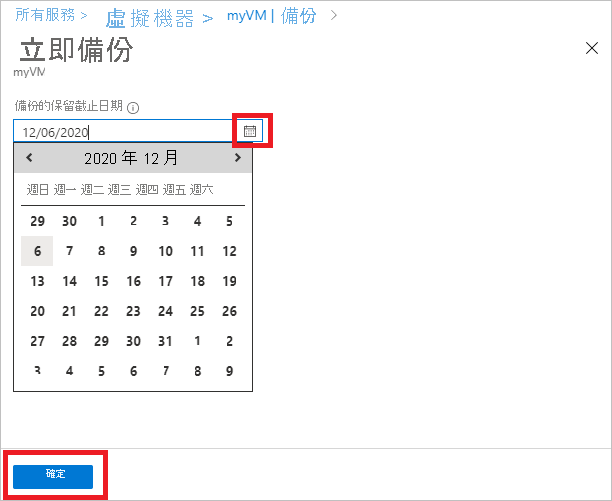

# 使用 Azure 備份服務管理 Azure VM 備份

本文說明如何管理 (Vm 的 Azure 虛擬機器) [Azure 備份服務](backup-overview.md)進行備份。 本文也會摘要說明您可以在保存庫儀表板上找到的備份資訊。

在 Azure 入口網站中，復原服務保存庫儀表板會提供保存庫資訊的存取權，包括：

* 最新的備份，也就是最新的還原點。
* 備份原則。
* 所有備份快照集的總大小。
* 已啟用備份的 Vm 數目。

您可以使用儀表板，並向下切入到個別 Vm 來管理備份。 若要開始電腦備份，請在儀表板上開啟保存庫。

[!INCLUDE [backup-center.md](../../includes/backup-center.md)]

## 在儀表板上查看 Vm

若要在保存庫儀表板上查看 Vm：

1. 登入 [Azure 入口網站](https://portal.azure.com/)。
1. 在左側功能表上，選取 [所有服務]  。

    

1. 在 [所有服務]  對話方塊中，輸入 *Recovery Services*。 資源清單會根據您的輸入進行篩選。 在資源清單中，選取 [復原服務保存庫]  。

    

    隨即會在訂用帳戶中出現 [復原服務保存庫] 清單。

1. 為了方便使用，請選取您保存庫名稱旁邊的釘選圖示，然後選取 [ **釘選到儀表板**]。
1. 開啟保存庫儀表板。

    

1. 在 [ **備份專案** ] 圖格上，選取 [ **Azure 虛擬機器**]。

    ![開啟 [備份專案] 圖格](./media/backup-azure-manage-vms/azure-virtual-machine.png)

1. 在 [ **備份專案** ] 窗格中，您可以查看受保護的 vm 清單。 在此範例中，保存庫會保護一個虛擬機器： *myVMR1*。  

    ![查看 [備份專案] 窗格](./media/backup-azure-manage-vms/backup-items-blade-select-item.png)

1. 從保存庫專案的儀表板中，您可以修改備份原則、執行隨選備份、停止或繼續保護 Vm、刪除備份資料、查看還原點，以及執行還原。

    ![[備份專案] 儀表板和 [設定] 窗格](./media/backup-azure-manage-vms/item-dashboard-settings.png)

## 管理 VM 的備份原則

### 修改備份原則

若要修改現有的備份原則：

1. 登入 [Azure 入口網站](https://portal.azure.com/)。 開啟保存庫儀表板。
2. 從 [ **管理 > 備份原則**] 中，選取 [ **Azure 虛擬機器**] 類型的備份原則。
3. 選取 [ **修改** 並變更設定]。

### 切換備份原則

若要管理備份原則：

1. 登入 [Azure 入口網站](https://portal.azure.com/)。 開啟保存庫儀表板。
2. 在 [ **備份專案** ] 圖格上，選取 [ **Azure 虛擬機器**]。

    ![開啟 [備份專案] 圖格](./media/backup-azure-manage-vms/azure-virtual-machine.png)

3. 在 [ **備份專案** ] 窗格中，您可以使用最新的還原點時間來查看受保護的 vm 清單和 [上次備份狀態]。

    ![查看 [備份專案] 窗格](./media/backup-azure-manage-vms/backup-items-blade-select-item.png)

4. 從保存庫專案的儀表板中，您可以選取備份原則。

   * 若要切換原則，請選取不同的原則，然後選取 [ **儲存**]。 新原則時會立即套用至保存庫。

     

## 執行隨選備份

在設定保護之後，您可以執行 VM 的隨選備份。 請記住下列詳細資料：

* 如果初始備份已暫止，隨選備份會在復原服務保存庫中建立 VM 的完整複本。
* 如果初始備份已完成，隨選備份只會將先前快照集的變更傳送到復原服務保存庫。 也就是說，稍後的備份一律為累加式。
* 隨選備份的保留範圍是您在觸發備份時所指定的保留值。

> [!NOTE]
> Azure 備份服務每天最多可支援九個隨選備份，但 Microsoft 建議不超過四個每日隨選備份，以確保最佳效能。

若要觸發隨選備份：

1. 在保存 [庫專案儀表板](#view-vms-on-the-dashboard)上，選取 [ **受保護的專案**] 下的 [ **備份專案**]。

    ![[立即備份] 選項](./media/backup-azure-manage-vms/backup-now-button.png)

2. 從 [ **備份管理類型**] 中，選取 [ **Azure 虛擬機器**]。 **(Azure 虛擬機器)** ] 窗格中的 [備份專案] 隨即出現。
3. 選取 VM，然後選取 [ **立即備份** ] 以建立隨選備份。 [ **立即備份** ] 窗格隨即出現。
4. 在 [ **保留備份** 到] 欄位中，指定要保留備份的日期。

    

5. 選取 **[確定]** 執行備份作業。

若要追蹤作業的進度，請在保存庫儀表板上，選取 [ **備份作業** ] 圖格。

## 停止保護 VM

有兩種方式可停止保護 VM：

* **停止保護並保留備份資料**。 此選項將會停止所有未來的備份作業以保護您的 VM。 不過，Azure 備份服務會保留已備份的復原點。  您將需要付費以將復原點保留在保存庫中 (如需詳細資料) ，請參閱 [Azure 備份定價](https://azure.microsoft.com/pricing/details/backup/) 。 如有需要，您將能夠還原 VM。 如果您決定繼續 VM 保護，則可以使用 [ *繼續備份* ] 選項。
* **停止保護並刪除備份資料**。 此選項將會停止所有未來的備份作業以保護您的 VM，並刪除所有復原點。 您將無法還原 VM，也無法使用 [ *繼續備份* ] 選項。

>[!NOTE]
>如果您刪除資料來源，但沒有停止備份，新的備份將會失敗。 舊的復原點將會根據原則到期，但在您停止備份並刪除資料之前，一律會保留最新的復原點。
>

### 停止保護並保留備份資料

若要停止保護並保留 VM 的資料：

1. 在保存 [庫專案的儀表板](#view-vms-on-the-dashboard)上，選取 [ **停止備份**]。
2. 選擇 [ **保留備份資料**]，並視需要確認您的選擇。 如果您想要的話，請新增批註。 如果您不確定專案的名稱，請將滑鼠停留在驚嘆號上方以查看名稱。

    

通知可讓您知道備份作業已停止。

### 停止保護並刪除備份資料

若要停止保護並刪除 VM 的資料：

1. 在保存 [庫專案的儀表板](#view-vms-on-the-dashboard)上，選取 [ **停止備份**]。
2. 選擇 [ **刪除備份資料**]，並視需要確認您的選擇。 輸入備份專案的名稱，並視需要新增批註。

    

> [!NOTE]
> 完成刪除操作之後，備份的資料將會保留14天的虛 [刪除狀態](./soft-delete-virtual-machines.md)。  此外，您也可以 [啟用或停](./backup-azure-security-feature-cloud.md#enabling-and-disabling-soft-delete)用虛刪除。

## 繼續保護 VM

如果您在停止 VM 保護期間選擇 [ [停止保護並保留備份資料](#stop-protection-and-retain-backup-data) ] 選項，則可以使用 [ **繼續備份**]。 如果您選擇 [ [停止保護] 和 [刪除備份資料](#stop-protection-and-delete-backup-data) ] 選項，或 [刪除備份資料](#delete-backup-data)，則無法使用此選項。

若要繼續保護 VM：

1. 在保存 [庫專案的儀表板](#view-vms-on-the-dashboard)上，選取 [ **繼續備份**]。

2. 請依照 [管理備份原則](#manage-backup-policy-for-a-vm) 中的步驟，為 VM 指派原則。 您不需要選擇 VM 的初始保護原則。
3. 將備份原則套用至 VM 之後，您會看到下列訊息：

    

## 刪除備份資料

有兩種方式可以刪除 VM 的備份資料：

* 從保存庫專案儀表板中，選取 [停止備份]，然後遵循 [ [停止保護並刪除備份資料](#stop-protection-and-delete-backup-data) ] 選項的指示。

  ![選取 [停止備份]](./media/backup-azure-manage-vms/stop-backup-button.png)

* 從保存庫專案儀表板中，選取 [刪除備份資料]。 如果您在停止 VM 保護期間選擇 [停止保護並保留備份資料](#stop-protection-and-retain-backup-data) 選項，就會啟用此選項。

  ![選取 [刪除備份]](./media/backup-azure-manage-vms/delete-backup-button.png)

  * 在保存 [庫專案儀表板](#view-vms-on-the-dashboard)上，選取 [ **刪除備份資料**]。
  * 輸入備份專案的名稱，以確認您想要刪除復原點。

    

  * 若要刪除專案的備份資料，請選取 [ **刪除**]。 通知訊息可讓您知道備份資料已刪除。

Azure 備份包含虛刪除功能，以保護您的資料。 使用虛刪除時，即使在備份之後 (VM) 的所有復原點都已刪除，備份資料仍會保留14天。 如需詳細資訊，請參閱虛 [刪除檔](./backup-azure-security-feature-cloud.md)。

  > [!NOTE]
  > 當您刪除備份資料時，您會刪除所有相關聯的復原點。 您無法選擇要刪除的特定復原點。

### 主要資料來源已不再存在的備份專案

* 如果針對 Azure 備份設定的 Azure Vm 未停止保護而遭到刪除或移動，則排程的備份作業和隨選 (臨機操作) 備份作業將會失敗，並出現錯誤 UserErrorVmNotFoundV2。 備份前置檢查只會顯示為失敗的隨選備份作業 (失敗的排程作業不會顯示) 。
* 這些備份專案會在系統中保持作用中狀態，並遵守使用者所設定的備份和保留原則。 根據保留原則，將會保留這些 Azure Vm 的備份資料。 過期的復原點 (除了最新的復原點) 會根據備份原則中設定的保留範圍進行清除。
* 若要避免任何額外的費用，建議您刪除主要資料來源已不存在的備份專案。 這種情況是因為已刪除資源的備份專案/資料不再需要，因為最新的復原點會永久保留，而您會根據適用的備份定價向您收費。

## 後續步驟

* 瞭解如何 [從 VM 的設定中備份 Azure vm](backup-azure-vms-first-look-arm.md)。
* 瞭解如何 [還原 vm](backup-azure-arm-restore-vms.md)。
* 瞭解如何 [監視 AZURE VM 備份](./backup-azure-monitoring-built-in-monitor.md)。
