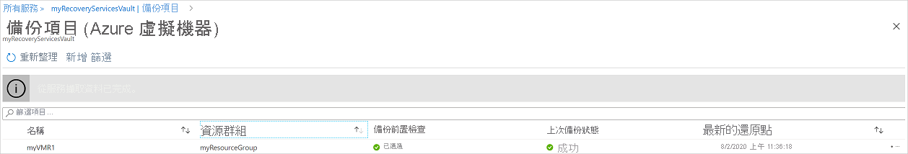
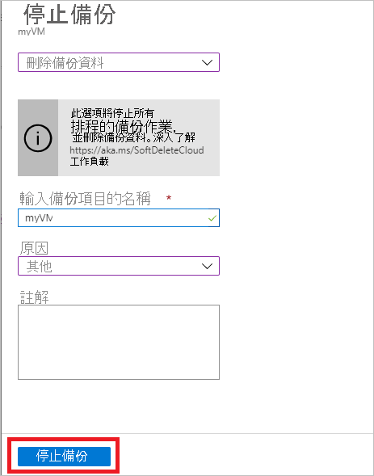

# 使用 Azure 備份服務管理 Azure VM 備份

本文介紹如何使用[Azure 備份服務](backup-overview.md)管理備份的 Azure 虛擬機器 （VM）。 本文還總結了您可以在保存庫儀表板上找到的備份資訊。

在 Azure 門戶中，恢復服務保存庫儀表板提供對保存庫資訊的訪問，包括：

* 最新的備份，也就是最新的還原點。
* 備份策略。
* 所有備份快照的總大小。
* 為備份啟用的 VM 數。

您可以通過使用儀表板和向下切入到各個 VM 來管理備份。 要開始電腦備份，在儀表板上打開保存庫。

## 在儀表板上查看 VM

要查看保存庫儀表板上的 VM，請查看：

1. 登錄到 Azure[門戶](https://portal.azure.com/)。
2. 在"中心"功能表上，選擇 **"流覽**"。 在資源清單中輸入 **復原服務**。 鍵入時，將根據輸入篩選清單。 選取 [復原服務保存庫]****。

    

3. 為方便使用，請按右鍵保存庫並選擇 **"固定到儀表板**"。
4. 開啟保存庫儀表板。

    

5. 在 **"備份專案"** 磁貼上，選擇**Azure 虛擬機器**。

    

6. 在 **"備份專案"** 窗格中，您可以查看受保護的 VM 清單。 在此示例中，保存庫保護一個虛擬機器：演示備份。  

    

7. 從保存庫專案的儀表板中，修改備份策略、運行按需備份、停止或恢復 VM 保護、刪除備份資料、查看還原點以及運行還原。

    

## 管理 VM 的備份策略

要管理備份策略，我們：

1. 登錄到 Azure[門戶](https://portal.azure.com/)。 開啟保存庫儀表板。
2. 在 **"備份專案"** 磁貼上，選擇**Azure 虛擬機器**。

    

3. 在 **"備份專案"** 窗格中，您可以查看受保護 VM 的清單以及具有最新還原點時間的最後一個備份狀態。

    

4. 從保存庫專案的儀表板中，您可以選擇備份策略。

   * 要切換策略，請選擇其他策略，然後選擇 **"保存**"。 新原則時會立即套用至保存庫。

     

## 執行隨選備份

設置 VM 的保護後，可以運行 VM 的按需備份。 請記住以下詳細資訊：

* 如果初始備份處於掛起狀態，按需備份將在恢復服務保存庫中創建 VM 的完整副本。
* 如果初始備份已完成，按需備份將僅將以前的快照的更改發送到恢復服務保存庫。 也就是說，以後的備份始終是增量的。
* 按需備份的保留範圍是觸發備份時指定的保留值。

若要觸發隨選備份：

1. 在[保存庫專案儀表板](#view-vms-on-the-dashboard)上，**在受保護項**下，選擇 **"備份項**"。

    

2. 從**備份管理類型**中選擇**Azure 虛擬機器**。 將顯示 **"備份專案（Azure 虛擬機器）"** 窗格。
3. 選擇 VM 並選擇 **"立即備份"** 以創建按需備份。 將顯示"**立即備份"** 窗格。
4. 在"**保留備份直到"** 欄位中，指定要保留備份的日期。

    

5. 選擇 **"確定"** 以運行備份作業。

要跟蹤作業的進度，請在保存庫儀表板上選擇 **"備份作業"** 磁貼。

## 停止保護 VM

有兩種方法可以停止保護 VM：

* **停止保護並保留備份資料**。 此選項將停止所有將來的備份作業保護 VM;但是，Azure 備份服務將保留已備份的復原點。  您需要付費才能將復原點保留在保存庫中（有關詳細資訊，請參閱[Azure 備份定價](https://azure.microsoft.com/pricing/details/backup/)）。 如果需要，您將能夠還原 VM。 如果您決定恢復 VM 保護，則可以使用 *"恢復備份"* 選項。
* **停止保護並刪除備份資料**。 此選項將停止所有將來的備份作業保護 VM 並刪除所有復原點。 您將無法還原 VM，也無法使用 *"恢復備份"* 選項。

>[!NOTE]
>如果您刪除資料來源，但沒有停止備份，新的備份將會失敗。 根據策略，舊復原點將過期，但最後一個復原點將始終保留，直到您停止備份並刪除資料。
>

### 停止保護並保留備份資料

要停止保護並保留 VM 的資料，可以：

1. 在[保存庫專案的儀表板](#view-vms-on-the-dashboard)上，選擇 **"停止備份**"。
2. 選擇 **"保留備份資料**"，並根據需要確認您的選擇。 如果需要，請添加注釋。 如果不確定專案的名稱，請將滑鼠懸停在驚嘆號上以查看名稱。

    

通知讓您知道備份作業已停止。

### 停止保護並刪除備份資料

要停止保護並刪除 VM 的資料，請：

1. 在[保存庫專案的儀表板](#view-vms-on-the-dashboard)上，選擇 **"停止備份**"。
2. 選擇 **"刪除備份資料**"，並根據需要確認您的選擇。 輸入備份項的名稱，並根據需要添加注釋。

    

## 繼續保護 VM

如果在停止 VM 保護期間選擇了["停止保護"並保留備份資料](#stop-protection-and-retain-backup-data)選項，則可以使用 **"恢復備份**"。 如果選擇["停止保護"並刪除備份資料](#stop-protection-and-delete-backup-data)選項或刪除[備份資料](#delete-backup-data)，則此選項不可用。

要恢復對 VM 的保護，請執行：

1. 在[保存庫專案的儀表板](#view-vms-on-the-dashboard)上，選擇 **"恢復備份**"。

2. 按照[管理備份策略](#manage-backup-policy-for-a-vm)中的步驟為 VM 分配策略。 您無需選擇 VM 的初始保護原則。
3. 將備份策略應用於 VM 後，您將看到以下消息：

    

## 刪除備份資料

有兩種方法可以刪除 VM 的備份資料：

* 在保存庫專案儀表板中，選擇"停止備份"，然後按照["停止保護"的說明操作並刪除備份資料](#stop-protection-and-delete-backup-data)選項。

  ![選取 [停止備份]](./media/backup-azure-manage-vms/stop-backup-buttom.png)

* 從保存庫專案儀表板中，選擇"刪除備份資料"。 如果您在停止 VM 保護期間選擇[停止保護並保留備份資料](#stop-protection-and-retain-backup-data)選項，則啟用此選項

  

  * 在[保存庫專案儀表板](#view-vms-on-the-dashboard)上，選擇 **"刪除備份資料**"。
  * 鍵入備份項的名稱以確認要刪除復原點。

    

  * 要刪除專案的備份資料，請選擇 **"刪除**"。 通知訊息讓您知道備份資料已被刪除。

為了保護資料，Azure 備份包括虛刪除功能。 使用虛刪除，即使在刪除 VM 的備份（所有復原點）後，備份資料也會保留 14 天。 有關詳細資訊，請參閱[虛刪除文檔](https://docs.microsoft.com/azure/backup/backup-azure-security-feature-cloud)。

  > [!NOTE]
  > 刪除備份資料時，將刪除所有關聯的復原點。 您無法選擇要刪除的特定復原點。

### 主資料來源不再存在的備份項

* 如果為 Azure 備份配置的 Azure VM 被刪除或移動而不停止保護，則計畫備份作業和按需（臨時）備份作業都將因錯誤 UserErrorVmNotFoundV2 而失敗。 備份預檢查將僅對失敗的按需備份作業（未顯示失敗的計畫作業）顯示為關鍵。
* 這些備份項在系統中保持活動狀態，並遵守使用者設置的備份和保留原則。 這些 Azure VM 的備份資料將根據保留原則保留。 過期的復原點（最後一個復原點除外）將根據備份策略中設置的保留範圍進行清理。
* 如果使用者不再需要刪除資源的備份項/資料，因為最後一個復原點會永久保留，並且使用者按適用的備份定價收費，則建議使用者刪除主資料來源不再存在的備份專案，以避免任何額外費用。

## 後續步驟

* 瞭解如何從[VM 的設置中備份 Azure VM。](backup-azure-vms-first-look-arm.md)
* 瞭解如何還原[VM。](backup-azure-arm-restore-vms.md)
* 瞭解如何監視[Azure VM 備份](backup-azure-monitor-vms.md)。
