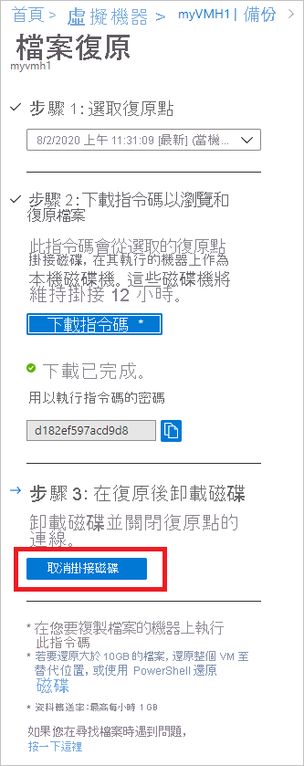

# <a name="recover-files-from-azure-virtual-machine-backup"></a>從 Azure 虛擬機器備份復原檔案

Azure 備份可從 Azure 虛擬機器 (VM) 備份 (又稱復原點) 還原 [Azure VM 和磁碟](./backup-azure-arm-restore-vms.md)。 本文說明如何從 Azure VM 備份來復原檔案和資料夾。 只有使用 Resource Manager 模型部署且受復原服務保存庫保護的 Azure Vm，才可還原檔案和資料夾。


> [!NOTE]
> 這項功能適用於使用 Resource Manager 模型部署且受復原服務保存庫保護的 Azure VM。
> 不支援從加密的 VM 備份進行檔案復原。
>


## <a name="step-1-generate-and-download-script-to-browse-and-recover-files"></a>步驟1：產生並下載腳本來流覽和復原檔案

若要從復原點還原檔案或資料夾，請移至虛擬機器，然後執行下列步驟：

1. 登入 [Azure 入口網站](https://portal.Azure.com) ，然後在左窗格中選取 [ **虛擬機器**]。 從虛擬機器的清單中，選取虛擬機器以開啟該虛擬機器的儀表板。

2. 在虛擬機器的功能表中，選取 [ **備份** ] 以開啟 [備份] 儀表板。

    

3. 在 [備份儀表板] 功能表中 **，選取 [** 檔案復原]。

    

    [檔案復原] 功能表隨即開啟。

    ![[檔案復原] 功能表](./media/backup-azure-restore-files-from-vm/file-recovery-blade.png)

4. 從 [選取復原點] 下拉式選單中，選取包含您所需檔案的復原點。 根據預設，已選取最近的復原點。

5. 選取 [下載 Windows Azure Vm 的 **可執行檔** (]) 或下載 Linux Azure Vm 的 **腳本** (、產生 python 腳本) 下載用來從復原點複製檔案的軟體。

    

    Azure 會將可執行檔或指令碼下載到本機電腦。

    

    若要以系統管理員的身分執行可執行檔或指令碼，建議先將下載的檔案儲存到電腦上。

6. 可執行檔或指令碼受到密碼保護，因此需輸入密碼。 在 [檔案復原 **] 功能表中** ，選取 [複製] 按鈕，將密碼載入至記憶體。

    


## <a name="step-2-ensure-the-machine-meets-the-requirements-before-executing-the-script"></a>步驟2：在執行腳本之前確定電腦符合需求

成功下載腳本之後，請確定您有正確的電腦可以執行此腳本。 您打算執行腳本的 VM 不應該有下列任何不支援的設定。 如果有的話，請從符合需求的相同區域選擇最好的電腦。  

### <a name="dynamic-disks"></a>動態磁碟

您無法在具有下列任何特性的 VM 上執行可執行檔腳本：

- 跨多個磁片的磁片區 (跨距和等量磁片區) 。
- 容錯磁片區 (在動態磁碟上) 鏡像和 RAID-5 磁片區。

### <a name="windows-storage-spaces"></a>Windows 儲存空間

您無法在針對 Windows 儲存空間設定的 VM 上執行已下載的可執行檔。

### <a name="virtual-machine-backups-having-large-disks"></a>具有大型磁片的虛擬機器備份

如果備份的機器有大量磁片 ( # B0 16) 或大型磁片 ( # A1 4) TB，因此不建議在同一部電腦上執行腳本進行還原，因為它會對 VM 造成顯著的影響。 相反地，建議您只針對 (Azure VM D2v3 Vm) 的檔案復原提供個別的 VM，然後在不需要時將其關閉。 

## <a name="step-3-os-requirements-to-successfully-run-the-script"></a>步驟3：成功執行腳本的作業系統需求

您要執行下載腳本的 VM 必須符合下列需求。

### <a name="for-windows-os"></a>若為 Windows OS

下表顯示伺服器和電腦作業系統之間的相容性。 復原檔案時，無法將檔案還原至之前或之後的作業系統版本。 例如，您無法將 Windows Server 2016 虛擬機器的檔案還原至 Windows Server 2012 或 Windows 8 電腦。 您可以將 VM 的檔案還原至相同的伺服器作業系統，或相容的用戶端作業系統。

|伺服器作業系統 | 相容的用戶端作業系統  |
| --------------- | ---- |
| Windows Server 2019    | Windows 10 |
| Windows Server 2016    | Windows 10 |
| Windows Server 2012 R2 | Windows 8.1 |
| Windows Server 2012    | Windows 8  |
| Windows Server 2008 R2 | Windows 7   |

### <a name="for-linux-os"></a>若為 Linux 作業系統

在 Linux 中，用來還原檔案的電腦作業系統必須支援受保護虛擬機器的檔案系統。 選取要執行指令碼的電腦時，請確認該電腦具有相容的作業系統，且使用下表中列出的其中一個版本：

|Linux 作業系統 | 版本  |
| --------------- | ---- |
| Ubuntu | 12.04 和更新版本 |
| CentOS | 6.5 和更新版本  |
| RHEL | 6.7 和更新版本 |
| Debian | 7 和更新版本 |
| Oracle Linux | 6.4 和更新版本 |
| SLES | 12 以上 (含) |
| openSUSE | 42.2 和更新版本 |

> [!NOTE]
> 我們發現在具有 SLES 12 SP4 作業系統的電腦上執行檔案復原腳本時，有一些問題，我們正在調查 SLES 團隊。
> 目前，執行檔案復原指令碼的作業是在作業系統版本為 SLES 12 SP2 和 SP3 的電腦上運作。
>

指令碼也需要 Python 和 Bash 元件，才能夠執行並安全地連線至復原點。

|元件 | 版本  |
| --------------- | ---- |
| Bash | 4 和更新版本 |
| Python | 2.6.6 和更新版本  |
| .NET | 4.6.2 和更新版本 |
| TLS | 應支援 1.2  |

## <a name="step-4-access-requirements-to-successfully-run-the-script"></a>步驟4：成功執行腳本的存取需求

如果您在具有限制存取的電腦上執行腳本，請確定有下列存取權：

- `download.microsoft.com`
- 復原服務 Url (地理名稱是指復原服務保存庫所在的區域) 
  - `https://pod01-rec2.GEO-NAME.backup.windowsazure.com` 適用于 Azure 公用區域的 () 
  - `https://pod01-rec2.GEO-NAME.backup.windowsazure.cn` (適用於 Azure China 21Vianet)
  - `https://pod01-rec2.GEO-NAME.backup.windowsazure.us` (適用於 Azure US Government)
  - `https://pod01-rec2.GEO-NAME.backup.windowsazure.de` (適用於 Azure 德國)
- 輸出連接埠 53 (DNS)、443、3260

> [!NOTE]
>
> 您在 [上述](#step-1-generate-and-download-script-to-browse-and-recover-files) 步驟1中下載的腳本檔案將會有該檔案名稱的 **地理位置名稱** 。 使用該 **地理名稱** 填入 URL。 下載的腳本名稱開頭會是： \' VMname \' \_ \' geoname \' _ \' GUID \' 。<br><br>
> 舉例來說，如果指令檔名是 *ContosoVM_wcus_12345678*，則 **地理名稱** 是 *wcus* ，而 URL 會是：<br> <https://pod01-rec2.wcus.backup.windowsazure.com>
>

若為 Linux，指令碼需要 'open-iscsi' 和 'lshw' 元件來連接到復原點。 如果元件不存在於執行指令碼所在的電腦上，則指令碼會要求安裝元件的權限。 同意安裝必要的元件。

需有 `download.microsoft.com` 的存取權才能下載元件，並使用這些元件在執行指令碼所在的電腦及復原點中的資料之間建立安全通道。


## <a name="step-5-running-the-script-and-identifying-volumes"></a>步驟5：執行腳本和識別磁片區

### <a name="for-windows"></a>若為 Windows

符合步驟2、步驟3和步驟4中列出的所有需求之後，請從下載的位置（通常是 [下載]) 資料夾）複製腳本 (，以滑鼠右鍵按一下可執行檔或腳本，然後以系統管理員認證執行。 當出現提示時，請輸入密碼或從記憶體中貼上密碼，然後按 Enter 鍵。 輸入有效的密碼後，指令碼會連線至復原點。

  


當您執行可執行檔時，作業系統會掛接新磁碟區並指派磁碟機代號。 您可以使用 Windows 檔案總管或檔案總管來瀏覽這些磁碟機。 指派給磁碟區的磁碟機代號可能與原始虛擬機器為不同的代號。 不過，系統會保留磁碟區名稱。 例如，如果原始虛擬機器上的磁碟區是 "Data Disk (E:`\`)"，則可以在本機電腦上將該磁碟區連結為 "Data Disk ('任何磁碟機代號':`\`)"。 瀏覽指令碼輸出中所提及的所有磁碟區，直到找出您的檔案或資料夾為止。  

   

#### <a name="for-backed-up-vms-with-large-disks-windows"></a>針對具有大型磁片的備份 Vm (Windows) 

如果在執行檔案還原腳本之後，檔案復原程式停止回應 (例如，如果磁片從未裝載或已掛接，但磁片區未出現) ，請執行下列步驟：
  
1. 請確定作業系統是 WS 2012 或更新版本。
2. 請確定已在還原伺服器中將登錄機碼設定為以下建議的設定，並務必將伺服器重新開機。 GUID 旁的編號範圍可以從 0001-0005。 在下列範例中是 0004。 瀏覽登錄機碼路徑，直到 [參數] 區段為止。

    

```registry
- HKEY_LOCAL_MACHINE\SYSTEM\CurrentControlSet\Services\Disk\TimeOutValue – change this from 60 to 1200
- HKEY_LOCAL_MACHINE\SYSTEM\ControlSet001\Control\Class\{4d36e97b-e325-11ce-bfc1-08002be10318}\0003\Parameters\SrbTimeoutDelta – change this from 15 to 1200
- HKEY_LOCAL_MACHINE\SYSTEM\ControlSet001\Control\Class\{4d36e97b-e325-11ce-bfc1-08002be10318}\0003\Parameters\EnableNOPOut – change this from 0 to 1
- HKEY_LOCAL_MACHINE\SYSTEM\ControlSet001\Control\Class\{4d36e97b-e325-11ce-bfc1-08002be10318}\0003\Parameters\MaxRequestHoldTime - change this from 60 to 1200
```

### <a name="for-linux"></a>若為 Linux

針對 Linux 電腦，則會產生 Python 指令碼。 下載腳本，並將它複製到相關/相容的 Linux 伺服器。 您可能必須修改權限，才能以 ```chmod +x <python file name>``` 執行。 接著，使用 ```./<python file name>``` 執行 Python 檔案。


在 Linux 中，復原點的磁碟區會掛接到執行指令碼的資料夾。 連結的磁碟、磁碟區和對應的掛接路徑會相應顯示。 具有根層級存取權的使用者都看得到這些掛接路徑。 在指令碼輸出中瀏覽所述的磁碟區。

  ![Linux [檔案復原] 功能表](./media/backup-azure-restore-files-from-vm/linux-mount-paths.png)


#### <a name="for-backed-up-vms-with-large-disks-linux"></a>針對具有大型磁片的備份 Vm (Linux) * *

如果在執行檔案還原腳本之後，檔案復原程式停止回應 (例如，如果磁片從未裝載或已掛接，但磁片區未出現) ，請執行下列步驟：

1. 在檔案 /etc/iscsi/iscsid.conf 中，將設定從：
    - `node.conn[0].timeo.noop_out_timeout = 5`  自 `node.conn[0].timeo.noop_out_timeout = 30`
2. 進行上述變更之後，請重新執行腳本。 如果發生暫時性失敗，請確定重新執行時間之間有20到30分鐘的間隔，以避免連續的要求激增，進而影響目標準備。 重新執行之間的間隔可確保目標已準備好從腳本連接。
3. 在檔案復原之後，請務必返回入口網站，並針對無法裝載磁片區的復原點選取 [ **卸載磁片** ]。 基本上，此步驟將會清除任何現有的程序/工作階段，並增加復原的機會。


#### <a name="lvmraid-arrays-for-linux-vms"></a>適用于 Linux Vm 的 LVM/RAID 陣列 () 

在 Linux 中，邏輯磁片區管理員 (LVM) 和/或軟體 RAID 陣列用來管理多個磁片上的邏輯磁片區。 如果受保護 Linux VM 使用 LVM 和/或 RAID 陣列，則無法在同一部虛擬機器上執行指令碼。<br>
請改為在其他具有相容作業系統且支援受保護 VM 之檔案系統的電腦上執行指令碼。<br>
下列指令碼輸出會顯示 LVM 和/或 RAID 陣列磁碟與磁碟區及其磁碟分割類型。

   

若要讓這些磁碟分割上線，請執行以下小節中的命令。

#### <a name="for-lvm-partitions"></a>若為 LVM 磁碟分割

執行腳本之後，LVM 分割區會裝載于實體磁片區 (s) /disk (s) 在腳本輸出中指定。 流程是

1. 從實體磁片區或磁片取得磁片區組名的唯一清單
2. 然後列出這些磁片區群組中的邏輯磁片區
3. 然後將邏輯磁片區掛接至所需的路徑。

##### <a name="listing-volume-group-names-from-physical-volumes"></a>列出實體磁片區的磁片區組名

列出磁片區組名：

```bash
pvs -o +vguuid
```

此命令會列出所有實體磁片區 (包括執行腳本) 之前的磁片區、對應的磁片區組名，以及磁片區群組的唯一使用者識別碼 (Uuid) 。 命令的範例輸出如下所示。

```bash
PV         VG        Fmt  Attr PSize   PFree    VG UUID

  /dev/sda4  rootvg    lvm2 a--  138.71g  113.71g EtBn0y-RlXA-pK8g-de2S-mq9K-9syx-B29OL6

  /dev/sdc   APPvg_new lvm2 a--  <75.00g   <7.50g njdUWm-6ytR-8oAm-8eN1-jiss-eQ3p-HRIhq5

  /dev/sde   APPvg_new lvm2 a--  <75.00g   <7.50g njdUWm-6ytR-8oAm-8eN1-jiss-eQ3p-HRIhq5

  /dev/sdf   datavg_db lvm2 a--   <1.50t <396.50g dhWL1i-lcZS-KPLI-o7qP-AN2n-y2f8-A1fWqN

  /dev/sdd   datavg_db lvm2 a--   <1.50t <396.50g dhWL1i-lcZS-KPLI-o7qP-AN2n-y2f8-A1fWqN
```

第一個資料行 (PV) 顯示實體磁片區，後續的資料行則顯示相關的磁片區組名、格式、屬性、大小、可用空間，以及磁片區群組的唯一識別碼。 命令輸出會顯示所有實體磁片區。 請參閱腳本輸出，並找出與備份相關的磁片區。 在上述範例中，腳本輸出會顯示/dev/sdf 和/dev/sdd。 因此， *datavg_db* 磁片區群組屬於腳本，而 *Appvg_new* 磁片區群組則屬於該機器。 最後的概念是確保唯一的磁片區組名應該有一個唯一識別碼。

###### <a name="duplicate-volume-groups"></a>重複的磁片區群組

在某些情況下，磁片區組名在執行腳本之後可以有2個 Uuid。 這表示執行腳本的電腦和備份的 VM 中的磁片區組名相同。 接著，我們必須重新命名備份的 Vm 磁片區群組。 請參閱下列範例。

```bash
PV         VG        Fmt  Attr PSize   PFree    VG UUID

  /dev/sda4  rootvg    lvm2 a--  138.71g  113.71g EtBn0y-RlXA-pK8g-de2S-mq9K-9syx-B29OL6

  /dev/sdc   APPvg_new lvm2 a--  <75.00g   <7.50g njdUWm-6ytR-8oAm-8eN1-jiss-eQ3p-HRIhq5

  /dev/sde   APPvg_new lvm2 a--  <75.00g   <7.50g njdUWm-6ytR-8oAm-8eN1-jiss-eQ3p-HRIhq5

  /dev/sdg   APPvg_new lvm2 a--  <75.00g  508.00m lCAisz-wTeJ-eqdj-S4HY-108f-b8Xh-607IuC

  /dev/sdh   APPvg_new lvm2 a--  <75.00g  508.00m lCAisz-wTeJ-eqdj-S4HY-108f-b8Xh-607IuC

  /dev/sdm2  rootvg    lvm2 a--  194.57g  127.57g efohjX-KUGB-ETaH-4JKB-MieG-EGOc-XcfLCt
```

腳本輸出會顯示已附加的/dev/sdg、/dev/sdh、/dev/sdm2。 因此，對應的 VG 名稱是 Appvg_new 和 rootvg。 但相同的名稱也會出現在電腦的 VG 清單中。 我們可以確認一個 VG 名稱有兩個 Uuid。

現在，我們需要為以腳本為基礎的磁片區重新命名 VG 名稱，例如：/dev/sdg、/dev/sdh、/dev/sdm2。 若要重新命名磁片區群組，請使用下列命令

```bash
vgimportclone -n rootvg_new /dev/sdm2
vgimportclone -n APPVg_2 /dev/sdg /dev/sdh
```

現在我們已有唯一識別碼的 VG 名稱。

###### <a name="active-volume-groups"></a>作用中磁片區群組

請確定對應到腳本磁片區的磁片區群組是作用中的。 下列命令可用來顯示作用中的磁片區群組。 檢查腳本的相關磁片區群組是否出現在這份清單中。

```bash
vgdisplay -a
```  

否則，請使用下列命令來啟用磁片區群組。

```bash
#!/bin/bash
vgchange –a y  <volume-group-name>
```

##### <a name="listing-logical-volumes-within-volume-groups"></a>列出磁片區群組內的邏輯磁片區

一旦取得與腳本相關的唯一、有效的 VGs 清單，就可以使用下列命令來列出這些磁片區群組中的邏輯磁片區。

```bash
#!/bin/bash
lvdisplay <volume-group-name>
```

此命令會將每個邏輯磁片區的路徑顯示為「LV 路徑」。

##### <a name="mounting-logical-volumes"></a>裝載邏輯磁片區

若要將邏輯磁碟區掛接至您所選擇的路徑：

```bash
#!/bin/bash
mount <LV path from the lvdisplay cmd results> </mountpath>
```

> [!WARNING]
> 請勿使用 ' mount-a '。 此命令會裝載 '/etc/fstab ' 中所述的所有裝置。 這可能表示可以裝載重複的裝置。 資料可以重新導向至腳本所建立的裝置，而不會保存資料，因此可能會導致資料遺失。

#### <a name="for-raid-arrays"></a>若為 RAID 陣列

下列命令會顯示所有 RAID 磁碟的詳細資料：

```bash
#!/bin/bash
mdadm –detail –scan
```

 相關的 RAID 磁碟將顯示為 `/dev/mdm/<RAID array name in the protected VM>`

如果 RAID 磁碟具有實體磁碟區，請使用掛接命令：

```bash
#!/bin/bash
mount [RAID Disk Path] [/mountpath]
```

如果 RAID 磁碟上有設定其他 LVM，則請使用上述適用於 LVM 磁碟分割的程序，但使用磁碟區名稱替代 RAID 磁碟名稱。

## <a name="step-6-closing-the-connection"></a>步驟6：關閉連接

在識別檔案並將它們複製到本機儲存體位置之後，移除 (或卸載) 其他磁碟機。 若要卸載磁片磁碟機，請在 Azure 入口網站的 [檔案復原 **] 功能表上，選取 [** **卸載磁片**]。



卸載磁片之後，您將會收到一則訊息。 連線可能需要幾分鐘重新整理，以讓您可以移除磁碟。

在 Linux 中，復原點的連線嚴重損毀之後，作業系統並不會自動移除對應的掛接路徑。 這些掛接路徑會以「孤立」磁碟區的形式存在。雖然您看得見，但是存取/寫入檔案時會擲回錯誤。 可以手動移除它們。 指令碼執行時，會從任何先前的復原點識別任何這類現有的磁碟區，並在同意下將它們清除。

> [!NOTE]
> 在還原必要的檔案之後，請確定連接已關閉。 這一點很重要，尤其是在執行腳本的電腦也設定為備份的情況下。 如果連接仍處於開啟狀態，後續備份可能會失敗，並出現錯誤「UserErrorUnableToOpenMount」。 發生這種情況是因為已載入的磁片磁碟機/磁片區會被假設為可用，而且存取它們時可能會失敗，因為基礎儲存體（也就是，iSCSI 目標伺服器可能無法使用）。 清除連接將會移除這些磁片磁碟機/磁片區，因此在備份期間將無法使用它們。

## <a name="security"></a>安全性

本節討論從 Azure VM 備份實作檔案復原所採取的各種安全性措施。

### <a name="feature-flow"></a>功能流程

此功能是建立來存取 VM 資料，而不需要還原整個 VM 或 VM 磁碟，而且所需採取的步驟最少。 VM 資料的存取是由指令碼所提供 (可在執行時掛接復原磁碟區，如下所示)，而且會形成所有安全性實作的基石：

  

### <a name="security-implementations"></a>安全性實作

#### <a name="select-recovery-point-who-can-generate-script"></a>選取復原點 (可產生指令碼的人員)

指令碼會提供 VM 資料的存取權，因此請務必控管誰可以先產生指令碼。 您必須登入 Azure 入口網站，並已 [授權 AZURE RBAC](backup-rbac-rs-vault.md#mapping-backup-built-in-roles-to-backup-management-actions) 來產生腳本。

檔案復原需要與 VM 還原和磁碟還原所需的相同授權層級。 換句話說，只有獲授權的使用者才可以檢視能夠產生指令碼的 VM 資料。

產生的指令碼會使用 Azure 備份服務的官方 Microsoft 憑證進行簽署。 對指令碼進行的任何竄改都表示簽章已損毀，而且執行指令碼的任何嘗試都會被視為作業系統的潛在風險。

#### <a name="mount-recovery-volume-who-can-run-script"></a>掛接復原磁碟區 (可執行指令碼的人員)

只有系統管理員可以執行指令碼，而且應該在提高權限的模式下執行。 指令碼只會執行一組預先產生的步驟，而且不接受來自任何外部來源的輸入。

若要執行腳本，只有在 Azure 入口網站或 PowerShell/CLI 中的腳本產生時，才會向授權使用者顯示密碼。 這是為了確保下載腳本的授權使用者也負責執行腳本。

#### <a name="browse-files-and-folders"></a>瀏覽檔案和資料夾

若要流覽檔案和資料夾，腳本會使用機器中的 iSCSI 啟動器，並連接到設定為 iSCSI 目標的復原點。 在這裡，您可以想像有人嘗試模仿/欺騙任何或所有元件的案例。

我們會使用相互 CHAP 驗證機制，讓每個元件彼此驗證。 也就是說，假的啟動器很難連線到 iSCSI 目標，而且假的目標很難連線到執行指令碼所在的電腦。

復原服務與電腦之間的資料流程會藉由透過 TCP 建立安全的 TLS 通道而受到保護 (執行指令碼所在的電腦[應該支援 TLS 1.2](#step-3-os-requirements-to-successfully-run-the-script))。

任何檔案存取控制清單 (ACL) 存在於父/備份 VM 中，也會保留在裝載的檔案系統中。

此指令碼會對復原點提供唯讀存取權，且只在 12 小時內有效。 如果您想要移除先前的存取權，請登入 Azure 入口網站/PowerShell/CLI，並針對該特定復原點執行 **卸載磁片** 。 此指令碼將會立即失效。


## <a name="next-steps"></a>後續步驟

- 了解如何[透過 PowerShell 還原檔案](./backup-azure-vms-automation.md#restore-files-from-an-azure-vm-backup)
- 了解如何[透過 Azure CLI 還原檔案](./tutorial-restore-files.md)
- 還原 VM 之後，了解如何[管理備份](./backup-azure-manage-vms.md)
