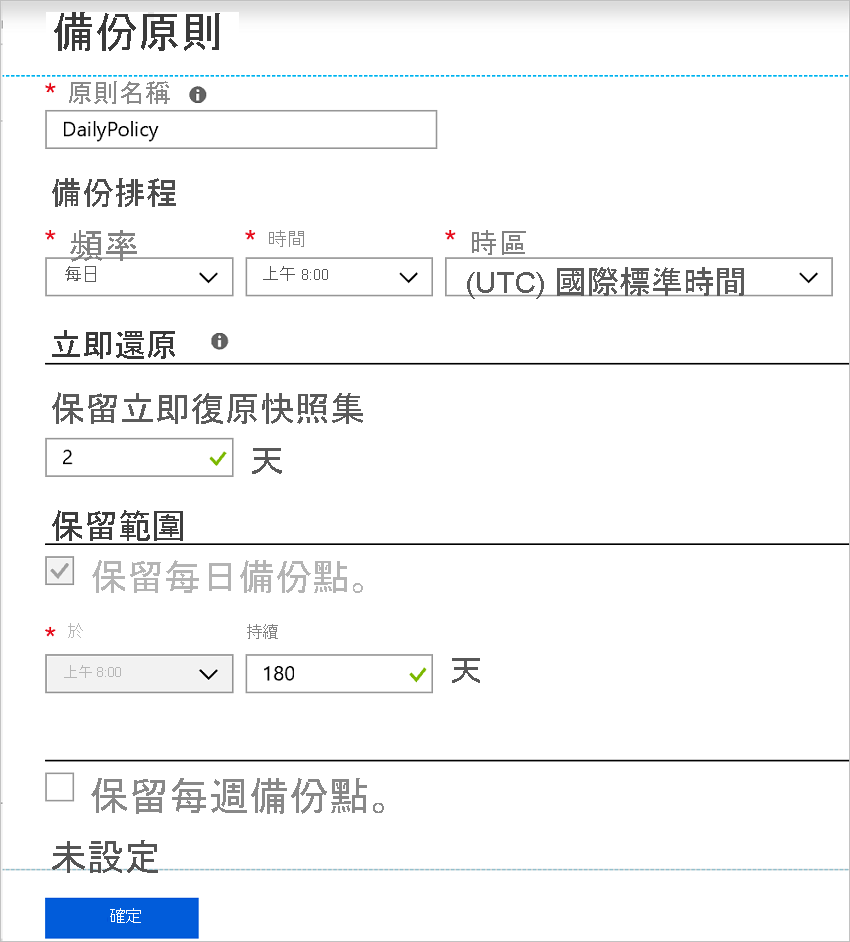
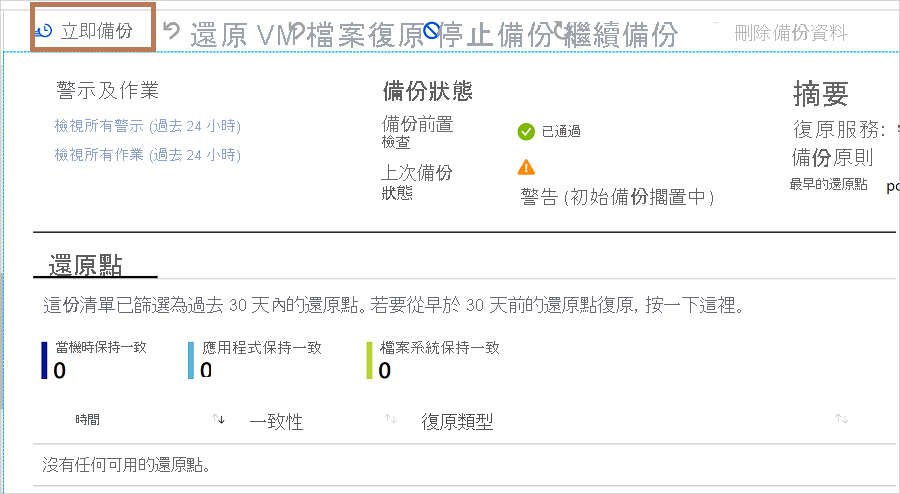

# 建立 Azure VM 時啟用備份

使用 Azure 備份服務，將 Azure 虛擬機器 (Vm) 備份。 系統會根據備份原則中指定的排程來備份 Vm，並從備份建立復原點。 復原點會儲存在復原服務保存庫中。

本文將詳細說明當您在 Azure 入口網站中建立 (VM) 的虛擬機器時，如何啟用備份。  

## 開始之前

- 如果您在建立 VM 時啟用備份，[請檢查](backup-support-matrix-iaas.md#supported-backup-actions)支援的作業系統。

## 登入 Azure

如果您尚未登入您的帳戶，請登入 [Azure 入口網站](https://portal.azure.com)。

## 建立已設定備份的 VM

1. 在 [Azure 入口網站中，選取 [ **建立資源**]。

2. 在 Azure Marketplace 中，選取 [ **計算**]，然後選取 VM 映射。

3. 根據 [Windows](../virtual-machines/windows/quick-create-portal.md) 或 [LINUX](../virtual-machines/linux/quick-create-portal.md) 指示設定 VM。

4. 在 [ **管理** ] 索引標籤的 [ **啟用備份**] 中，選取 [ **開啟**]。
5. Azure 備份復原服務保存庫的備份。 如果您沒有現有的保存庫，請選取 [ **建立新** 的]。
6. 接受建議的保存庫名稱，或指定您自己的名稱。
7. 指定或建立保存庫所在的資源群組。 資源群組保存庫可以與 VM 資源群組不同。

    

8. 接受預設備份原則，或修改設定。
    - 備份原則會指定建立 VM 備份快照集的頻率，以及保留這些備份複本的時間長度。
    - 預設原則每天備份一次 VM。
    - 您可以自訂自己的備份原則，讓 Azure VM 每天或每週進行備份。
    - [深入瞭解](backup-azure-vms-introduction.md#backup-and-restore-considerations) Azure vm 的備份考慮。
    - [深入瞭解](backup-instant-restore-capability.md) 立即還原功能。

      

>[!NOTE]
>[SSE 和 PMK 是 Azure vm 的預設加密方法](backup-encryption.md) 。 Azure 備份支援這些 Azure Vm 的備份和還原。

## 虛擬機器 Azure 備份資源群組

備份服務會建立不同的資源群組 (RG) ，不同于要用來儲存還原點集合 (RPC) 的 VM 資源群組。 RPC 裝載受管理 Vm 的立即復原點。 備份服務所建立的資源群組預設命名格式為： `AzureBackupRG_<Geo>_<number>` 。 例如： *AzureBackupRG_northeurope_1*。 您現在可以自訂 Azure 備份所建立的資源組名。

注意事項：

1. 您可以使用 RG 的預設名稱，或根據您的公司需求進行編輯。
2. 您會在建立 VM 備份原則期間提供 RG 名稱模式作為輸入。 RG 名稱的格式應該如下： `<alpha-numeric string>* n <alpha-numeric string>` 。 ' n ' 會以從 1) 開始的整數 (取代，並在第一個 RG 已滿時用於相應放大。 一個 RG 現在最多可以有600個 Rpc。
              
3. 此模式應遵循下方的 RG 命名規則，而且總長度不應超過允許的 RG 名稱長度上限。
    1. 資源組名只允許英數位元、句點、底線、連字號及括弧。 它們的結尾不能是句點。
    2. 資源組名最多可包含74個字元，包括 RG 名稱和尾碼。
4. 第一個 `<alpha-numeric-string>` 是必要的，而第二個則是選擇性的。 這僅適用于您提供自訂名稱時。 如果您未在任一文字方塊中輸入任何值，則會使用預設名稱。
5. 您可以在必要時修改原則，以編輯 RG 的名稱。 如果名稱模式變更，新的 RPs 將會建立在新的 RG 中。 不過，舊的 RPs 仍會位於舊的 RG 中且不會移動，因為 RP 集合不支援資源移動。 最後，當點數到期時，RPs 將會被垃圾收集。

6. 建議不要鎖定為備份服務所建立的資源群組。

若要使用 PowerShell 來設定虛擬機器的 Azure 備份資源群組，請參閱 [在快照集保留期間建立 Azure 備份資源群組](backup-azure-vms-automation.md#creating-azure-backup-resource-group-during-snapshot-retention)。

## 在建立 VM 之後啟動備份

您的 VM 備份將會根據您的備份原則執行。 不過，我們建議您執行初始備份。

建立 VM 之後，請執行下列動作：

1. 在 VM 屬性中，選取 [ **備份**]。 在初始備份執行之前，VM 狀態為「初始備份擱置中」。
2. 選取 [ **立即備份** ] 以執行隨選備份。

    

## 使用 Resource Manager 範本來部署受保護的 VM

先前的步驟說明如何使用 Azure 入口網站來建立虛擬機器，並在復原服務保存庫中加以保護。 若要快速部署一或多部 Vm，並在復原服務保存庫中保護它們，請參閱範本 [部署 WINDOWS VM 並啟用備份](https://azure.microsoft.com/resources/templates/101-recovery-services-create-vm-and-configure-backup/)。

## 後續步驟

現在您已保護您的 VM，請瞭解如何管理和還原 VM。

- [管理和監視 VM](backup-azure-manage-vms.md)
- [還原 VM](backup-azure-arm-restore-vms.md)

如果您遇到任何問題，請 [參閱](backup-azure-vms-troubleshoot.md) 疑難排解指南。
