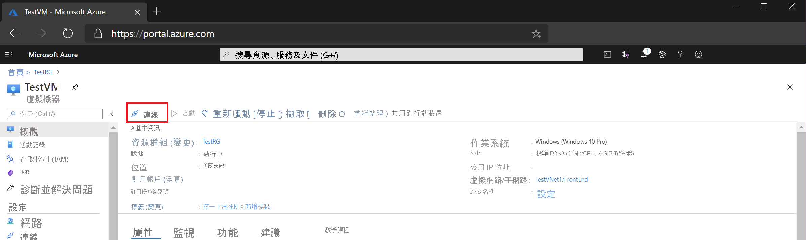

# 快速入門：使用私人 IP 位址和 Azure 堡壘連接到虛擬機器

此快速入門文章介紹如何使用私人 IP 位址連接到虛擬機器。 通過 Bastion 進行連接時，虛擬機器不需要公共 IP 位址。 本文中的步驟可説明您通過門戶中的虛擬機器將堡壘部署到虛擬網路。 預配服務後，RDP/SSH 體驗將提供給同一虛擬網路中的所有虛擬機器。

## Prerequisites

* Azure 虛擬網路。
* 位於打開端口 3389 的虛擬網路中的 Azure 虛擬機器。

### 範例值

|**名稱** | **價值** |
| --- | --- |
| 名稱 |  VNet1 堡壘 |
| 區域 | eastus |
| 虛擬網路 |  VNet1 |
| • 子網名稱 | Azure 堡壘子網 |
| AzureBastion Subnet 位址 |  10.1.254.0/27 |
| 公用 IP 位址 |  新建 |
| 公用 IP 位址名稱 | VNet1BastionPIP  |
| 公共 IP 位址 SKU |  標準  |
| 指派  | 靜態 |

## 建立 Bastion 主機

當您使用現有虛擬機器在門戶中創建堡壘主機時，各種設置將自動預設以對應于虛擬機器和/或虛擬網路。

1. 打開[Azure 門戶](https://portal.azure.com)。 轉到虛擬機器，然後按一下"**連接**"。

   
1. 從下拉清單中，選擇 **"堡壘**"。
1. 在"連接"頁上，選擇 **"使用堡壘**"。

   

1. 在"堡壘"頁上，填寫以下設置欄位：

   * **名稱**： 命名堡壘主機
   * **子網**：將部署堡壘資源的虛擬網路中的子網。 子網必須使用**名稱 AzureBastion Subnet 創建**。 該名稱使 Azure 知道要將堡壘資源部署到哪個子網。 這與閘道子網不同。 使用至少 /27 或更大的子網（/27、/26、/25 等）。
   
      * 選擇 **"管理子網配置**"，然後選擇 **" 子網**"。
      * 在"添加子網"頁上，鍵入**AzureBastion 子網**。
      * 在 CIDR 標記法中指定位址範圍。 例如，10.1.254.0/27。
      * 選擇 **"確定"** 以創建子網。 在頁面頂部，導航回堡壘以完成其餘設置。

         
   * **公共 IP 位址**：這是將訪問 RDP/SSH 的堡壘資源的公共 IP（通過埠 443）。 創建新的公共 IP 或使用現有 IP。 公共 IP 位址必須與您正在創建的堡壘資源位於同一區域。
   * **公共 IP 位址名稱**：公共 IP 位址資源的名稱。
1. 在驗證螢幕上，按一下"**創建**"。 等待大約 5 分鐘，以便創建和部署堡壘資源。

   

## 連接

將堡壘部署到虛擬網路後，螢幕將更改為連接頁。

1. 鍵入虛擬機器的使用者名和密碼。 然後，選擇 **"連接**"。

   
1. 通過 Bastion 連接到此虛擬機器的 RDP 連接將直接在 Azure 門戶（通過 HTML5）中使用埠 443 和堡壘服務打開。

   

## 清除資源

使用虛擬網路和虛擬機器完成後，請刪除資源組及其包含的所有資源：

1. 在門戶頂部的 **"搜索**"框中輸入*TestRG1，* 然後從搜尋結果中選擇**TestRG1。**

2. 選取 [刪除資源群組]****。

3. 輸入*TESTRG1*以**鍵入資源組名稱**，然後選擇 **"刪除**"。

## 後續步驟

在此快速入門中，您為虛擬網路創建了一個堡壘主機，然後通過堡壘主機安全地連接到虛擬機器。

* 要瞭解有關 Azure 堡壘的詳細資訊，請閱讀[堡壘概述](bastion-overview.md)和[堡壘常見問題 。](bastion-faq.md)
* 要將網路安全性群組與 Azure 堡壘子網一起使用，請參閱[使用 NSG。](bastion-nsg.md)
* 有關包含 Azure 堡壘主機設置說明的說明，請參閱[教程](bastion-create-host-portal.md)。
* 要連接到虛擬機器縮放集，請參閱[使用 Azure Bastion 連接到虛擬機器規模集](bastion-connect-vm-scale-set.md)。