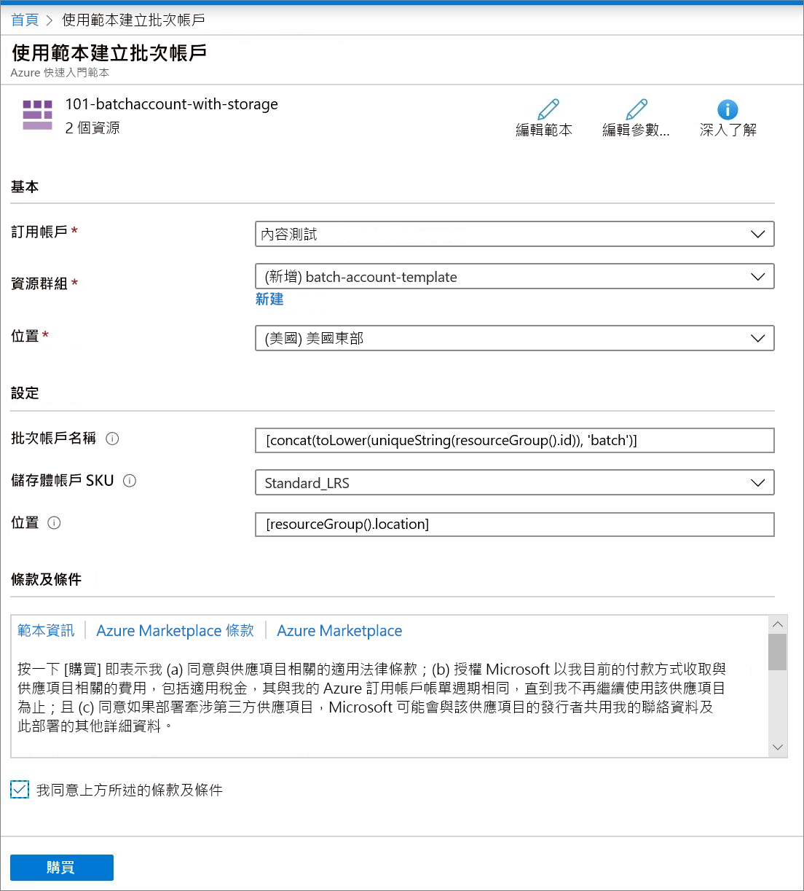

# 快速入門：使用 ARM 範本建立 Batch 帳戶

您需有 Batch 帳戶才能建立計算資源 (計算節點的集區) 和 Batch 作業。 您可以連結 Azure 儲存體帳戶與 Batch 帳戶，其適合用於部署應用程式以及儲存大部分真實工作負載的輸入和輸出資料。 本快速入門會說明如何使用 Azure Resource Manager 範本 (ARM 範本) 來建立 Batch 帳戶，包括儲存體。 完成本快速入門之後，您將了解 Batch 服務的重要概念，並可準備使用更多真實的工作負載來大規模試用 Batch。

[!INCLUDE [About Azure Resource Manager](../../includes/resource-manager-quickstart-introduction.md)]

如果您的環境符合必要條件，而且您很熟悉 ARM 範本，請選取 [部署至 Azure] 按鈕。 範本會在 Azure 入口網站中開啟。

## 必要條件

您必須擁有有效的 Azure 訂用帳戶。

- [!INCLUDE [quickstarts-free-trial-note](../../includes/quickstarts-free-trial-note.md)]

## 檢閱範本

本快速入門中使用的範本是來自 [Azure 快速入門範本](https://azure.microsoft.com/resources/templates/101-batchaccount-with-storage/)。

:::code language="json" source="~/quickstart-templates/101-batchaccount-with-storage/azuredeploy.json" range="1-80" highlight="36-69":::

範本中定義了兩個 Azure 資源：

- [Microsoft.Storage/storageAccounts](/azure/templates/microsoft.storage/storageaccounts)：建立儲存體帳戶。
- [Microsoft.Batch/batchAccounts](/azure/templates/microsoft.batch/batchaccounts)：建立 Batch 帳戶。

## 部署範本

1. 選取以下影像來登入 Azure 並開啟範本。 範本會建立 Azure Batch 帳戶和儲存體帳戶。

   

1. 選取或輸入下列值。

   

   - **訂用帳戶**：選取 Azure 訂用帳戶。
   - [資源群組]選取 [新建]，輸入資源群組的唯一名稱，然後按一下 [確認]。
   - **位置**：選取位置。 例如，**美國中部**。
   - **Batch 帳戶名稱**：保留預設值。
   - [儲存體帳戶 SKU]：選取儲存體帳戶類型。 例如，**Standard_LRS**。
   - **位置**：保留預設值，讓資源與您的資源群組位於相同位置。
   - 我同意上方所述的條款及條件：**選取**。

1. 選取 [購買]。

幾分鐘後，您應該會看到已成功建立 Batch 帳戶的通知。

在此範例中，會使用 Azure 入口網站來部署範本。 除了 Azure 入口網站以外，您也可以使用 Azure PowerShell、Azure CLI 和 REST API。 若要了解其他部署方法，請參閱[部署範本](../azure-resource-manager/templates/deploy-powershell.md)。

## 驗證部署

您可以瀏覽至您所建立的資源群組，以驗證 Azure 入口網站中的部署。 在 [總覽] 畫面中，確認 Batch 帳戶和儲存體帳戶存在。

## 清除資源

如果您打算繼續進行後續的[教學課程](./tutorial-parallel-dotnet.md)，可以讓這些資源留在原處。 或者，如果您不再需要這些資源，可以[刪除資源群組](../azure-resource-manager/management/delete-resource-group.md?tabs=azure-portal#delete-resource-group)，這樣也會刪除您所建立的 Batch 帳戶和儲存體帳戶。

## 後續步驟

在本快速入門中，您建立了 Batch 帳戶和儲存體帳戶。 若要深入了解 Azure Batch，請繼續進行 Azure Batch 教學課程。

> [!div class="nextstepaction"]
> [Azure Batch 教學課程](./tutorial-parallel-dotnet.md)
