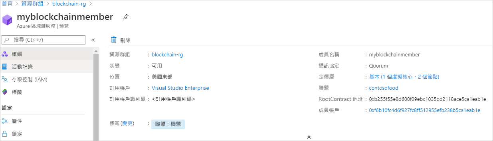

# 快速入門：使用 ARM 範本建立 Azure 區塊鏈服務成員

在本快速入門中，您會使用 Azure Resource Manager 範本 (ARM 範本) 在 Azure 區塊鏈服務中部署新的區塊鏈成員和聯盟。 Azure 區塊鏈服務成員是私人聯盟區塊鏈網路中的區塊鏈節點。 在佈建成員時，您可以建立或加入聯盟網路。 一個聯盟網路至少需要一個成員。 參與者所需的區塊鏈成員數目視您的案例而定。 聯盟參與者可以有一或多個區塊鏈成員，也可以與其他參與者共用成員。 如需聯盟的詳細資訊，請參閱 [Azure 區塊鏈服務聯盟](consortium.md)。

[!INCLUDE [About Azure Resource Manager](../../../includes/resource-manager-quickstart-introduction.md)]

如果您的環境符合必要條件，而且您很熟悉 ARM 範本，請選取 [部署至 Azure] 按鈕。 範本會在 Azure 入口網站中開啟。

## 必要條件

如果您沒有 Azure 訂用帳戶，請在開始前建立[免費帳戶](https://azure.microsoft.com/free/)。

## 檢閱範本

本快速入門中使用的範本是來自 [Azure 快速入門範本](https://azure.microsoft.com/resources/templates/201-blockchain-asaservice/)。

:::code language="json" source="~/quickstart-templates/201-blockchain-asaservice/azuredeploy.json":::

範本中定義的 Azure 資源：

* [**Microsoft.Blockchain/blockchainMembers**](/azure/templates/microsoft.blockchain/blockchainmembers)

## 部署範本

1. 選取以下連結來登入 Azure 並開啟範本。

    

1. 指定 Azure 區塊鏈服務成員的設定。

    設定 | 描述
    --------|------------
    訂用帳戶 | 選取您要用於服務的 Azure 訂用帳戶。 如果您有多個訂用帳戶，請選擇資源計費的訂用帳戶。
    資源群組 | 建立新的資源群組名稱，或選擇您訂用帳戶中現有的資源群組名稱。
    Location | 選擇要建立成員的位置。 聯盟的所有成員都必須位於相同的位置。 可供部署的位置有 *westeurope、eastus、southeastasia、westeurope、northeurope、westus2* 和 *japaneast*。 某些區域可能無法使用這些功能。 下列 Azure 區域提供 Azure 區塊鏈資料管理員服務：美國東部和西歐。
    成員名稱 | 選擇 Azure 區塊鏈服務成員的唯一名稱。 區塊鏈成員的名稱只能包含小寫字母和數字。 第一個字元必須是字母。 此值長度必須介於 2 至 20 個字元之間。
    聯盟名稱 | 輸入唯一名稱。 如需聯盟的詳細資訊，請參閱 [Azure 區塊鏈服務聯盟](consortium.md)。
    成員密碼 | 成員帳戶密碼可用來對為您的成員建立的 Ethereum 帳戶進行私密金鑰加密。 您可以使用帳戶成員和成員帳戶密碼進行聯盟管理。
    SKU 層 | 新服務的定價層。 在**標準**和**基本**層之間選擇。 使用「基本」層來進行開發、測試和概念證明。 使用「標準」層來進行生產等級的部署。 如果您使用區塊鏈資料管理員或傳送大量的私人交易，也應該使用*標準*層。 不支援在建立成員之後變更基本和標準間的定價層。
    SKU 名稱 | 新服務的節點組態和成本。

1. 選取 [購買] 以部署範本。

  Azure 入口網站在此用於部署範本。 您也可以使用 Azure PowerShell、Azure CLI 和 REST API。 若要了解其他部署方法，請參閱[部署範本](../../azure-resource-manager/templates/deploy-powershell.md)。

## 檢閱已部署的資源

您可以使用 Azure 入口網站來檢視已部署 Azure 區塊鏈服務成員的詳細資料。 在入口網站中，前往包含 Azure 區塊鏈服務成員的資源群組。 選取您建立的區塊鏈成員。

## 清除資源

您可以使用您建立的區塊鏈成員來進行下一個快速入門或教學課程。 當不再需要資源時，您可藉由刪除您為本快速入門建立的資源群組來刪除資源。

若要刪除資源群組：

1. 在 Azure 入口網站中，瀏覽至左側瀏覽窗格中的 [資源群組]，然後選取您想要刪除的資源群組。
2. 選取 [刪除資源群組]。 輸入資源群組名稱並選取 [刪除]，以確定進行刪除。

## 後續步驟

在本快速入門中，您已部署 Azure 區塊鏈服務成員和新的聯盟。 請嘗試進行下一個快速入門，使用適用於 Ethereum 的 Azure 區塊鏈開發套件連結至 Azure 區塊鏈服務成員。

> [!div class="nextstepaction"]
> [使用 Visual Studio Code 連線至聯盟網路](connect-vscode.md)