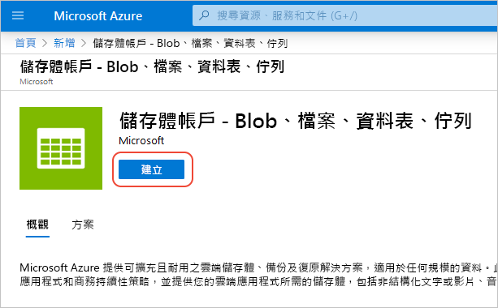
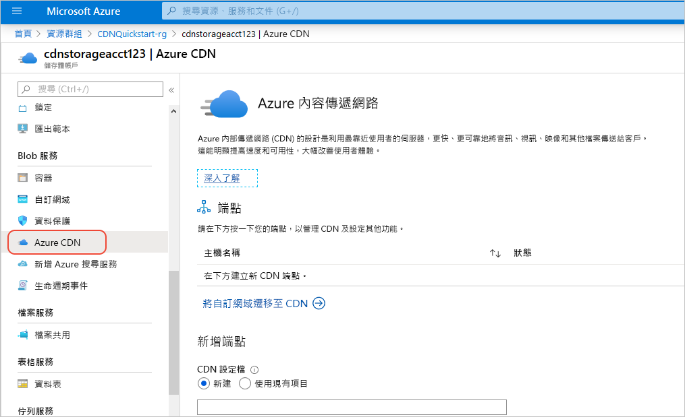
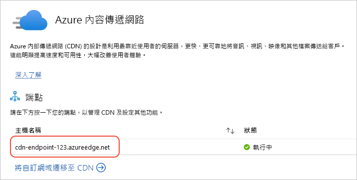

# 快速入門：整合 Azure 儲存體帳戶與 Azure CDN

在本快速入門中，您可以啟用 [Azure 內容傳遞網路 (CDN)](cdn-overview.md)，以從 Azure 儲存體快取內容。 Azure CDN 提供開發人員一套傳遞高頻寬內容的全域解決方案。 在北美洲、歐洲、亞洲、澳洲及南美洲的實體節點上，皆可快取 blob 和計算執行個體的靜態內容。

## Prerequisites

- 具有有效訂用帳戶的 Azure 帳戶。 [免費建立帳戶](https://azure.microsoft.com/free/?ref=microsoft.com&utm_source=microsoft.com&utm_medium=docs&utm_campaign=visualstudio)。

## 登入 Azure 入口網站

使用您的 Azure 帳戶登入 [Azure 入口網站](https://portal.azure.com) 。

## 建立儲存體帳戶

有了儲存體帳戶，才能存取 Azure 儲存體服務。 儲存體帳戶代表最高層級的命名空間，用於存取每個 Azure 儲存體服務元件：Azure Blob、佇列和資料表儲存體。 如需詳細資訊，請參閱 [Microsoft Azure 儲存體簡介](../storage/common/storage-introduction.md)。

若要建立儲存體帳戶，您必須是服務管理員或是相關訂用帳戶的共同管理員。

1. 在 Azure 入口網站中，選取左上方的 [建立資源]。 [新增] 窗格隨即出現。

1. 搜尋 [儲存體帳戶]，並從下拉式清單中選取 [儲存體帳戶 - Blob、檔案、資料表、佇列]。 然後，選取 [建立]：
    
    

1. 在 [建立儲存體帳戶] 窗格中，輸入下列詳細資料：

    | 設定 | 值 | 
    | --- | --- |
    | 專案詳細資料 > 資源群組 | 選取 [新建]，並使用名稱 *CDNQuickstart-rg*。 您也可以使用現有的資源群組 (如果您偏好此做法)。 |
    | 執行個體詳細資料 > 儲存體帳戶名稱 | 輸入限用 3-24 小寫字母和數字的帳戶名稱。 此名稱在 Azure 中必須是唯一的，且會成為 URL 中用來為訂用帳戶的 Blob、佇列或資料表資源定址的主機名稱。 若要為 Blob 儲存體的容器資源定址，請使用下列格式的 URI： http:// *&lt;storageaccountname&gt;* .blob.core.windows.net/ *&lt;container-name&gt;* 。
    | 執行個體詳細資料 > 位置 | 從下拉式清單中選取您附近的 Azure 區域。 |
    
    將所有其他詳細資料的設定保留為預設值，然後選取 [檢閱 + 建立]。

1. 建立儲存體帳戶可能需要幾分鐘才能完成。 建立完成後，請選取 [前往資源] 開啟儲存體帳戶的頁面，以進行下一個步驟。

## 啟用儲存體帳戶的 Azure CDN

1. 在您的儲存體帳戶頁面上，從左側功能表中選取 [Blob 服務] > [Azure CDN]。 [Azure CDN] 頁面隨即顯示。

    
    
1. 在 [新增端點] 區段中，輸入下列資訊：

    | 設定  | 值 |
    | -------- | ----- |
    | **CDN 設定檔** | 選取 [新建] 並輸入設定檔名稱，例如 cdn-profile-123。 設定檔是端點的集合。 |
    | **定價層** | 選取其中一個**標準**選項，例如 [標準 Microsoft]。 |
    | **CDN 端點名稱** | 輸入您的端點主機名稱，例如 *cdn-endpoint-123*。 此名稱在 Azure 中必須是全域唯一的，因為此名稱會用來存取 URL _&lt;endpoint-name&gt;_ .azureedge.net 上的快取資源。 |
    | **原始主機名稱** | 根據預設，新的 CDN 端點會使用儲存體帳戶的主機名稱作為原始伺服器。 |

1. 選取 [建立]。 端點建立之後，即會出現在端點清單中。

    

> [!TIP]
> 如果想要指定 CDN 端點的進階組態設定 (例如[大型檔案下載最佳化](cdn-optimization-overview.md#large-file-download))，您可以改用 [Azure CDN 擴充功能](cdn-create-new-endpoint.md)建立 CDN 設定檔或端點。

## 啟用其他 CDN 功能

在儲存體帳戶 [Azure CDN] 頁面中，選取清單內的 CDN 端點，以開啟 CDN 端點組態頁面。

從此頁面中，您可以為傳遞啟用其他的 CDN 功能，例如[壓縮](cdn-improve-performance.md)、[查詢字串快取](cdn-query-string.md)和[地區篩選](cdn-restrict-access-by-country.md)。 
    
## 啟用 SAS

如果您想要授與有限的私人儲存體容器存取權，可以使用 Azure 儲存體帳戶的「共用存取簽章」(SAS) 功能。 SAS 是一個 URI，可在不公開您帳戶金鑰的情況下，授與對「Azure 儲存體」資源的有限存取權限。 如需詳細資訊，請參閱[搭配使用 Azure CDN 與 SAS](cdn-sas-storage-support.md)。

## 存取 CDN 內容

若要存取 CDN 上快取的內容，請使用入口網站中提供的 CDN URL。 快取 blob 的位址格式如下：

http://<*endpoint-name*\>.azureedge.net/<*myPublicContainer*\>/<*BlobName*\>

> [!NOTE]
> 啟用 Azure CDN 存取儲存體帳戶後，所有公開可用的物件皆適用於 CDN POP 快取。 如果您修改的物件目前是 CDN 中的快取物件，在快取內容的有效存留期已滿之後，除非 Azure CDN 重新整理內容，否則無法透過 Azure CDN 取得新的內容。

## 從 Azure CDN 移除內容

如果不想繼續在 Azure CDN 中快取物件，您可以採取下列其中一個步驟：

- 將容器設為私人而非公用。 如需詳細資訊，請參閱 [管理對容器與 Blob 的匿名讀取權限](../storage/blobs/storage-manage-access-to-resources.md)。
- 使用 Azure 入口網站來停用或刪除 CDN 端點。
- 修改託管服務，使其不再回應物件的要求。

已在 Azure CDN 中快取的物件會保持快取狀態，直到物件的有效存留期已滿或端點已[清除](cdn-purge-endpoint.md)為止。 有效存留期已滿時，Azure CDN 會判斷 CDN 端點是否仍然有效，以及物件是否仍可匿名存取。 如果不是的話，將不再快取物件。

## 清除資源

在前述步驟中，您在資源群組中建立了 CDN 設定檔和端點。 如果您想移至[後續步驟](#next-steps)並了解如何將自訂網域新增至您的端點，請儲存這些資源。 不過，如果您認為未來不需要使用這些資源，可以藉由刪除資源群組的方式將其刪除，以避免額外的費用：

1. 從 Azure 入口網站的左側功能表中，依序選取 [資源群組] 和 *CDNQuickstart-rg*\*。

2. 在 [資源群組] 頁面上選取 [刪除資源群組]，在文字方塊中輸入 *CDNQuickstart-rg*，然後選取 [刪除]。

    此動作將會刪除資源群組、設定檔，以及您在此快速入門中建立的端點。

3. 若要刪除儲存體帳戶，請從儀表板中選取該帳戶，然後從頂端功能表中選取 [刪除]。

## 後續步驟

> [!div class="nextstepaction"]
> [建立 Azure CDN 設定檔和端點](cdn-create-new-endpoint.md)

> [!div class="nextstepaction"]
> [教學課程：從 Web 應用程式使用 CDN 提供靜態內容](cdn-add-to-web-app.md)
