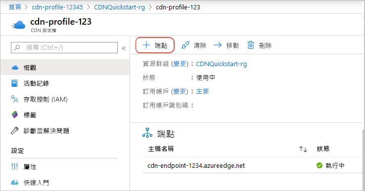
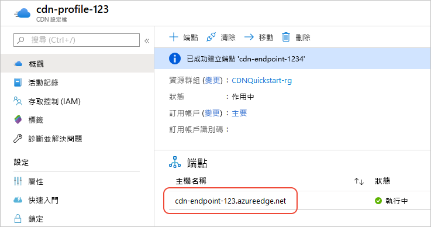

# 快速入門：建立 Azure CDN 設定檔和端點
在本快速入門中，您會藉由建立新的 CDN 設定檔和 CDN 端點來啟用 Azure 內容傳遞網路（CDN）。 建立設定檔和端點之後，您就可以開始將內容傳遞給您的客戶。

[!INCLUDE [quickstarts-free-trial-note](../../includes/quickstarts-free-trial-note.md)]

## 要求
基於本快速入門的目的，您必須已建立名為*mystorageacct123*的儲存體帳戶，用於來源主機名稱。 如需詳細資訊，請參閱[整合 azure 儲存體帳戶與 AZURE CDN](cdn-create-a-storage-account-with-cdn.md)。

## 登入 Azure 入口網站
使用您的 Azure 帳戶登入[Azure 入口網站](https://portal.azure.com)。

[!INCLUDE [cdn-create-profile](../../includes/cdn-create-profile.md)]

## 建立新的 CDN 端點

建立 CDN 設定檔之後，您就可以使用它來建立端點。

1. 在 Azure 入口網站中，在儀表板中選取您所建立的 CDN 設定檔。 如果找不到，請選取 [**所有服務**]，然後選取 [ **CDN 設定檔**]。 在 [ **CDN 設定檔**] 頁面中，選取您想要使用的設定檔。 
   
    [CDN 設定檔] 頁面隨即出現。

2. 選取 [**端點**]。
   
    
   
    [**新增端點**] 窗格隨即出現。

3. 針對端點設定，使用下表中指定的值：

    | 設 | Value |
    | ------- | ----- |
    | **檔案名** | 針對您的端點主機名稱輸入「*我的端點-123* 」。 此名稱必須是全域唯一的;如果已在使用中，您可以輸入不同的名稱。 這個名稱會用來存取位於網域 _&lt;端點名稱&gt;_ . azureedge.net 的快取資源。|
    | **來源類型** | 選取 [**儲存體**]。 | 
    | **來源主機名稱** | 針對您的主機名稱輸入*mystorageacct123.blob.core.windows.net* 。 此名稱必須是全域唯一的;如果已在使用中，您可以輸入不同的名稱。 |
    | **原始路徑** | 保留空白。 |
    | **原始主機標頭** | 保留預設產生的值。 |  
    | **Protocol** | 保留選取預設的**HTTP**和**HTTPS**選項。 |
    | **來源埠** | 保留預設的埠值。 | 
    | **已針對** | 保留預設選項 [**一般 web 傳遞**]。 |

    ![[新增端點] 窗格](./media/cdn-create-new-endpoint/cdn-add-endpoint.png)

3. 選取 **[新增]** 以建立新的端點。
   
   建立端點之後，它會出現在設定檔的端點清單中。
    
   
    
   因為需要時間來傳播註冊，所以端點不會立即可供使用： 
   - 若為**來自 Microsoft 的標準 AZURE CDN**設定檔，通常會在10分鐘內完成傳播。 
   - 若為**來自 Akamai 的 AZURE CDN 標準**設定檔，通常會在一分鐘內完成傳播。 
   - 若為**來自 Verizon 的 AZURE Cdn 標準**和**來自 VERIZON 的 azure cdn Premium**設定檔，通常會在90分鐘內完成傳播。 

## 清除資源
在上述步驟中，您已在資源群組中建立 CDN 設定檔和端點。 如果您想要移至[後續步驟](#next-steps)並瞭解如何將自訂網域新增至您的端點，請儲存這些資源。 不過，如果您未來不希望使用這些資源，您可以藉由刪除資源群組來刪除它們，藉此避免額外的費用：

1. 從 Azure 入口網站的左側功能表中，選取 [**資源群組**]，然後選取 [**我的資源群組-123**]。

2. 在 [**資源群組**] 頁面上，選取 [**刪除資源群組**]，在文字方塊中輸入*我的資源群組-123* ，然後選取 [**刪除**]。

    此動作會刪除您在本快速入門中建立的資源群組、設定檔和端點。

## 後續步驟
若要瞭解如何將自訂網域新增至您的 CDN 端點，請參閱下列教學課程：

> [!div class="nextstepaction"]
> [教學課程：將自訂網域新增至您的 Azure CDN 端點](cdn-map-content-to-custom-domain.md)

