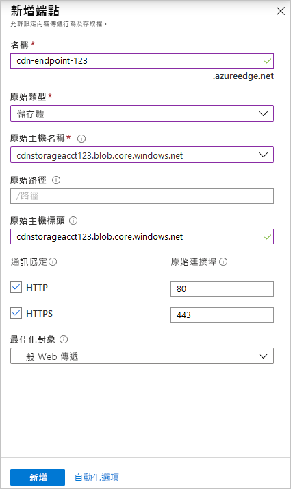

# 快速入門：建立 Azure CDN 設定檔和端點

在此快速入門中，您會藉由建立新的 CDN 設定檔 (此為一或多個 CDN 端點的集合)，來啟用 Azure 內容傳遞網路 (CDN)。 在建立設定檔和端點後，您即可開始將內容傳遞給您的客戶。

## Prerequisites

- 具有有效訂用帳戶的 Azure 帳戶。 [免費建立帳戶](https://azure.microsoft.com/free/?ref=microsoft.com&utm_source=microsoft.com&utm_medium=docs&utm_campaign=visualstudio)。
- 名為 *cdnstorageacct123* 的 Azure 儲存體帳戶，用於來源主機名稱。 若要符合此需求，請參閱[整合 Azure 儲存體帳戶與 Azure CDN](cdn-create-a-storage-account-with-cdn.md)。

## 登入 Azure 入口網站

使用您的 Azure 帳戶登入 [Azure 入口網站](https://portal.azure.com) 。

[!INCLUDE [cdn-create-profile](../../includes/cdn-create-profile.md)]

## 建立新的 CDN 端點

在您建立 CDN 設定檔後，可以使用此設定檔來建立端點。

1. 在 Azure 入口網站中，從儀表板中選取您所建立的 CDN 設定檔。 如果您找不到此設定檔，可以開啟其建立所在的資源群組，或使用入口網站頂端的搜尋列，輸入設定檔名稱，然後從結果中選取設定檔。
   
1. 在 [CDN 設定檔] 頁面上，選取 [+ 端點]。
   
    
   
    此時會顯示 [新增端點] 窗格。

3. 輸入下列設定值：

    | 設定 | 值 |
    | ------- | ----- |
    | **名稱** | 輸入 *cdn-endpoint-123* 作為您的端點主機名稱。 此名稱在整個 Azure 中必須是唯一的；如果已在使用中，您可以輸入不同的名稱。 此名稱可用來存取網域 _&lt;endpoint-name&gt;_ .azureedge.net 上的快取資源。|
    | **原始類型** | 選取 [儲存體] 。 | 
    | **原始主機名稱** | 從下拉式清單中選取您要使用之 Azure 儲存體帳戶的主機名稱，例如 *cdnstorageacct123.blob.core.windows.net*。 |
    | **原始路徑** | 保留空白。 |
    | **原始主機標頭** | 保留預設值 (這是儲存體帳戶的主機名稱)。 |  
    | **通訊協定** | 保留已選取的預設值 **HTTP** 和 **HTTPS** 選項。 |
    | **原始連接埠** | 保留預設的連接埠值。 | 
    | **最佳化對象** | 保留預設選項 [一般 Web 傳遞]。 |

    

3. 選取 [新增] 來建立新的端點。 端點建立之後，即會出現在設定檔的端點清單中。
    
   
    
   端點傳播所需的時間取決於您在建立設定檔時選取的定價層。 **標準 Akamai** 通常會在一分鐘內完成，**標準 Microsoft** 需要 10 分鐘，而**標準 Verizon** 和 **進階 Verizon** 最多需要 90 分鐘。

## 清除資源

在前述步驟中，您在資源群組中建立了 CDN 設定檔和端點。 如果您想移至[後續步驟](#next-steps)並了解如何將自訂網域新增至您的端點，請儲存這些資源。 不過，如果您認為未來不需要使用這些資源，可以藉由刪除資源群組的方式將其刪除，以避免額外的費用：

1. 從 Azure 入口網站的左側功能表中，依序選取 [資源群組] 和 [CDNQuickstart-rg]。

2. 在 [資源群組] 頁面上選取 [刪除資源群組]，在文字方塊中輸入 *CDNQuickstart-rg*，然後選取 [刪除]。 此動作將會刪除資源群組、設定檔，以及您在此快速入門中建立的端點。

## 後續步驟

> [!div class="nextstepaction"]
> [教學課程：從 Web 應用程式使用 CDN 提供靜態內容](cdn-add-to-web-app.md)

> [!div class="nextstepaction"]
> [教學課程：將自訂網域新增至 Azure CDN 端點](cdn-map-content-to-custom-domain.md)
