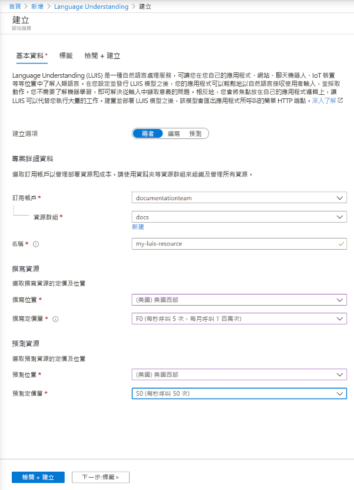

## 在 Azure 入口網站中建立 LUIS 資源

1. 使用[此連結](https://ms.portal.azure.com/#create/Microsoft.CognitiveServicesLUISAllInOne)開始在 Azure 入口網站中建立 LUIS 資源。

1. 輸入所有必要的設定：

    |名稱|目的|
    |--|--|
    |訂閱名稱| 要作為資源收費對象的訂用帳戶。|
    |資源群組| 您選擇或建立的自訂資源群組名稱。 資源群組可讓您將 Azure 資源分組以方便存取和管理。|
    |名稱| 您選擇的自訂名稱，用來作為撰寫和預測端點查詢的自訂子網域。|
    |製作位置|與您模型相關聯的區域。|
    |製作定價層|定價層會決定每秒和每月的交易上限。|
    |執行階段位置|與您發佈的預測端點執行階段相關聯的區域。|
    |執行階段定價層|定價層會決定每秒和每月的交易上限。|

    > [!div class="mx-imgBorder"]
    > 

1. 按一下 [檢閱 +建立]  ，並等待系統建立資源。
1. 建立這兩個資源之後，仍在 Azure 入口網站中，選取新的撰寫資源，然後選取 [快速入門]  以撰寫 [端點 URL]  和 [金鑰]  以程式設計方式進行撰寫。

> [!TIP]
> 若要使用資源，請在 LUIS 入口網站中，[指派資源](../luis-how-to-azure-subscription.md#assign-an-authoring-resource-in-the-luis-portal-for-all-apps)。