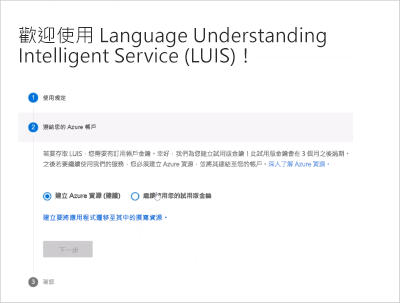

# <a name="create-luis-resources"></a>建立 LUIS 資源

撰寫和查詢預測執行時間資源可提供驗證給您的 LUIS 應用程式和預測端點。

<a name="azure-resources-for-luis"></a>
<a name="programmatic-key" ></a>
<a name="endpoint-key"></a>
<a name="authoring-key"></a>

## <a name="luis-resources"></a>LUIS 資源

LUIS 允許三種類型的 Azure 資源和一個非 Azure 資源：

|資源|目的|認知服務 `kind`|認知服務 `type`|
|--|--|--|--|
|撰寫資源|可讓您建立、管理、定型、測試及發佈您的應用程式。 如果您想要在 programtically 或從 LUIS 入口網站撰寫 LUIS apps，請[建立 LUIS 編寫資源](luis-how-to-azure-subscription.md#create-luis-resources-in-azure-portal)。 您需要先 [遷移您的 LUIS 帳戶](luis-migration-authoring.md#what-is-migration) ，才能將 Azure authroring 資源連結至您的應用程式。 您可以藉由將人員指派給「 [參與者」角色](#contributions-from-other-authors)，來控制撰寫資源的許可權。 <br><br> LUIS 撰寫資源有一層有：<br> * **免費的 F0 撰寫資源** ，可提供1百萬個免費的撰寫交易和1000個每月免費測試預測端點要求。 |`LUIS.Authoring`|`Cognitive Services`|
|預測資源| 發佈 LUIS 應用程式之後，請使用預測資源/金鑰來查詢預測端點要求。 請先建立 LUIS 預測資源，用戶端應用程式才會要求在撰寫或入門資源所提供的1000要求之外進行預測。 <br><br> 預測資源有兩個層級 avialble：<br> * **免費的 F0 預測資源** ，每月提供10000個免費的預測端點要求<br> * **標準 S0 預測資源** ，也就是付費層。 [深入瞭解定價詳細資料](https://azure.microsoft.com/pricing/details/cognitive-services/language-understanding-intelligent-services/)|`LUIS`|`Cognitive Services`|
|入門/試用資源|可讓您建立、管理、定型、測試及發佈您的應用程式。 如果您在第一次註冊 tp LUIS 時選擇 [入門資源] 選項，deafult 就會建立此設定。 不過，入門金鑰最後會被取代，而且所有 LUIS 使用者都必須 [遷移其帳戶](luis-migration-authoring.md#what-is-migration) ，並將其 LUIS 應用程式連結至撰寫資源。 此資源並不會授與角色型存取控制（例如撰寫資源）的許可權。 <br><br> 就像撰寫資源一樣，入門資源提供了1百萬個免費的撰寫交易和1000個免費的測試預測端點要求。|-|不是 Azure 資源|
|[認知服務的多服務資源金鑰](../cognitive-services-apis-create-account-cli.md?tabs=windows#create-a-cognitive-services-resource)|查詢與 LUIS 和其他支援的認知服務共用的預測端點要求。|`CognitiveServices`|`Cognitive Services`|


> [!Note]
> 有兩種類型的 F0 (LUIS 提供的免費層) 資源。 一個用於撰寫交易，另一個用於預測交易。 如果您的預測交易可用配額不足，請確定您實際上使用 F0 預測資源，每月提供您10000的免費交易，而不是每月提供1000個預測交易的撰寫資源。

當 Azure 資源建立程式完成時，請在 LUIS 入口網站中 [將資源指派](#assign-a-resource-to-an-app) 給應用程式。

在您想要發佈和查詢的 [區域](luis-reference-regions.md#publishing-regions) 中撰寫 LUIS 應用程式相當重要。

## <a name="resource-ownership"></a>資源擁有權

Azure 資源（例如 LUIS）由包含資源的訂用帳戶所擁有。

若要轉移資源的擁有權，您可以：
* 轉移訂用帳戶的[擁有權](../../cost-management-billing/manage/billing-subscription-transfer.md)
* 將 LUIS 應用程式匯出為檔案，然後將應用程式匯入至不同的訂用帳戶。 您可以從 LUIS 入口網站中的 [ **我的應用程式** ] 頁面使用 [匯出]。


## <a name="resource-limits"></a>資源限制

### <a name="authoring-key-creation-limits"></a>撰寫金鑰建立限制

每個訂用帳戶最多可以為每個區域建立10個撰寫金鑰。

查看 [金鑰限制](luis-limits.md#key-limits) 和 [Azure 區域](luis-reference-regions.md)。

發佈區域與撰寫區域不同。 請確定您在撰寫區域中建立的應用程式，與您想要的用戶端應用程式所在的發列區域相對應。

### <a name="key-usage-limit-errors"></a>金鑰使用限制錯誤

使用量限制是以定價層為基礎。

如果您超出每秒交易 (TPS) 配額，就會收到 HTTP 429 錯誤。 如果您超出每月交易 (TPS) 配額，就會收到 HTTP 403 錯誤。


### <a name="reset-authoring-key"></a>重設撰寫金鑰

針對 [撰寫資源遷移](luis-migration-authoring.md) 的應用程式：如果您的撰寫金鑰遭到入侵，請在該撰寫資源的 [ **金鑰** ] 頁面上，重設 Azure 入口網站中的金鑰。

針對尚未遷移的應用程式：您可以在 LUIS 入口網站中的所有應用程式上重設金鑰。 如果您透過撰寫 Api 撰寫您的應用程式，則需要將 Apim-訂用帳戶金鑰的值變更為新的金鑰。

### <a name="regenerate-azure-key"></a>重新產生 Azure 金鑰

從 Azure 入口網站的 [ **金鑰** ] 頁面重新產生 Azure 金鑰。


<a name="securing-the-endpoint"></a>

## <a name="app-ownership-access-and-security"></a>應用程式擁有權、存取權和安全性

應用程式是由其 Azure 資源所定義，由擁有者的訂用帳戶所決定。

您可以移動您的 LUIS 應用程式。 使用 Azure 入口網站或 Azure CLI 中的下列檔資源：

* [在 LUIS 編寫資源之間移動應用程式](https://westus.dev.cognitive.microsoft.com/docs/services/5890b47c39e2bb17b84a55ff/operations/apps-move-app-to-another-luis-authoring-azure-resource)
* [將資源移至新的資源群組或訂用帳戶](../../azure-resource-manager/management/move-resource-group-and-subscription.md)
* [移動相同訂用帳戶內或跨訂用帳戶的資源](../../azure-resource-manager/management/move-limitations/app-service-move-limitations.md)


### <a name="contributions-from-other-authors"></a>其他作者的投稿

針對 [撰寫資源遷移](luis-migration-authoring.md) 的應用程式： _參與者_ 是在撰寫資源的 Azure 入口網站中進行管理，並使用 **存取控制 (IAM) ** 頁面。 瞭解如何使用共同作業者的電子郵件地址和_參與者_角色[來新增使用者](luis-how-to-collaborate.md)。

針對尚未遷移的應用程式：所有共同作業者都是在 LUIS 入口網站 _中，從_ [ **管理->** 共同作業者] 頁面進行管理。

### <a name="query-prediction-access-for-private-and-public-apps"></a>私用和公用應用程式的查詢預測存取

若為 **私** 用應用程式，擁有者和參與者都可以使用查詢預測執行時間存取。 針對 **公用** 應用程式，每個人都可以使用執行時間存取，其擁有自己的 Azure [認知服務](../cognitive-services-apis-create-account.md) 或 [LUIS](#create-resources-in-the-azure-portal) 執行時間資源，且具有公用應用程式的識別碼。

目前沒有公用應用程式的目錄。

### <a name="authoring-permissions-and-access"></a>撰寫許可權和存取權
從 [LUIS](luis-reference-regions.md#luis-website) 入口網站或 [撰寫 api](https://go.microsoft.com/fwlink/?linkid=2092087) 存取應用程式是由 Azure 撰寫資源所控制。

擁有者和所有參與者都具有編寫應用程式的存取權。

|撰寫存取權包括|注意|
|--|--|
|新增或移除端點金鑰||
|匯出版本||
|匯出端點記錄||
|匯入版本||
|將應用程式設定為公用|當應用程式為公用時，任何具有撰寫或端點金鑰的使用者都可查詢該應用程式。|
|修改模型|
|發佈|
|檢閱用於[主動式學習](luis-how-to-review-endpoint-utterances.md)的端點語句|
|定型|

<a name="prediction-endpoint-runtime-key"></a>

### <a name="prediction-endpoint-runtime-access"></a>預測端點執行時間存取

查詢預測端點的存取權是由 [**管理**] 區段中 [**應用程式資訊**] 頁面上的設定所控制。

|[私人端點](#runtime-security-for-private-apps)|[公用端點](#runtime-security-for-public-apps)|
|:--|:--|
|適用于擁有者和參與者|適用于擁有者、參與者，以及任何知道應用程式識別碼的其他人|

您可以在伺服器對伺服器環境中呼叫，以控制誰看到您的 LUIS 執行時間金鑰。 如果您是從 Bot 使用 LUIS，則 Bot 與 LUIS 之間的連線已經是安全連線。 如果您要直接呼叫 LUIS 端點，則應該建立一個具有受控存取權 (例如 [AAD](https://azure.microsoft.com/services/active-directory/)) 的伺服器端 API (例如 Azure [函數](https://azure.microsoft.com/services/functions/))。 當呼叫伺服器端 API 並驗證並驗證授權時，請將呼叫傳遞給 LUIS。 雖然這項策略不會防止攔截式攻擊，但是它會從您的使用者混淆您的金鑰和端點 URL，讓您能夠追蹤存取權，並可讓您新增端點回應記錄 (例如 [Application Insights](https://azure.microsoft.com/services/application-insights/)) 。

### <a name="runtime-security-for-private-apps"></a>私用應用程式的執行時間安全性

私用應用程式的執行時間僅適用于下列各項：

|金鑰和使用者|說明|
|--|--|
|擁有者的撰寫金鑰| 最多 1000 次端點叫用|
|共同作業者/參與者撰寫金鑰| 最多 1000 次端點叫用|
|作者或共同作業者/參與者指派給 LUIS 的任何金鑰|以金鑰使用量為基礎|

### <a name="runtime-security-for-public-apps"></a>公用應用程式的執行時間安全性

將應用程式設定為公用之後，「任何」__ 有效的 LUIS 撰寫金鑰或 LUIS 端點金鑰都能查詢您的應用程式，只要該金鑰尚未使用整個端點配額即可。

如果使用者不是擁有者或參與者，則只能存取公用應用程式的執行時間（如果有提供應用程式識別碼）。 LUIS 沒有公用「市集」__ 或其他方式可供搜尋公用應用程式。

公用應用程式會在所有區域中發佈，以便具有區域型 LUIS 資源金鑰的使用者在與資源金鑰相關聯的區域中存取應用程式。


### <a name="securing-the-query-prediction-endpoint"></a>保護查詢預測端點

您可以在伺服器對伺服器環境中呼叫，以控制誰可以查看您的 LUIS 預測執行時間端點金鑰。 如果您是從 Bot 使用 LUIS，則 Bot 與 LUIS 之間的連線已經是安全連線。 如果您要直接呼叫 LUIS 端點，則應該建立一個具有受控存取權 (例如 [AAD](https://azure.microsoft.com/services/active-directory/)) 的伺服器端 API (例如 Azure [函數](https://azure.microsoft.com/services/functions/))。 呼叫伺服器端 API 並確認驗證和授權之後，請將呼叫繼續傳遞給 LUIS。 雖然這項策略不會防止攔截式攻擊，但是它會從您的使用者混淆您的端點，讓您能夠追蹤存取權，並可讓您新增端點回應記錄 (例如 [Application Insights](https://azure.microsoft.com/services/application-insights/)) 。

<a name="starter-key"></a>

## <a name="sign-in-to-luis-portal-and-begin-authoring"></a>登入 LUIS 入口網站並開始撰寫

1. 登入 [LUIS 入口網站](https://www.luis.ai) ，並同意使用規定。
1. 選擇您的 Azure LUIS 撰寫金鑰來開始 LUIS 應用程式。

   

1. 當您完成資源選取流程時，請 [建立新的應用程式](luis-how-to-start-new-app.md#create-new-app-in-luis)。


<a name="create-azure-resources"></a>
<a name="create-resources-in-the-azure-portal"></a>

[!INCLUDE [Create LUIS resource in Azure portal](includes/create-luis-resource.md)]

### <a name="create-resources-in-azure-cli"></a>在 Azure CLI 中建立資源

使用 [Azure CLI](https://docs.microsoft.com/cli/azure/install-azure-cli?view=azure-cli-latest) 來個別建立每個資源。

資源 `kind` ：

* 創作： `LUIS.Authoring`
* 預測： `LUIS`

1. 登入 Azure CLI：

    ```azurecli
    az login
    ```

    這會開啟瀏覽器，讓您選取正確的帳戶並提供驗證。

1. 建立 **LUIS 撰寫資源**（種類 `LUIS.Authoring` ），並 `my-luis-authoring-resource` 在名為之區域的 _現有_ 資源群組中命名 `my-resource-group` `westus` 。

    ```azurecli
    az cognitiveservices account create -n my-luis-authoring-resource -g my-resource-group --kind LUIS.Authoring --sku F0 -l westus --yes
    ```

1. 建立類型的 **LUIS 預測端點資源**， `LUIS` 其名稱會 `my-luis-prediction-resource` 在名為之區域的 _現有_ 資源群組中命名 `my-resource-group` `westus` 。 如果您想要比免費層更高的輸送量，請將變更 `F0` 為 `S0` 。 深入瞭解 [定價層和輸送量](luis-limits.md#key-limits)。

    ```azurecli
    az cognitiveservices account create -n my-luis-prediction-resource -g my-resource-group --kind LUIS --sku F0 -l westus --yes
    ```

    > [!Note]
    > LUIS 入口網站 **不** 會使用此金鑰，除非在 **Azure 管理 > 的 Azure 資源**上于 LUIS 入口網站中指派這些金鑰。

<a name="assign-an-authoring-resource-in-the-luis-portal-for-all-apps"></a>

### <a name="assign-resource-in-the-luis-portal"></a>在 LUIS 入口網站中指派資源

您可以針對單一應用程式或 LUIS 中的所有應用程式，指派撰寫資源。 下列程式會將所有應用程式指派給單一撰寫資源。

1. 登入 [LUIS 入口網站](https://www.luis.ai)。
1. 在頂端導覽列的最右邊，選取您的使用者帳戶，然後選取 [ **設定**]。
1. 在 [ **使用者設定** ] 頁面上，選取 [ **新增撰寫資源** ]，然後選取現有的撰寫資源。 選取 [儲存]。

## <a name="assign-a-resource-to-an-app"></a>將資源指派給應用程式

請注意，如果您沒有 Azure 訂用帳戶，您將無法指派或建立新的資源。 您必須先建立 [Azure 免費試用版](https://azure.microsoft.com/en-us/free/) ，然後返回 LUIS 以從入口網站建立新的資源。

您可以使用下列程式，對應用程式指派或建立撰寫或預測資源：

1. 登入 [LUIS 入口網站](https://www.luis.ai)，然後從 **我的應用程式** 清單中選取應用程式
1. 流覽至 [ **管理-> Azure 資源** ] 頁面

    ![在 LUIS 入口網站中選取 [管理-> Azure 資源]，將資源指派給應用程式。](./media/luis-how-to-azure-subscription/manage-azure-resources-prediction.png)

1. 選取 [預測] 或 [撰寫資源] 索引標籤，然後選取 [ **新增預測資源** ] 或 [ **加入撰寫資源** ] 按鈕
1. 選取表單中的欄位以尋找正確的資源，然後選取 [**儲存**]
1. 如果您沒有現有的資源，您可以選取 [建立新的 LUIS 資源嗎？] 來建立它。 從視窗底部


### <a name="assign-query-prediction-runtime-resource-without-using-luis-portal"></a>在不使用 LUIS 入口網站的情況下指派查詢預測執行時間資源

基於自動化用途（例如 CI/CD 管線），您可能會想要將 LUIS 執行時間資源的指派自動化至 LUIS 應用程式。 為此，您必須執行下列步驟：

1. 從這個[網站](https://resources.azure.com/api/token?plaintext=true)取得 Azure Resource Manager 權杖。 此權杖有使用期限，因此請立即使用。 要求會傳回 Azure Resource Manager 權杖。

    

1. 使用權杖在訂用帳戶之間，從您的使用者帳戶可存取的 [GET LUIS Azure 帳戶 API](https://westus.dev.cognitive.microsoft.com/docs/services/5890b47c39e2bb17b84a55ff/operations/5be313cec181ae720aa2b26c)要求 LUIS 執行時間資源。

    此 POST API 需要下列設定︰

    |頁首|值|
    |--|--|
    |`Authorization`|`Authorization` 的值是 `Bearer {token}`。 請注意，權杖值的開頭必須加上 `Bearer` 一字和空格。|
    |`Ocp-Apim-Subscription-Key`|您的撰寫金鑰。|

    此 API 會傳回您 LUIS 訂用帳戶的 JSON 物件陣列，其中包含訂用帳戶識別碼、資源群組和資源名稱 (傳回作為帳戶名稱)。 請在此陣列中找出要指派給 LUIS 應用程式的 LUIS 資源項目。

1. 使用將 [LUIS Azure 帳戶指派給應用程式](https://westus.dev.cognitive.microsoft.com/docs/services/5890b47c39e2bb17b84a55ff/operations/5be32228e8473de116325515) API，將權杖指派給 LUIS 資源。

    此 POST API 需要下列設定︰

    |類型|設定|值|
    |--|--|--|
    |標頭|`Authorization`|`Authorization` 的值是 `Bearer {token}`。 請注意，權杖值的開頭必須加上 `Bearer` 一字和空格。|
    |標頭|`Ocp-Apim-Subscription-Key`|您的撰寫金鑰。|
    |標頭|`Content-type`|`application/json`|
    |Querystring|`appid`|LUIS 應用程式識別碼。
    |主體||{"AzureSubscriptionId":"ddda2925-af7f-4b05-9ba1-2155c5fe8a8e",<br>"ResourceGroup": "resourcegroup-2",<br>"AccountName": "luis-uswest-S0-2"}|

    此 API 成功執行時，會傳回「201 - 已建立」狀態。

## <a name="unassign-resource"></a>取消指派資源

1. 登入 [LUIS 入口網站](https://www.luis.ai)，然後從 **我的應用程式** 清單中選取應用程式。
1. 流覽至 [ **管理-> Azure 資源** ] 頁面。
1. 選取 [預測] 或 [撰寫資源] 索引標籤，然後選取資源的 [ **取消指派資源** ] 按鈕。

當您取消指派資源時，它不會從 Azure 中刪除。 只會從 LUIS 取消連結。


## <a name="delete-account"></a>刪除帳戶

如需刪除帳戶時會刪除哪些資料的相關資訊，請參閱[資料儲存和移除](luis-concept-data-storage.md#accounts)。

## <a name="change-pricing-tier"></a>變更定價層

1.  在 [Azure](https://portal.azure.com) 中，尋找您的 LUIS 訂用帳戶。 選取 LUIS 訂用帳戶。
    
1.  選取 [定價層]**** 以查看可用的定價層。
    
1.  選取定價層，然後選取 [選取]**** 以儲存變更。
    
1.  定價變更完成時，快顯視窗會確認新的定價層。
    
1. 請記得在 [發佈]**** 頁面上[指派此端點金鑰](#assign-a-resource-to-an-app)，然後將它使用於所有端點查詢。

## <a name="viewing-azure-resource-metrics"></a>查看 Azure 資源計量

### <a name="viewing-azure-resource-summary-usage"></a>查看 Azure 資源摘要使用量
您可以在 Azure 中檢視 LUIS 使用量資訊。 [概觀]**** 頁面會顯示近期摘要資訊，包括呼叫和錯誤。 如果您提出 LUIS 端點要求，然後立即觀看 [概觀] 頁面****，允許使用量最多在五分鐘內出現。


### <a name="customizing-azure-resource-usage-charts"></a>自訂 Azure 資源使用量圖表
計量會提供資料的更詳細檢視。


您可以設定時間週期和計量類型的計量圖表。


### <a name="total-transactions-threshold-alert"></a>交易總數閾值警示
如果您想要知道何時達到特定交易閾值 (例如 10,000 筆交易) 時，可以建立警示。


為一段時間的**呼叫總數**計量新增計量警示。 新增應收到警示的所有人員電子郵件地址。 為應收到警示的所有系統新增 Webhook。 您也可以在警示觸發時執行邏輯應用程式。

## <a name="next-steps"></a>後續步驟

* 瞭解 [如何使用版本](luis-how-to-manage-versions.md) 來控制您的應用程式生命週期。
* 遷移至新的 [撰寫資源](luis-migration-authoring.md)
