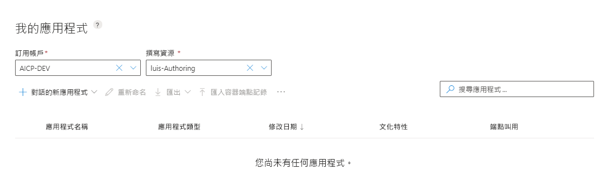

# 在 LUIS 入口網站中建立新的 LUIS 應用程式
有好幾種方法可建立 LUIS 應用程式。 您可以在 LUIS 入口網站中建立 LUIS 應用程式，或透過 LUIS 撰寫 [API](developer-reference-resource.md)。

[!INCLUDE [Uses preview portal](includes/uses-portal-preview.md)]

## 使用 LUIS 入口網站

您可以通過多種方式在預覽門戶中創建新應用：

* 從空的應用程式著手，並建立意圖、語句和實體。
* 從空的應用程式著手，並新增[預建網域](luis-how-to-use-prebuilt-domains.md)。
* 從已包含意圖、陳述`.lu`和`.json`實體的 或 檔中導入 LUIS 應用。

## 使用撰寫 API
您可使用撰寫 API 以數種方式建立新的應用程式：

* [添加應用程式](https://westeurope.dev.cognitive.microsoft.com/docs/services/luis-programmatic-apis-v3-0-preview/operations/5890b47c39e2bb052c5b9c2f)- 從空應用開始，然後創建意圖、陳述和實體。
* [添加預構建的應用程式](https://westeurope.dev.cognitive.microsoft.com/docs/services/luis-programmatic-apis-v3-0-preview/operations/59104e515aca2f0b48c76be5)- 從預構建的域開始，包括意圖、陳述和實體。  

 

[!INCLUDE [Sign in to LUIS](./includes/sign-in-process.md)]

## 在 LUIS 中建立新的應用程式

1. 在 **"我的應用"** 頁上，選擇您的訂閱，然後創作資源 **，然後創建**。 如果使用免費試用金鑰，請瞭解如何[創建創作資源](luis-how-to-azure-subscription.md#create-resources-in-the-azure-portal)。

    

1. 在對話方塊中，輸入應用程式的名稱，如`Pizza Tutorial`。

    

1. 選擇應用程式區域性，然後選擇 **"完成**"。 此時，描述和預測資源是可選的。 您可以隨時在門戶的 **"管理**"部分中設置。

    > [!NOTE]
    > 建立應用程式之後便無法變更文化特性 (Culture)。 

    創建應用後，LUIS 門戶將顯示 **"意向"** 清單，`None`並列出已為您創建的意圖。 現在，您有一個空應用。 
    
    > [!div class="mx-imgBorder"]
    > 

## 其他可用的操作

上下文工具列提供其他操作：

* 將應用程式重新命名
* 使用`.lu`或`.json`
* 將應用匯出`.lu`為 （對於`.json`[LUDown](https://github.com/microsoft/botbuilder-tools/tree/master/packages/Ludown)）或`.zip`（對於[LUIS 容器](luis-container-howto.md)）
* 導入容器終結點日誌，以查看終結點陳述
* 匯出終結點日誌，作為`.csv`離線分析。
* 刪除應用程式

## 後續步驟

如果應用設計包括意圖檢測，[請創建新的意圖](luis-how-to-add-intents.md)，並添加示例陳述。 如果應用設計僅提取資料，請向 None 意圖添加示例陳述，然後[創建實體](luis-how-to-add-example-utterances.md)，並將示例陳述與這些實體一起標記。 
