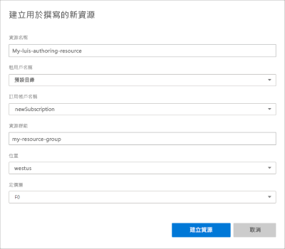

# <a name="steps-to-migrate-to-the-azure-authoring-resource"></a>遷移到 Azure 創作資源的步驟

從語言理解 （LUIS） 門戶中，遷移您擁有的所有應用以使用 Azure 創作資源。

## <a name="prerequisites"></a>Prerequisites

* **或者，** 通過匯出每個應用或使用匯出[API](https://westus.dev.cognitive.microsoft.com/docs/services/5890b47c39e2bb17b84a55ff/operations/5890b47c39e2bb052c5b9c40)從 LUIS 門戶的應用清單中備份應用。
* **可以選擇**，保存每個應用程式的協作者清單。 作為遷移過程的一部分，可以向所有協作者發送電子郵件。
* **必需**，您需要具有[Azure 訂閱](https://azure.microsoft.com/free/)。 訂閱過程的一部分確實需要計費資訊。 但是，當您使用 LUIS 時，可以使用免費 （F0） 定價層。 隨著使用量的增加，您最終可能會發現您需要付費層。

如果沒有 Azure 訂閱，[請註冊](https://azure.microsoft.com/free/)。

## <a name="access-the-migration-process"></a>訪問遷移過程

每週都會提示您遷移應用。 無需遷移即可取消此視窗。 如果要在下一個計畫期間之前遷移，可以從 LUIS 門戶頂部工具列上的**Azure**圖示開始遷移過程。

> [!div class="mx-imgBorder"]
> 

## <a name="app-owner-begins-the-migration-process"></a>應用擁有者開始遷移過程

如果您是任何 LUIS 應用的擁有者，則遷移過程可用。

1. 登錄到[LUIS 門戶](https://www.luis.ai)並同意使用條款。
1. 遷移快顯視窗允許您繼續遷移或以後遷移。 選擇 **"立即遷移**"。 如果選擇以後遷移，則有 9 個月的時間遷移到 Azure 中的新創作金鑰。

    

1. 或者，如果任何應用都有協作者，系統會提示他們**發送電子郵件**，讓他們知道遷移。 這是選擇性步驟。

    將帳戶遷移到 Azure 後，您的應用將不再可供協作者使用。

    對於每個協作者和應用程式，預設電子郵件應用程式將打開，並打開一封格式稍淺的電子郵件。 您可以在發送電子郵件之前對其進行編輯。

    電子郵件範本包括確切的應用 ID 和應用名稱。

    ```html
    Dear Sir/Madam,

    I will be migrating my LUIS account to Azure. Consequently, you will no longer have access to the following app:

    App Id: <app-ID-omitted>
    App name: Human Resources

    Thank you
    ```

1. 選擇通過選擇使用現有創作資源或創建新的創作資源來創建 LUIS 創作資源。

    > [!div class="mx-imgBorder"]
    > 

1. 在下一個視窗中，輸入資源金鑰資訊。 輸入資訊後，選擇 **"創建資源**"。 每個訂閱可以擁有 10 個免費創作資源。

    

    在**建立新的撰寫資源**時，請提供下列資訊：

    * **資源名稱** - 您選擇的自訂名稱，用來作為撰寫和預測端點查詢 URL 的一部分。
    * **租用戶** - Azure 訂用帳戶所關聯的租用戶。
    * **訂用帳戶名稱** - 要作為資源收費對象的訂用帳戶。
    * **資源群組** - 您選擇或建立的自訂資源群組名稱。 資源群組可讓您將 Azure 資源分組以方便存取和管理。
    * **位置** - 位置選擇是以**資源群組**選取項目作為依據。
    * **定價層** - 定價層會決定每秒和每月的交易上限。

1. 驗證您的創作資源，**然後立即遷移**。

    

1. 創建創作資源時，將顯示成功消息。 選擇 **"關閉"** 以關閉快顯視窗。

    

    "**我的應用"** 清單顯示遷移到新創作資源的應用。

    在 LUIS 門戶中繼續編輯應用不需要知道創作資源的金鑰。 如果您計畫以程式設計方式編輯應用，則需要創作鍵值。 這些值顯示在 LUIS 門戶中的 **"管理-> Azure 資源**"頁上，並且在資源 **"金鑰"** 頁上的 Azure 門戶中也可用。

1. 在訪問應用之前，請選擇訂閱和 LUIS 創作資源以查看可以創作的應用。

    


## <a name="app-contributor-begins-the-migration-process"></a>應用參與者開始遷移過程

按照與應用擁有者相同的步驟進行遷移。 該過程創建了一種新的類型`LUIS.Authoring`創作資源。

您需要遷移您的帳戶，以便將其添加為其他人擁有的遷移應用的貢獻者。

## <a name="after-the-migration-process-add-contributors-to-your-authoring-resource"></a>遷移過程後，向創作資源添加參與者

[!INCLUDE [Manage contributors for the Azure authoring resource for language understanding](./includes/manage-contributors-authoring-resource.md)]

[瞭解如何添加參與者](luis-how-to-collaborate.md)。

## <a name="troubleshooting-errors-with-the-migration-process"></a>通過遷移過程排除錯誤

如果在遷移過程中在`MissingSubscriptionRegistration`LUIS 門戶中收到帶有紅色通知列的錯誤，請在[Azure 門戶](luis-how-to-azure-subscription.md#create-resources-in-the-azure-portal)或[Azure CLI](luis-how-to-azure-subscription.md#create-resources-in-azure-cli)中創建認知服務資源。 瞭解有關[此錯誤原因](../../azure-resource-manager/templates/error-register-resource-provider.md#cause)的詳細資訊。

## <a name="next-steps"></a>後續步驟


* 查看有關創作和運行時金鑰[的概念](luis-concept-keys.md)
* 查看[如何分配金鑰](luis-how-to-azure-subscription.md)和添加[參與者](luis-how-to-collaborate.md)
