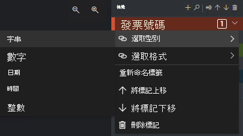

# <a name="train-a-form-recognizer-model-with-labels-using-the-sample-labeling-tool"></a>使用範例標籤工具，以標籤定型表單辨識器模型

在本快速入門中，您將搭配使用表單辨識器 REST API 與範例標籤工具，以手動加上標籤的資料定型自訂文件處理模型。 若要深入了解使用「表單辨識器」的受監督定型，請參閱概觀的[以標籤定型](../overview.md#train-with-labels)一節。

> [!VIDEO https://channel9.msdn.com/Shows/Docs-Azure/Azure-Form-Recognizer/player]

## <a name="prerequisites"></a>必要條件

若要完成此快速入門，您必須：

* Azure 訂用帳戶 - [建立免費帳戶](https://azure.microsoft.com/free/cognitive-services)
* 擁有 Azure 訂用帳戶之後，在 Azure 入口網站中<a href="https://ms.portal.azure.com/#create/Microsoft.CognitiveServicesFormRecognizer"  title="建立表單辨識器資源"  target="_blank">建立表單辨識器資源<span class="docon docon-navigate-external x-hidden-focus"></span></a>，以取得您的金鑰和端點。 在其部署後，按一下 [前往資源]。
    * 您需要來自所建立資源的金鑰和端點，以將應用程式連線至表單辨識器 API。 您稍後會在快速入門中將金鑰和端點貼到下列程式碼中。
    * 您可以使用免費定價層 (`F0`) 來試用服務，之後可升級至付費層以用於實際執行環境。
* 至少有六個相同類型的表單。 您將使用此資料來定型模型和測試表單。 您可使用 [範例資料集](https://go.microsoft.com/fwlink/?linkid=2090451) (下載 *sample_data .zip* 並將其解壓縮) 來進行本快速入門。 將訓練檔案上傳至標準效能層級 Azure 儲存體帳戶中 Blob 儲存體容器的根目錄。

## <a name="create-a-form-recognizer-resource"></a>建立表單辨識器資源

[!INCLUDE [create resource](../includes/create-resource.md)]

## <a name="try-it-out"></a>試做

若要線上試用表單辨識器的範例標籤工具，請移至 [FOTT 網站](https://fott-preview.azurewebsites.net/)。

# <a name="v20"></a>[v2.0](#tab/v2-0)
> [!div class="nextstepaction"]
> [試用預建模型](https://fott.azurewebsites.net/)

# <a name="v21-preview"></a>[v2.1 預覽](#tab/v2-1)
> [!div class="nextstepaction"]
> [試用預建模型](https://fott-preview.azurewebsites.net/)

---

您需要有 Azure 訂用帳戶 ([免費建立一個](https://azure.microsoft.com/free/cognitive-services)) 和[表單辨識器資源](https://ms.portal.azure.com/#create/Microsoft.CognitiveServicesFormRecognizer)端點和金鑰，才能試用表單辨識器服務。 


## <a name="set-up-the-sample-labeling-tool"></a>設定範例標籤工具

您將使用 Docker 引擎來執行範例標籤工具。 請依照下列步驟來設定 Docker 容器。 如需 Docker 和容器基本概念的入門，請參閱 [Docker 概觀](https://docs.docker.com/engine/docker-overview/) \(英文\)。

> [!TIP]
> OCR 表單標籤工具也可作為 GitHub 上的開放原始碼專案。 此工具是使用R eact + Redux 建立的 TypeScript Web 應用程式。 若要深入了解或參與，請參閱 [OCR 表單標籤工具](https://github.com/microsoft/OCR-Form-Tools/blob/master/README.md#run-as-web-application)存放庫。 若要線上試用此工具，請移至 [FOTT 網站](https://fott.azurewebsites.net/)。   

1. 首先，在主機電腦上安裝 Docker。 本指南將說明如何使用本機電腦作為主機。 如果您想要在 Azure 中使用 Docker 主機服務，請參閱[部署範例標籤工具](../deploy-label-tool.md)操作指南。 

   主機電腦必須符合下列硬體需求：

    | 容器 | 最小值 | 建議|
    |:--|:--|:--|
    |範例標籤工具|2 核心、4 GB 記憶體|4 核心，8 GB 記憶體|

   遵循您作業系統的適當指示，在電腦上安裝 Docker： 
   * [Windows](https://docs.docker.com/docker-for-windows/)
   * [macOS](https://docs.docker.com/docker-for-mac/)
   * [Linux](https://docs.docker.com/install/)


1. 使用 `docker pull` 命令取得範例標籤工具容器。

    # <a name="v20"></a>[v2.0](#tab/v2-0)    
    ```
    docker pull mcr.microsoft.com/azure-cognitive-services/custom-form/labeltool
    ```
    # <a name="v21-preview"></a>[v2.1 預覽](#tab/v2-1)    
    ```
    docker pull mcr.microsoft.com/azure-cognitive-services/custom-form/labeltool:latest-preview
    ```

    ---

1. 現在您已準備就緒，可使用 `docker run` 執行容器。

    # <a name="v20"></a>[v2.0](#tab/v2-0)    
    ```
    docker run -it -p 3000:80 mcr.microsoft.com/azure-cognitive-services/custom-form/labeltool eula=accept
    ```
    # <a name="v21-preview"></a>[v2.1 預覽](#tab/v2-1)    
    ```
    docker run -it -p 3000:80 mcr.microsoft.com/azure-cognitive-services/custom-form/labeltool:latest-preview eula=accept    
    ```

    --- 

   此命令會讓範例標籤工具可透過網頁瀏覽器來使用。 移至 `http://localhost:3000`。

> [!NOTE]
> 您也可以使用表單辨識器 REST API 為文件加上標籤及定型模型。 若要使用此 REST API 進行定型和分析，請參閱[使用 REST API 和 Python以標籤定型](./python-labeled-data.md)。

## <a name="set-up-input-data"></a>設定輸入資料

首先，請確定所有訓練文件都有相同的格式。 如果您的表單有多種格式，請根據共同的格式將這些表單組織成子資料夾。 在定型時，您必須將 API 導向子資料夾。

### <a name="configure-cross-domain-resource-sharing-cors"></a>設定跨網域資源共用 (CORS)

在您的儲存體帳戶上啟用 CORS。 在 Azure 入口網站中選取您的儲存體帳戶，然後按一下左窗格中的 [CORS] 索引標籤。 在底線上填入下列值。 然後，按一下頂端的 [儲存]。

* 允許的原始來源 = * 
* 允許的方法 = \[全選\]
* 允許的標頭 = *
* 公開的標頭 = * 
* 存留期上限 = 200

> [!div class="mx-imgBorder"]
> 

## <a name="connect-to-the-sample-labeling-tool"></a>連線至範例標籤工具

範例標籤工具會連線至來源 (原始表單所在之處) 和目標 (此工具匯出所建立標籤和輸出資料時所選擇的目的地)。

您可以跨專案設定和共用連線。 連線會使用可延伸提供者模型，因此您可以輕鬆地新增來源/目標提供者。

若要建立新的連線，請按一下左側瀏覽列中的 [新增連線] (插頭) 圖示。

在欄位中填入下列值：

* **顯示名稱** - 連線的顯示名稱。
* **描述** - 您的專案描述。
* **SAS URL** - Azure Blob 儲存體容器的共用存取簽章 (SAS) URL。 若要擷取 SAS URL，請開啟 Microsoft Azure 儲存體總管、以滑鼠右鍵按一下您的容器，然後選取 [取得共用存取簽章]。 請將到期時間設定為您用完服務後的時間。 確定 [讀取]、[寫入]、[刪除] 和 [列出] 權限均已勾選，然後按一下 [建立]。 然後，複製 [URL] 區段的值。 其格式應該為：`https://<storage account>.blob.core.windows.net/<container name>?<SAS value>`。

:::image type="content" source="../media/label-tool/connections.png" alt-text="範例標籤工具的連線設定。":::


## <a name="create-a-new-project"></a>建立新專案

在範例標籤工具中，專案會儲存您的組態和設定。 建立新的專案，並在欄位中填入下列值：

* **顯示名稱** - 專案的顯示名稱
* **安全性權杖** - 某些專案設定可能會包含敏感值，例如 API 金鑰或其他共用秘密。 每個專案都會產生可用來加密/解密敏感專案設定的安全性權杖。 您可以按一下左側瀏覽列底部的齒輪圖示，在 [應用程式設定] 中找到安全性權杖。
* **來源連線** - 您在先前的步驟中建立而要在此專案中使用的 Azure Blob 儲存體連線。
* **資料夾路徑** - 選擇性 - 如果您的來源表單位於 Blob 容器的資料夾中，請在此處指定資料夾名稱
* **表單辨識器服務 URI** - 您的表單辨識器端點 URL。
* **API 金鑰** - 您的表單辨識器訂用帳戶金鑰。
* **描述** - 選擇性 - 專案描述

:::image type="content" source="../media/label-tool/new-project.png" alt-text="範例標籤工具上的新增專案頁面。":::

## <a name="label-your-forms"></a>為表單加上標籤

當您建立或開啟專案時，主要的標籤編輯器視窗隨即開啟。 標籤編輯器由三個部分組成：

* 可調整大小的預覽窗格，其中包含來自來源連線的可捲動表單清單。
* 可讓您套用標籤的主要編輯器窗格。
* 可讓使用者修改、鎖定、重新排列和刪除標籤的標籤編輯器窗格。 

### <a name="identify-text-elements"></a>識別文字元素

按一下左窗格上的 [在所有檔案上執行 OCR]，以取得每份文件的文字版面配置資訊。 標籤工具會在每個文字元素周圍繪製週框方塊。

其也會顯示哪些資料表已自動擷取。 按一下文件左側的 [資料表/格線] 圖示，以查看已擷取的資料表。 因為本快速入門會自動擷取資料表內容，所以我們不會為資料表內容加上標籤，而是會仰賴自動化擷取。

:::image type="content" source="../media/label-tool/table-extraction.png" alt-text="範例標籤工具中的資料表視覺效果。":::

### <a name="apply-labels-to-text"></a>將標籤套用至文字

接下來，您將建立標記 (標籤)，並將其套用至要讓模型辨識的文字元素。

# <a name="v20"></a>[v2.0](#tab/v2-0)  
1. 首先，使用標記編輯器窗格建立您要識別的標記。
   1. 按一下 **+** 以建立新標記。
   1. 輸入標記名稱。
   1. 按 Enter 以儲存標記。
1. 在主要編輯器中，按一下以從醒目提示的文字元素中選取字組。
1. 按一下您要套用的標記，或按對應的鍵盤按鍵。 數字鍵會指派為前 10 個標記的快速鍵。 您可以使用標籤編輯器窗格中的向上和向下箭號圖示來重新排序標籤。
    > [!Tip]
    > 當您要標記表單時，請記住下列秘訣。
    > * 您只能對每個選取的文字元素套用一個標記。
    > * 每個標記只能在每頁套用一次。 如果某個值在相同表單上出現多次，請為每個執行個體建立不同的標記。 例如："invoice# 1"、"invoice# 2" 等等。
    > * 標記不能跨越頁面。
    > * 標示出現在表單上的值；請勿嘗試將值分割成具有兩個不同標記的兩個部分。 例如，位址欄位應該以單一標記標示，即使其橫跨多行也一樣。
    > * 請勿在標記的欄位中包含索引鍵，&mdash; 只能包含值。
    > * 系統應會自動偵測資料表資料，而且將會在最終輸出 JSON 檔案中提供。 不過，如果模型無法偵測所有資料表資料，您也可以手動標記這些欄位。 以不同的標籤標記資料表中的每個資料格。 如果您的表單具有不同資料列數目的資料表，請務必標記至少一個具有最大可能資料表的表單。
    > * 使用 **+** 右邊的按鈕來搜尋、重新命名、重新排序和刪除您的標記。
    > * 若要移除已套用的標記，而不刪除標記本身，請在文件檢視上選取加上標記的矩形，然後按下 Delete 鍵。


# <a name="v21-preview"></a>[v2.1 預覽](#tab/v2-1) 
1. 首先，使用標記編輯器窗格建立您要識別的標記。
   1. 按一下 **+** 以建立新標記。
   1. 輸入標記名稱。
   1. 按 Enter 以儲存標記。
1. 在主要編輯器中，按一下以從醒目提示的文字元素中選取字組。 在 _v2.1 preview.2_ 中，您也可以按一下以選取 [選取標記] (如選項按鈕和核取方塊) 來作為索引鍵值組。 表單辨識器會識別選取標記是「已選取」或「未選取」作為值。
1. 按一下您要套用的標記，或按對應的鍵盤按鍵。 數字鍵會指派為前 10 個標記的快速鍵。 您可以使用標籤編輯器窗格中的向上和向下箭號圖示來重新排序標籤。
    > [!Tip]
    > 當您要標記表單時，請記住下列秘訣。
    > * 您只能對每個選取的文字元素套用一個標記。
    > * 每個標記只能在每頁套用一次。 如果某個值在相同表單上出現多次，請為每個執行個體建立不同的標記。 例如："invoice# 1"、"invoice# 2" 等等。
    > * 標記不能跨越頁面。
    > * 標示出現在表單上的值；請勿嘗試將值分割成具有兩個不同標記的兩個部分。 例如，位址欄位應該以單一標記標示，即使其橫跨多行也一樣。
    > * 請勿在標記的欄位中包含索引鍵，&mdash; 只能包含值。
    > * 系統應會自動偵測資料表資料，而且將會在最終輸出 JSON 檔案中提供。 不過，如果模型無法偵測所有資料表資料，您也可以手動標記這些欄位。 以不同的標籤標記資料表中的每個資料格。 如果您的表單具有不同資料列數目的資料表，請務必標記至少一個具有最大可能資料表的表單。
    > * 使用 **+** 右邊的按鈕來搜尋、重新命名、重新排序和刪除您的標記。
    > * 若要移除已套用的標記，而不刪除標記本身，請在文件檢視上選取加上標記的矩形，然後按下 Delete 鍵。


---

:::image type="content" source="../media/label-tool/main-editor-2-1.png" alt-text="範例標籤工具的主要編輯器視窗。":::


請遵循上述步驟，至少為您表單中的五個表單加上標籤。

### <a name="specify-tag-value-types"></a>指定標記值類型

(選擇性) 您可以為每個標記設定預期的資料類型。 開啟標記右邊的捷徑功能表，然後從功能表中選取類型。 這項功能可讓偵測演算法做出一些可改善文字偵測精確度的假設。 也可確保在最終 JSON 輸出中，會以標準化格式傳回偵測到的值。 

> [!div class="mx-imgBorder"]
> 

目前支援下列值類型和變化：
* `string`
    * 預設值、`no-whitespaces`、`alphanumeric`
* `number`
    * 預設值、`currency`
* `date` 
    * 預設值、`dmy`、`mdy`、`ymd`
* `time`
* `integer`
* `selectionMark` – _v2.1-preview.1 中的新功能！_

> [!NOTE]
> 請參閱適用於日期格式的規則：
> 
> 您必須指定格式 (`dmy`、`mdy`、`ymd`)，才可使用日期格式。
>
> 下列字元可用來作為日期分隔符號：`, - / . \`。 空白字元不能用來作為分隔符號。 例如：
> * 01,01,2020
> * 01-01-2020
> * 01/01/2020
>
> 日和月份可以寫成一或兩個數字，年份可以是兩個或四個數字：
> * 1-1-2020
> * 1-01-20
>
> 如果日期字串有八位數，則分隔符號為選用：
> * 01012020
> * 01 01 2020
>
> 月份也可以撰寫為其完整或簡短名稱。 如果使用名稱，分隔符號為選用字元。 不過，這種格式可能比其他格式更不容易辨識。
> * 01/Jan/2020
> * 01Jan2020
> * 01 Jan 2020

## <a name="train-a-custom-model"></a>定型自訂模型

按一下左窗格上的「訓練」圖示，以開啟 [訓練] 頁面。 然後，按一下 [訓練] 按鈕，開始對模型進行定型。 定型程序完成後，您會看到下列資訊：

* **模型識別碼** - 已建立並定型之模型的識別碼。 每個定型呼叫都會以本身的識別碼建立新的模型。 請將此字串複製到安全之處；如果您想要透過 [REST API](./curl-train-extract.md) 或[用戶端程式庫](./client-library.md)進行預測呼叫，就會需要此字串。
* **平均精確度** - 模型的平均精確度。 您可以為其他表單加上標籤並再次定型以建立新的模型，進而改善模型的精確度。 建議您先為五個表單加上標籤，然後再視需要新增更多表單。
* 標籤的清單，以及每個標籤的預估精確度。


:::image type="content" source="../media/label-tool/train-screen.png" alt-text="定型檢視。":::

定型完成後，請查看 [平均精確度] 值。 如果該值偏低，您應新增更多輸入文件，並重複上述步驟。 您已加上標籤的文件會保留在專案索引中。

> [!TIP]
> 您也可以使用 REST API 呼叫來執行定型程序。 若要了解其執行方法，請參閱[使用 Python 以標籤定型](./python-labeled-data.md)。

## <a name="compose-trained-models"></a>撰寫已定型的模型

# <a name="v20"></a>[v2.0](#tab/v2-0)  

此功能目前已在 v2.1 預覽中提供。 預覽。 

# <a name="v21-preview"></a>[v2.1 預覽](#tab/v2-1) 

使用「模型撰寫」時，您最多可以將 100 個模型撰寫為單一模型識別碼。 當您使用此已撰寫模型的識別碼呼叫分析時，表單辨識器會先將您所提交的表單分類，使其符合最相符的模型，然後再傳回該模型的結果。 當傳入表單可能屬於數個範本之一時，這會很有用。

若要在範例標籤工具中撰寫模型，請按一下左側的 [模型撰寫 (合併箭號)] 圖示。 在左側，選取您想要一起撰寫的模型。 具有箭號圖示的模型是已經撰寫好的模型。 按一下 [撰寫] 按鈕。 在快顯視窗中，為新撰寫的模型命名，然後按一下 [撰寫]。 當作業完成時，新撰寫的模型應該就會出現在清單中。 

:::image type="content" source="../media/label-tool/model-compose.png" alt-text="模型撰寫 UX 檢視。":::

---

## <a name="analyze-a-form"></a>分析表單 

按一下左側的「預測 (燈泡)」圖示，以測試您的模型。 上傳還未用於定型程序的表單文件。 然後按一下右側的 [預測] 按鈕，以取得表單的索引鍵/值預測。 此工具會將標籤套用到週框方塊中，且會報告每個標籤的信賴度。

> [!TIP]
> 您也可以使用 REST 呼叫來執行分析 API。 若要了解其執行方法，請參閱[使用 Python 以標籤定型](./python-labeled-data.md)。

## <a name="improve-results"></a>改善結果

根據報告的精確度，您可以進一步定型以改善模型。 完成預測後，請查看每個套用標籤的信賴值。 如果平均精確度的訓練值很高，但信賴分數很低 (或結果不正確)，您應將用於預測的檔案新增至定型集，並為其加上標籤，然後再次定型。

如果所分析的文件與用於定型的文件不同，則報告的平均精確度、信賴分數和實際精確度可能會不一致。 請注意，有些文件在常人看來會是類似的，但 AI 模型則會看出其不同之處。 例如，假設您使用具有兩種變化的表單類型來定型，其中，定型集由 20% 的變化 A 和 80% 的變化 B 所組成。在預測期間，變化 A 文件的信賴分數可能會較低。

## <a name="save-a-project-and-resume-later"></a>儲存專案並於稍後繼續執行

若要另擇時間或在另一個瀏覽器中繼續執行專案，您必須儲存專案的安全性權杖，並於稍後重新輸入。 

### <a name="get-project-credentials"></a>取得專案認證
移至您的專案設定頁面 (滑杆圖示)，並記下安全性權杖名稱。 然後，移至您的應用程式設定 (齒輪圖示)，此處會顯示目前瀏覽器執行個體中的所有安全性權杖。 找出專案的安全性權杖，並將其名稱和金鑰值複製到安全的位置。

### <a name="restore-project-credentials"></a>還原專案認證
想要繼續執行專案時，您必須先建立對相同 Blob 儲存體容器的連線。 請重複進行上述步驟來執行此動作。 然後，移至應用程式設定頁面 (齒輪圖示)，並確認您專案的安全性權杖位於該處。 如果不在該處，請新增安全性權杖，並以其覆寫先前步驟中的權杖名稱和金鑰。 然後，按一下 [儲存設定]。 

### <a name="resume-a-project"></a>繼續執行專案

最後，移至主頁面 (房屋圖示)，然後按一下 [開啟雲端專案]。 接著，選取 Blob 儲存體連線，再選取專案的 *.fott* 檔案。 應用程式會載入所有專案的設定，因為它具有安全性權杖。

## <a name="next-steps"></a>後續步驟

在本快速入門中，您已了解如何使用表單辨識器範例標籤工具，以手動加上標籤的資料為模型定型。 如果您想要建置自己的公用程式來為定型資料加上標籤，請使用處理已加上標籤資料定型的 REST API。

> [!div class="nextstepaction"]
> [使用 Python 以標籤定型](./python-labeled-data.md)

* [什麼是表單辨識器？](../overview.md)
* [表單辨識器用戶端程式庫快速入門](client-library.md)
