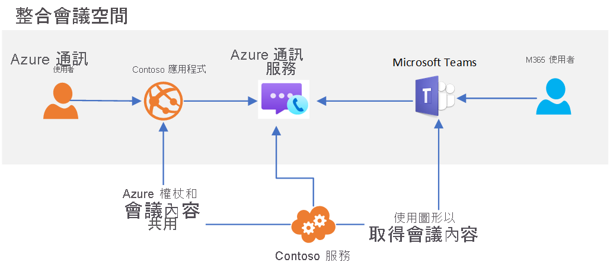

# 小組互通性

[!INCLUDE [Private Preview Notice](../../includes/private-preview-include.md)]

Azure 通訊服務可用來建置能與 Microsoft Teams 互動的自訂會議體驗。 通訊服務解決方案的使用者可以透過語音、影片和螢幕共用來與 Teams 參與者互動。

此互通性可讓您建立自訂 Azure 應用程式，以將使用者連線到 Teams 會議。 自訂應用程式的使用者不需要有 Azure Active Directory 身分識別或 Teams 授權就能體驗這項功能。 這非常適合用於將員工 (可能熟悉 Teams) 和外部使用者 (使用自訂應用程式體驗) 一起帶入順暢的會議體驗。 這可讓您建置與下列類似的體驗：

1. 員工使用 Teams 來排程會議
2. 您的自訂通訊服務應用程式使用 Microsoft Graph API 來存取會議詳細資料
3. 會議詳細資料會透過您的自訂應用程式與外部使用者共用
4. 外部使用者使用您的自訂應用程式來加入 Teams 會議 (透過通訊服務通話用戶端程式庫)

此使用案例的高階架構看起來像這樣： 

雖然某些 Teams 會議功能 (例如舉手的人、一起模式和分組討論室) 僅適用於 Teams 使用者，但您的自訂應用程式將可存取會議的核心音訊、影片和螢幕共用功能。

當通訊服務使用者加入 Teams 會議時，系統會向 Teams 使用者顯示透過通話用戶端程式庫所提供的顯示名稱。 否則，系統會將通訊服務使用者視為 Teams 中的匿名使用者。 您的自訂應用程式應該考慮採用使用者驗證和其他安全性措施，以保護 Teams 會議。 請留意讓匿名使用者加入會議的安全性含意，並使用 [Teams 安全性指南](/microsoftteams/teams-security-guide#addressing-threats-to-teams-meetings)來設定匿名使用者可用的功能。

只要在[會議設定](/microsoftteams/meeting-settings-in-teams)中啟用匿名加入，通訊服務使用者就可以加入已排程的 Teams 會議。

## 政府雲端 (GCC) 中的 Teams
目前不允許使用 [Microsoft 365 政府雲端 (GCC)](https://docs.microsoft.com/MicrosoftTeams/plan-for-government-gcc) 的 Teams 部署使用 Azure 通訊服務互通性。 

## 後續步驟

> [!div class="nextstepaction"]
> [將您的通話應用程式加入至小組會議](../../quickstarts/voice-video-calling/get-started-teams-interop.md)
