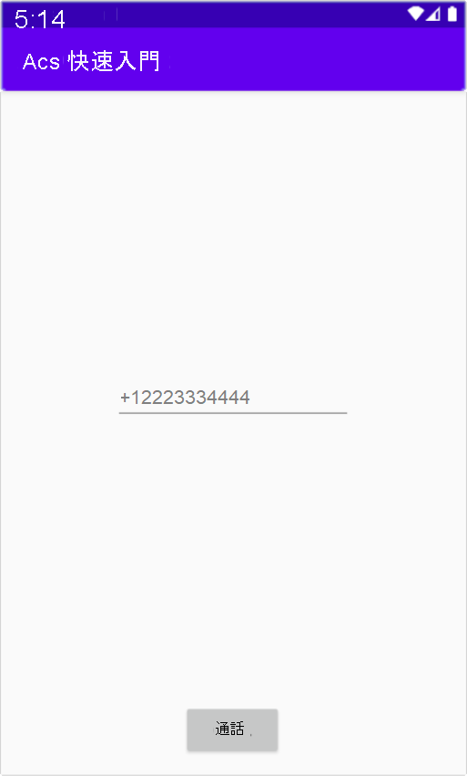

[!INCLUDE [Emergency Calling Notice](../../../includes/emergency-calling-notice-include.md)]
## <a name="prerequisites"></a>必要條件

- 具有有效訂用帳戶的 Azure 帳戶。 [免費建立帳戶](https://azure.microsoft.com/free/?WT.mc_id=A261C142F)。 
- 已部署通訊服務資源。 [建立通訊服務資源](../../create-communication-resource.md)。
- 在通訊服務資源中取得的電話號碼。 [如何取得電話號碼](../../telephony-sms/get-phone-number.md)。
- 用來啟用通話用戶端的 `User Access Token`。 如需[如何取得 `User Access Token`](../../access-tokens.md) 的詳細資訊
- 完成[開始將通話新增至應用程式](../getting-started-with-calling.md)的快速入門

### <a name="prerequisite-check"></a>先決條件檢查

- 若要檢視與您通訊服務資源相關聯的電話號碼，請登入 [Azure 入口網站](https://portal.azure.com/)、尋找您的通訊服務資源，然後從左側瀏覽窗格開啟 [電話號碼] 索引標籤。

## <a name="setting-up"></a>設定

### <a name="add-pstn-functionality-to-your-app"></a>將 PSTN 功能新增至您的應用程式

修改 **MainActivity.java**，將 `PhoneNumber` 類型新增至您的應用程式：


```java
import com.azure.android.communication.common.PhoneNumber;
```

<!--
> [!TBD]
> Namespace based on input from Komivi Agbakpem. But it does not correlates with other use namespaces in Calling Quickstart. E.g: "com.azure.communication.calling.CommunicationUser" or "com.azure.communication.common.client.CommunicationUserCredential". Double-chek this.
-->

## <a name="start-a-call-to-phone"></a>啟動通話

指定您從通訊服務資源內取得的電話號碼。 這會用來啟動通話：

> [!WARNING]
> 請注意，電話號碼應以 E. 164 國際標準格式提供。 (例如：+12223334444)

修改 **MainActivity.java** 中的 `startCall()` 事件處理常式，使其處理電話通話：

```java
    private void startCall() {
        EditText calleePhoneView = findViewById(R.id.callee_id);
        String calleePhone = calleePhoneView.getText().toString();
        PhoneNumber callerPhone = new PhoneNumber("+12223334444");
        StartCallOptions options = new StartCallOptions();
        options.setAlternateCallerId(callerPhone);
        options.setVideoOptions(new VideoOptions(null));
        call = agent.call(
                getApplicationContext(),
                new PhoneNumber[] {new PhoneNumber(calleePhone)},
                options);
    }
```

## <a name="launch-the-app-and-call-the-echo-bot"></a>啟動應用程式並呼叫 Echo Bot

應用程式現在可以使用工具列上的 [執行應用程式] 按鈕 (Shift+F10) 來啟動。 您可以在新增的文字欄位中提供電話號碼，並按一下 [通話] 按鈕，以進行通話。
> [!WARNING]
> 請注意，電話號碼應以 E. 164 國際標準格式提供。 (例如：+12223334444)


