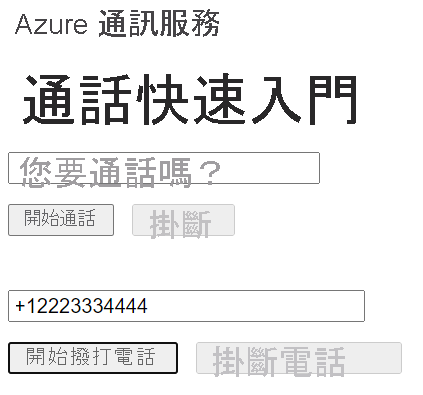

[!INCLUDE [Emergency Calling Notice](../../../includes/emergency-calling-notice-include.md)]
## <a name="prerequisites"></a>必要條件

- 具有有效訂用帳戶的 Azure 帳戶。 [免費建立帳戶](https://azure.microsoft.com/free/?WT.mc_id=A261C142F)。 
- 已部署通訊服務資源。 [建立通訊服務資源](../../create-communication-resource.md)。
- 在通訊服務資源中取得的電話號碼。 [如何取得電話號碼](../../telephony-sms/get-phone-number.md)。
- 用來啟用通話用戶端的 `User Access Token`。 如需[如何取得 `User Access Token`](../../access-tokens.md) 的詳細資訊
- 完成[開始將通話新增至應用程式](../getting-started-with-calling.md)的快速入門

### <a name="prerequisite-check"></a>先決條件檢查

- 若要檢視與您通訊服務資源相關聯的電話號碼，請登入 [Azure 入口網站](https://portal.azure.com/)、尋找您的通訊服務資源，然後從左側瀏覽窗格開啟 [電話號碼] 索引標籤。
- 您可以使用適用於 JavaScript 的 Azure 通訊服務通話用戶端程式庫，建置並執行您的應用程式：

```console
npx webpack-dev-server --entry ./client.js --output bundle.js
```

## <a name="setting-up"></a>設定

### <a name="add-pstn-functionality-to-your-app"></a>將 PSTN 功能新增至您的應用程式

使用電話撥號控制項擴充您的配置。

將此程式碼放在 **index.html** 的 `<body />` 區段結尾，在 `<script />` 標籤之前：

```html
<input 
  id="callee-phone-input"
  type="text"
  placeholder="Phone number you would like to dial"
  style="margin-bottom:1em; width: 230px;"
/>
<div>
  <button id="call-phone-button" type="button">
    Start Phone Call
  </button>
  &nbsp;
  <button id="hang-up-phone-button" type="button" disabled="true">
    Hang Up Phone Call
  </button>
</div>
```

使用電話語音功能擴充您的應用程式邏輯。

將此程式碼新增至 **client.js**：

```javascript
const calleePhoneInput = document.getElementById("callee-phone-input");
const callPhoneButton = document.getElementById("call-phone-button");
const hangUpPhoneButton = document.getElementById("hang-up-phone-button");
```

## <a name="start-a-call-to-phone"></a>啟動通話

指定您在通訊服務資源中取得的電話號碼，將用來啟動通話：
> [!WARNING]
> 請注意，電話號碼應以 E. 164 國際標準格式提供。 (例如：+12223334444)

新增事件處理常式，以在按一下 `callPhoneButton` 時，對您提供的電話號碼起始通話：


```javascript
callPhoneButton.addEventListener("click", () => {
  // start a call to phone
  const phoneToCall = calleePhoneInput.value;
  call = callAgent.call(
    [{phoneNumber: phoneToCall}], { alternateCallerId: {phoneNumber: '+18336528005'}
  });

  // toggle button states
  hangUpPhoneButton.disabled = false;
  callPhoneButton.disabled = true;
});
```

## <a name="end-a-call-to-phone"></a>結束通話

新增事件接聽程式，以在按一下 `hangUpPhoneButton` 時結束目前的通話：

```javascript
hangUpPhoneButton.addEventListener("click", () => {
  // end the current call
  call.hangUp({
    forEveryone: true
  });

  // toggle button states
  hangUpPhoneButton.disabled = true;
  callPhoneButton.disabled = false;
});
```

`forEveryone` 屬性會結束所有通話參與者的通話。

## <a name="run-the-code"></a>執行程式碼

使用 `webpack-dev-server` 來建置並執行您的應用程式。 執行下列命令，在本機 Web 伺服器上組合應用程式主機：


```console
npx webpack-dev-server --entry ./client.js --output bundle.js
```

開啟瀏覽器並巡覽至 `http://localhost:8080/`。 您應該會看見下列內容：




您可以在新增的文字欄位中提供電話號碼，並按一下 [啟動通話] 按鈕，以對實際的電話號碼進行通話。

> [!WARNING]
> 請注意，電話號碼應以 E. 164 國際標準格式提供。 (例如：+12223334444)
