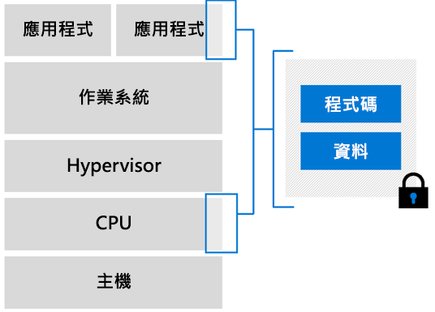

# Azure 機密計算虛擬機器 (Vm) 總覽

Azure 是在虛擬化環境中提供機密運算的第一個雲端提供者。 我們開發了虛擬機器，作為硬體與您應用程式之間的抽象層。 您可大規模執行工作負載，並可使用備援和可用性選項。  

## 已啟用 Intel SGX 的虛擬機器

在 Azure 機密運算虛擬機器中，CPU 硬體的一部分會保留給您應用程式中一部分的程式碼和資料使用。 此限制的部分就是記憶體保護區。 

Azure 機密運算基礎結構目前由虛擬機器 (VM) 的專用 SKU 組成。 這些 VM 會在具有 Software Guard Extension (Intel SGX) 的 Intel 處理器上執行。 [Intel SGX](https://intel.com/sgx) 是一種元件，可讓我們以機密運算增加保護。 

現今，Azure 提供以 Intel SGX 技術為基礎的 [DCsv2 系列](https://docs.microsoft.com/azure/virtual-machines/dcv2-series)，以便建立以硬體為基礎的記憶體保護區。 您可建置以安全記憶體保護區為基礎的應用程式，以在 DCsv2 系列的 VM 中執行，進而保護您的應用程式資料和使用中的程式碼。 

[深入](virtual-machine-solutions.md) 瞭解如何使用以硬體為基礎的受信任記憶體保護區來部署 Azure 機密計算虛擬機器。

## 記憶體保護區

記憶體保護區是硬體處理器和記憶體的安全部分。 即使使用偵錯工具，也沒有辦法檢視記憶體保護區內的資料或程式碼。 如果不受信任的程式碼嘗試修改記憶體保護區記憶體中的內容，則會停用環境並拒絕作業。

基本上，請將記憶體保護區視為一個安全箱。 您可將已加密的程式碼和資料放入這個箱子中。 從箱子外部，您看不到任何東西。 您可為記憶體保護區提供可解密資料的金鑰，然後在從記憶體保護區送出之前，再次處理和加密資料。

每個記憶體保護區都有一組加密頁面快取 (EPC) ，可決定每個記憶體保護區可以保留的記憶體數量。 較大的 DCsv2 虛擬機器有更多 EPC 記憶體。 閱讀 [ [DCsv2 規格](https://docs.microsoft.com/azure/virtual-machines/dcv2-series) ] 頁面，以瞭解每個 VM 大小的最大 EPC。

### 開發要在記憶體保護區內部執行的應用程式
開發應用程式時，您可使用[軟體工具](application-development.md)來防護記憶體保護區內的部分程式碼和資料。 這些工具可確保受信任環境以外的任何人都無法檢視或修改您的程式碼和資料。 

## 後續步驟
- 閱讀在 Azure 機密計算虛擬機器上部署解決方案的[最佳作法](virtual-machine-solutions.md)。
- [部署 DCsv2-Series 的虛擬機器](quick-create-portal.md)
- 使用 OE SDK[開發可感知記憶體保護區的應用程式](application-development.md)