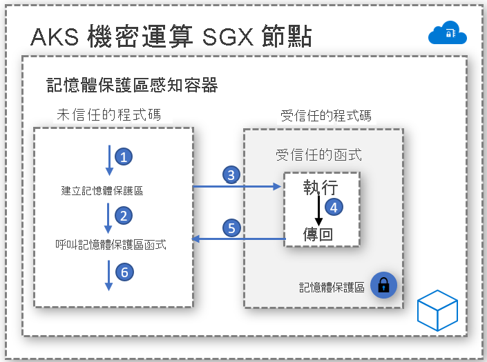

# 記憶體保護區感知容器

記憶體保護區是受保護的記憶體區域，可提供資料和程式碼執行的機密性。 這是受信任執行環境 (TEE) 的執行個體，受到硬體的保護。 AKS 上的機密運算節點會使用 [Intel Software Guard Extensions (SGX)](https://software.intel.com/sgx)，在每個容器應用程式之間的節點中建立隔離的記憶體保護區環境。

就像 Intel SGX 虛擬機器一樣，為了在記憶體保護區中執行而開發的容器應用程式，會有兩個元件：

- 不受信任的元件 (稱為主機)，以及
- 受信任的元件 (稱為記憶體保護區)。

記憶體保護區感知容器應用程式架構可讓您以最大的程度掌控實作，同時將記憶體保護區中保持較低的程式碼使用量。 盡可能減少在記憶體保護區中執行的程式碼，有助於縮小受攻擊面區域。   

## 啟用程式

### 開啟記憶體保護區 SDK
Open Enclave SDK 是一個跨硬體的開放原始碼程式庫，可用來開發採用硬體型受信任執行環境的 C、C++ 應用程式。 目前的實作提供 Intel SGX 的支援，且對 [Arm TrustZone 上的 OP-TEE OS](https://optee.readthedocs.io/en/latest/general/about.html) 提供預覽支援。

請從[這裡](https://github.com/openenclave/openenclave/tree/master/docs/GettingStartedDocs)開始使用 Open Enclave 型容器應用程式

### Intel SGX SDK
Intel 會維護可用來為 Linux 和 Windows 容器工作負載建置 SGX 應用程式的軟體開發工具組。 AKS 機密運算節點目前不支援 Windows 容器。

請從[這裡](https://software.intel.com/content/www/us/en/develop/topics/software-guard-extensions/sdk.html)開始使用 Intel SGX 型應用程式

### 機密聯盟架構 (CCF)
機密聯盟架構 (CCF) 是一個開放原始碼架構，可用來建置新類別的安全、高可用性、著重於多方運算和資料的高效能應用程式。 CCF 可實現符合重要企業需求的大規模機密網路 — 提供適當機制，來加速生產及促進企業採用聯盟型區塊鏈和多方運算技術。

請從[這裡](https://github.com/Microsoft/CCF)開始使用 Azure 機密運算和 CCF

### 機密推斷 ONNX 執行階段

開放原始碼記憶體保護區型 ONNX 執行階段會在用戶端與推斷服務之間建立安全的通道 - 確保要求或回應都不會離開安全的記憶體保護區。 

此解決方案可讓您導入現有的 ML 定型模型，並機密地加以執行，同時透過證明和驗證提供用戶端與伺服器之間的信任。 

請從[這裡](https://aka.ms/confidentialinference)開始將 ML 模型隨即轉移至 ONNX 執行階段

## 容器範例實作

[AKS 上適用於記憶體保護區感知容器的 Azure 範例](https://github.com/Azure-Samples/enclave-aware-container-samples)

<!-- LINKS - external -->
[Azure Attestation]: https://docs.microsoft.com/en-us/azure/attestation/

<!-- LINKS - internal -->
[DC Virtual Machine]: /confidential-computing/virtual-machine-solutions
[Confidential Containers]: /confidential-computing/containercompute/confidential-containers