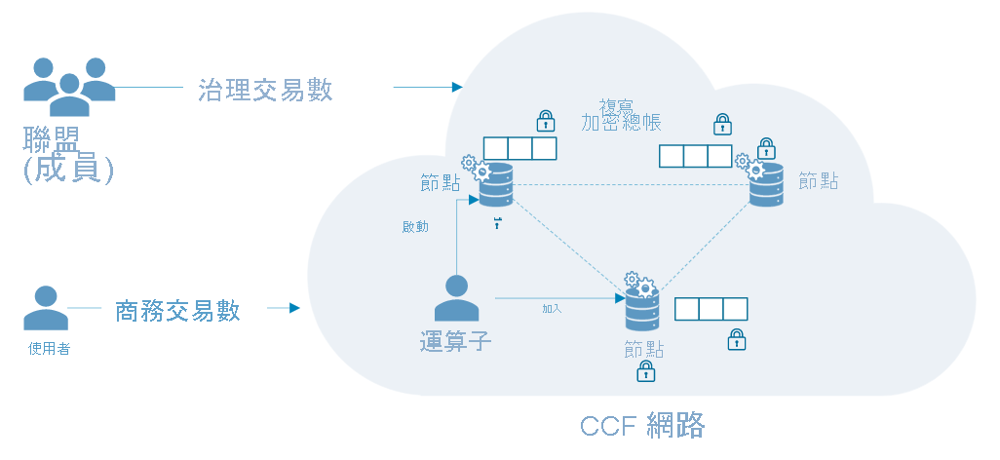

# Azure 機密運算的常見案例

本文概述 Azure 機密運算的一些常見案例。 本文中的建議可作為使用機密運算服務和架構開發應用程式的起點。 

閱讀本文後，您將能夠回答下列問題：

- Azure 機密運算有哪些案例？
- 對多方案例使用 Azure 機密運算有哪些好處？
- 在區塊鏈網路上使用 Azure 機密運算有哪些好處？

## 保護多方運算
Azure 機密運算可讓您處理多個來源的資料，且不會將輸入資料公開給其他方。 這類型的安全運算可支援許多案例，例如：洗錢防治、詐騙偵測，以及醫療保健資料的安全分析。

多個來源可以將其資料上傳到虛擬機器中的一個記憶體保護區。 其中一方可指示記憶體保護區對資料進行運算或處理。 沒有任一方 (甚至是執行分析的人員) 可實際看到其他方已上傳至記憶體保護區的資料。 

在安全的多方運算中，加密的資料會進入記憶體保護區，而記憶體保護區會使用金鑰將資料解密、執行分析、取得結果，然後傳回可供其他方使用指定金鑰解密的加密結果。 

**保護使用中的資料**： 
- 在 Azure 上使用 DCsv2 系列虛擬機器 (VM)，並啟用 Intel SGX 支援。 這些 VM 會啟用受信任執行環境 (TEE)，以保護並隔離部分的應用程式資料和程式碼。
- 使用記憶體保護區感知 SDK，在虛擬機器內建立記憶體保護區。 在記憶體保護區中，資料不會公開給任何人 (甚至 VM 提供者)。 記憶體保護區中的資料將由硬體支援加密。
    - 例如，您可以使用 [OE SDK](https://github.com/openenclave/openenclave) 進行伺服器端處理。 

**保護傳輸中的資料** 
- 使用經證明的 TLS 作為安全通道，以確保傳輸中資料的安全性
- 用戶端可確保只會將資料傳送至由記憶體保護區保護的相同伺服器。 

**保護靜態資料的安全**
- 使用受保護和安全的資料存放區，確保待用資料的安全性 

### 洗錢防治
在此安全的多方運算範例中，多家銀行會彼此共用資料，但不會公開其客戶的個人資料。 銀行會對結合的敏感資料集執行議定的分析。 彙總資料集的分析可偵測到某位使用者在多家銀行之間的金錢流向，而不讓銀行存取彼此的資料。

透過機密運算，這些金融機構可以提高詐騙偵測率、處理洗錢案例、減少誤報，並繼續從較大的資料集學習。 

### 醫療保健的藥物開發
合作的醫療設施會提供個人健康狀況資料集來定型 ML 模型。 每個設施都只能看到自己的資料集。 沒有其他設備 (甚至雲端提供者) 可看到資料或訓練模型。 

所有設施都可因使用定型的模型而受益。 藉由建立包含更多資料的模型，模型會變得更精確。 為定型模型作出貢獻的每個設施都可使用該模型，並獲得有用的結果。 

## 區塊鏈

區塊鏈網路是分散的節點網路。 這些節點會由操作員或驗證者執行和維護，以確保完整性並達成網路狀態的共識。 節點本身是總帳的複本，可用來追蹤區塊鏈交易。 每個節點都有交易歷程記錄的完整複本，可確保分散式網路中的完整性和可用性。

區塊鏈技術以機密運算為基礎，可使用硬體型隱私權來啟用資料機密性和安全運算。 在某些情況下，會將整個總帳加密以保護資料存取。 有時，交易本身可能會在節點內部的記憶體保護區中發生運算模組內。

### 機密聯盟架構 (CCF)
[CCF](https://www.microsoft.com/research/project/confidential-consortium-framework/) 是以 Azure 機密運算為基礎的分散式區塊鏈架構的範例之一。 此架構由 Microsoft Research 率先使用，運用受信任執行環境 (TEE) 的強大功能，建立遠端記憶體保護區的網路以進行證明。 節點可在 Azure 虛擬機器 ([DCsv2 系列](confidential-computing-enclaves.md)) 上執行，並利用記憶體保護區基礎結構。 透過證明通訊協定，區塊鏈的使用者可以驗證一個 CCF 節點的完整性，並有效驗證整個網路。 

在 CCF 中，分散式總帳由金鑰/值存放區的已記錄變更所組成，而這些變更會在所有網路節點間複寫。 每個節點都會執行可由區塊鏈的使用者透過 TLS 觸發的交易引擎。 當您觸發端點時，您會改變金鑰/值存放區。 加密的變更在記錄到分散式總帳之前，必須經過特定數目節點的同意，才能達成共識。 

## 後續步驟
[部署](quick-create-marketplace.md) DCsv2 系列虛擬機器。

