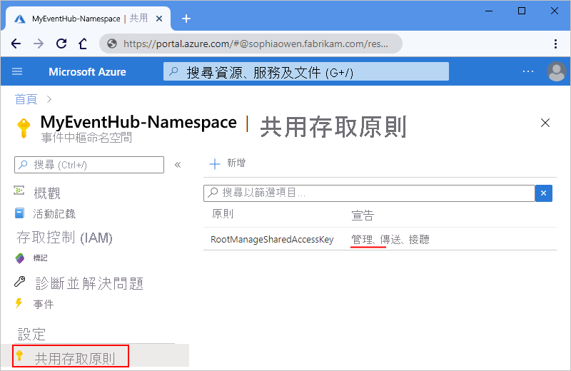
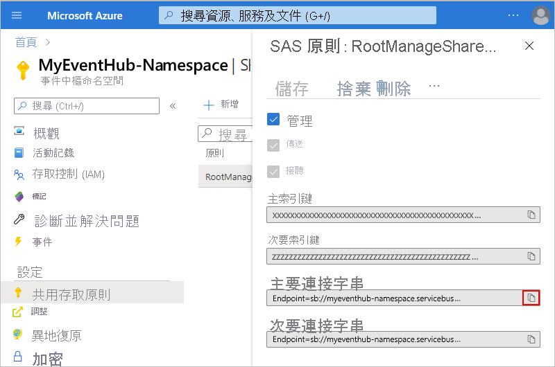
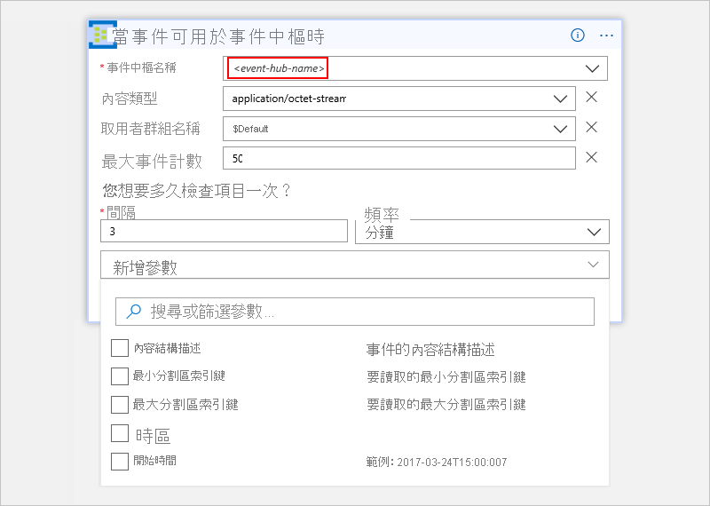
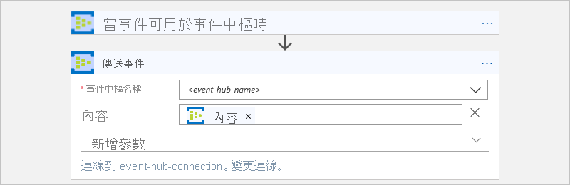
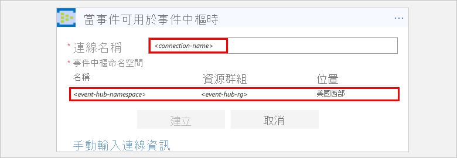
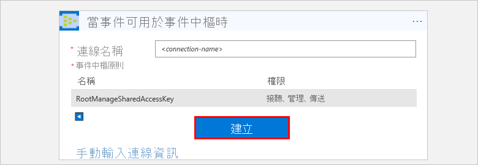

# 使用 Azure 事件中樞與 Azure Logic Apps 監視、接收和傳送事件

本文說明如何使用 Azure 事件中樞連接器，從邏輯應用程式內部監視和管理傳送至 [Azure 事件中樞](../event-hubs/event-hubs-what-is-event-hubs.md)的事件。 這樣一來，您就可以建立邏輯應用程式，來自動執行從事件中樞檢查、傳送和接收事件的工作和工作流程。 有關特定于連接器的技術資訊，請參閱[Azure 事件中心連接器引用](https://docs.microsoft.com/connectors/eventhubs/)</a>。

## Prerequisites

* Azure 訂用帳戶。 如果您沒有 Azure 訂用帳戶，請先[註冊免費的 Azure 帳戶](https://azure.microsoft.com/free/)。 

* [Azure 事件中樞命名空間和事件中樞](../event-hubs/event-hubs-create.md)

* 您要存取事件中樞的邏輯應用程式。 若要使用 Azure 事件中樞觸發程序來啟動邏輯應用程式，您需要[空白邏輯應用程式](../logic-apps/quickstart-create-first-logic-app-workflow.md)。
如果您還不熟悉邏輯應用程式，請檢閱[什麼是 Azure Logic Apps？](../logic-apps/logic-apps-overview.md)和[快速入門：建立第一個邏輯應用程式](../logic-apps/quickstart-create-first-logic-app-workflow.md)。

## 檢查使用權限並取得連接字串

為了確保邏輯應用可以訪問事件中心，請檢查您的許可權並獲取事件中心命名空間的連接字串。

1. 登錄到 Azure[門戶](https://portal.azure.com)。

1. 移至您的事件中樞「命名空間」**，而不是特定事件中樞。 

1. 在命名空間功能表中，**在"設置"** 下，選擇 **"共用訪問策略**"。 在 **"聲明"** 下，檢查您是否具有該命名空間**的管理**許可權。

   

1. 如果您想要在稍後手動輸入您的連線資訊，請取得事件中樞命名空間的連接字串。

   1. 在 [原則]**** 下，選擇 [RootManageSharedAccessKey]****。

   1. 尋找主索引鍵的連接字串。 選擇 [複製] 按鈕，然後儲存連接字串以供稍後使用。

      

      > [!TIP]
      > 若要確認您的連接字串是否與事件中樞命名空間或特定事件中樞相關聯，請確認連接字串沒有 `EntityPath` 參數。 如果您發現這個參數，此連接字串適用於特定事件中樞「實體」，而不是使用您的邏輯應用程式的正確字串。

1. 現在繼續[新增事件中樞觸發程序](#add-trigger)或[新增事件中樞動作](#add-action)。

## 添加事件中心觸發器

在 Azure Logic Apps 中，每個邏輯應用程式都必須使用[觸發程序](../logic-apps/logic-apps-overview.md#logic-app-concepts)啟動，而該觸發程序會在特定事件發生或符合特定條件時引發。 每次引發觸發程序時，Logic Apps 引擎都會建立邏輯應用程式執行個體，並開始執行應用程式的工作流程。

此範例會示範當新的事件傳送到事件中樞時，如何啟動邏輯應用程式工作流程。 

1. 在 Azure 入口網站或 Visual Studio 中，建立空白的邏輯應用程式，以開啟 Logic Apps 設計工具。 這個範例會使用 Azure 入口網站。

1. 在搜尋方塊中，輸入「事件中樞」作為篩選條件。 從觸發器清單中選擇此觸發器：**當事件中心中事件可用時 - 事件中心**

   

1. 如果系統提示您輸入連線詳細資料，請[立即建立事件中樞連線](#create-connection)。 

1. 在觸發器中，提供有關要監視的事件中心的資訊。 有關更多屬性，打開 **"添加新參數**清單"。 選擇參數會將該屬性添加到觸發器卡中。

   

   | 屬性 | 必要 | 描述 |
   |----------|----------|-------------|
   | **事件中樞名稱** | 是 | 要監視的事件中心的名稱 |
   | **內容類型** | 否 | 事件的內容類型。 預設值為 `application/octet-stream`。 |
   | **取用者群組名稱** | 否 | 用於讀取[事件的事件中心消費者組的名稱](../event-hubs/event-hubs-features.md#consumer-groups)。 若未指定，就會使用預設取用者群組。 |
   | **最大事件計數** | 否 | 事件的最大數量。 觸發程序傳回的事件數目會介於 1 到這個屬性指定的數目之間。 |
   | **區間** | 是 | 描述工作流根據頻率運行頻率的正整數 |
   | **頻率** | 是 | 重複的時間單位 |
   ||||

   **其他屬性**

   | 屬性 | 必要 | 描述 |
   |----------|----------|-------------|
   | **內容結構描述** | 否 | 要從事件中心讀取的事件的 JSON 內容架構。 例如，如果指定內容架構，則只能為與架構匹配的事件觸發邏輯應用。 |
   | **最小分割區索引鍵** | 否 | 輸入要讀取的最小[分割區](../event-hubs/event-hubs-features.md#partitions)識別碼。 預設會讀取所有分割區。 |
   | **最大分割區索引鍵** | 否 | 輸入要讀取的最大[分割區](../event-hubs/event-hubs-features.md#partitions)識別碼。 預設會讀取所有分割區。 |
   | **時區** | 否 | 只有當您有指定開始時間時才適用，因為此觸發程序並不接受 UTC 時差。 選取您要套用的時區。 
有關詳細資訊，請參閱使用[Azure 邏輯應用創建和運行定期任務和工作流](../connectors/connectors-native-recurrence.md)。 |
   | **開始時間** | 否 | 提供下列格式的開始時間： 
YYYY-MM-DDThh:mm:ss (如果您選取時區)
-或-
YYYY-MM-DDThh:mm:ssZ (如果您未選取時區)
有關詳細資訊，請參閱使用[Azure 邏輯應用創建和運行定期任務和工作流](../connectors/connectors-native-recurrence.md)。 |
   ||||

1. 當您完成時，請在設計工具的工具列上，選擇 [儲存]****。

1. 現在，繼續針對您想要使用觸發程序結果來執行的工作，於邏輯應用程式中新增一或多個動作。 

   例如，要根據特定值（如類別）篩選事件，可以添加條件，以便 **"發送事件**"操作僅發送滿足條件的事件。 

> [!NOTE]
> 所有事件中樞觸發程序都是*長時間輪詢*觸發程序；這表示當引發觸發程序時，觸發程序會處理所有事件，然後等候 30 秒等事件中樞中出現更多事件。
> 如果在 30 秒內沒收到任何事件，就會略過觸發程序執行。 否則，觸發程序會繼續讀取事件，直到事件中樞沒有任何事件為止。
> 下一次發生觸發程序輪詢的時間，會根據您在觸發程序屬性中指定的循環間隔而定。

## 添加事件中心操作

在 Azure Logic Apps 中，[動作](../logic-apps/logic-apps-overview.md#logic-app-concepts)是工作流程中跟隨在觸發程序或另一個動作之後的步驟。 在此範例中，邏輯應用程式會從事件中樞觸發程序開始，其會檢查事件中樞內的新事件。

1. 在 Azure 入口網站或 Visual Studio 的邏輯應用程式設計工具中，開啟邏輯應用程式。 這個範例會使用 Azure 入口網站。

1. 在觸發器或操作下，選擇 **"新建步驟**"。

   若要在現有步驟之間新增動作，請將滑鼠放在連接箭頭上。 
   選擇顯示的加號**+**（），然後選擇 **"添加操作**"。

1. 在搜尋方塊中，輸入「事件中樞」作為篩選條件。
從動作清單中選擇此操作：**發送事件 - 事件中心**

   

1. 如果系統提示您輸入連線詳細資料，請[立即建立事件中樞連線](#create-connection)。 

1. 在操作中，提供有關要發送的事件的資訊。 有關更多屬性，打開 **"添加新參數**清單"。 選擇參數會將該屬性添加到操作卡中。

   

   | 屬性 | 必要 | 描述 |
   |----------|----------|-------------|
   | **事件中樞名稱** | 是 | 要發送事件的事件中心 |
   | **內容** | 否 | 您要傳送事件的內容 |
   | **屬性** | 否 | 要傳送的應用程式屬性與值 |
   | **分區鍵** | 否 | 用於發送事件的[分區](../event-hubs/event-hubs-features.md#partitions)ID |
   ||||

   例如，您可以將事件中心觸發器的輸出發送到其他事件中心：

   

1. 當您完成時，請在設計工具的工具列上，選擇 [儲存]****。

## 連線至事件中樞

[!INCLUDE [Create connection general intro](../../includes/connectors-create-connection-general-intro.md)] 

1. 當系統提示您需要連線資訊時，請提供以下詳細資料：

   | 屬性 | 必要 | 值 | 描述 |
   |----------|----------|-------|-------------|
   | **連接名稱** | 是 | <*連接名稱*> | 要為連線建立的名稱 |
   | **事件中心命名空間** | 是 | <*事件中心命名空間*> | 選取您想要使用的事件中樞命名空間。 |
   |||||  

   例如：

   

   要手動輸入連接字串，請選擇 **"手動輸入連接資訊**"。 
   了解[如何尋找您的連接字串](#permissions-connection-string)。

2. 選取要使用的事件中樞原則 (若尚未選取)。 選擇 **[建立]**。

   

3. 您在建立連線之後，請繼續[新增事件中樞觸發程序](#add-trigger)或[新增事件中樞動作](#add-action)。

## 連接器參考

如需連接器的 Swagger 檔案所敘述的技術詳細資料 (例如，觸發程序、動作和限制)，請參閱[連接器的參考頁面](https://docs.microsoft.com/connectors/eventhubs/)。

> [!NOTE]
> 對於[整合服務環境 （ISE）](../logic-apps/connect-virtual-network-vnet-isolated-environment-overview.md)中的邏輯應用，此連接器的 ISE 標記版本使用[ISE 消息限制](../logic-apps/logic-apps-limits-and-config.md#message-size-limits)。

## 後續步驟

* 了解其他 [Logic Apps 連接器](../connectors/apis-list.md)