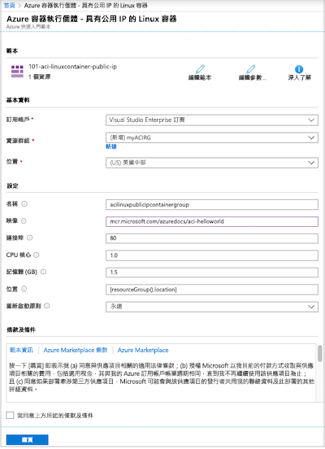
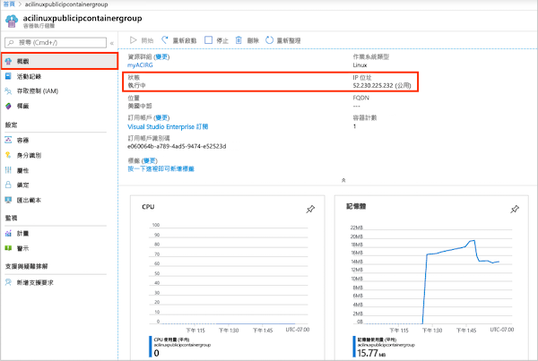
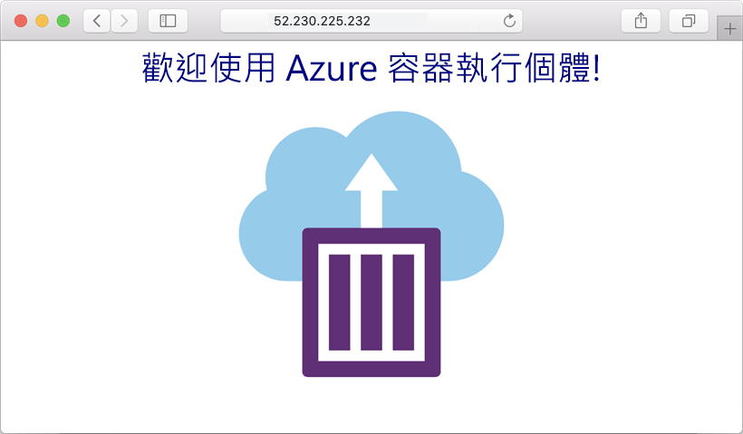
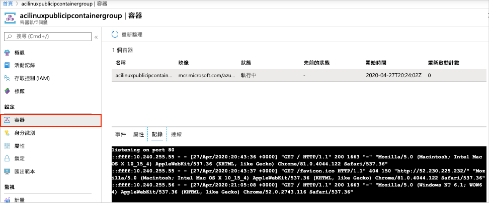

# 快速入門：使用 ARM 範本部署容器執行個體

使用 Azure 容器執行個體在 Azure 中簡潔且快速地執行無伺服器 Docker 容器。 當您不需要像 Azure Kubernetes Service 的完整容器協調流程平台時，請視需要將應用程式部署至容器執行個體。 在本快速入門中，您會使用 Azure Resource Manager 範本 (ARM 範本) 部署隔離的 Docker 容器，並讓其 Web 應用程式可透過公用 IP 位址使用。

[!INCLUDE [About Azure Resource Manager](../../includes/resource-manager-quickstart-introduction.md)]

如果您的環境符合必要條件，而且您很熟悉 ARM 範本，請選取 [部署至 Azure] 按鈕。 範本會在 Azure 入口網站中開啟。

## 必要條件

如果您沒有 Azure 訂用帳戶，請在開始前建立[免費帳戶](https://azure.microsoft.com/free/)。

## 檢閱範本

本快速入門中使用的範本是來自 [Azure 快速入門範本](https://azure.microsoft.com/resources/templates/101-aci-linuxcontainer-public-ip/)。

:::code language="json" source="~/quickstart-templates/101-aci-linuxcontainer-public-ip/azuredeploy.json":::

範本中已定義下列資源：

* **[Microsoft.ContainerInstance/containerGroups](/azure/templates/microsoft.containerinstance/containergroups)** ：建立 Azure 容器群組。 此範本會定義由單一容器執行個體組成的群組。

您可以在[快速入門範本資源庫](https://azure.microsoft.com/resources/templates/?resourceType=Microsoft.Containerinstance&pageNumber=1&sort=Popular)中找到更多 Azure 容器執行個體範本的範例。

## 部署範本

 1. 選取以下影像來登入 Azure 並開啟範本。 此範本會在另一個位置建立登錄和複本。

    

 2. 選取或輸入下列值。

    * **訂用帳戶**：選取 Azure 訂用帳戶。
    * **資源群組**：選取 [新建]，輸入資源群組的唯一名稱，然後選取 [確認]。
    * **位置**：選取資源群組的位置。 範例：**美國中部**。
    * **名稱**：接受為執行個體產生的名稱，或輸入名稱。
    * **映像**：接受預設映像名稱。 此範例 Linux 映像會封裝以 Node.js 撰寫並提供靜態 HTML 網頁的小型 Web 應用程式。 

    接受其餘屬性的預設值。

    檢閱條款及條件。 若同意，請選取 [我同意上方所述的條款及條件]。

    

 3. 成功部署執行個體之後，您會收到通知：

    

 Azure 入口網站用於部署範本。 除了 Azure 入口網站，您可以使用 Azure PowerShell、Azure CLI 和 REST API。 若要了解其他部署方法，請參閱[部署範本](../azure-resource-manager/templates/deploy-cli.md)。

## 檢閱已部署的資源

使用 Azure 入口網站或 [Azure CLI](container-instances-quickstart.md) 之類的工具來檢閱容器執行個體的內容。

1. 在入口網站中，搜尋容器執行個體，然後選取您建立的容器執行個體。

1. 在 [概觀] 頁面上，注意執行個體的**狀態**及其 **IP 位址**。

    

2. 當其狀態成為「執行中」時，請在瀏覽器中瀏覽至 IP 位址。 

    

### 檢視容器記錄

在對您的容器或其執行的應用程式排解問題時，檢視的容器執行個體的記錄會很有幫助。

若要檢視容器的記錄，請在 [設定] 下選取 [容器] > [記錄]。 您應該會看到您在瀏覽器中檢視應用程式時產生的 HTTP GET 要求。

## 清除資源

完成容器的作業後，請在容器執行個體的**概觀**頁面選取 [刪除]。 出現提示時，確認刪除。

## 後續步驟

在本快速入門中，您已從公用 Microsoft 映像建立 Azure 容器執行個體。 如果您想要建置容器映像，並從私人的 Azure 容器登錄進行部署，請繼續進行 Azure Container Instances 教學課程。

> [!div class="nextstepaction"]
> [教學課程：建立容器影像以部署至 Azure 容器執行個體](./container-instances-tutorial-prepare-app.md)

如需逐步教學課程，以引導您完成建立範本的流程，請參閱：

> [!div class="nextstepaction"]
> [教學課程：建立及部署您的第一個 ARM 範本](../azure-resource-manager/templates/template-tutorial-create-first-template.md)