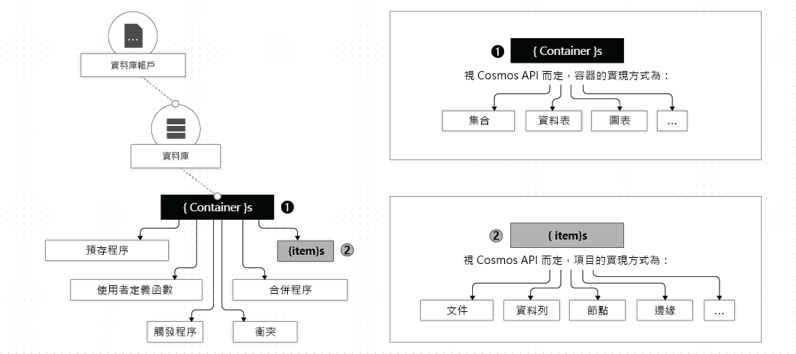

# 使用 Azure Cosmos DB 中的資料庫、容器和項

在 Azure 訂閱下創建[Azure Cosmos DB 帳戶](account-overview.md)後，可以通過創建資料庫、容器和專案來管理帳戶中的資料。 本文會說明每個實體。 

下圖顯示了 Azure Cosmos DB 帳戶中不同實體的層次結構：

## Azure Cosmos 資料庫

您可以在帳戶下創建一個或多個 Azure Cosmos 資料庫。 資料庫類似于命名空間。 資料庫是一組 Azure Cosmos 容器的管理單元。 下表說明 Azure Cosmos 資料庫如何對應至各種 API 特定實體：

| Azure Cosmos 實體 | SQL API | Cassandra API | 適用於 MongoDB 的 Azure Cosmos DB API | Gremlin API | 資料表 API |
| --- | --- | --- | --- | --- | --- |
|Azure Cosmos 資料庫 | 資料庫 | keyspace | 資料庫 | 資料庫 | NA |

> [!NOTE]
> 使用表 API 帳戶，創建第一個表時，將自動在 Azure Cosmos 帳戶中創建預設資料庫。

### Azure Cosmos 資料庫中的作業

您可以與 Azure Cosmos 資料庫與 Azure Cosmos API 進行交互，如下表所述：

| 作業 | Azure CLI | SQL API | Cassandra API | 適用於 MongoDB 的 Azure Cosmos DB API | Gremlin API | 資料表 API |
| --- | --- | --- | --- | --- | --- | --- |
|列舉所有資料庫| 是 | 是 | 是 (資料庫會對應至 keyspace) | 是 | NA | NA |
|讀取資料庫| 是 | 是 | 是 (資料庫會對應至 keyspace) | 是 | NA | NA |
|建立新的資料庫| 是 | 是 | 是 (資料庫會對應至 keyspace) | 是 | NA | NA |
|更新資料庫| 是 | 是 | 是 (資料庫會對應至 keyspace) | 是 | NA | NA |

## Azure Cosmos 容器

Azure Cosmos 容器是可伸縮性單元，用於預配輸送量和存儲。 容器會以水平方式分割，然後跨多個區域複寫。 您新增至容器的項目和您在容器上佈建的輸送量，會自動依據分割區索引鍵分布在一組邏輯分割區之間。 要瞭解有關分區和分區鍵的更多詳細資訊，請參閱[分區資料](partition-data.md)。 

創建 Azure Cosmos 容器時，以以下模式之一配置輸送量：

* **專用預配輸送量模式**：容器上預配的輸送量僅保留給該容器，並由 SL 支援。 要瞭解詳細資訊，請參閱[如何在 Azure Cosmos 容器上預配輸送量](how-to-provision-container-throughput.md)。

* **共用預配輸送量模式**：這些容器與同一資料庫中的其他容器共用預配輸送量（不包括已配置專用預配輸送量的容器）。 換句話說，資料庫上的預配輸送量在所有"共用輸送量"容器之間共用。 要瞭解詳細資訊，請參閱[如何在 Azure Cosmos 資料庫上預配輸送量](how-to-provision-database-throughput.md)。

> [!NOTE]
> 僅當創建資料庫和容器時，才能配置共用輸送量和專用輸送量。 若要在建立容器後從專用輸送量模式切換為共用輸送量模式 (反之亦然)，您必須建立新的容器，並將資料遷移至新的容器。 可以使用 Azure Cosmos DB 更改源功能遷移資料。

無論使用專用或共用預配輸送量模式創建容器，Azure Cosmos 容器都可以彈性擴展。

Azure Cosmos 容器是與結構描述無關的項目容器。 容器中的項可以具有任意架構。 例如，表示人員的專案和表示汽車的項可以放置在*同一容器*中。 預設情況下，添加到容器的所有項都將自動編制索引，而無需顯式索引或架構管理。 您可以通過在容器上配置[索引策略](index-overview.md)來自訂索引行為。 

您可以在 Azure Cosmos 容器中的選定專案上設置["存留時間"（TTL），](time-to-live.md)也可以使整個容器從系統中正常清除這些專案。 Azure Cosmos DB 會在專案過期時自動刪除它們。 它還保證對容器執行的查詢不會返回固定綁定中的過期項。 要瞭解更多資訊，請參閱[在容器上配置 TTL。](how-to-time-to-live.md)

可以使用[更改源](change-feed.md)訂閱為容器的每個邏輯分區管理的動作記錄。 更改源提供容器上執行的所有更新的日誌，以及專案之前和之後的圖像。 有關詳細資訊，請參閱[使用更改源生成無功應用程式](serverless-computing-database.md)。 還可以使用容器上的更改源策略配置更改源的保留期限。 

您可以為 Azure Cosmos 容器註冊[預存程序、觸發器、使用者定義的函數 （UdF）](stored-procedures-triggers-udfs.md)和[合併過程](how-to-manage-conflicts.md)。 

您可以在 Azure Cosmos 容器上指定[唯一的鍵約束](unique-keys.md)。 您可以建立唯一索引鍵原則，以確保每個邏輯分割區索引鍵一或多個值的唯一性。 如果使用唯一的鍵策略創建容器，則不能創建具有複製唯一鍵約束指定的值的值的新項或更新項。 若要進一步了解，請參閱[唯一索引鍵條件約束](unique-keys.md)。

Azure Cosmos 容器專用於特定于 API 的實體，如下表所示：

| Azure Cosmos 實體 | SQL API | Cassandra API | 適用於 MongoDB 的 Azure Cosmos DB API | Gremlin API | 資料表 API |
| --- | --- | --- | --- | --- | --- |
|Azure Cosmos 容器 | 容器 | Table | 集合 | 圖形 | Table |

### Azure Cosmos 容器的屬性

Azure Cosmos 容器具有一組系統定義的屬性。 根據所使用的 API，某些屬性可能不會直接公開。 下表描述了系統定義的屬性清單：

| 系統定義的屬性 | 系統生成或使用者可配置 | 目的 | SQL API | Cassandra API | 適用於 MongoDB 的 Azure Cosmos DB API | Gremlin API | 資料表 API |
| --- | --- | --- | --- | --- | --- | --- | --- |
|\_擺脫 | 系統生成 | 容器的唯一識別碼 | 是 | 否 | 否 | 否 | 否 |
|\_Etag | 系統生成 | 適用於開放式並行存取控制的實體標記 | 是 | 否 | 否 | 否 | 否 |
|\_Ts | 系統生成 | 容器的上次更新日期時間戳記 | 是 | 否 | 否 | 否 | 否 |
|\_自我 | 系統生成 | 容器的可定址 URI | 是 | 否 | 否 | 否 | 否 |
|id | 使用者可配置 | 使用者定義的容器唯一名稱 | 是 | 是 | 是 | 是 | 是 |
|indexingPolicy | 使用者可配置 | 提供更改索引路徑、索引類型和索引模式的能力 | 是 | 否 | 否 | 否 | 是 |
|timeToLive | 使用者可配置 | 提供在設定的時間段後自動從容器中刪除物料的能力。 有關詳細資訊，請參閱["存留時間](time-to-live.md)"。 | 是 | 否 | 否 | 否 | 是 |
|changeFeedPolicy | 使用者可配置 | 用來讀取容器中對項目所做的變更。 有關詳細資訊，請參閱[更改源](change-feed.md)。 | 是 | 否 | 否 | 否 | 是 |
|uniqueKeyPolicy | 使用者可配置 | 用於確保邏輯分區中一個或多個值的唯一性。 有關詳細資訊，請參閱[唯一鍵約束](unique-keys.md)。 | 是 | 否 | 否 | 否 | 是 |

### Azure Cosmos 容器中的作業

使用任何 Azure Cosmos API 時，Azure Cosmos 容器支援以下操作：

| 作業 | Azure CLI | SQL API | Cassandra API | 適用於 MongoDB 的 Azure Cosmos DB API | Gremlin API | 資料表 API |
| --- | --- | --- | --- | --- | --- | --- |
| 列舉資料庫中的容器 | 是 | 是 | 是 | 是 | NA | NA |
| 讀取容器 | 是 | 是 | 是 | 是 | NA | NA |
| 建立新容器 | 是 | 是 | 是 | 是 | NA | NA |
| 更新容器 | 是 | 是 | 是 | 是 | NA | NA |
| 刪除容器 | 是 | 是 | 是 | 是 | NA | NA |

## Azure Cosmos 項目

根據所使用的 API，Azure Cosmos 項可以表示集合中的文檔、表中的行或圖形中的節點或邊。 下表顯示了 API 特定實體與 Azure Cosmos 項的映射：

| Cosmos 實體 | SQL API | Cassandra API | 適用於 MongoDB 的 Azure Cosmos DB API | Gremlin API | 資料表 API |
| --- | --- | --- | --- | --- | --- |
|Azure Cosmos 項目 | Document | 資料列 | Document | 節點或邊 | Item |

### 項目的屬性

每個 Azure Cosmos 項都有以下系統定義的屬性。 根據您使用的 API，其中一些可能未直接公開。

| 系統定義的屬性 | 系統生成或使用者可配置| 目的 | SQL API | Cassandra API | 適用於 MongoDB 的 Azure Cosmos DB API | Gremlin API | 資料表 API |
| --- | --- | --- | --- | --- | --- | --- | --- |
|\_擺脫 | 系統生成 | 專案的唯一識別碼 | 是 | 否 | 否 | 否 | 否 |
|\_Etag | 系統生成 | 適用於開放式並行存取控制的實體標記 | 是 | 否 | 否 | 否 | 否 |
|\_Ts | 系統生成 | 專案上次更新的時間戳記 | 是 | 否 | 否 | 否 | 否 |
|\_自我 | 系統生成 | 項目的可定址 URI | 是 | 否 | 否 | 否 | 否 |
|id | 之前或之後 | 邏輯分區中使用者定義的唯一名稱。 | 是 | 是 | 是 | 是 | 是 |
|任意使用者定義的屬性 | 使用者定義 | 以 API 本機表示形式表示的使用者定義屬性（包括 JSON、BSON 和 CQL） | 是 | 是 | 是 | 是 | 是 |

> [!NOTE]
> `id`屬性的唯一性僅在每個邏輯分區內強制執行。 多個文檔可以具有具有不同`id`分區鍵值的相同屬性。

### 項目上的作業

Azure Cosmos 項支援以下操作。 可以使用任何 Azure 宇宙 API 執行操作。

| 作業 | Azure CLI | SQL API | Cassandra API | 適用於 MongoDB 的 Azure Cosmos DB API | Gremlin API | 資料表 API |
| --- | --- | --- | --- | --- | --- | --- |
| 插入、取代、刪除、更新插入、讀取 | 否 | 是 | 是 | 是 | 是 | 是 |

## 後續步驟

瞭解這些任務和概念：

* [在 Azure Cosmos 資料庫上佈建輸送量](how-to-provision-database-throughput.md)
* [在 Azure Cosmos 容器上佈建輸送量](how-to-provision-container-throughput.md)
* [使用邏輯分區](partition-data.md)
* [在 Azure Cosmos 容器上配置 TTL](how-to-time-to-live.md)
* [使用更改源生成被動應用程式](change-feed.md)
* [在 Azure Cosmos 容器上配置唯一的鍵約束](unique-keys.md)
