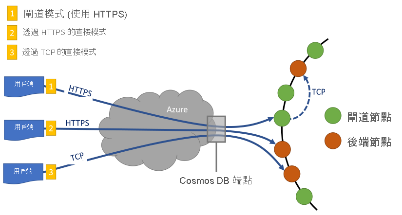

# <a name="performance-tips-for-azure-cosmos-db-and-net"></a>Azure Cosmos DB 和 .NET 的效能祕訣

> [!div class="op_single_selector"]
> * [非同步 Java](performance-tips-async-java.md)
> * [JAVA](performance-tips-java.md)
> * [.NET](performance-tips.md)
> 

Azure Cosmos DB 是一個既快速又彈性的分散式資料庫，可在獲得延遲與輸送量保證的情況下順暢地調整。 您不必進行重大體系結構更改或編寫複雜的代碼來使用 Azure Cosmos DB 擴展資料庫。 相應增加和減少就像進行單一 API 呼叫一樣簡單。 若要深入了解，請參閱[如何佈建容器輸送量](how-to-provision-container-throughput.md)或[如何佈建資料庫輸送量](how-to-provision-database-throughput.md)。 但是，由於 Azure Cosmos DB 是通過網路調用訪問的，因此在使用[SQL .NET SDK](sql-api-sdk-dotnet-standard.md)時，您可以進行用戶端優化以實現峰值性能。

因此，如果您嘗試提高資料庫性能，請考慮以下選項：

## <a name="hosting-recommendations"></a>託管建議

**對於查詢密集型工作負載，請使用 Windows 64 位而不是 Linux 或 Windows 32 位主機處理**

我們建議處理 Windows 64 位主機以提高性能。 SQL SDK 包括一個本機 ServiceInterop.dll，用於在本地解析和優化查詢。 服務 Interop.dll 僅在 Windows x64 平臺上受支援。 對於 Linux 和其他不支援的平臺（ServiceInterop.dll 不可用），將再對閘道進行網路調用以獲取優化的查詢。 預設情況下，以下類型的應用程式使用 32 位主機處理。 要將主機處理更改為 64 位處理，請根據應用程式的類型執行以下步驟：

- 對於可執行應用程式，您可以通過在 **"生成"選項卡上的"專案屬性**"視窗中將[平臺目標](https://docs.microsoft.com/visualstudio/ide/how-to-configure-projects-to-target-platforms?view=vs-2019)設置為**x64**來**Build**更改主機處理。

- 對於基於 VSTest 的測試專案，您可以通過在 Visual Studio**測試**功能表中選擇**測試** > **設置** > **預設處理器體系結構作為 X64**來更改主機處理。

- 對於本地部署ASP.NET Web 應用程式，您可以通過選擇"**工具** > **選項** > **專案和解決方案** > **Web 專案**"下的 Web**網站和專案使用 64 位版本的 IIS Express**來更改主機處理。

- 對於部署在 Azure 上的ASP.NET Web 應用程式，可以通過在 Azure 門戶中**的應用程式設定**中選擇**64 位**平臺來更改主機處理。

> [!NOTE] 
> 預設情況下，新的視覺化工作室專案設置為**任何 CPU**。 我們建議您將專案設置為**x64，** 以便它不會切換到**x86**。 如果添加了僅 x86 的依賴項，則設置為 **"任何 CPU"** 的專案集可以輕鬆地切換到**x86。**<br/>
> ServiceInterop.dll 需要位於正在從中執行 SDK DLL 的資料夾中。 僅當手動複製 DLL 或具有自訂生成/部署系統時，這才應是一個問題。
    
**打開伺服器端垃圾回收 （GC）**

在某些情況下，減少垃圾回收的頻率會有所説明。 在 .NET 中，將`true` [gcServer](https://msdn.microsoft.com/library/ms229357.aspx)設置為 。

**橫向擴展用戶端工作負載**

如果您在高輸送量級別（超過 50，000 RU/s）進行測試，則用戶端應用程式可能會由於電腦在 CPU 或網路利用率上受到限制而成為瓶頸。 如果到了這一刻，您可以將用戶端應用程式向外延展至多部伺服器，以繼續將 Azure Cosmos DB 帳戶再往前推進一步。

> [!NOTE] 
> CPU 使用率高可能會導致延遲增加和請求超時異常。

## <a name="networking"></a>網路
<a id="direct-connection"></a>

**原則︰使用直接連接模式**

用戶端如何連接到 Azure Cosmos DB 具有重要的性能影響，尤其是對於觀察到的用戶端延遲。 有兩個關鍵配置設置可用於配置用戶端連接策略：連接*模式*和連接*協定*。  兩個可用的模式︰

   * 閘道模式
      
     閘道模式在所有 SDK 平臺上都受支援，是[Microsoft.Azure.DocumentDB SDK](sql-api-sdk-dotnet.md)的配置預設值。 如果應用程式在具有嚴格防火牆限制的公司網路中運行，則閘道模式是最佳選擇，因為它使用標準 HTTPS 埠和單個終結點。 但是，性能權衡是，每次從 Azure Cosmos DB 讀取資料或寫入 Azure Cosmos DB 時，閘道模式都涉及額外的網路躍點。 因此，直接模式提供更好的性能，因為網路躍點較少。 在通訊端連接數量有限的環境中運行應用程式時，我們還建議採用閘道連接模式。

     在 Azure 函數中使用 SDK 時，尤其是在[使用計畫中](../azure-functions/functions-scale.md#consumption-plan)，請注意[連接的當前限制](../azure-functions/manage-connections.md)。 在這種情況下，如果您還在 Azure 函數應用程式中使用其他基於 HTTP 的用戶端，則閘道模式可能更好。

   * 直接模式

     直接模式支援通過TCP協定連接，如果您使用的是[Microsoft.Azure.Cosmos/.NET V3 SDK](sql-api-sdk-dotnet-standard.md)，則它是預設連接模式。

在閘道模式下，當您使用 MongoDB 的 Azure Cosmos DB API 時，Azure Cosmos DB 使用埠 443 和埠 10250、10255 和 10256。 埠 10250 映射到預設的 MongoDB 實例，無需異地複製。 埠 10255 和 10256 映射到具有異地複製的 MongoDB 實例。
     
在直接模式下使用 TCP 時，除了閘道埠之外，還需要確保 10000 和 20000 之間的埠範圍處於打開狀態，因為 Azure Cosmos DB 使用動態 TCP 埠。 如果這些埠未打開，並且您嘗試使用 TCP，您將收到 503 服務不可用錯誤。 下表顯示了可用於各種 API 的連接模式以及用於每個 API 的服務埠：

|連線模式  |支援的通訊協定  |支援的 SDK  |API/服務連接埠  |
|---------|---------|---------|---------|
|閘道  |   HTTPS    |  所有 SDK    |   SQL （443）， 蒙哥DB （10250， 10255， 10256）， 表 （443）， 卡珊多拉 （10350）， 圖形 （443）    |
|直接    |     TCP    |  .NET SDK    | 10000 到 20000 範圍內的埠 |

Azure Cosmos DB 通過 HTTPS 提供了簡單、開放的 RESTful 程式設計模型。 此外，它可提供有效率的 TCP 通訊協定，此 TCP 通訊協定在通訊模型中也符合 REST 限制，並且可以透過 .NET 用戶端 SDK 取得。 TCP 協定使用 SSL 進行初始身份驗證和加密流量。 為了達到最佳效能，儘可能使用 TCP 通訊協定。

對於 SDK V3，在 中創建`CosmosClient`實例時配置連接模式。 `CosmosClientOptions` 請記住，直接模式是預設值。

```csharp
var serviceEndpoint = new Uri("https://contoso.documents.net");
var authKey = "your authKey from the Azure portal";
CosmosClient client = new CosmosClient(serviceEndpoint, authKey,
new CosmosClientOptions
{
    ConnectionMode = ConnectionMode.Gateway // ConnectionMode.Direct is the default
});
```

對於 Microsoft.Azure.DocumentDB SDK，您可以使用`DocumentClient``ConnectionPolicy`參數在實例構造期間配置連接模式。 如果使用直接模式，也可以使用 參數`Protocol``ConnectionPolicy`設置 。

```csharp
var serviceEndpoint = new Uri("https://contoso.documents.net");
var authKey = "your authKey from the Azure portal";
DocumentClient client = new DocumentClient(serviceEndpoint, authKey,
new ConnectionPolicy
{
   ConnectionMode = ConnectionMode.Direct, // ConnectionMode.Gateway is the default
   ConnectionProtocol = Protocol.Tcp
});
```

由於 TCP 僅在直接模式下受支援，因此如果使用閘道模式，則 HTTPS 協定始終用於與閘道通信，`Protocol`並且忽略 中的`ConnectionPolicy`值。



**呼叫 OpenAsync 以避免第一次要求的啟動延遲**

預設情況下，第一個請求具有更高的延遲，因為它需要獲取位址路由表。 當您使用[SDK V2](sql-api-sdk-dotnet.md)`OpenAsync()`時，在初始化期間調用一次，以避免第一個請求上的啟動延遲：

    await client.OpenAsync();

> [!NOTE] 
> `OpenAsync`將生成請求以獲取帳戶中所有容器的位址路由表。 對於具有許多容器但應用程式訪問其中子集的帳戶，`OpenAsync`將生成不必要的流量，這將使初始化速度變慢。 因此，`OpenAsync`在這種情況下，使用可能毫無用處，因為它會減慢應用程式啟動的速度。

   <a id="same-region"></a>
**為了達到性能，將用戶端位於同一 Azure 區域中**

如果可能，將調用 Azure Cosmos DB 的任何應用程式放在與 Azure Cosmos 資料庫相同的區域中。 下面是一個近似的比較：對 Azure Cosmos DB 的調用在同一區域內完成 1 毫秒到 2 毫秒以內，但美國西海岸和東海岸之間的延遲超過 50 毫秒。 此延遲可能因請求而異，具體取決於請求從用戶端傳遞到 Azure 資料中心邊界時所走的路線。 通過確保調用應用程式與預配的 Azure Cosmos DB 終結點位於同一 Azure 區域中，可以獲得盡可能低的延遲。 有關可用區域的清單，請參閱[Azure 區域](https://azure.microsoft.com/regions/#services)。

策略<a id="increase-threads"></a>

**增加執行緒/任務數**

由於通過網路對 Azure Cosmos DB 進行的調用，您可能需要變更要求的並行性程度，以便用戶端應用程式在請求之間花費最少的等待時間。 例如，如果使用 .NET[任務並行庫](https://msdn.microsoft.com//library/dd460717.aspx)，則按從 Azure Cosmos DB 讀取或寫入的數百個任務的順序創建。

**啟用加速網路**
 
 為了減少延遲和 CPU 抖動，我們建議您在用戶端虛擬機器上啟用加速網路。 請參閱[創建具有加速網路的 Windows 虛擬機器](../virtual-network/create-vm-accelerated-networking-powershell.md)或[創建具有加速網路的 Linux 虛擬機器](../virtual-network/create-vm-accelerated-networking-cli.md)。

## <a name="sdk-usage"></a>SDK 使用方式
**安裝最新的 SDK**

Azure Cosmos DB SDK 會持續改善以提供最佳效能。 請參閱 [Azure Cosmos DB SDK](sql-api-sdk-dotnet-standard.md) 頁面來判斷最新的 SDK 並檢閱改善項目。

**使用流 API**

[.NET SDK V3](sql-api-sdk-dotnet-standard.md)包含流 API，可以接收和返回資料而不進行序列化。 

中介層應用程式不直接從 SDK 使用回應，但將它們中繼到其他應用程式層，則可以從流 API 中受益。 有關流處理的示例，請參閱[物料管理](https://github.com/Azure/azure-cosmos-dotnet-v3/blob/master/Microsoft.Azure.Cosmos.Samples/Usage/ItemManagement)示例。

**在應用程式存留期內使用單一 Azure Cosmos DB 用戶端**

每個`DocumentClient`實例`CosmosClient`都是執行緒安全的，在直接模式下運行時執行高效的連接管理和位址緩存。 為了實現高效的連接管理和更好的 SDK 用戶端性能，我們建議您在應用程式的存留期內為每個`AppDomain`實例使用單個實例。

   <a id="max-connection"></a>

**使用閘道模式時，增加每個主機的最大連接System.Net**

使用閘道模式時，通過 HTTPS/REST 發出 Azure 宇宙 DB 請求。 它們受每個主機名稱或 IP 位址的預設連接限制。 您可能需要設置為`MaxConnections`較高的值（100 到 1，000），以便用戶端庫可以使用多個同時連接到 Azure Cosmos DB。 在 .NET SDK 1.8.0 及更高版本中，[服務點管理器的預設值為](https://msdn.microsoft.com/library/system.net.servicepointmanager.defaultconnectionlimit.aspx)50。 要更改該值，可以將[文檔.用戶端.連接策略.maxConnectionLimit](https://msdn.microsoft.com/library/azure/microsoft.azure.documents.client.connectionpolicy.maxconnectionlimit.aspx)設置為更高的值。

**調整分區集合的並行查詢**

SQL .NET SDK 1.9.0 和更高版本支援並行查詢，使您能夠並行查詢分區集合。 如需詳細資訊，請參閱使用 SDK 的相關[程式碼範例](https://github.com/Azure/azure-documentdb-dotnet/blob/master/samples/code-samples/Queries/Program.cs)。 並行查詢旨在提供比串列查詢更好的查詢延遲和輸送量。 並行查詢提供兩個參數，您可以調整這些參數以滿足您的要求： 
- `MaxDegreeOfParallelism`控制可並行查詢的最大分區數。 
- `MaxBufferedItemCount`控制預獲取結果的數量。

***並行度的調諧度***

並行查詢的工作原理是並行查詢多個分區。 但是，單個分區中的資料相對於查詢進行串列提取。 在`MaxDegreeOfParallelism` [SDK V2](sql-api-sdk-dotnet.md)或`MaxConcurrency` [SDK V3](sql-api-sdk-dotnet-standard.md)中設置為分區數最有可能實現性能最優的查詢，前提是所有其他系統條件保持不變。 如果不知道分區的數量，可以將並行度設置為高數位。 系統將選擇最小（分區數，使用者提供的輸入）作為並行性的程度。

請注意，如果資料與查詢有關的所有分區均勻分佈，則並行查詢會產生最大的好處。 如果分區集合進行了分區，以便查詢返回的所有資料或大部分集中在幾個分區中（一個分區是最壞的情況），則這些分區將制約查詢的性能。

***調整最大緩衝專案計數***
    
並行查詢旨在在用戶端處理當前結果批次處理時預提取結果。 此預提取有助於提高查詢的總體延遲。 該`MaxBufferedItemCount`參數限制預獲取結果的數量。 設置為`MaxBufferedItemCount`返回的預期結果數（或較高數量），以允許查詢從預提取中獲得最大收益。

無論並行性程度如何，預提取的工作方式都相同，並且所有分區中的資料都有一個緩衝區。  

**在 RetryAfter 間隔實作降速**

在效能測試期間，應增加負載，直到限制少量請求。 如果請求被限制，用戶端應用程式應在伺服器指定的重試間隔內關閉限制。 尊重回退可確保您在重試之間花費最少的時間等待。 

重試策略支援包含在這些 SDK 中：
- 用於 SQL 的[.NET SDK](sql-api-sdk-dotnet.md)版本 1.8.0 及更高版本，[以及用於 SQL](sql-api-sdk-java.md)的 JAVA SDK
- 用於 SQL 的[Node.js SDK](sql-api-sdk-node.md)版本 1.9.0 及更高版本，[以及用於 SQL](sql-api-sdk-python.md)的 Python SDK
- [.NET 核心](sql-api-sdk-dotnet-core.md)SDK 的所有支援版本 

有關詳細資訊，請參閱[重試後](https://msdn.microsoft.com/library/microsoft.azure.documents.documentclientexception.retryafter.aspx)。
    
在版本 1.19 和 .NET SDK 的更高版本中，有一種用於記錄其他診斷資訊和解決延遲問題的機制，如下例所示。 您可以針對具有較高讀取延遲的要求記錄診斷字串。 捕獲的診斷字串將説明您瞭解給定請求收到 429 個錯誤的次數。

```csharp
ResourceResponse<Document> readDocument = await this.readClient.ReadDocumentAsync(oldDocuments[i].SelfLink);
readDocument.RequestDiagnosticsString 
```

**快取較低讀取延遲的文件 URI**

盡可能快取文件 URI 以達到最佳讀取效能。 創建資源時，需要定義邏輯以緩存資源識別碼。 基於資源指示的查找比基於名稱的查找更快，因此緩存這些值可提高性能。

   <a id="tune-page-size"></a>
**調整查詢/讀取源的頁面大小，以獲得更好的性能**

當您使用讀取源功能（例如`ReadDocumentFeedAsync`），或發出 SQL 查詢對文檔進行批量讀取時，如果結果集太大，則以分段方式返回結果。 根據預設，會以 100 個項目或 1 MB 的區塊傳回結果 (以先達到的限制為準)。

若要減少檢索所有適用結果所需的網路往返次數，可以使用[x-ms-max 項計數](https://docs.microsoft.com/rest/api/cosmos-db/common-cosmosdb-rest-request-headers)請求多達 1，000 個標頭來增加頁面大小。 當您只需要顯示幾個結果時，例如，如果使用者介面或應用程式 API 一次僅返回 10 個結果，也可以將頁面大小減小到 10，以減少讀取和查詢的輸送量。

> [!NOTE] 
> 該`maxItemCount`屬性不應僅用於分形。 它的主要用途是通過減少單個頁中返回的最大項數來提高查詢的性能。  

您還可以使用可用的 Azure Cosmos DB SDK 設置頁面大小。 中的`FeedOptions` [MaxItemCount](/dotnet/api/microsoft.azure.documents.client.feedoptions.maxitemcount?view=azure-dotnet)屬性允許您設置枚舉操作中要返回的最大項數。 當`maxItemCount`設置為 -1 時，SDK 會自動找到最佳值，具體取決於文檔大小。 例如：
    
```csharp
IQueryable<dynamic> authorResults = client.CreateDocumentQuery(documentCollection.SelfLink, "SELECT p.Author FROM Pages p WHERE p.Title = 'About Seattle'", new FeedOptions { MaxItemCount = 1000 });
```
    
執行查詢時，生成的資料將在 TCP 資料包中發送。 如果為`maxItemCount`指定的值太低，則在 TCP 資料包中發送資料所需的行程數很高，這會影響性能。 因此，如果您不確定要為`maxItemCount`屬性設置什麼值，最好將其設置為 -1，並讓 SDK 選擇預設值。

**增加執行緒/任務數**

請參閱增加本文"網路"部分中的[執行緒/任務數](#increase-threads)。

## <a name="indexing-policy"></a>編製索引原則
 
**從索引中排除未使用的路徑，以便加快寫入速度**

Azure Cosmos DB 索引策略還允許您通過使用索引路徑（索引策略.包含路徑和索引策略.排除路徑）指定要包含在索引中或排除哪些文檔路徑。 索引路徑可以提高寫入性能，並減少預先知道查詢模式的方案的索引存儲。 這是因為索引成本與索引的唯一路徑數直接相關。 例如，此代碼演示如何使用"*"萬用字元從索引中排除文檔的整個部分（子樹）：

```csharp
var collection = new DocumentCollection { Id = "excludedPathCollection" };
collection.IndexingPolicy.IncludedPaths.Add(new IncludedPath { Path = "/*" });
collection.IndexingPolicy.ExcludedPaths.Add(new ExcludedPath { Path = "/nonIndexedContent/*");
collection = await client.CreateDocumentCollectionAsync(UriFactory.CreateDatabaseUri("db"), excluded);
```

如需詳細資訊，請參閱 [Azure Cosmos DB 索引編製原則](index-policy.md)。

## <a name="throughput"></a>Throughput
<a id="measure-rus"></a>

**測量和調整較低的請求單位/秒使用方式**

Azure Cosmos DB 提供了一組豐富的資料庫操作。 這些操作包括與 UDF 的關係查詢和分層查詢、預存程序和觸發器，所有這些操作都對資料庫集合中的文檔進行操作。 與每個操作關聯的成本因完成操作所需的 CPU、IO 和記憶體而異。 您可以將請求單元 （RU） 視為執行各種資料庫操作和服務應用程式請求所需的資源的單一度量值，而不是考慮和管理硬體資源。

輸送量根據為每個容器設置[的請求單位](request-units.md)數進行預配。 請求單位消耗量計算為每秒速率。 超過其容器的預配請求單位速率的應用程式將受到限制，直到速率降至容器的預配級別以下。 如果應用程式需要更高級別的輸送量，則可以通過預配其他請求單位來增加輸送量。

查詢的複雜性會影響操作使用的請求單位數。 謂詞數、謂詞的性質、UdF 的數量和源資料集的大小都會影響查詢操作的成本。

要測量任何操作（創建、更新或刪除）的開銷，請檢查[x-ms 請求-請求-費用](https://docs.microsoft.com/rest/api/cosmos-db/common-cosmosdb-rest-response-headers)標頭（或`RequestCharge``FeedResponse\<T>`.NET `ResourceResponse\<T>` SDK 中的等效屬性）以測量操作使用的請求單位數：

```csharp
// Measure the performance (Request Units) of writes
ResourceResponse<Document> response = await client.CreateDocumentAsync(collectionSelfLink, myDocument);
Console.WriteLine("Insert of document consumed {0} request units", response.RequestCharge);
// Measure the performance (Request Units) of queries
IDocumentQuery<dynamic> queryable = client.CreateDocumentQuery(collectionSelfLink, queryString).AsDocumentQuery();
while (queryable.HasMoreResults)
    {
        FeedResponse<dynamic> queryResponse = await queryable.ExecuteNextAsync<dynamic>();
        Console.WriteLine("Query batch consumed {0} request units", queryResponse.RequestCharge);
    }
```             

在此標頭中返回的請求費用只是預配輸送量（即 2，000 個 R/秒）的一小部分。 例如，如果前面的查詢返回 1，000 個 1-KB 文檔，則操作的成本為 1，000。 因此，在一秒鐘內，伺服器只通知兩個此類請求，然後再對以後的請求進行速率限制。 有關詳細資訊，請參閱[請求單位和](request-units.md)[請求單位計算機](https://www.documentdb.com/capacityplanner)。
<a id="429"></a>

**處理速率限制/要求速率太大**

當用戶端嘗試超過帳戶的保留輸送量時，伺服器的性能不會下降，並且不會使用超出保留級別的輸送量容量。 伺服器將先發制人地使用 RequestRateTooLarge（HTTP 狀態碼 429）結束請求。 它將返回一個[x-ms-retry 後 ms 標頭](https://docs.microsoft.com/rest/api/cosmos-db/common-cosmosdb-rest-response-headers)，指示使用者必須等待的時間量（以毫秒為單位）才能再次嘗試請求。

    HTTP Status 429,
    Status Line: RequestRateTooLarge
    x-ms-retry-after-ms :100

SDK 全都隱含地攔截這個回應，採用伺服器指定的 retry-after 標頭，並重試此要求。 除非有多個用戶端同時存取您的帳戶，否則下次重試將會成功。

如果多個用戶端累積操作始終高於請求速率，則用戶端當前在內部設置為 9 的預設重試計數可能不足。 在這種情況下，用戶端向應用程式拋出帶有狀態碼 429 的 DocumentClientException。 

您可以通過在`RetryOptions``ConnectionPolicy`實例上設置 更改預設重試計數。 根據預設，如果要求繼續以高於要求速率的方式運作，則會在 30 秒的累計等候時間後傳回 DocumentClientException (狀態碼 429)。 即使當前重試計數小於最大重試計數（無論當前值是預設值 9 還是使用者定義的值）也會返回此錯誤。

自動重試行為有助於提高大多數應用程式的恢復能力和可用性。 但是，在進行性能基準測試時，這可能不是最佳行為，尤其是在測量延遲時。 如果實驗達到伺服器節流並導致用戶端 SDK 以無訊息模式重試，則用戶端觀察到的延遲將會突然增加。 若要避免效能實驗期間的延遲尖峰，測量每個作業所傳回的費用，並確保要求是以低於保留要求速率的方式運作。 有關詳細資訊，請參閱[請求單位](request-units.md)。

**為了更高的輸送量，設計較小的文檔**

給定操作的請求費用（即請求處理成本）與文檔的大小直接相關。 對大型文檔的操作比對小型文檔的操作的成本要高出。

## <a name="next-steps"></a>後續步驟
對於用於評估 Azure Cosmos DB 用於幾個用戶端電腦上高性能方案的應用程式範例，請參閱[使用 Azure Cosmos DB 進行性能和縮放測試](performance-testing.md)。

若要深入了解如何針對規模和高效能設計您的應用程式，請參閱 [Azure Cosmos DB 的資料分割與調整規模](partition-data.md)。
