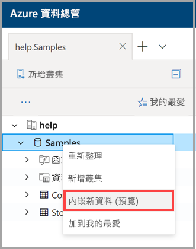

# 使用一鍵引入將資料引入 Azure 資料資源管理器

本文介紹如何使用一鍵式引入來快速引入 JSON 或 CSV 格式的新表。 資料可以從存儲或本地檔引入現有表或新表。 使用直觀的一鍵式嚮導，資料將在幾分鐘內進行攝錄。 然後，可以使用 Azure 資料資源管理器 Web UI 編輯表並執行查詢。

## Prerequisites

* 如果您沒有 Azure 訂用帳戶，請在開始前建立[免費 Azure 帳戶](https://azure.microsoft.com/free/)。
* 登錄到[應用程式](https://dataexplorer.azure.com/)。
* [創建 Azure 資料資源管理器群集和資料庫](create-cluster-database-portal.md)。
* 登錄到 Web [UI](https://dataexplorer.azure.com/)並[添加到群集的連接](/azure/data-explorer/web-query-data#add-clusters)。

## 引入新資料

1. 按右鍵 Web UI 左側功能表中的*資料庫*或*表*行，然後選擇 **"引入新資料（預覽）"。**

       
 
1. 在 **"引入新資料（預覽）"** 視窗中，選擇 **"源"** 選項卡並完成 **"專案詳細資訊**"：

    * 對於**表**，從下拉式功能表中選擇現有表名稱，或選擇 **"新建**"以創建新表。
    * 對於**引入類型**，**從存儲**或**從檔**中選擇 。
      * 如果**從存儲**中選擇，請選擇 **"連結到存儲**以添加 URL"。 對專用存儲帳戶使用[Blob SAS URL。](/azure/vs-azure-tools-storage-explorer-blobs#get-the-sas-for-a-blob-container) 
      * 如果**從檔**中選擇，請選擇 **"流覽"** 並將檔拖入框中。
    * 選擇 **"編輯架構"** 以查看和編輯表列配置。
 
     

    > [!TIP]
    > 如果在*表*行上選擇 **"引入新資料（預覽"），** 則所選表名將顯示在 **"專案詳細資訊**"中。

1. 如果選擇了現有表，"**地圖"列**視窗將打開以將來源資料列映射到目標表列。 
    * 使用 **"省略"列**從表中刪除目標列。
    * 使用 **"新建"列**向表添加新列。

    

1. 在 **"架構"** 選項卡中：

    * 從下拉式功能表中選擇**壓縮類型**，然後選擇 **"未壓縮**"或 **"GZip"。**
    * 從下拉式功能表中選擇**資料格式**，然後選擇 JSON、CSV、TSV、SCSV、SOHSV、TSVE 或**SOHSV****CSV****PSV**。 **JSON** **TSV** **SCSV** **TSVE** 
        * 選擇**JSON**格式時，還必須選擇**JSON 級別**，從 1 到 10。 級別會影響表列資料描述。 
        * 如果選擇 JSON 以外的格式，則必須選擇核取方塊 **"包括列名稱**"以忽略檔的標題列。
    * **映射名稱**是自動設置的，但可以編輯。
    * 如果選擇了現有表，則可以選擇 **"地圖"列**以打開 **"地圖"列**視窗。

    

1. 在 **"編輯器"** 窗格上方，選擇**v**按鈕以打開編輯器。 在編輯器中，您可以查看和複製從輸入生成的自動查詢。 

1. 在表中： 
    * 按右鍵新列標題以**更改資料類型**、**重命名列**、**刪除列**、**排序昇冪**或**排序降冪**。 在現有列上，只有資料排序可用。 
    * 按兩下要編輯的新列名稱。

1. 選擇 **"開始引入**"以創建表和映射並開始資料引入。

     
 
## 查詢資料

1. 在 **"資料引入完成**"視窗中，如果資料引入成功完成，所有三個步驟都將用綠色核取記號標記。
 
    

1. 選擇**v**按鈕以打開查詢。 複製到 Web UI 以編輯查詢。

1. 右側的功能表包含**快速查詢**和**工具**選項。 

    * **快速查詢**包括指向 Web UI 的連結以及依例查詢。
    * **工具**包括指向 Web UI 上**放置命令**的連結，該連結允許您通過運行相關`.drop`命令來解決問題。

    > [!TIP]
    > 使用`.drop`命令時可能會遺失資料。 請仔細使用它們。

## 後續步驟

* [在 Azure 資料總管 Web UI 中查詢資料](web-query-data.md)
* [使用 Kusto 查詢語言為 Azure 資料資源管理器編寫查詢](write-queries.md)
