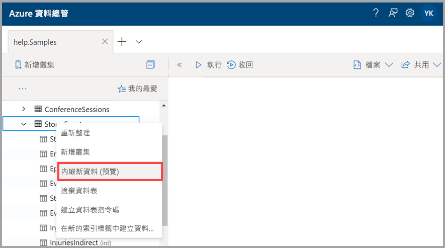
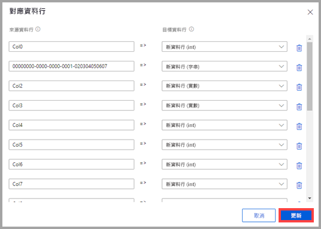
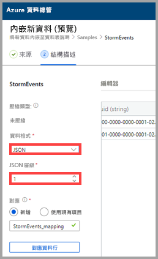
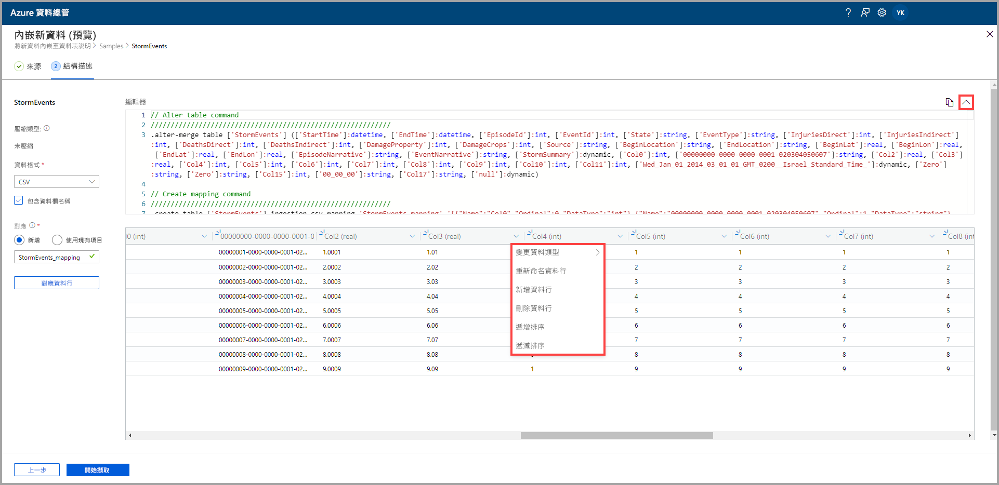
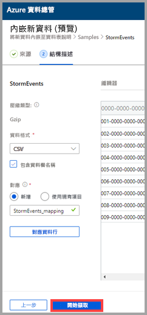
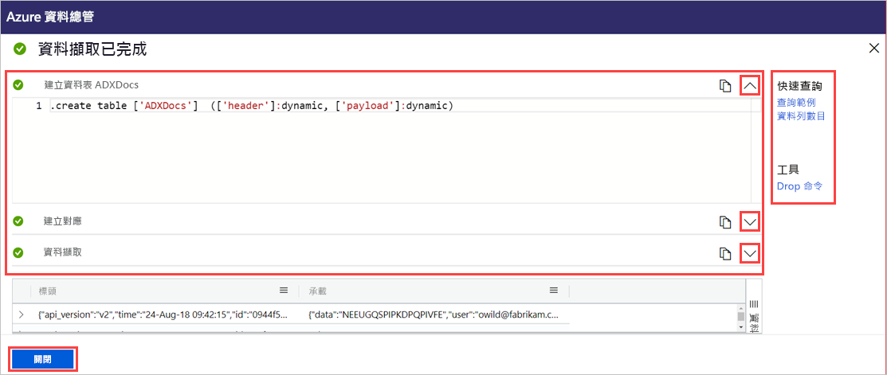

# 使用單鍵擷取將資料內嵌到 Azure 資料總管中的現有資料表

單鍵擷取可讓您快速將 JSON、CSV 和其他格式的資料內嵌到資料表中。 使用 Azure 資料總管 Web UI，即可從儲存體、本機檔案或容器內嵌資料。 

本文件說明如何使用直覺式單鍵精靈，將檔案中的 JSON 資料內嵌到現有資料表中。 接著，您可使用 Azure 資料總管 Web UI 來編輯資料表和執行查詢。

第一次內嵌資料時，或不熟悉資料的結構描述時，單鍵擷取特別有用。 

如需單鍵擷取概觀和必要條件清單，請參閱[單鍵擷取](ingest-data-one-click.md)。
如需將資料內嵌到 Azure 資料總管中新資料表的詳細資訊，請參 [單鍵擷取至新的資料表](one-click-ingestion-new-table.md)

## 內嵌新資料

1. 在 Web UI 的左側功能表中，以滑鼠右鍵按一下 [資料庫]  或 [資料表]  ，然後選取 [內嵌新資料 (預覽)]  。

       
 
1. 在 [內嵌新資料 (預覽)]  視窗中，[來源]  索引標籤已自動選取。

1. 如果未自動填入 [資料表]  欄位，請從下拉式功能表中選取現有資料表名稱。
    > [!TIP]
    > 如果您在 [資料表]  資料列上選取 [內嵌新資料 (預覽)]  ，則所選的資料表名稱會出現在 [專案詳細資料]  中。

[!INCLUDE [data-explorer-one-click-ingestion-types](../../includes/data-explorer-one-click-ingestion-types.md)]
    
選取 [編輯結構描述]  以查看和編輯資料表資料行設定。

## 編輯結構描述

1. [對應資料行]  對話方塊隨即開啟，而您可將來源資料行對應至目標資料表資料行。 
    * 在 [來源資料行]  欄位中，輸入要與 [目標資料行]  對應的資料行名稱。
    * 若要刪除對應，請選取垃圾桶圖示。

    

1. 選取 [更新]  。
1. 在 [結構描述]  索引標籤中：
    1. 選取 [壓縮類型]  ，然後選取 [未壓縮]  或 [GZip]  。

        [!INCLUDE [data-explorer-one-click-ingestion-edit-schema](../../includes/data-explorer-one-click-ingestion-edit-schema.md)]
        
    1. 如果您選取 [JSON]  ，則也必須選取從 1 到 10 的 [JSON 層級]  。 這些層級會影響資料表資料行的資料描述。

    

    * 如果您選取 JSON 以外的格式，則可選取 [包含資料行名稱]  核取方塊，以忽略檔案的標題列。
        
    ![選取 [包含資料行名稱]](media/one-click-ingestion-existing-table/non-json-format.png)

    > [!Note]
    > 表格式格式只能將資料行資料內嵌到 Azure 資料總管資料表中的一個資料行。 

    * 新的對應會自動設定，但您可將其變更為使用現有對應。 
    * 您可選取 [對應資料行]  以開啟 [對應資料行]  視窗。

## 複製並貼上查詢

1. 在 [編輯器]  窗格上方，選取 **v** 按鈕以開啟編輯器。 在編輯器中，您可檢視及複製從您的輸入產生的自動命令。 
1. 在資料表中： 
    * 選取新的資料行標題以新增 [新的資料行]  、[刪除資料行]  、[遞增排序]  或 [遞減排序]  。 在現有資料行上，只能使用資料排序。

    > [!Note]
    > * 您無法更新現有資料表的名稱和資料類型。
    > * Drop 命令只會還原其擷取流程所做的變更 (新的範圍和資料行)。 不會捨棄任何其他項目。

 

## 開始擷取

選取 [開始擷取]  以建立資料表和對應，以及開始進行資料擷取。

## 資料擷取已完成

在 [資料擷取已完成]  視窗中，如果資料擷取成功完成，這三個步驟都會標示綠色勾號。
 

[!INCLUDE [data-explorer-one-click-ingestion-query-data](../../includes/data-explorer-one-click-ingestion-query-data.md)]

## 後續步驟

* [在 Azure 資料總管 Web UI 中查詢資料](/azure/data-explorer/web-query-data)
* [使用 Kusto 查詢語言撰寫 Azure 資料總管的查詢](/azure/data-explorer/write-queries)
