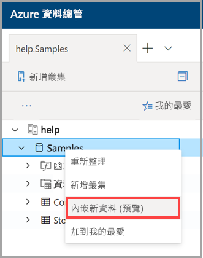
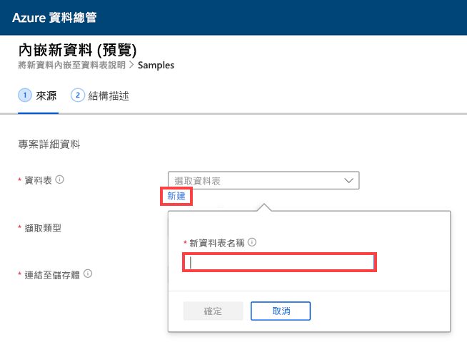
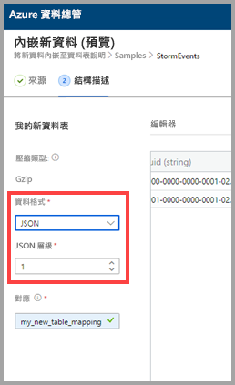
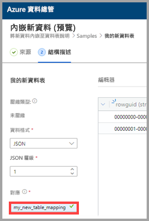
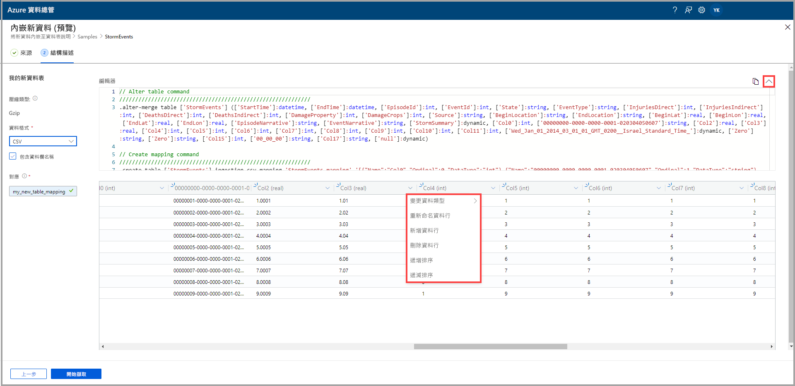
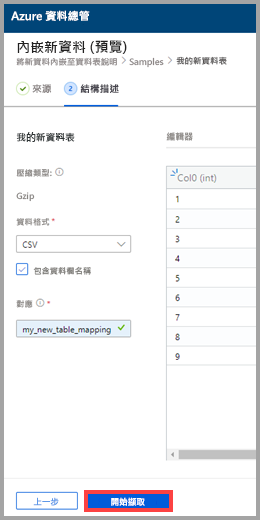
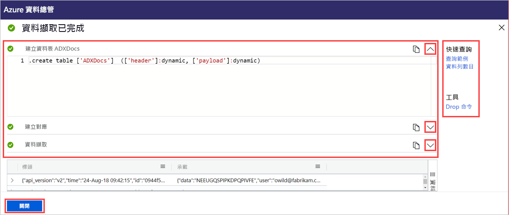

# 使用單鍵擷取將資料內嵌到 Azure 資料總管中新的資料表

單鍵擷取可讓您快速將 JSON、CSV 和其他格式的資料內嵌到資料表中。 使用 Azure 資料總管 Web UI，即可從儲存體、本機檔案或容器內嵌資料。 

本文件說明如何使用直覺式單鍵精靈，將容器中的 CSV 資料內嵌到新的資料表中。 接著，您可使用 Azure 資料總管 Web UI 來編輯資料表和執行查詢。 您也可設定連續擷取，在來源資料更新時，自動將資料內嵌到資料表中。

第一次內嵌資料時，或不熟悉資料的結構描述時，單鍵擷取特別有用。 

如需單鍵擷取概觀和必要條件清單，請參閱[單鍵擷取](ingest-data-one-click.md)。
如需將資料內嵌到 Azure 資料總管中現有資料表的詳細資訊，請參 [單鍵擷取至現有資料表](one-click-ingestion-existing-table.md)

## 內嵌新資料

1. 在 Web UI 的左側功能表中，以滑鼠右鍵按一下 [資料庫]  ，然後選取 [內嵌新資料 (預覽)]  。

       
 
1. 在 [內嵌新資料 (預覽)]  視窗中，[來源]  索引標籤已自動選取。 

1. 選取 [建立新資料表]  ，然後輸入新資料表的名稱。 您可使用英數位元、連字號和底線。 但不支援萬用字元。

 

[!INCLUDE [data-explorer-one-click-ingestion-types](../../includes/data-explorer-one-click-ingestion-types.md)]

選取 [編輯結構描述]  以查看和編輯資料表資料行設定。 系統會隨機選取其中一個 Blob，並根據該 Blob 產生結構描述。 服務會藉由查看來源名稱，自動識別其是否壓縮。

## 編輯結構描述

1. 在 [結構描述]  索引標籤中：

    1. 選取 [資料格式]  ：

        [!INCLUDE [data-explorer-one-click-ingestion-edit-schema](../../includes/data-explorer-one-click-ingestion-edit-schema.md)]

    1. 如果您選取 [JSON]  ，則也必須選取從 1 到 10 的 [JSON 層級]  。 這些層級會影響資料表資料行的資料描述。 

    

    * 如果您選取 JSON 以外的格式，則可選取 [包含資料行名稱]  核取方塊，以忽略檔案的標題列。

        ![選取 [包含資料行名稱]](media/one-click-ingestion-new-table/non-json-format.png)
        
1. 在 [對應名稱]  欄位中，輸入對應名稱。 您可使用英數位元和底線。 不支援空格、特殊字元和連字號。
    
    

## 複製並貼上查詢

1. 在 [編輯器]  窗格上方，選取 **v** 按鈕以開啟編輯器。 在編輯器中，您可檢視及複製從您的輸入產生的自動查詢。 
1. 在資料表中： 
    * 按兩下要編輯的新資料行名稱。
    * 選取新的資料行標題並執行下列任何動作：
    
|動作         |描述                                  |
|-----------------|-------------------------------------------|
|變更資料類型 |將服務自動選取的資料類型變更為其他[支援的資料類型](#edit-the-schema)|
|重新命名資料行    |變更資料行名稱 |
|新增資料行       |加入新的資料行|
|刪除資料行    |刪除選取的資料行|
|遞增排序   |依據選取的資料行，以遞增順序排序對資料表 (僅限現有資料行)|
|遞減排序  |依據選取的資料行，以遞減順序排序對資料表 (僅限現有資料行) |

> [!Note]
> 若為表格式格式，每個資料行都可以內嵌到 Azure 資料總管中的一個資料行。
> 您可以從不同的 JSON 層級建立新的資料行。

 

## 開始擷取

選取 [開始擷取]  以建立資料表和對應，以及開始進行資料擷取。

## 資料擷取已完成

在 [資料擷取已完成]  視窗中，如果資料擷取成功完成，這三個步驟都會標示綠色勾號。
 

[!INCLUDE [data-explorer-one-click-ingestion-query-data](../../includes/data-explorer-one-click-ingestion-query-data.md)]

**持續擷取**

持續擷取可讓您建立事件方格，以接聽來源容器。 任何符合預先定義參數 (前置詞、尾碼等等) 之準則的新 Blob 都會自動內嵌到目的地資料表。

> [!Note]
> 只有在從容器內嵌時，才與持續擷取相關。

1. 選取 [持續擷取]  以開啟 Azure 入口網站。 資料連線頁面隨即開啟，其中已開啟事件方格資料連接器，並已輸入來源和目標參數 (來源容器、資料表和對應)。

1. 選取 [建立]  來建立資料連線，以接聽該容器中的任何變更。 

## 後續步驟

* [在 Azure 資料總管 Web UI 中查詢資料](/azure/data-explorer/web-query-data)
* [使用 Kusto 查詢語言撰寫 Azure 資料總管的查詢](/azure/data-explorer/write-queries)
