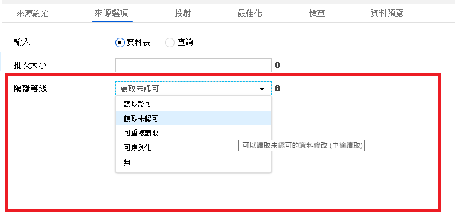
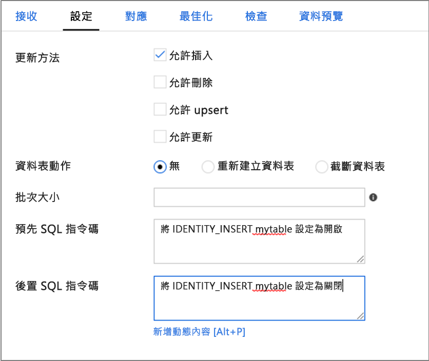

# <a name="copy-and-transform-data-in-azure-synapse-analytics-formerly-sql-data-warehouse-by-using-azure-data-factory"></a>使用 Azure Data Factory，在 Azure Synapse Analytics (先前的 SQL 資料倉儲) 中複製和轉換資料

> [!div class="op_single_selector" title1="選取您目前使用的 Data Factory 服務版本："]
>
> - [第 1 版](v1/data-factory-azure-sql-data-warehouse-connector.md)
> - [目前的版本](connector-azure-sql-data-warehouse.md)

[!INCLUDE[appliesto-adf-asa-md](includes/appliesto-adf-asa-md.md)]

本文概述如何使用 Azure Data Factory 中的複製活動，在 Azure Synapse Analytics 中來回複製資料，以及如何使用資料流程在 Azure Data Lake Storage Gen2 中轉換資料。 若要了解 Azure Data Factory，請閱讀[簡介文章](introduction.md)。

## <a name="supported-capabilities"></a>支援的功能

此 Azure Synapse Analytics 連接器支援下列活動：

- 含[支援來源/接收器矩陣](copy-activity-overview.md)資料表的[複製活動](copy-activity-overview.md)
- [對應資料流程](concepts-data-flow-overview.md)
- [查閱活動](control-flow-lookup-activity.md)
- [GetMetadata 活動](control-flow-get-metadata-activity.md)

針對複製活動，此 Azure Synapse 分析連接器支援下列功能：

- 使用 SQL 驗證和 Azure Active Directory (Azure AD) 應用程式權杖驗證搭配服務主體或 Azure 資源的受控識別來複製資料。
- 作為來源時，使用 SQL 查詢或預存程序來擷取資料。 您也可以選擇從 Azure Synapse Analytics 來源進行平行複製，如需詳細資料，請參閱 [Synapse Analytics 的並行複製](#parallel-copy-from-synapse-analytics) 一節。
- 做為接收時，使用 [PolyBase](#use-polybase-to-load-data-into-azure-synapse-analytics) 或 [COPY 陳述式](#use-copy-statement) (預覽) 或大量插入來載入資料。 我們建議 PolyBase 或 COPY 陳述式 (預覽)，以獲得較佳的複製效能。 連接器也支援根據來源架構，自動建立目的地資料表（如果不存在的話）。

> [!IMPORTANT]
> 如果您使用 Azure Data Factory Integration Runtime 來複製資料，請設定 [伺服器層級的防火牆規則](../azure-sql/database/firewall-configure.md) ，讓 Azure 服務可以存取 [邏輯 SQL server](../azure-sql/database/logical-servers.md)。
> 如果您使用自我裝載整合執行時間來複製資料，請將防火牆設定為允許適當的 IP 範圍。 此範圍包括機器的 IP，用來連線到 Azure Synapse Analytics。

## <a name="get-started"></a>開始使用

> [!TIP]
> 若要達到最佳效能，請使用 PolyBase 將資料載入 Azure Synapse Analytics。 如需詳細資訊，請參閱 [使用 PolyBase 將資料載入 Azure Synapse Analytics](#use-polybase-to-load-data-into-azure-synapse-analytics)小節。 如需使用案例的逐步解說，請參閱[使用 Azure Data Factory 在 15 分鐘內將 1 TB 載入至 Azure Synapse Analytics](load-azure-sql-data-warehouse.md)。

[!INCLUDE [data-factory-v2-connector-get-started](../../includes/data-factory-v2-connector-get-started.md)]

下列各節提供屬性的相關詳細資料，這些屬性會定義 Azure Synapse Analytics 連接器專屬的 Data Factory 實體。

## <a name="linked-service-properties"></a>連結服務屬性

以下是 Azure Synapse Analytics 連結服務支援的屬性：

| 屬性            | 說明                                                  | 必要                                                     |
| :------------------ | :----------------------------------------------------------- | :----------------------------------------------------------- |
| type                | 類型屬性必須設為 **AzureSqlDW**。             | 是                                                          |
| connectionString    | 針對 **connectionString** 屬性指定連線到 Azure Synapse Analytics 執行個體所需的資訊。 <br/>將此欄位標記為 SecureString，將它安全地儲存在 Data Factory 中。 您也可以將密碼/服務主體金鑰放在 Azure Key Vault 中，而且，如果這是 SQL 驗證，則會從連接字串中提取 `password` 組態。 請參閱表格下方的 JSON 範例和[在 Azure Key Vault 中儲存認證](store-credentials-in-key-vault.md)一文深入了解詳細資料。 | 是                                                          |
| servicePrincipalId  | 指定應用程式的用戶端識別碼。                         | 當您搭配服務主體使用 Azure AD 驗證時為是。 |
| servicePrincipalKey | 指定應用程式的金鑰。 將此欄位標記為 SecureString，將它安全地儲存在 Data Factory 中，或[參考 Azure Key Vault 中儲存的祕密](store-credentials-in-key-vault.md)。 | 當您搭配服務主體使用 Azure AD 驗證時為是。 |
| tenant              | 指定您的應用程式所在租用戶的資訊 (網域名稱或租用戶識別碼)。 將滑鼠游標暫留在 Azure 入口網站右上角，即可擷取它。 | 當您搭配服務主體使用 Azure AD 驗證時為是。 |
| azureCloudType | 針對服務主體驗證，請指定您的 Azure AD 應用程式註冊所在的 Azure 雲端環境類型。 <br/> 允許的值為 **AzurePublic**、 **AzureChina**、 **AzureUsGovernment**和 **AzureGermany**。 根據預設，會使用 data factory 的雲端環境。 | 否 |
| connectVia          | 用來連線到資料存放區的[整合執行階段](concepts-integration-runtime.md)。 您可以使用 Azure Integration Runtime 或自我裝載整合執行階段 (如果您的資料存放區位於私人網路中)。 如果未指定，就會使用預設的 Azure Integration Runtime。 | 否                                                           |

針對不同的驗證類型，請分別參閱下列有關先決條件和 JSON 範例的章節：

- [SQL 驗證](#sql-authentication)
- Azure AD 應用程式權杖驗證：[服務主體](#service-principal-authentication)
- Azure AD 應用程式權杖驗證：[適用於 Azure 資源的受控識別](#managed-identity)

>[!TIP]
>如果您遇到錯誤，其錯誤碼為 "UserErrorFailedToConnectToSqlServer"，以及「資料庫的工作階段限制為 XXX 並已達到。」訊息，請將 `Pooling=false` 新增至您的連接字串並再試一次。

### <a name="sql-authentication"></a>SQL 驗證

#### <a name="linked-service-example-that-uses-sql-authentication"></a>使用 SQL 驗證的連結服務範例

```json
{
    "name": "AzureSqlDWLinkedService",
    "properties": {
        "type": "AzureSqlDW",
        "typeProperties": {
            "connectionString": "Server=tcp:<servername>.database.windows.net,1433;Database=<databasename>;User ID=<username>@<servername>;Password=<password>;Trusted_Connection=False;Encrypt=True;Connection Timeout=30"
        },
        "connectVia": {
            "referenceName": "<name of Integration Runtime>",
            "type": "IntegrationRuntimeReference"
        }
    }
}
```

**Azure Key Vault 中的密碼：**

```json
{
    "name": "AzureSqlDWLinkedService",
    "properties": {
        "type": "AzureSqlDW",
        "typeProperties": {
            "connectionString": "Server=tcp:<servername>.database.windows.net,1433;Database=<databasename>;User ID=<username>@<servername>;Trusted_Connection=False;Encrypt=True;Connection Timeout=30",
            "password": {
                "type": "AzureKeyVaultSecret",
                "store": {
                    "referenceName": "<Azure Key Vault linked service name>",
                    "type": "LinkedServiceReference"
                },
                "secretName": "<secretName>"
            }
        },
        "connectVia": {
            "referenceName": "<name of Integration Runtime>",
            "type": "IntegrationRuntimeReference"
        }
    }
}
```

### <a name="service-principal-authentication"></a>服務主體驗證

若要使用以服務主體為基礎的 Azure AD 應用程式權杖驗證，請遵循下列步驟：

1. 從 Azure 入口網站 **[建立 Azure Active Directory 應用程式](../active-directory/develop/howto-create-service-principal-portal.md#register-an-application-with-azure-ad-and-create-a-service-principal)** 。 請記下應用程式名稱，以及下列可定義連結服務的值：

   - 應用程式識別碼
   - 應用程式金鑰
   - 租用戶識別碼

2. 如果您尚未這麼做，請在 Azure 入口網站中為您的伺服器布建**[Azure Active Directory 系統管理員](../azure-sql/database/authentication-aad-configure.md#provision-azure-ad-admin-sql-database)**。 Azure AD 系統管理員可以是 Azure AD 使用者或 Azure AD 群組。 如果您授與受控識別系統管理員角色，請略過步驟 3 和 4。 系統管理員將擁有資料庫的完整存取權。

3. 為服務主體 **[建立自主資料庫使用者](../azure-sql/database/authentication-aad-configure.md#create-contained-users-mapped-to-azure-ad-identities)** 。 以至少具有 ALTER ANY USER 權限的 AAD 身分識別，使用 SSMS 這類工具連線至您想要從中來回複製資料的資料倉儲。 執行下列 T-SQL：
  
    ```sql
    CREATE USER [your application name] FROM EXTERNAL PROVIDER;
    ```

4. 如同您一般對 SQL 使用者或其他人所做的一樣，**將所需的權限授與服務主體**。 執行下列程式碼，或參閱[這裡](https://docs.microsoft.com/sql/relational-databases/system-stored-procedures/sp-addrolemember-transact-sql)的更多選項。 如果您想要使用 PolyBase 來載入資料，請瞭解[所需的資料庫權限](#required-database-permission)。

    ```sql
    EXEC sp_addrolemember db_owner, [your application name];
    ```

5. 在 Azure Data Factory 中，**設定 Azure Synapse Analytics 連結服務**。

#### <a name="linked-service-example-that-uses-service-principal-authentication"></a>使用服務主體驗證的連結服務範例

```json
{
    "name": "AzureSqlDWLinkedService",
    "properties": {
        "type": "AzureSqlDW",
        "typeProperties": {
            "connectionString": "Server=tcp:<servername>.database.windows.net,1433;Database=<databasename>;Connection Timeout=30",
            "servicePrincipalId": "<service principal id>",
            "servicePrincipalKey": {
                "type": "SecureString",
                "value": "<service principal key>"
            },
            "tenant": "<tenant info, e.g. microsoft.onmicrosoft.com>"
        },
        "connectVia": {
            "referenceName": "<name of Integration Runtime>",
            "type": "IntegrationRuntimeReference"
        }
    }
}
```

### <a name="managed-identities-for-azure-resources-authentication"></a><a name="managed-identity"></a> Azure 資源的受控識別驗證

資料處理站可與 [Azure 資源的受控識別](data-factory-service-identity.md)相關聯，後者表示特定的處理站。 您可以使用此受控識別來進行 Azure Synapse 分析驗證。 指定的處理站可以使用此身分識別來存取資料倉儲和從中來回複製資料。

若要使用受控識別驗證，請遵循下列步驟：

1. 在 Azure 入口網站上為您的伺服器布建**[Azure Active Directory 系統管理員](../azure-sql/database/authentication-aad-configure.md#provision-azure-ad-admin-sql-database)**（如果您尚未這樣做）。 Azure AD 系統管理員可以是 Azure AD 使用者或 Azure AD 群組。 如果您授與受控識別系統管理員角色，請略過步驟 3 和 4。 系統管理員將擁有資料庫的完整存取權。

2. 為 Data Factory 受控識別 **[建立自主資料庫使用者](../azure-sql/database/authentication-aad-configure.md#create-contained-users-mapped-to-azure-ad-identities)** \(部分機器翻譯\)。 以至少具有 ALTER ANY USER 權限的 AAD 身分識別，使用 SSMS 這類工具連線至您想要從中來回複製資料的資料倉儲。 執行下列 T-SQL。
  
    ```sql
    CREATE USER [your Data Factory name] FROM EXTERNAL PROVIDER;
    ```

3. 依照您平常為 SQL 使用者和其他人所進行的操作一樣，**授與 Data Factory 受控識別所需的權限**。 執行下列程式碼，或參閱[這裡](https://docs.microsoft.com/sql/relational-databases/system-stored-procedures/sp-addrolemember-transact-sql)的更多選項。 如果您想要使用 PolyBase 來載入資料，請瞭解[所需的資料庫權限](#required-database-permission)。

    ```sql
    EXEC sp_addrolemember db_owner, [your Data Factory name];
    ```

4. 在 Azure Data Factory 中，**設定 Azure Synapse Analytics 連結服務**。

**範例︰**

```json
{
    "name": "AzureSqlDWLinkedService",
    "properties": {
        "type": "AzureSqlDW",
        "typeProperties": {
            "connectionString": "Server=tcp:<servername>.database.windows.net,1433;Database=<databasename>;Connection Timeout=30"
        },
        "connectVia": {
            "referenceName": "<name of Integration Runtime>",
            "type": "IntegrationRuntimeReference"
        }
    }
}
```

## <a name="dataset-properties"></a>資料集屬性

如需可用來定義資料集的區段和屬性完整清單，請參閱[資料集](concepts-datasets-linked-services.md)一文。

以下是 Azure Synapse Analytics 資料集支援的屬性：

| 屬性  | 說明                                                  | 必要                    |
| :-------- | :----------------------------------------------------------- | :-------------------------- |
| type      | 資料集的**類型**屬性必須設定為 **AzureSqlDWTable**。 | 是                         |
| 結構描述 | 結構描述的名稱。 |否 (來源)；是 (接收)  |
| 資料表 | 資料表/檢視的名稱。 |否 (來源)；是 (接收)  |
| tableName | 具有結構描述的資料表/檢視名稱。 支援此屬性是基於回溯相容性。 對於新的工作負載，請使用 `schema` 和 `table`。 | 否 (來源)；是 (接收) |

### <a name="dataset-properties-example"></a>資料集屬性範例

```json
{
    "name": "AzureSQLDWDataset",
    "properties":
    {
        "type": "AzureSqlDWTable",
        "linkedServiceName": {
            "referenceName": "<Azure Synapse Analytics linked service name>",
            "type": "LinkedServiceReference"
        },
        "schema": [ < physical schema, optional, retrievable during authoring > ],
        "typeProperties": {
            "schema": "<schema_name>",
            "table": "<table_name>"
        }
    }
}
```

## <a name="copy-activity-properties"></a>複製活動屬性

如需可用來定義活動的區段和屬性完整清單，請參閱[管線](concepts-pipelines-activities.md)一文。 本節提供 Azure Synapse Analytics 來源和接收所支援屬性的清單。

### <a name="azure-synapse-analytics-as-the-source"></a>Azure Synapse Analytics 做為來源

>[!TIP]
>若要使用資料分割有效率地從 Azure Synapse Analytics 載入資料，請從 [Synapse Analytics 的並行複製](#parallel-copy-from-synapse-analytics)深入瞭解。

若要從 Azure Synapse Analytics 複製資料，請將複製活動來源中的**類型**屬性設定為 **SqlDWSource**。 複製活動的 [來源] 區段支援下列屬性：

| 屬性                     | 說明                                                  | 必要 |
| :--------------------------- | :----------------------------------------------------------- | :------- |
| type                         | 複製活動來源的**類型**屬性必須設定為 **SqlDWSource**。 | 是      |
| sqlReaderQuery               | 使用自訂 SQL 查詢來讀取資料。 範例： `select * from MyTable`. | 否       |
| sqlReaderStoredProcedureName | 從來源資料表讀取資料的預存程序名稱。 最後一個 SQL 陳述式必須是預存程序中的 SELECT 陳述式。 | 否       |
| storedProcedureParameters    | 預存程序的參數。<br/>允許的值為名稱或值組。 參數的名稱和大小寫必須符合預存程序參數的名稱和大小寫。 | 否       |
| isolationLevel | 指定 SQL 來源的異動鎖定行為。 允許的值為： **ReadCommitted**、 **ReadUncommitted**、 **RepeatableRead**、 **Serializable**、 **Snapshot**。 如果未指定，則會使用資料庫的預設隔離等級。 如需詳細資訊，請參閱[這篇文件](https://docs.microsoft.com/dotnet/api/system.data.isolationlevel)。 | 否 |
| partitionOptions | 指定用來從 Azure Synapse Analytics 載入資料的資料分割選項。 <br>允許的值為： **無** (預設值) 、 **PhysicalPartitionsOfTable**和 **DynamicRange**。<br>當您啟用分割區選項時 (也就是不 `None`) ，從 Azure Synapse Analytics 並行載入資料的平行處理原則程度，是由 [`parallelCopies`](copy-activity-performance-features.md#parallel-copy) 複製活動上的設定所控制。 | 否 |
| partitionSettings | 指定資料分割的設定群組。 <br>當資料分割選項不適用時套用 `None` 。 | 否 |
| ***在 `partitionSettings` 下列情況下：*** | | |
| partitionColumnName | **以整數或日期/日期時間類型**指定來源資料行的名稱，此名稱將由範圍資料分割用於平行複製。 如果未指定，則會自動偵測資料表的索引或主鍵，並將其當做資料分割資料行使用。<br>當分割選項是 `DynamicRange` 時套用。 如果您使用查詢來取出來源資料，請  `?AdfDynamicRangePartitionCondition ` 在 WHERE 子句中掛上。 如需範例，請參閱 [SQL database 的平行複製](#parallel-copy-from-synapse-analytics) 一節。 | 否 |
| partitionUpperBound | 分割區範圍分割之分割區資料行的最大值。 這個值是用來決定資料分割 stride，而不是用來篩選資料表中的資料列。 資料表或查詢結果中的所有資料列都會進行分割和複製。 如果未指定，複製活動會自動偵測該值。  <br>當分割選項是 `DynamicRange` 時套用。 如需範例，請參閱 [SQL database 的平行複製](#parallel-copy-from-synapse-analytics) 一節。 | 否 |
| partitionLowerBound | 分割區範圍分割之分割區資料行的最小值。 這個值是用來決定資料分割 stride，而不是用來篩選資料表中的資料列。 資料表或查詢結果中的所有資料列都會進行分割和複製。 如果未指定，複製活動會自動偵測該值。<br>當分割選項是 `DynamicRange` 時套用。 如需範例，請參閱 [SQL database 的平行複製](#parallel-copy-from-synapse-analytics) 一節。 | 否 |

**範例：使用 SQL 查詢**

```json
"activities":[
    {
        "name": "CopyFromAzureSQLDW",
        "type": "Copy",
        "inputs": [
            {
                "referenceName": "<Azure Synapse Analytics input dataset name>",
                "type": "DatasetReference"
            }
        ],
        "outputs": [
            {
                "referenceName": "<output dataset name>",
                "type": "DatasetReference"
            }
        ],
        "typeProperties": {
            "source": {
                "type": "SqlDWSource",
                "sqlReaderQuery": "SELECT * FROM MyTable"
            },
            "sink": {
                "type": "<sink type>"
            }
        }
    }
]
```

**範例：使用預存程序**

```json
"activities":[
    {
        "name": "CopyFromAzureSQLDW",
        "type": "Copy",
        "inputs": [
            {
                "referenceName": "<Azure Synapse Analytics input dataset name>",
                "type": "DatasetReference"
            }
        ],
        "outputs": [
            {
                "referenceName": "<output dataset name>",
                "type": "DatasetReference"
            }
        ],
        "typeProperties": {
            "source": {
                "type": "SqlDWSource",
                "sqlReaderStoredProcedureName": "CopyTestSrcStoredProcedureWithParameters",
                "storedProcedureParameters": {
                    "stringData": { "value": "str3" },
                    "identifier": { "value": "$$Text.Format('{0:yyyy}', <datetime parameter>)", "type": "Int"}
                }
            },
            "sink": {
                "type": "<sink type>"
            }
        }
    }
]
```

**範例預存程序：**

```sql
CREATE PROCEDURE CopyTestSrcStoredProcedureWithParameters
(
    @stringData varchar(20),
    @identifier int
)
AS
SET NOCOUNT ON;
BEGIN
    select *
    from dbo.UnitTestSrcTable
    where dbo.UnitTestSrcTable.stringData != stringData
    and dbo.UnitTestSrcTable.identifier != identifier
END
GO
```

### <a name="azure-synapse-analytics-as-sink"></a><a name="azure-sql-data-warehouse-as-sink"></a>Azure Synapse Analytics 做為接收

Azure Data Factory 支援將資料載入 Azure Synapse Analytics 的三種方式。


- [使用 PolyBase](#use-polybase-to-load-data-into-azure-synapse-analytics)
- [使用 COPY 陳述式 (預覽)](#use-copy-statement)
- 使用大量插入

載入資料的最快速且可調整的方式是透過 [PolyBase](https://docs.microsoft.com/sql/relational-databases/polybase/polybase-guide)或[COPY 陳述式](https://docs.microsoft.com/sql/t-sql/statements/copy-into-transact-sql)(預覽)。

若要將資料複製到 Azure Synapse Analytics，請將複製活動中的接收類型設定為 **>sqldwsink**。 複製活動的 [接收] 區段支援下列屬性：

| 屬性          | 說明                                                  | 必要                                      |
| :---------------- | :----------------------------------------------------------- | :-------------------------------------------- |
| type              | 複製活動接收端的**類型**屬性必須設定為 **SqlDWSink**。 | 是                                           |
| allowPolyBase     | 指出是否要使用 PolyBase 將資料載入 Azure Synapse Analytics 中。 `allowCopyCommand` 和 `allowPolyBase` 不可同時為 true。 <br/><br/>如需條件約束和詳細資料，請參閱 [使用 PolyBase 將資料載入 Azure Synapse Analytics](#use-polybase-to-load-data-into-azure-synapse-analytics) 一節。<br/><br/>允許的值為 **True** 和 **False** (預設值)。 | 否。<br/>使用 PolyBase 時套用。     |
| polyBaseSettings  | 可以在 `allowPolybase` 屬性設定為 **true** 時指定的一組屬性。 | 否。<br/>使用 PolyBase 時套用。 |
| allowCopyCommand | 指出是否要使用 (preview) 的 [COPY 語句](https://docs.microsoft.com/sql/t-sql/statements/copy-into-transact-sql) 將資料載入 Azure Synapse Analytics。 `allowCopyCommand` 和 `allowPolyBase` 不可同時為 true。 <br/><br/>如需條件約束和詳細資料，請參閱 [使用 COPY 語句將資料載入 Azure Synapse Analytics](#use-copy-statement) 一節。<br/><br/>允許的值為 **True** 和 **False** (預設值)。 | 否。<br>使用 COPY 時套用。 |
| copyCommandSettings | 可以在 `allowCopyCommand` 屬性設定為 TRUE 時指定的一組屬性。 | 否。<br/>使用 COPY 時套用。 |
| writeBatchSize    | 對於**每個批次**要插入 SQL 資料表中的資料列數。<br/><br/>允許的值為**整數** (資料列數目)。 根據預設，Data Factory 會依據資料列大小動態決定適當的批次大小。 | 否。<br/>使用 bulk insert 時套用。     |
| writeBatchTimeout | 在逾時前等待批次插入作業完成的時間。<br/><br/>允許的值為**時間範圍**。 範例：「00:30:00」(30 分鐘)。 | 否。<br/>使用 bulk insert 時套用。        |
| preCopyScript     | 指定在每次執行中將資料寫入 Azure Synapse Analytics 之前，要執行的複製活動的 SQL 查詢。 使用此屬性來清除預先載入的資料。 | 否                                            |
| tableOption | 指定是否要根據來源架構， [自動建立接收資料表](copy-activity-overview.md#auto-create-sink-tables) （如果不存在的話）。 允許的值包為：`none` (預設) 或 `autoCreate`。 |否 |
| disableMetricsCollection | Data Factory 會收集諸如複製效能優化和建議的 Azure Synapse Analytics Dwu 等度量。 如果您擔心此行為，請指定 `true` 將其關閉。 | 否 (預設值為 `false`) |

#### <a name="azure-synapse-analytics-sink-example"></a>Azure Synapse Analytics 接收器範例

```json
"sink": {
    "type": "SqlDWSink",
    "allowPolyBase": true,
    "polyBaseSettings":
    {
        "rejectType": "percentage",
        "rejectValue": 10.0,
        "rejectSampleValue": 100,
        "useTypeDefault": true
    }
}
```

## <a name="parallel-copy-from-synapse-analytics"></a>從 Synapse 分析進行平行複製

複製活動中的 Azure Synapse Analytics 連接器提供內建資料分割，以平行方式複製資料。 您可以在複製活動的 [ **來源** ] 索引標籤上找到資料分割選項。


當您啟用分割區複製時，複製活動會針對您的 Azure Synapse Analytics 來源執行平行查詢，以依分割區載入資料。 平行程度由複製活動的 [`parallelCopies`](copy-activity-performance-features.md#parallel-copy) 設定所控制。 例如，如果您設定 `parallelCopies` 為四，Data Factory 會同時產生並執行四個以指定的資料分割選項和設定為基礎的查詢，而每個查詢都會從您的 Azure Synapse Analytics 中取出部分資料。

當您從 Azure Synapse Analytics 載入大量資料時，建議您啟用資料分割的平行複製。 以下針對各種情節的建議設定。 將資料複製到以檔案為基礎的資料存放區時，建議您將資料夾做為多個檔案寫入 (只指定資料夾名稱) ，在此情況下，效能比寫入單一檔案更好。

| 狀況                                                     | 建議的設定                                           |
| ------------------------------------------------------------ | ------------------------------------------------------------ |
| 具有實體資料分割之大型資料表的完整載入。        | **分割區選項**：資料表的實體分割區。 <br><br/>在執行期間，Data Factory 會自動偵測實體分割區，並依分割區複製資料。 <br><br/>若要檢查您的資料表是否有實體分割區，您可以參考 [此查詢](#sample-query-to-check-physical-partition)。 |
| 從大型資料表完整載入（沒有實體資料分割），同時使用整數或 datetime 資料行進行資料分割。 | **分割選項**：動態範圍分割。<br>**分割** 區資料行 (選擇性) ：指定用來分割資料的資料行。 如果未指定，則會使用索引或主鍵資料行。<br/>**分割區上限** 和資料 **分割下限** (選擇性) ：指定是否要判斷資料分割 stride。 這不是用來篩選資料表中的資料列，而是資料表中的所有資料列都會進行分割和複製。 如果未指定，複製活動會自動偵測這些值。<br><br>例如，如果您的資料分割資料行 "ID" 的值範圍從1到100，而且您將下限設定為20，並將上限設為80，並將平行複製設為4，則 Data Factory 會分別以4個數據分割識別碼（範圍 <= 20、[21、50]、[51、80] 和 >= 81）抓取資料。 |
| 使用自訂查詢（沒有實體資料分割）載入大量資料，並使用資料分割的整數或日期/日期時間資料行。 | **分割選項**：動態範圍分割。<br>**查詢**：`SELECT * FROM <TableName> WHERE ?AdfDynamicRangePartitionCondition AND <your_additional_where_clause>`。<br>**分割資料行**：指定用來分割資料的資料行。<br>**分割區上限** 和資料 **分割下限** (選擇性) ：指定是否要判斷資料分割 stride。 這不是用來篩選資料表中的資料列，而且查詢結果中的所有資料列都會進行分割和複製。 如果未指定，複製活動會自動偵測該值。<br><br>在執行期間，Data Factory 會 `?AdfRangePartitionColumnName` 以實際的資料行名稱和每個資料分割的值範圍取代，並傳送至 Azure Synapse Analytics。 <br>例如，如果您的資料分割資料行 "ID" 的值範圍從1到100，而且您將下限設定為20，並將上限設為80，並將平行複製設為4，則 Data Factory 會分別以4個數據分割識別碼（範圍 <= 20、[21、50]、[51、80] 和 >= 81）抓取資料。 <br><br>以下是針對不同案例的查詢範例：<br> 1. 查詢整個資料表： <br>`SELECT * FROM <TableName> WHERE ?AdfDynamicRangePartitionCondition`<br> 2. 從包含資料行選取和其他 where 子句篩選的資料表查詢： <br>`SELECT <column_list> FROM <TableName> WHERE ?AdfDynamicRangePartitionCondition AND <your_additional_where_clause>`<br> 3. 使用子查詢進行查詢： <br>`SELECT <column_list> FROM (<your_sub_query>) AS T WHERE ?AdfDynamicRangePartitionCondition AND <your_additional_where_clause>`<br> 4. 查詢子查詢中的資料分割： <br>`SELECT <column_list> FROM (SELECT <your_sub_query_column_list> FROM <TableName> WHERE ?AdfDynamicRangePartitionCondition) AS T`
|

使用資料分割選項載入資料的最佳作法：

1. 選擇獨特的資料行做為資料分割資料行 (例如 primary key 或 unique key) ，以避免資料扭曲。 
2. 如果資料表有內建的資料分割，請使用資料分割選項「資料表的實體分割區」來取得較佳的效能。
3. 如果您使用 Azure Integration Runtime 複製資料，您可以將較大的「[資料整合單位 (DIU) ](copy-activity-performance-features.md#data-integration-units)」 ( # B0 4) ，以利用更多計算資源。 查看該處適用的案例。
4. 「[複製平行](copy-activity-performance-features.md#parallel-copy)處理原則的程度」控制資料分割編號，設定此數目太大有時會影響效能，建議將此數目設定為 (DIU 或自我裝載 IR 節點的數目) * (2 到 4) 。
5. 注意 Azure Synapse Analytics 可以一次執行最多32個查詢，設定「複製平行處理原則的程度」太大可能會導致 Synapse 節流問題。

**範例：具有實體分割區之大型資料表的完整載入**

```json
"source": {
    "type": "SqlDWSource",
    "partitionOption": "PhysicalPartitionsOfTable"
}
```

**範例：使用動態範圍分割進行查詢**

```json
"source": {
    "type": "SqlDWSource",
    "query": "SELECT * FROM <TableName> WHERE ?AdfDynamicRangePartitionCondition AND <your_additional_where_clause>",
    "partitionOption": "DynamicRange",
    "partitionSettings": {
        "partitionColumnName": "<partition_column_name>",
        "partitionUpperBound": "<upper_value_of_partition_column (optional) to decide the partition stride, not as data filter>",
        "partitionLowerBound": "<lower_value_of_partition_column (optional) to decide the partition stride, not as data filter>"
    }
}
```

### <a name="sample-query-to-check-physical-partition"></a>檢查實體資料分割的範例查詢

```sql
SELECT DISTINCT s.name AS SchemaName, t.name AS TableName, c.name AS ColumnName, CASE WHEN c.name IS NULL THEN 'no' ELSE 'yes' END AS HasPartition
FROM sys.tables AS t
LEFT JOIN sys.objects AS o ON t.object_id = o.object_id
LEFT JOIN sys.schemas AS s ON o.schema_id = s.schema_id
LEFT JOIN sys.indexes AS i ON t.object_id = i.object_id
LEFT JOIN sys.index_columns AS ic ON ic.partition_ordinal > 0 AND ic.index_id = i.index_id AND ic.object_id = t.object_id
LEFT JOIN sys.columns AS c ON c.object_id = ic.object_id AND c.column_id = ic.column_id
LEFT JOIN sys.types AS y ON c.system_type_id = y.system_type_id
WHERE s.name='[your schema]' AND t.name = '[your table name]'
```

如果資料表有實體分割區，您會看到 "HasPartition" 為 "yes"。

## <a name="use-polybase-to-load-data-into-azure-synapse-analytics"></a>使用 PolyBase 將資料載入 Azure Synapse Analytics

使用 [PolyBase](https://docs.microsoft.com/sql/relational-databases/polybase/polybase-guide) 是以高輸送量將大量資料載入 Azure Synapse Analytics 的有效方法。 使用 PolyBase 而不是預設的 BULKINSERT 機制，將可看到輸送量大幅提升。 如需使用案例的逐步解說，請參閱[將 1 TB 載入至 Azure Synapse Analytics](v1/data-factory-load-sql-data-warehouse.md)。

- 如果您的來源資料是在 **Azure Blob 中，Azure Data Lake Storage Gen1 或 Azure Data Lake Storage Gen2**，而且 **格式與 PolyBase 相容**，您可以使用複製活動來直接叫用 polybase，讓 Azure Synapse Analytics 從來源提取資料。 如需詳細資料，請參閱 **[使用 PolyBase 直接複製](#direct-copy-by-using-polybase)** 。
- 如果您的來源資料存放區與格式不受 PolyBase 支援，您可以改用 **[使用 PolyBase 分段複製](#staged-copy-by-using-polybase)** 功能。 分段複製功能也能提供更好的輸送量。 它會自動將資料轉換成 PolyBase 相容的格式，將資料儲存在 Azure Blob 儲存體中，然後呼叫 PolyBase 將資料載入 Azure Synapse Analytics 中。

> [!TIP]
> 深入瞭解[使用 PolyBase 的最佳做法](#best-practices-for-using-polybase)。

在複製活動的 `polyBaseSettings` 下支援下列 PolyBase 設定：

| 屬性          | 說明                                                  | 必要                                      |
| :---------------- | :----------------------------------------------------------- | :-------------------------------------------- |
| rejectValue       | 指定在查詢失敗前可以拒絕的資料列數目或百分比。<br/><br/>在 [CREATE EXTERNAL TABLE (Transact-SQL)](https://msdn.microsoft.com/library/dn935021.aspx)的＜引數＞一節中，深入瞭解 PolyBase 的拒絕選項。 <br/><br/>允許的值為 0 (預設值)、1、2 等其他值。 | 否                                            |
| rejectType        | 指定 **rejectValue** 選項為常值或百分比。<br/><br/>允許的值為**值** (預設值) 和**百分比**。 | 否                                            |
| rejectSampleValue | 決定在 PolyBase 重新計算已拒絕的資料列百分比之前，所要擷取的資料列數目。<br/><br/>允許的值為 1、2 等其他值。 | 是，如果 **rejectType** 是**百分比**。 |
| useTypeDefault    | 指定當 PolyBase 從文字檔擷取資料時，如何處理分隔符號文字檔中遺漏的值。<br/><br/>從 [CREATE EXTERNAL FILE FORMAT (Transact-SQL)](https://msdn.microsoft.com/library/dn935026.aspx) 的＜引數＞一節深入了解這個屬性。<br/><br/>允許的值為 **True** 和 **False** (預設值)。<br><br> | 否                                            |

### <a name="direct-copy-by-using-polybase"></a>使用 PolyBase 直接複製

Azure Synapse Analytics PolyBase 直接支援 Azure Blob、Azure Data Lake Storage Gen1 和 Azure Data Lake Storage Gen2。 如果您的來源資料符合本節所述準則，即可使用 PolyBase 從來源資料存放區直接複製到 Azure Synapse Analytics。 否則，請利用[使用 PolyBase 分段複製](#staged-copy-by-using-polybase)。

> [!TIP]
> 若要有效率地將資料複製到 Azure Synapse Analytics，深入瞭解 [Azure Data Factory 可讓您更輕鬆且方便地在使用 Data Lake Store 搭配 Azure Synapse Analytics 時發現資料的見解](https://blogs.msdn.microsoft.com/azuredatalake/2017/04/08/azure-data-factory-makes-it-even-easier-and-convenient-to-uncover-insights-from-data-when-using-data-lake-store-with-sql-data-warehouse/)。

如果不符合需求，Azure Data Factory 會檢查設定，並自動切換回適用於資料移動的 BULKINSERT 機制。

1. **來源連結服務**使用下列類型和驗證方法：

    | 支援的來源資料存放區類型                             | 支援的來源驗證類型                        |
    | :----------------------------------------------------------- | :---------------------------------------------------------- |
    | [Azure Blob](connector-azure-blob-storage.md)                | 帳戶金鑰驗證、受控識別驗證 |
    | [Azure Data Lake Storage Gen1](connector-azure-data-lake-store.md) | 服務主體驗證                            |
    | [Azure Data Lake Storage Gen2](connector-azure-data-lake-storage.md) \(部分機器翻譯\) | 帳戶金鑰驗證、受控識別驗證 |

    >[!IMPORTANT]
    >如果您的 Azure 儲存體設定了 VNet 服務端點，您必須使用受控識別驗證 - 請參閱[使用 VNet 服務端點搭配 Azure 儲存體的影響](../azure-sql/database/vnet-service-endpoint-rule-overview.md#impact-of-using-vnet-service-endpoints-with-azure-storage)。 從 [Azure Blob 受控識別驗證](connector-azure-blob-storage.md#managed-identity)和 [Azure Data Lake Storage Gen2 受控識別驗證](connector-azure-data-lake-storage.md#managed-identity)一節的 Data Factory 中，瞭解所需的設定。

2. **來源資料格式**是 **Parquet**、**ORC** 或**分隔的文字**，並具有下列設定：

   1. 資料夾路徑不包含萬用字元篩選條件。
   2. 檔案名稱是空的，或指向單一檔案。 如果您在複製活動中指定萬用字元檔案名稱，則只能是 `*` 或 `*.*`。
   3. `rowDelimiter` 是**預設值**、 **\n**、 **\r\n** 或 **\r**。
   4. `nullValue` 會保留預設值或設定為**空字串** ("")，而 `treatEmptyAsNull` 則保留預設值或設定為 true。
   5. `encodingName` 會保留為預設值，或設定為 **utf-8**。
   6. 未指定 `quoteChar`、`escapeChar` 與 `skipLineCount`。 PolyBase 支援略過標頭列，這在 ADF 中可設定為 `firstRowAsHeader`。
   7. `compression` 可以是「無壓縮」、**GZip** 或 **Deflate**。

3. 如果您的來源是資料夾，則複製活動中的 `recursive` 必須設定為 true。

4. `wildcardFolderPath``wildcardFilename` `modifiedDateTimeStart` 未指定、、、、 `modifiedDateTimeEnd` `prefix` `enablePartitionDiscovery` 和 `additionalColumns` 。

>[!NOTE]
>如果您的來源是資料夾，請注意 PolyBase 會從資料夾及其所有子資料夾擷取檔案，而且不會從檔案名稱開頭為底線 (_) 或句號 (.) 的檔案中擷取資料，如[這裡 - LOCATION 引數](https://docs.microsoft.com/sql/t-sql/statements/create-external-table-transact-sql#arguments-2)所述。

```json
"activities":[
    {
        "name": "CopyFromAzureBlobToSQLDataWarehouseViaPolyBase",
        "type": "Copy",
        "inputs": [
            {
                "referenceName": "ParquetDataset",
                "type": "DatasetReference"
            }
        ],
        "outputs": [
            {
                "referenceName": "AzureSQLDWDataset",
                "type": "DatasetReference"
            }
        ],
        "typeProperties": {
            "source": {
                "type": "ParquetSource",
                "storeSettings":{
                    "type": "AzureBlobStorageReadSettings",
                    "recursive": true
                }
            },
            "sink": {
                "type": "SqlDWSink",
                "allowPolyBase": true
            }
        }
    }
]
```

### <a name="staged-copy-by-using-polybase"></a>使用 PolyBase 分段複製

當您的來源資料與 PolyBase 原生不相容時，請啟用透過過渡暫存 Azure Blob 或 Azure Data Lake Storage Gen2 的資料複製， (它不能是 Azure 進階儲存體) 。 在此情況下，Azure Data Factory 會自動轉換資料，以符合 PolyBase 的資料格式需求。 然後，它會叫用 PolyBase 將資料載入 Azure Synapse Analytics 中。 最後，它會清除儲存體中的暫存資料。 如需透過暫存複製資料的詳細資訊，請參閱 [分段複製](copy-activity-performance-features.md#staged-copy) 。

若要使用這項功能，請建立 [Azure Blob 儲存體連結服務](connector-azure-blob-storage.md#linked-service-properties) 或 [Azure Data Lake Storage Gen2 連結服務](connector-azure-data-lake-storage.md#linked-service-properties) ，以參考具有暫時儲存體的 Azure 儲存體帳戶。 然後指定複製活動的 `enableStaging` 和 `stagingSettings` 屬性，如下列程式碼所示。

>[!IMPORTANT]
>如果您的暫存 Azure 儲存體設定了 VNet 服務端點，您必須使用受控識別驗證 - 請參閱[使用 VNet 服務端點搭配 Azure 儲存體的影響](../azure-sql/database/vnet-service-endpoint-rule-overview.md#impact-of-using-vnet-service-endpoints-with-azure-storage)。 從 [Azure Blob 受控身分識別驗證](connector-azure-blob-storage.md#managed-identity) 和 [Azure Data Lake Storage Gen2 受控身分識別驗證](connector-azure-data-lake-storage.md#managed-identity)Data Factory 瞭解所需的設定。

```json
"activities":[
    {
        "name": "CopyFromSQLServerToSQLDataWarehouseViaPolyBase",
        "type": "Copy",
        "inputs": [
            {
                "referenceName": "SQLServerDataset",
                "type": "DatasetReference"
            }
        ],
        "outputs": [
            {
                "referenceName": "AzureSQLDWDataset",
                "type": "DatasetReference"
            }
        ],
        "typeProperties": {
            "source": {
                "type": "SqlSource",
            },
            "sink": {
                "type": "SqlDWSink",
                "allowPolyBase": true
            },
            "enableStaging": true,
            "stagingSettings": {
                "linkedServiceName": {
                    "referenceName": "MyStagingStorage",
                    "type": "LinkedServiceReference"
                }
            }
        }
    }
]
```

### <a name="best-practices-for-using-polybase"></a>使用 PolyBase 的最佳做法

除了＜[Azure Synapse Analytics 的最佳做法](../synapse-analytics/sql/best-practices-sql-pool.md)＞中所述的方法外，下列章節還提供其他最佳做法。

#### <a name="required-database-permission"></a>必要的資料庫權限

若要使用 PolyBase，將資料載入 Azure Synapse Analytics 的使用者必須擁有目標資料庫的「 [控制」許可權](https://msdn.microsoft.com/library/ms191291.aspx) 。 達到此目標的其中一個方法是將該使用者新增為 **db_owner** 角色的成員。 在 [Azure Synapse Analytics 總覽](../synapse-analytics/sql-data-warehouse/sql-data-warehouse-overview-manage-security.md#authorization)中瞭解如何進行。

#### <a name="row-size-and-data-type-limits"></a>資料列大小和資料類型限制

PolyBase 負載的限制為小於 1 MB 的資料列。 這無法用來載入 VARCHR(MAX)、NVARCHAR(MAX) 或 VARBINARY(MAX)。 如需詳細資訊，請參閱 [Azure Synapse Analytics 服務容量限制](../synapse-analytics/sql-data-warehouse/sql-data-warehouse-service-capacity-limits.md#loads)。

當您來源資料中的資料列大於 1 MB 時，您可能要將來源資料表垂直分割成幾個小的資料表。 務必確認每一列的大小不會超過限制。 然後可以使用 PolyBase 載入較小的資料表，並且在 Azure Synapse Analytics 中將其合併在一起。

或者，對於具有這類寬資料行的資料，您可以藉由關閉「允許 PolyBase」設定，使用非 PolyBase 來載入資料 (使用 ADF)。

#### <a name="azure-synapse-analytics-resource-class"></a>Azure Synapse Analytics 資源類別

若要達到最佳的可能輸送量，請將較大的資源類別指派給可透過 PolyBase 將資料載入 Azure Synapse Analytics 的使用者。

#### <a name="polybase-troubleshooting"></a>PolyBase, 疑難排解

**載入至 Decimal 資料行**

如果您的來源資料是文字格式或其他非 PolyBase 相容的存放區 (使用分段複製和 PolyBase) ，而且它包含要載入至 Azure Synapse Analytics Decimal 資料行的空白值，您可能會遇到下列錯誤：

```
ErrorCode=FailedDbOperation, ......HadoopSqlException: Error converting data type VARCHAR to DECIMAL.....Detailed Message=Empty string can't be converted to DECIMAL.....
```

解決方法是在複製活動接收中取消選取 [使用類型預設] 選項 (如 false) - > PolyBase 設定。 「[USE_TYPE_DEFAULT](https://docs.microsoft.com/sql/t-sql/statements/create-external-file-format-transact-sql#arguments)」是 PolyBase原生設定，會指定當 PolyBase 從文字檔擷取資料時，如何處理分隔符號文字檔中遺漏的值。

**`tableName` 在 Azure Synapse Analytics 中**

下表是如何在 JSON 資料集中指定 **tableName** 屬性的範例。 其中會顯示數個結構描述和資料表名稱的組合。

| DB 結構描述 | 資料表名稱 | **tableName** JSON 屬性               |
| --------- | ---------- | ----------------------------------------- |
| dbo       | MyTable    | MyTable 或 dbo.MyTable 或 [dbo].[MyTable] |
| dbo1      | MyTable    | dbo1.MyTable 或 [dbo1].[MyTable]          |
| dbo       | My.Table   | [My.Table] 或 [dbo].[My.Table]            |
| dbo1      | My.Table   | [dbo1].[My.Table]                         |

如果您看到下列錯誤，可能是您為 **tableName** 屬性指定的值有問題。 請參閱前面的資料表，以正確的方式指定 **tableName** JSON 屬性的值。

```
Type=System.Data.SqlClient.SqlException,Message=Invalid object name 'stg.Account_test'.,Source=.Net SqlClient Data Provider
```

**包含預設值的資料行**

Data Factory 中的 PolyBase 功能目前只接受與目標資料表中相同的資料行數目。 範例是內含四個資料行的資料表，且其中一個資料行已使用預設值進行定義。 輸入資料仍需要有四個資料行。 3 個資料行的輸入資料集會產生類似下列訊息的錯誤︰

```
All columns of the table must be specified in the INSERT BULK statement.
```

NULL 值是一種特殊形式的預設值。 如果資料欄可以是 Null，Blob 中該欄的輸入資料可能會是空白。 但輸入資料集中不能缺少輸入資料。 PolyBase 會在 Azure Synapse Analytics 中為遺漏值插入 NULL。

## <a name="use-copy-statement-to-load-data-into-azure-synapse-analytics-preview"></a><a name="use-copy-statement"></a> 使用 COPY 語句將資料載入 Azure Synapse Analytics (preview) 

Azure Synapse Analytics [COPY 語句](https://docs.microsoft.com/sql/t-sql/statements/copy-into-transact-sql) (preview) 直接支援從 **Azure Blob 載入資料和 Azure Data Lake Storage Gen2**。 如果您的來源資料符合本節所述的準則，您可以選擇在 ADF 中使用 COPY 語句將資料載入 Azure Synapse Analytics 中。 Azure Data Factory 會檢查設定，並在不符合準則時失敗複製活動執行。

>[!NOTE]
>目前 Data Factory 僅支援從複製陳述式相容來源複製，如下所述。

使用 COPY 陳述式支援下列設定：

1. **來源連結服務和格式**使用下列類型和驗證方法：

    | 支援的來源資料存放區類型                             | 支援的格式           | 支援的來源驗證類型                         |
    | :----------------------------------------------------------- | -------------------------- | :----------------------------------------------------------- |
    | [Azure Blob](connector-azure-blob-storage.md)                | [分隔符號文字](format-delimited-text.md)             | 帳戶金鑰驗證、共用存取簽章驗證、服務主體驗證、受控識別驗證 |
    | &nbsp;                                                       | [Parquet](format-parquet.md)                    | 帳戶金鑰驗證、共用存取簽章驗證 |
    | &nbsp;                                                       | [ORC](format-orc.md)                        | 帳戶金鑰驗證、共用存取簽章驗證 |
    | [Azure Data Lake Storage Gen2](connector-azure-data-lake-storage.md) \(部分機器翻譯\) | [分隔符號文字](format-delimited-text.md)<br/>[Parquet](format-parquet.md)<br/>[ORC](format-orc.md) | 帳戶金鑰驗證、服務主體驗證、受控識別驗證 |

    >[!IMPORTANT]
    >如果您的 Azure 儲存體設定了 VNet 服務端點，您必須使用受控識別驗證 - 請參閱[使用 VNet 服務端點搭配 Azure 儲存體的影響](../azure-sql/database/vnet-service-endpoint-rule-overview.md#impact-of-using-vnet-service-endpoints-with-azure-storage)。 從 [Azure Blob 受控識別驗證](connector-azure-blob-storage.md#managed-identity)和 [Azure Data Lake Storage Gen2 受控識別驗證](connector-azure-data-lake-storage.md#managed-identity)一節的 Data Factory 中，瞭解所需的設定。

2. 格式設定使用下列各項︰

   1. 對於 **Parquet**：`compression`可以是**不壓縮**、**Snappy** 或 **GZip**。
   2. 對於 **ORC**：`compression`可以是**不壓縮**、 **```zlib```** 或 **Snappy**。
   3. 對於**分隔符號文字**：
      1. `rowDelimiter`明確設定為**單一字元**或「 **\r\n**」，不支援預設值。
      2. `nullValue` 會保留為預設值，或設定為**空字串** ("")。
      3. `encodingName` 會保留為預設值，或設定為 **utf-8 或 utf-16**。
      4. `escapeChar` 必須與 `quoteChar` 相同，而且不是空的。
      5. `skipLineCount` 會保留為預設值或設定為 0。
      6. `compression` 可以是**不壓縮**或 **GZip**。

3. 如果您的來源是資料夾，則複製活動中的 `recursive` 必須設定為 true，而且 `wildcardFilename` 必須是 `*`。 

4. `wildcardFolderPath``wildcardFilename` (， `*` `modifiedDateTimeStart` `modifiedDateTimeEnd` `prefix` `enablePartitionDiscovery` `additionalColumns` 則不會指定) 、、、和以外的。

在複製活動的 `allowCopyCommand` 下支援下列 COPY 陳述式設定：

| 屬性          | 說明                                                  | 必要                                      |
| :---------------- | :----------------------------------------------------------- | :-------------------------------------------- |
| defaultValues | 針對 Azure Synapse Analytics 中的每個目標資料行指定預設值。  屬性中的預設值會覆寫資料倉儲中設定的預設條件約束，而且識別欄位不可有預設值。 | 否 |
| additionalOptions | 將直接在 [copy 語句](https://docs.microsoft.com/sql/t-sql/statements/copy-into-transact-sql)的 "With" 子句中傳遞給 Azure Synapse Analytics COPY 語句的其他選項。 視需要將值加上引號，以配合 COPY 陳述式需求。 | 否 |

```json
"activities":[
    {
        "name": "CopyFromAzureBlobToSQLDataWarehouseViaCOPY",
        "type": "Copy",
        "inputs": [
            {
                "referenceName": "ParquetDataset",
                "type": "DatasetReference"
            }
        ],
        "outputs": [
            {
                "referenceName": "AzureSQLDWDataset",
                "type": "DatasetReference"
            }
        ],
        "typeProperties": {
            "source": {
                "type": "ParquetSource",
                "storeSettings":{
                    "type": "AzureBlobStorageReadSettings",
                    "recursive": true
                }
            },
            "sink": {
                "type": "SqlDWSink",
                "allowCopyCommand": true,
                "copyCommandSettings": {
                    "defaultValues": [
                        {
                            "columnName": "col_string",
                            "defaultValue": "DefaultStringValue"
                        }
                    ],
                    "additionalOptions": {
                        "MAXERRORS": "10000",
                        "DATEFORMAT": "'ymd'"
                    }
                }
            },
            "enableSkipIncompatibleRow": true
        }
    }
]
```

## <a name="mapping-data-flow-properties"></a>對應資料流程屬性

在對應資料流程中轉換資料時，您可以從 Azure Synapse 分析讀取和寫入資料表。 如需詳細資訊，請參閱對應資料流程中的[來源轉換](data-flow-source.md)和[接收轉換](data-flow-sink.md)。

### <a name="source-transformation"></a>來源轉換

您可以在來源轉換的 [來源選項] 索引標籤中找到 Azure Synapse 分析的特定設定。

**輸入** 選取您的來源是否指向) 的資料表 (相等， ```Select * from <table-name>``` 或輸入自訂的 SQL 查詢。

**啟用預備** 環境強烈建議您在生產工作負載中搭配 Synapse DW 來源使用此選項。 當您從管線執行具有 Synapase 來源的資料流程活動時，ADF 會提示您輸入預備位置儲存體帳戶，並將其用於暫存資料載入。 它是從 Synapse DW 載入資料的最快機制。

**查詢**：如果您在 [輸入] 欄位中選取 [查詢]，請對於您的來源輸入 SQL 查詢。 此設定會覆寫您在資料集中選擇的任何資料表。 這裡不支援 **Order By** 子句，但您可以設定完整的 SELECT FROM 陳述式。 您也可使用使用者定義的資料表函數。 **select * from udfGetData()** 是 SQL 中傳回資料表的 UDF。 此查詢會產生您可以在資料流程中使用的來源資料表。 使用查詢也是縮減資料列以進行測試或查閱的絕佳方式。

SQL 範例：```Select * from MyTable where customerId > 1000 and customerId < 2000```

**批次大小**：輸入批次大小，以將大量資料分成多次讀取。 在資料流程中，ADF 會使用此設定來設定 Spark 單欄式快取。 這是選項欄位，如果將其保留空白，將會使用 Spark 預設值。

**隔離等級**：對應資料流程中 SQL 來源的預設值為「未認可」。 您可以在這裡將隔離等級變更為下列其中一個值：

- 讀取認可
- 讀取未認可
- 可重複讀取
- Serializable *-無 (忽略隔離等級) 



### <a name="sink-transformation"></a>接收轉換

您可以在接收轉換的 [設定] 索引標籤中找到 Azure Synapse 分析的特定設定。

**Update 方法：** 決定您的資料庫目的地所允許的作業。 預設僅允許插入。 若要更新、upsert 或刪除資料列，必須使用 alter-row 轉換來標記這些動作的資料列。 對於更新、更新插入和刪除，必須設定索引鍵資料行，以決定要改變哪一個資料列。

**資料表動作：** 決定在寫入之前，是否要重新建立或移除目的地資料表中的所有資料列。

- 無：資料表不會執行任何動作。
- 重新建立：資料表會遭到捨棄並重新建立。 如果要動態建立新的資料表，則為必要。
- Truncate：會移除目標資料表中的所有資料列。

**啟用暫存：** 決定在寫入 Azure Synapse 分析時，是否要使用 [PolyBase](https://docs.microsoft.com/sql/relational-databases/polybase/polybase-guide)

**批次大小**：控制要在每個值區中寫入的資料列數目。 較大的批次大小會改善壓縮和記憶體優化，但會導致在快取資料時發生記憶體例外狀況的風險。

**前置和後置 SQL 指令碼**：輸入將在寫入至您的接收資料庫之前 (前置處理) 和之後 (後置處理) 將執行的多行 SQL 指令碼



## <a name="lookup-activity-properties"></a>查閱活動屬性

若要了解關於屬性的詳細資料，請參閱[查閱活動](control-flow-lookup-activity.md)。

## <a name="getmetadata-activity-properties"></a>GetMetadata 活動屬性

若要了解關於屬性的詳細資料，請參閱 [GetMetadata 活動](control-flow-get-metadata-activity.md)

## <a name="data-type-mapping-for-azure-synapse-analytics"></a>Azure Synapse Analytics 的資料類型對應

從 Azure Synapse Analytics 複製資料或將資料複製到該處時，會使用下列從 Azure Synapse Analytics 資料類型對應到 Azure Data Factory 過渡期資料類型的對應。 請參閱[結構描述和資料類型對應](copy-activity-schema-and-type-mapping.md)，以了解複製活動如何將來源結構描述和資料類型對應至接收。

>[!TIP]
>如需有關 Azure Synapse Analytics 支援的資料類型與不支援的資料類型的因應措施，請參閱 [Azure Synapse Analytics 文章中的資料表資料類型](../synapse-analytics/sql/develop-tables-data-types.md) 。

| Azure Synapse Analytics 資料類型    | Data Factory 過渡期資料類型 |
| :------------------------------------ | :----------------------------- |
| BIGINT                                | Int64                          |
| BINARY                                | Byte[]                         |
| bit                                   | Boolean                        |
| char                                  | String, Char[]                 |
| date                                  | Datetime                       |
| Datetime                              | Datetime                       |
| datetime2                             | Datetime                       |
| Datetimeoffset                        | DateTimeOffset                 |
| Decimal                               | Decimal                        |
| FILESTREAM attribute (varbinary(max)) | Byte[]                         |
| Float                                 | Double                         |
| image                                 | Byte[]                         |
| int                                   | Int32                          |
| money                                 | Decimal                        |
| NCHAR                                 | String, Char[]                 |
| NUMERIC                               | Decimal                        |
| NVARCHAR                              | String, Char[]                 |
| real                                  | Single                         |
| rowversion                            | Byte[]                         |
| smalldatetime                         | Datetime                       |
| SMALLINT                              | Int16                          |
| SMALLMONEY                            | Decimal                        |
| time                                  | TimeSpan                       |
| TINYINT                               | Byte                           |
| UNIQUEIDENTIFIER                      | Guid                           |
| varbinary                             | Byte[]                         |
| varchar                               | String, Char[]                 |

## <a name="next-steps"></a>後續步驟

如需 Azure Data Factory 中的複製活動所支援作為來源和接收端的資料存放區清單，請參閱[支援的資料存放區和格式](copy-activity-overview.md#supported-data-stores-and-formats)。
