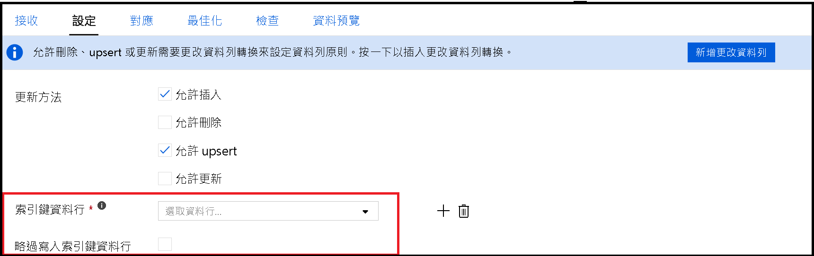

# <a name="copy-and-transform-data-in-azure-sql-database-by-using-azure-data-factory"></a>使用 Azure 資料工廠複製和轉換 Azure SQL 資料庫中的資料

> [!div class="op_single_selector" title1="選擇正在使用的 Azure 資料工廠版本："]
> * [版本 1](v1/data-factory-azure-sql-connector.md)
> * [當前版本](connector-azure-sql-database.md)

本文概述了如何使用 Azure 資料工廠中的複製活動從 Azure SQL 資料庫複製資料，以及使用資料流程轉換 Azure SQL 資料庫中的資料。 若要了解 Azure Data Factory，請閱讀[簡介文章](introduction.md)。

## <a name="supported-capabilities"></a>支援的功能

以下活動支援此 Azure SQL 資料庫連接器：

- 使用[支援的源/接收器矩陣](copy-activity-overview.md)表[複製活動](copy-activity-overview.md)
- [映射資料流程](concepts-data-flow-overview.md)
- [查找活動](control-flow-lookup-activity.md)
- [獲取中繼資料活動](control-flow-get-metadata-activity.md)

對於複製活動，此 Azure SQL 資料庫連接器支援以下功能：

- 使用 SQL 身份驗證和 Azure 活動目錄 （Azure AD） 應用程式權杖身份驗證使用 Azure 資源的服務主體或託管標識複製資料。
- 作為源，使用 SQL 查詢或預存程序檢索資料。
- 作為接收器，將資料追加到目標表或在複製期間使用自訂邏輯調用預存程序。

>[!NOTE]
>此連接器現在不支援 Azure SQL 資料庫["始終加密](https://docs.microsoft.com/sql/relational-databases/security/encryption/always-encrypted-database-engine?view=azuresqldb-current)"。 為了解決這些問題，您可以通過自託管的集成運行時使用[通用 ODBC 連接器](connector-odbc.md)和 SQL Server ODBC 驅動程式。 有關 ODBC 驅動程式下載和連接字串配置，請按照[本指南](https://docs.microsoft.com/sql/connect/odbc/using-always-encrypted-with-the-odbc-driver?view=azuresqldb-current)操作。

> [!IMPORTANT]
> 如果使用 Azure 資料工廠集成運行時複製資料，請配置 Azure [SQL Server 防火牆](https://docs.microsoft.com/azure/sql-database/sql-database-firewall-configure)，以便 Azure 服務可以訪問伺服器。
> 如果使用自託管的集成運行時複製資料，請將 Azure SQL Server 防火牆配置為允許適當的 IP 範圍。 此範圍包括用於連接到 Azure SQL 資料庫的電腦 IP。

## <a name="get-started"></a>開始使用

[!INCLUDE [data-factory-v2-connector-get-started](../../includes/data-factory-v2-connector-get-started.md)]

以下各節提供有關用於定義特定于 Azure SQL 資料庫連接器的 Azure 資料工廠實體的屬性的詳細資訊。

## <a name="linked-service-properties"></a>連結服務屬性

以下是支援 Azure SQL Database 已連結服務的屬性：

| 屬性 | 描述 | 必要 |
|:--- |:--- |:--- |
| type | **類型**屬性必須設置為**AzureSqlDatabase**。 | 是 |
| connectionString | 指定連接到**連接String**屬性的 Azure SQL 資料庫實例所需的資訊。 <br/>您還可以在 Azure 金鑰保存庫中放置密碼或服務主體金鑰。 如果是 SQL 身份驗證，則從連接`password`字串中拔出配置。 有關詳細資訊，請參閱[Azure 金鑰保存庫中表和存儲憑據](store-credentials-in-key-vault.md)之後的 JSON 示例。 | 是 |
| servicePrincipalId | 指定應用程式的用戶端識別碼。 | 是，當您使用具有服務主體的 Azure AD 身份驗證時 |
| servicePrincipalKey | 指定應用程式的金鑰。 將此欄位標記為**SecureString，** 以將其安全地存儲在 Azure 資料工廠中，或[引用存儲在 Azure 金鑰保存庫中的機密](store-credentials-in-key-vault.md)。 | 是，當您使用具有服務主體的 Azure AD 身份驗證時 |
| tenant | 指定應用程式所在的租戶資訊，如功能變數名稱或租戶 ID。 通過將滑鼠懸停在 Azure 門戶的右上角來檢索它。 | 是，當您使用具有服務主體的 Azure AD 身份驗證時 |
| connectVia | 用來連線到資料存放區的[整合執行階段](concepts-integration-runtime.md)。 如果資料存儲位於私人網路絡中，則可以使用 Azure 集成運行時或自託管集成運行時。 如果未指定，則使用預設的 Azure 集成運行時。 | 否 |

針對不同的驗證類型，請分別參閱下列有關先決條件和 JSON 範例的章節：

- [SQL 身份驗證](#sql-authentication)
- [Azure AD 應用程式權杖身份驗證：服務主體](#service-principal-authentication)
- [Azure AD 應用程式權杖驗證：Azure 資源的受控識別](#managed-identity)

>[!TIP]
>如果錯誤代碼"使用者錯誤失敗到ConnectToSqlServer"和"資料庫的會話限制為 XXX 且已到達"之類的消息出錯，請添加到`Pooling=false`連接字串中，然後重試。

### <a name="sql-authentication"></a>SQL 驗證

#### <a name="linked-service-example-that-uses-sql-authentication"></a>使用 SQL 驗證的連結服務範例

```json
{
    "name": "AzureSqlDbLinkedService",
    "properties": {
        "type": "AzureSqlDatabase",
        "typeProperties": {
            "connectionString": "Server=tcp:<servername>.database.windows.net,1433;Database=<databasename>;User ID=<username>@<servername>;Password=<password>;Trusted_Connection=False;Encrypt=True;Connection Timeout=30"
        },
        "connectVia": {
            "referenceName": "<name of Integration Runtime>",
            "type": "IntegrationRuntimeReference"
        }
    }
}
```

**Azure 金鑰保存庫中的密碼** 

```json
{
    "name": "AzureSqlDbLinkedService",
    "properties": {
        "type": "AzureSqlDatabase",
        "typeProperties": {
            "connectionString": "Server=tcp:<servername>.database.windows.net,1433;Database=<databasename>;User ID=<username>@<servername>;Trusted_Connection=False;Encrypt=True;Connection Timeout=30",
            "password": { 
                "type": "AzureKeyVaultSecret", 
                "store": { 
                    "referenceName": "<Azure Key Vault linked service name>", 
                    "type": "LinkedServiceReference" 
                }, 
                "secretName": "<secretName>" 
            }
        },
        "connectVia": {
            "referenceName": "<name of Integration Runtime>",
            "type": "IntegrationRuntimeReference"
        }
    }
}
```

### <a name="service-principal-authentication"></a>服務主體驗證

若要使用以服務主體為基礎的 Azure AD 應用程式權杖驗證，請遵循下列步驟：

1. 從 Azure 入口網站[建立 Azure Active Directory 應用程式](../active-directory/develop/howto-create-service-principal-portal.md#create-an-azure-active-directory-application)。 請記下應用程式名稱，以及下列可定義連結服務的值：

    - 應用程式識別碼
    - 應用程式金鑰
    - 租用戶識別碼

2. 如果尚未這樣做，則在 Azure 門戶上為 Azure SQL Server[預配 Azure 活動目錄管理員](../sql-database/sql-database-aad-authentication-configure.md#provision-an-azure-active-directory-administrator-for-your-azure-sql-database-server)。 Azure AD 系統管理員必須是 Azure AD 使用者或 Azure AD 群組，但不能是服務主體。 此步驟必須完成，如此您才可以在下一個步驟中使用 Azure AD 身分識別，為服務主體建立自主資料庫使用者。

3. 為服務主體[建立自主資料庫使用者](../sql-database/sql-database-aad-authentication-configure.md#create-contained-database-users-in-your-database-mapped-to-azure-ad-identities)。 使用 SQL 伺服器管理工作室等工具，使用至少具有 ALTER 任何使用者許可權的 Azure AD 標識，從或連接到要複製資料的資料庫。 執行下列 T-SQL： 
  
    ```sql
    CREATE USER [your application name] FROM EXTERNAL PROVIDER;
    ```

4. 如同您一般對 SQL 使用者或其他人所做的一樣，將所需的權限授與服務主體。 執行下列程式碼。 如需更多選項，請參閱[此文件](https://docs.microsoft.com/sql/relational-databases/system-stored-procedures/sp-addrolemember-transact-sql?view=sql-server-2017)。

    ```sql
    EXEC sp_addrolemember [role name], [your application name];
    ```

5. 在 Azure Data Factory 中，設定 Azure SQL Database 連結服務。


#### <a name="linked-service-example-that-uses-service-principal-authentication"></a>使用服務主體驗證的連結服務範例

```json
{
    "name": "AzureSqlDbLinkedService",
    "properties": {
        "type": "AzureSqlDatabase",
        "typeProperties": {
            "connectionString": "Server=tcp:<servername>.database.windows.net,1433;Database=<databasename>;Connection Timeout=30",
            "servicePrincipalId": "<service principal id>",
            "servicePrincipalKey": {
                "type": "SecureString",
                "value": "<service principal key>"
            },
            "tenant": "<tenant info, e.g. microsoft.onmicrosoft.com>"
        },
        "connectVia": {
            "referenceName": "<name of Integration Runtime>",
            "type": "IntegrationRuntimeReference"
        }
    }
}
```

### <a name="managed-identities-for-azure-resources-authentication"></a><a name="managed-identity"></a>Azure 資源身份驗證的託管標識

資料處理站可與 [Azure 資源的受控識別](data-factory-service-identity.md)相關聯，後者表示特定的資料處理站。 可以使用此託管標識進行 Azure SQL 資料庫身份驗證。 指定的處理站可以使用此身分識別從您資料庫存取資料，或從您的資料庫複製資料。

要使用託管標識身份驗證，請按照以下步驟操作。

1. 如果尚未這樣做，則在 Azure 門戶上為 Azure SQL Server[預配 Azure 活動目錄管理員](../sql-database/sql-database-aad-authentication-configure.md#provision-an-azure-active-directory-administrator-for-your-azure-sql-database-server)。 Azure AD 管理員可以是 Azure AD 使用者或 Azure AD 組。 如果您授與受控識別系統管理員角色，請略過步驟 3 和 4。 管理員對資料庫具有完全存取權限。

2. 為 Azure 資料工廠託管標識[創建包含的資料庫使用者](../sql-database/sql-database-aad-authentication-configure.md#create-contained-database-users-in-your-database-mapped-to-azure-ad-identities)。 使用 SQL 伺服器管理工作室等工具，使用至少具有 ALTER 任何使用者許可權的 Azure AD 標識，從或連接到要複製資料的資料庫。 執行下列 T-SQL： 
  
    ```sql
    CREATE USER [your Data Factory name] FROM EXTERNAL PROVIDER;
    ```

3. 授予資料工廠託管標識所需的許可權，就像您通常對 SQL 使用者和其他人所做的一樣。 執行下列程式碼。 如需更多選項，請參閱[此文件](https://docs.microsoft.com/sql/relational-databases/system-stored-procedures/sp-addrolemember-transact-sql?view=sql-server-2017)。

    ```sql
    EXEC sp_addrolemember [role name], [your Data Factory name];
    ```

4. 在 Azure Data Factory 中，設定 Azure SQL Database 連結服務。

**範例**

```json
{
    "name": "AzureSqlDbLinkedService",
    "properties": {
        "type": "AzureSqlDatabase",
        "typeProperties": {
            "connectionString": "Server=tcp:<servername>.database.windows.net,1433;Database=<databasename>;Connection Timeout=30"
        },
        "connectVia": {
            "referenceName": "<name of Integration Runtime>",
            "type": "IntegrationRuntimeReference"
        }
    }
}
```

## <a name="dataset-properties"></a>資料集屬性

有關可用於定義資料集的節和屬性的完整清單，請參閱[資料集](https://docs.microsoft.com/azure/data-factory/concepts-datasets-linked-services)。 

Azure SQL 資料庫資料集支援以下屬性：

| 屬性 | 描述 | 必要 |
|:--- |:--- |:--- |
| type | 資料集**的類型**屬性必須設置為**AzureSqlTable**。 | 是 |
| 結構描述 | 結構描述的名稱。 |否 (來源)；是 (接收)  |
| 資料表 | 表/視圖的名稱。 |否 (來源)；是 (接收)  |
| tableName | 具有架構的表/視圖的名稱。 此屬性支援向後相容性。 對於新的工作負載，請使用`schema``table`和 。 | 否 (來源)；是 (接收) |

#### <a name="dataset-properties-example"></a>資料集屬性範例

```json
{
    "name": "AzureSQLDbDataset",
    "properties":
    {
        "type": "AzureSqlTable",
        "linkedServiceName": {
            "referenceName": "<Azure SQL Database linked service name>",
            "type": "LinkedServiceReference"
        },
        "schema": [ < physical schema, optional, retrievable during authoring > ],
        "typeProperties": {
            "schema": "<schema_name>",
            "table": "<table_name>"
        }
    }
}
```

## <a name="copy-activity-properties"></a>複製活動屬性

如需可用來定義活動的區段和屬性完整清單，請參閱[管線](concepts-pipelines-activities.md)。 本節提供 Azure SQL Database 來源和接收所支援屬性的清單。

### <a name="azure-sql-database-as-the-source"></a>Azure SQL Database 作為來源

要從 Azure SQL 資料庫複製資料，複製活動**源**部分中支援以下屬性：

| 屬性 | 描述 | 必要 |
|:--- |:--- |:--- |
| type | 必須將複製活動源**的類型**屬性設置為**AzureSqlSource**。 對於向後相容性，仍然支援"SqlSource"類型。 | 是 |
| sqlReaderQuery | 此屬性使用自訂 SQL 查詢來讀取資料。 例如 `select * from MyTable`。 | 否 |
| sqlReaderStoredProcedureName | 從來源資料表讀取資料的預存程序名稱。 最後一個 SQL 陳述式必須是預存程序中的 SELECT 陳述式。 | 否 |
| storedProcedureParameters | 預存程序的參數。<br/>允許的值為名稱或值組。 參數的名稱和大小寫必須與預存程序參數的名稱和大小寫匹配。 | 否 |
| isolationLevel | 指定 SQL 源的事務鎖定行為。 允許的值是：**已讀提交**（預設）、**未提交**、**可重複讀取**、**可序列化**、**快照**。 有關詳細資訊，請參閱[此文檔](https://docs.microsoft.com/dotnet/api/system.data.isolationlevel)。 | 否 |

**需要注意的要點：**

- 如果為**AzureSqlSource**指定**了 sqlReaderQuery，** 則複製活動將針對 Azure SQL 資料庫源運行此查詢以獲取資料。 如果預存程序接受參數，您也可以藉由指定 **sqlReaderStoredProcedureName** 和 **storedProcedureParameters** 來指定預存程序。
- 如果不指定**sqlReaderQuery**或**sqlReader預存程序名稱**，則資料集 JSON 的"結構"部分中定義的列用於構造查詢。 查詢`select column1, column2 from mytable`針對 Azure SQL 資料庫運行。 如果資料集定義沒有 "structure"，則會從資料表中選取所有資料行。

#### <a name="sql-query-example"></a>SQL 查詢範例

```json
"activities":[
    {
        "name": "CopyFromAzureSQLDatabase",
        "type": "Copy",
        "inputs": [
            {
                "referenceName": "<Azure SQL Database input dataset name>",
                "type": "DatasetReference"
            }
        ],
        "outputs": [
            {
                "referenceName": "<output dataset name>",
                "type": "DatasetReference"
            }
        ],
        "typeProperties": {
            "source": {
                "type": "AzureSqlSource",
                "sqlReaderQuery": "SELECT * FROM MyTable"
            },
            "sink": {
                "type": "<sink type>"
            }
        }
    }
]
```

#### <a name="stored-procedure-example"></a>預存程序範例

```json
"activities":[
    {
        "name": "CopyFromAzureSQLDatabase",
        "type": "Copy",
        "inputs": [
            {
                "referenceName": "<Azure SQL Database input dataset name>",
                "type": "DatasetReference"
            }
        ],
        "outputs": [
            {
                "referenceName": "<output dataset name>",
                "type": "DatasetReference"
            }
        ],
        "typeProperties": {
            "source": {
                "type": "AzureSqlSource",
                "sqlReaderStoredProcedureName": "CopyTestSrcStoredProcedureWithParameters",
                "storedProcedureParameters": {
                    "stringData": { "value": "str3" },
                    "identifier": { "value": "$$Text.Format('{0:yyyy}', <datetime parameter>)", "type": "Int"}
                }
            },
            "sink": {
                "type": "<sink type>"
            }
        }
    }
]
```

### <a name="stored-procedure-definition"></a>預存程序定義

```sql
CREATE PROCEDURE CopyTestSrcStoredProcedureWithParameters
(
    @stringData varchar(20),
    @identifier int
)
AS
SET NOCOUNT ON;
BEGIN
     select *
     from dbo.UnitTestSrcTable
     where dbo.UnitTestSrcTable.stringData != stringData
    and dbo.UnitTestSrcTable.identifier != identifier
END
GO
```

### <a name="azure-sql-database-as-the-sink"></a>Azure SQL Database 作為接收

> [!TIP]
> 詳細瞭解將[資料載入到 Azure SQL 資料庫的最佳實踐](#best-practice-for-loading-data-into-azure-sql-database)中支援的寫入行為、配置和最佳實踐。

要將資料複製到 Azure SQL 資料庫，複製活動**接收器**部分支援以下屬性：

| 屬性 | 描述 | 必要 |
|:--- |:--- |:--- |
| type | 必須將複製活動接收器**的類型**屬性設置為**AzureSqlSink**。 對於向後相容性，仍然支援"SqlSink"類型。 | 是 |
| writeBatchSize | *要插入到 SQL 表中的行數。*<br/> 允許的值為**整數** (資料列數目)。 預設情況下，Azure 資料工廠會根據行大小動態確定適當的批次處理大小。 | 否 |
| writeBatchTimeout | 在逾時前等待批次插入作業完成的時間。<br/> 允許的值是**時間跨度**。 例如"00：30：00"（30 分鐘）。 | 否 |
| preCopyScript | 為將資料寫入 Azure SQL 資料庫之前要運行的副本活動指定 SQL 查詢。 每一複製回合只會叫用此查詢一次。 使用此屬性來清除預先載入的資料。 | 否 |
| sqlWriterStoredProcedureName | 定義如何將來源資料套用到目標資料表的預存程序名稱。 <br/>此預存程序將會*依批次叫用*。 對於僅運行一次且與來源資料無關的操作（例如，刪除或截圖）請使用 屬性`preCopyScript`。 | 否 |
| 預存程序表類型參數名稱 |預存程序中指定的表類型的參數名稱。  |否 |
| sqlWriterTableType |要在預存程序中使用的表類型名稱。 複製活動可讓正在移動的資料可用於此資料表類型的暫存資料表。 然後，預存程序程式碼可以合併正在複製的資料與現有的資料。 |否 |
| storedProcedureParameters |預存程序的參數。<br/>允許的值為：名稱和值組。 參數的名稱和大小寫必須符合預存程序參數的名稱和大小寫。 | 否 |
| 表選項 | 指定是否根據源架構自動創建接收器表（如果不存在）。 當接收器指定預存程序或在複製活動中配置暫存副本時，不支援自動表創建。 允許的值是：（`none`預設），。 `autoCreate` |否 |
| 禁用"指標收集" | 資料工廠收集 Azure SQL 資料庫 DTD 等指標，以便進行複製性能優化和建議。 如果您關注此行為，請指定`true`將其關閉。 | 否 (預設值為 `false`) |

**示例 1：追加資料**

```json
"activities":[
    {
        "name": "CopyToAzureSQLDatabase",
        "type": "Copy",
        "inputs": [
            {
                "referenceName": "<input dataset name>",
                "type": "DatasetReference"
            }
        ],
        "outputs": [
            {
                "referenceName": "<Azure SQL Database output dataset name>",
                "type": "DatasetReference"
            }
        ],
        "typeProperties": {
            "source": {
                "type": "<source type>"
            },
            "sink": {
                "type": "AzureSqlSink",
                "writeBatchSize": 100000,
                "tableOption": "autoCreate"
            }
        }
    }
]
```

**示例 2：在複製期間調用預存程序**

若要了解更多詳細資料，請參閱[叫用 SQL 接收中的預存程序](#invoke-a-stored-procedure-from-a-sql-sink)。

```json
"activities":[
    {
        "name": "CopyToAzureSQLDatabase",
        "type": "Copy",
        "inputs": [
            {
                "referenceName": "<input dataset name>",
                "type": "DatasetReference"
            }
        ],
        "outputs": [
            {
                "referenceName": "<Azure SQL Database output dataset name>",
                "type": "DatasetReference"
            }
        ],
        "typeProperties": {
            "source": {
                "type": "<source type>"
            },
            "sink": {
                "type": "AzureSqlSink",
                "sqlWriterStoredProcedureName": "CopyTestStoredProcedureWithParameters",
                "storedProcedureTableTypeParameterName": "MyTable",
                "sqlWriterTableType": "MyTableType",
                "storedProcedureParameters": {
                    "identifier": { "value": "1", "type": "Int" },
                    "stringData": { "value": "str1" }
                }
            }
        }
    }
]
```

## <a name="best-practice-for-loading-data-into-azure-sql-database"></a>將資料載入到 Azure SQL 資料庫的最佳做法

將資料複製到 Azure SQL 資料庫時，可能需要不同的寫入行為：

- [追加：](#append-data)我的來源資料只有新記錄。
- [Upsert](#upsert-data)：我的來源資料同時包含插入和更新。
- [覆蓋](#overwrite-the-entire-table)：我想每次重新載入整個維度表。
- [用自訂邏輯編寫](#write-data-with-custom-logic)：在最終插入目標表之前，我需要額外的處理。

請參閱有關如何在 Azure 資料工廠中配置的相應部分以及最佳做法。

### <a name="append-data"></a>附加資料

追加資料是此 Azure SQL 資料庫接收器連接器的預設行為。 Azure 資料工廠執行批量插入以高效地寫入表。 您可以在複製活動中相應地配置源和接收器。

### <a name="upsert-data"></a>更新插入資料

**選項 1：** 當您有大量要複製的資料時，請使用以下方法執行 upsert： 

- 首先，使用[資料庫作用域的臨時表](https://docs.microsoft.com/sql/t-sql/statements/create-table-transact-sql?view=azuresqldb-current#database-scoped-global-temporary-tables-azure-sql-database)使用複製活動批量載入所有記錄。 由於未記錄針對資料庫作用域臨時表的操作，因此可以在數秒內載入數百萬條記錄。
- 在 Azure 資料工廠中運行預存程序活動以應用[MERGE](https://docs.microsoft.com/sql/t-sql/statements/merge-transact-sql?view=azuresqldb-current)或 INSERT/UPDATE 語句。 使用臨時表作為源執行所有更新或作為單個事務插入。 這樣，往返次數和日誌操作就會減少。 在預存程序活動結束時，可以截斷臨時表以準備下一個上升週期。

例如，在 Azure 資料工廠中，您可以創建具有"**複製"活動**與**預存程序活動**連結的管道。 前者將源存儲中的資料複製到 Azure SQL 資料庫臨時表（例如 **，##UpsertTempTable）** 作為資料集中的表名。 然後，後者調用預存程序將臨時表的來源資料合併到目標表中並清理臨時表。


在資料庫中，使用 MERGE 邏輯定義預存程序，如以下示例，該示例從以前的預存程序活動中指向。 假設目標是具有三列**的行銷**表：**設定檔 ID、****狀態**和**類別**。 根據 **"設定檔 ID"** 列執行向上操作。

```sql
CREATE PROCEDURE [dbo].[spMergeData]
AS
BEGIN
    MERGE TargetTable AS target
    USING ##UpsertTempTable AS source
    ON (target.[ProfileID] = source.[ProfileID])
    WHEN MATCHED THEN
        UPDATE SET State = source.State
    WHEN NOT matched THEN
        INSERT ([ProfileID], [State], [Category])
      VALUES (source.ProfileID, source.State, source.Category);
    
    TRUNCATE TABLE ##UpsertTempTable
END
```

**選項 2：** 您還可以選擇[在複製活動中調用預存程序](#invoke-a-stored-procedure-from-a-sql-sink)。 此方法運行源表中的每一行，而不是使用批量插入作為複製活動中的預設方法，這不適用於大規模 upsert。

### <a name="overwrite-the-entire-table"></a>覆蓋整個表

您可以在複製活動接收器中配置**預複製腳本**屬性。 在這種情況下，對於運行的每個複製活動，Azure 資料工廠首先運行腳本。 然後運行複製以插入資料。 例如，要用最新資料覆蓋整個表，請指定一個腳本，首先刪除所有記錄，然後再從源批量載入新資料。

### <a name="write-data-with-custom-logic"></a>使用自訂邏輯寫入資料

使用自訂邏輯寫入資料的步驟與[Upsert 資料](#upsert-data)部分中描述的步驟類似。 當您需要在最終將來源資料插入目標表之前應用額外處理時，對於大規模，可以執行以下兩項操作之一：

- 載入到資料庫作用域的臨時表，然後調用預存程序。 
- 在複製期間調用預存程序。

## <a name="invoke-a-stored-procedure-from-a-sql-sink"></a><a name="invoke-a-stored-procedure-from-a-sql-sink"></a> 從 SQL 接收叫用預存程序

將資料複製到 Azure SQL 資料庫時，還可以配置和調用使用者指定的預存程序，並包含其他參數。 預存程序功能利用了[表值參數](https://msdn.microsoft.com/library/bb675163.aspx)。

> [!TIP]
> 調用預存程序逐行處理資料，而不是使用批量操作，我們不建議進行大規模複製。 從將資料[載入到 Azure SQL 資料庫的最佳做法中](#best-practice-for-loading-data-into-azure-sql-database)瞭解詳細資訊。

當內建的複製機制無法滿足需求時，您可以使用預存程序。 例如，您希望在最終將來源資料插入目標表之前應用額外處理。 當您想要合併列、查找其他值並插入到多個表中時，將介紹一些額外的處理示例。

下列範例示範如何使用預存程序，對 Azure SQL Database 中的資料表執行 upsert。 假設輸入資料和接收器**市場行銷**表各有三列：**設定檔 ID、****狀態**和**類別**。 根據**ProfileID**列執行 upsert，並且僅將其應用於名為"ProductA"的特定類別。

1. 在資料庫中，定義與**sqlWriterTableType**同名的表類型。 資料表類型的結構描述會與輸入資料所傳回的結構描述相同。

    ```sql
    CREATE TYPE [dbo].[MarketingType] AS TABLE(
        [ProfileID] [varchar](256) NOT NULL,
        [State] [varchar](256) NOT NULL,
        [Category] [varchar](256) NOT NULL
    )
    ```

2. 在資料庫中，定義與**sqlWriter預存程序名稱**相同的預存程序。 它會處理來自指定來源的輸入資料，並合併至輸出資料表。 預存程序中表類型的參數名稱與在資料集中定義的**表名稱**相同。

    ```sql
    CREATE PROCEDURE spOverwriteMarketing @Marketing [dbo].[MarketingType] READONLY, @category varchar(256)
    AS
    BEGIN
    MERGE [dbo].[Marketing] AS target
    USING @Marketing AS source
    ON (target.ProfileID = source.ProfileID and target.Category = @category)
    WHEN MATCHED THEN
        UPDATE SET State = source.State
    WHEN NOT MATCHED THEN
        INSERT (ProfileID, State, Category)
        VALUES (source.ProfileID, source.State, source.Category);
    END
    ```

3. 在 Azure 資料工廠中，在複製活動中定義**SQL 接收器**部分，如下所示：

    ```json
    "sink": {
        "type": "AzureSqlSink",
        "sqlWriterStoredProcedureName": "spOverwriteMarketing",
        "storedProcedureTableTypeParameterName": "Marketing",
        "sqlWriterTableType": "MarketingType",
        "storedProcedureParameters": {
            "category": {
                "value": "ProductA"
            }
        }
    }
    ```

## <a name="mapping-data-flow-properties"></a>映射資料流程屬性

在映射資料流程中轉換資料時，可以從 Azure SQL 資料庫讀取和寫入表。 有關詳細資訊，請參閱映射資料流程的[源轉換](data-flow-source.md)和[接收器轉換](data-flow-sink.md)。

### <a name="source-transformation"></a>源轉換

特定于 Azure SQL 資料庫的設置可在源轉換的 **"源選項**"選項卡中提供。 

**輸入：** 選擇是將源指向表（等效```Select * from <table-name>```項）還是輸入自訂 SQL 查詢。

**查詢**：如果在輸入欄位中選擇"查詢"，請輸入源的 SQL 查詢。 此設置將覆蓋您在資料集中選擇的任何表。 **此處不支援"按訂單"** 子句，但您可以設置完整的 SELECT FROM 語句。 您還可以使用使用者定義的表函數。 **從 udfGetData（） 中選擇 *** 是 SQL 中的 UDF，用於返回表。 此查詢將生成一個源表，可用於資料流程。 使用查詢也是減少用於測試或查找的行的好方法。 

* SQL 示例：```Select * from MyTable where customerId > 1000 and customerId < 2000```

**批次處理大小**：輸入批次處理大小以將大資料塊塊到讀取中。

**隔離等級**：映射資料流程的 SQL 源的預設值為未提交。 您可以在此處將隔離等級更改為以下值之一：
* 讀取認可
* 讀取未認可
* 可重複讀取
* 可序列化
* 無（忽略隔離等級）


### <a name="sink-transformation"></a>水槽變換

特定于 Azure SQL 資料庫的設置可在接收器轉換的 **"設置"** 選項卡中提供。

**更新方法：** 確定資料庫目標上允許的操作。 預設值是僅允許插入。 要更新、更新或刪除行，需要更改行轉換來標記這些操作的行。 對於更新、升級和刪除，必須設置鍵列或列以確定要更改的行。



此處選擇作為鍵的列名稱將由 ADF 用作後續更新、upsert、刪除的一部分。 因此，必須選取"接收器"映射中存在的列。 如果不希望將值寫入此鍵列，請按一下"跳過寫入鍵列"。

**表操作：** 確定在寫入之前是從目標表重新創建或刪除所有行。
* 無：對表不執行任何操作。
* 重新創建：該表將被刪除並重新創建。 動態創建新表時是必需的。
* 截取：將刪除目標表中的所有行。

**批次處理大小**：控制每個存儲桶中寫入的行數。 較大的批次處理大小可改善壓縮和記憶體優化，但在緩存資料時存在記憶體異常風險。

**前 SQL 和後 SQL 腳本**：輸入將在（預處理）和之後（後處理）資料寫入 Sink 資料庫之前執行的多行 SQL 腳本


## <a name="data-type-mapping-for-azure-sql-database"></a>Azure SQL Database 的資料類型對應

從 Azure SQL 資料庫複製資料或複製到 Azure SQL 資料庫時，將使用以下映射從 Azure SQL 資料庫資料類型到 Azure 資料工廠臨時資料類型。 若要了解複製活動如何將來源結構描述和資料類型對應至接收，請參閱[結構描述和資料類型對應](copy-activity-schema-and-type-mapping.md)。

| Azure SQL Database 資料類型 | Azure Data Factory 過渡期資料類型 |
|:--- |:--- |
| BIGINT |Int64 |
| BINARY |Byte[] |
| bit |Boolean |
| char |String, Char[] |
| date |Datetime |
| Datetime |Datetime |
| datetime2 |Datetime |
| Datetimeoffset |DateTimeOffset |
| Decimal |Decimal |
| FILESTREAM attribute (varbinary(max)) |Byte[] |
| Float |Double |
| image |Byte[] |
| int |Int32 |
| money |Decimal |
| NCHAR |String, Char[] |
| ntext |String, Char[] |
| NUMERIC |Decimal |
| NVARCHAR |String, Char[] |
| real |Single |
| rowversion |Byte[] |
| smalldatetime |Datetime |
| SMALLINT |Int16 |
| SMALLMONEY |Decimal |
| sql_variant |Object |
| text |String, Char[] |
| time |TimeSpan |
| timestamp |Byte[] |
| TINYINT |Byte |
| UNIQUEIDENTIFIER |Guid |
| varbinary |Byte[] |
| varchar |String, Char[] |
| Xml |Xml |

>[!NOTE]
> 針對對應至 Decimal 過渡期類型的資料類型，Azure Data Factory 目前支援最多 28 個有效位數。 如果資料精度大於 28，請考慮在 SQL 查詢中轉換為字串。

## <a name="lookup-activity-properties"></a>查找活動屬性

要瞭解有關屬性的詳細資訊，請檢查[查找活動](control-flow-lookup-activity.md)。

## <a name="getmetadata-activity-properties"></a>獲取中繼資料活動屬性

要瞭解有關屬性的詳細資訊，請選中[獲取中繼資料活動](control-flow-get-metadata-activity.md) 

## <a name="next-steps"></a>後續步驟
有關 Azure 資料工廠中複製活動支援為源和接收器的資料存儲清單，請參閱[支援資料存儲和格式](copy-activity-overview.md#supported-data-stores-and-formats)。
