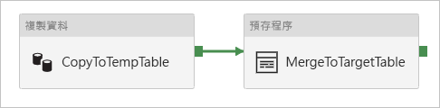

# <a name="copy-data-to-and-from-azure-sql-managed-instance-by-using-azure-data-factory"></a>使用 Azure Data Factory 將資料複製到 Azure SQL 受控執行個體或從中複製資料

[!INCLUDE[appliesto-adf-asa-md](includes/appliesto-adf-asa-md.md)]

本文概述如何使用 Azure Data Factory 中的「複製活動」，將資料複製到 Azure SQL 受控執行個體或從中複製資料。 它是以「 [複製活動」總覽](copy-activity-overview.md) 文章為基礎，提供複製活動的一般總覽。

## <a name="supported-capabilities"></a>支援的功能

下列活動支援此 SQL 受控執行個體連接器：

- 含[支援來源/接收器矩陣](copy-activity-overview.md)的[複製活動](copy-activity-overview.md)
- [查閱活動](control-flow-lookup-activity.md)
- [GetMetadata 活動](control-flow-get-metadata-activity.md)

您可以將資料從 SQL 受控執行個體複製到任何支援的接收資料存放區。 您也可以將資料從任何支援的來源資料存放區複製到 SQL 受控執行個體。 如需複製活動所支援作為來源和接收器的資料存放區清單，請參閱[支援的資料存放區](copy-activity-overview.md#supported-data-stores-and-formats)表格。

具體來說，這個 SQL 受控執行個體連接器支援：

- 使用 SQL 驗證和 Azure Active Directory (Azure AD) 應用程式權杖驗證搭配服務主體或適用于 Azure 資源的受控識別來複製資料。
- 作為來源，使用 SQL 查詢或預存程式來抓取資料。 您也可以選擇從 SQL MI 來源進行平行複製，如需詳細資料，請參閱 [SQL mi 的平行複製](#parallel-copy-from-sql-mi) 一節。
- 作為接收，如果不存在，則會根據來源架構自動建立目的地資料表;在複製期間將資料附加至資料表，或使用自訂邏輯叫用預存程式。

>[!NOTE]
> 此連接器目前不支援 SQL 受控執行個體 [Always Encrypted](https://docs.microsoft.com/sql/relational-databases/security/encryption/always-encrypted-database-engine?view=azuresqldb-mi-current) 。 若要解決這個問題，您可以透過自我裝載的整合執行時間，使用 [一般 odbc 連接器](connector-odbc.md) 和 SQL Server ODBC 驅動程式。 若要深入瞭解，請 [使用 Always Encrypted](#using-always-encrypted) 一節。 

## <a name="prerequisites"></a>必要條件

若要存取 SQL 受控執行個體 [公用端點](../azure-sql/managed-instance/public-endpoint-overview.md)，您可以使用 Azure Data Factory 受控 Azure integration runtime。 請確定您已啟用公用端點，而且也允許網路安全性群組上的公用端點流量，讓 Azure Data Factory 可以連接到您的資料庫。 如需詳細資訊，請參閱 [本指引](../azure-sql/managed-instance/public-endpoint-configure.md)。

若要存取 SQL 受控執行個體私用端點，請設定可存取資料庫的 [自我裝載整合運行](create-self-hosted-integration-runtime.md) 時間。 如果您將自我裝載整合執行時間布建在與受控實例相同的虛擬網路中，請確定您的整合執行時間電腦與您的受控實例位於不同的子網中。 如果您在與受控實例不同的虛擬網路中布建自我裝載整合執行時間，您可以使用虛擬網路對等互連或虛擬網路對虛擬網路連線。 如需詳細資訊，請參閱[將您的應用程式連線到SQL 受控執行個體](../azure-sql/managed-instance/connect-application-instance.md)。

## <a name="get-started"></a>開始使用

[!INCLUDE [data-factory-v2-connector-get-started](../../includes/data-factory-v2-connector-get-started.md)]

下列各節提供屬性的相關詳細資料，這些屬性是用來定義 SQL 受控執行個體連接器特定的 Azure Data Factory 實體。

## <a name="linked-service-properties"></a>連結服務屬性

以下是 SQL 受控執行個體連結服務支援的屬性：

| 屬性 | 描述 | 必要 |
|:--- |:--- |:--- |
| type | Type 屬性必須設為 **AzureSqlMI**。 | 是 |
| connectionString |這個屬性會指定使用 SQL 驗證連接到 SQL 受控執行個體所需的 **connectionString** 資訊。 如需詳細資訊，請參閱下列範例。 <br/>預設的連接埠為 1433。 如果您使用具有公用端點的 SQL 受控執行個體，請明確指定埠3342。<br> 您也可以將密碼放在 Azure Key Vault 中。 如果是 SQL 驗證，請 `password` 從連接字串中提取設定。 如需詳細資訊，請參閱下表中的 JSON 範例，並 [將認證儲存在 Azure Key Vault 中](store-credentials-in-key-vault.md)。 |是 |
| servicePrincipalId | 指定應用程式的用戶端識別碼。 | 是，當您搭配服務主體使用 Azure AD authentication 時 |
| servicePrincipalKey | 指定應用程式的金鑰。 將此欄位標記為 **SecureString** ，將它安全地儲存在 Azure Data Factory 中，或 [參考儲存在 Azure Key Vault 中的秘密](store-credentials-in-key-vault.md)。 | 是，當您搭配服務主體使用 Azure AD authentication 時 |
| tenant | 指定您的應用程式所在的租使用者資訊，例如功能變數名稱或租使用者識別碼。 將滑鼠游標暫留在 Azure 入口網站右上角，即可加以擷取。 | 是，當您搭配服務主體使用 Azure AD authentication 時 |
| azureCloudType | 針對服務主體驗證，請指定您的 Azure AD 應用程式註冊所在的 Azure 雲端環境類型。 <br/> 允許的值為 **AzurePublic**、 **AzureChina**、 **AzureUsGovernment**和 **AzureGermany**。 根據預設，會使用 data factory 的雲端環境。 | 否 |
| connectVia | 用來連線到資料存放區的[整合執行階段](concepts-integration-runtime.md)。 您可以使用自我裝載整合執行時間或 Azure integration runtime （如果您的受控實例具有公用端點），並允許 Azure Data Factory 存取它。 若未指定，則會使用預設 Azure Integration Runtime。 |是 |

針對不同的驗證類型，請分別參閱下列有關先決條件和 JSON 範例的章節：

- [SQL 驗證](#sql-authentication)
- [Azure AD 應用程式權杖驗證：服務主體](#service-principal-authentication)
- [Azure AD 應用程式權杖驗證：適用于 Azure 資源的受控識別](#managed-identity)

### <a name="sql-authentication"></a>SQL 驗證

**範例1：使用 SQL 驗證**

```json
{
    "name": "AzureSqlMILinkedService",
    "properties": {
        "type": "AzureSqlMI",
        "typeProperties": {
            "connectionString": "Data Source=<hostname,port>;Initial Catalog=<databasename>;Integrated Security=False;User ID=<username>;Password=<password>;"
        },
        "connectVia": {
            "referenceName": "<name of Integration Runtime>",
            "type": "IntegrationRuntimeReference"
        }
    }
}
```

**範例2：使用 SQL 驗證搭配 Azure Key Vault 中的密碼**

```json
{
    "name": "AzureSqlMILinkedService",
    "properties": {
        "type": "AzureSqlMI",
        "typeProperties": {
            "connectionString": "Data Source=<hostname,port>;Initial Catalog=<databasename>;Integrated Security=False;User ID=<username>;",
            "password": { 
                "type": "AzureKeyVaultSecret", 
                "store": { 
                    "referenceName": "<Azure Key Vault linked service name>", 
                    "type": "LinkedServiceReference" 
                }, 
                "secretName": "<secretName>" 
            }
        },
        "connectVia": {
            "referenceName": "<name of Integration Runtime>",
            "type": "IntegrationRuntimeReference"
        }
    }
}
```

### <a name="service-principal-authentication"></a>服務主體驗證

若要使用以服務主體為基礎的 Azure AD 應用程式權杖驗證，請遵循下列步驟：

1. 遵循下列步驟來為您的受控執行個體布建 [Azure Active Directory 系統管理員](../azure-sql/database/authentication-aad-configure.md#provision-azure-ad-admin-sql-managed-instance)。

2. 從 Azure 入口網站 [建立 Azure Active Directory 應用程式](../active-directory/develop/howto-create-service-principal-portal.md#register-an-application-with-azure-ad-and-create-a-service-principal) 。 請記下應用程式名稱，以及下列可定義連結服務的值：

    - 應用程式識別碼
    - 應用程式金鑰
    - 租用戶識別碼

3. [建立](https://docs.microsoft.com/sql/t-sql/statements/create-login-transact-sql?view=azuresqldb-mi-current) Azure Data Factory 受控識別的登入。 在 SQL Server Management Studio (SSMS) 中，使用 **系統管理員（sysadmin**）的 SQL Server 帳戶連接到您的受控實例。 在 **master** 資料庫中執行下列 T-SQL：

    ```sql
    CREATE LOGIN [your application name] FROM EXTERNAL PROVIDER
    ```

4. 為 Azure Data Factory 受控識別[建立自主資料庫使用者](../azure-sql/database/authentication-aad-configure.md#create-contained-users-mapped-to-azure-ad-identities)。 連線到您想要從中複製資料的資料庫，然後執行下列 T-SQL： 
  
    ```sql
    CREATE USER [your application name] FROM EXTERNAL PROVIDER
    ```

5. 依照您平常為 SQL 使用者和其他人所做的動作，授與 Data Factory 受控識別所需的許可權。 執行下列程式碼。 如需更多選項，請參閱[此文件](https://docs.microsoft.com/sql/t-sql/statements/alter-role-transact-sql?view=azuresqldb-mi-current)。

    ```sql
    ALTER ROLE [role name e.g. db_owner] ADD MEMBER [your application name]
    ```

6. 在 Azure Data Factory 中設定 SQL 受控執行個體連結服務。

**範例：使用服務主體驗證**

```json
{
    "name": "AzureSqlDbLinkedService",
    "properties": {
        "type": "AzureSqlMI",
        "typeProperties": {
            "connectionString": "Data Source=<hostname,port>;Initial Catalog=<databasename>;",
            "servicePrincipalId": "<service principal id>",
            "servicePrincipalKey": {
                "type": "SecureString",
                "value": "<service principal key>"
            },
            "tenant": "<tenant info, e.g. microsoft.onmicrosoft.com>"
        },
        "connectVia": {
            "referenceName": "<name of Integration Runtime>",
            "type": "IntegrationRuntimeReference"
        }
    }
}
```

### <a name="managed-identities-for-azure-resources-authentication"></a><a name="managed-identity"></a> Azure 資源的受控識別驗證

資料處理站可與 [Azure 資源的受控識別](data-factory-service-identity.md)相關聯，後者表示特定的資料處理站。 您可以將此受控識別用於 SQL 受控執行個體驗證。 指定的處理站可以使用此身分識別從您資料庫存取資料，或從您的資料庫複製資料。

若要使用受控識別驗證，請遵循下列步驟。

1. 遵循下列步驟來為您的受控執行個體布建 [Azure Active Directory 系統管理員](../azure-sql/database/authentication-aad-configure.md#provision-azure-ad-admin-sql-managed-instance)。

2. [建立](https://docs.microsoft.com/sql/t-sql/statements/create-login-transact-sql?view=azuresqldb-mi-current) Azure Data Factory 受控識別的登入。 在 SQL Server Management Studio (SSMS) 中，使用 **系統管理員（sysadmin**）的 SQL Server 帳戶連接到您的受控實例。 在 **master** 資料庫中執行下列 T-SQL：

    ```sql
    CREATE LOGIN [your Data Factory name] FROM EXTERNAL PROVIDER
    ```

3. 為 Azure Data Factory 受控識別[建立自主資料庫使用者](../azure-sql/database/authentication-aad-configure.md#create-contained-users-mapped-to-azure-ad-identities)。 連線到您想要從中複製資料的資料庫，然後執行下列 T-SQL： 
  
    ```sql
    CREATE USER [your Data Factory name] FROM EXTERNAL PROVIDER
    ```

4. 依照您平常為 SQL 使用者和其他人所做的動作，授與 Data Factory 受控識別所需的許可權。 執行下列程式碼。 如需更多選項，請參閱[此文件](https://docs.microsoft.com/sql/t-sql/statements/alter-role-transact-sql?view=azuresqldb-mi-current)。

    ```sql
    ALTER ROLE [role name e.g. db_owner] ADD MEMBER [your Data Factory name]
    ```

5. 在 Azure Data Factory 中設定 SQL 受控執行個體連結服務。

**範例：使用受控識別驗證**

```json
{
    "name": "AzureSqlDbLinkedService",
    "properties": {
        "type": "AzureSqlMI",
        "typeProperties": {
            "connectionString": "Data Source=<hostname,port>;Initial Catalog=<databasename>;"
        },
        "connectVia": {
            "referenceName": "<name of Integration Runtime>",
            "type": "IntegrationRuntimeReference"
        }
    }
}
```

## <a name="dataset-properties"></a>資料集屬性

如需可用來定義資料集的區段和屬性完整清單，請參閱資料集文章。 本節提供 SQL 受控執行個體資料集所支援的屬性清單。

若要將資料複製到 SQL 受控執行個體或從中複製資料，支援下列屬性：

| 屬性 | 描述 | 必要 |
|:--- |:--- |:--- |
| type | 資料集的 type 屬性必須設為 **AzureSqlMITable**。 | 是 |
| 結構描述 | 結構描述的名稱。 |否 (來源)；是 (接收)  |
| 資料表 | 資料表/檢視的名稱。 |否 (來源)；是 (接收)  |
| tableName | 具有結構描述的資料表/檢視名稱。 支援此屬性是基於回溯相容性。 對於新的工作負載，請使用 `schema` 和 `table`。 | 否 (來源)；是 (接收) |

**範例**

```json
{
    "name": "AzureSqlMIDataset",
    "properties":
    {
        "type": "AzureSqlMITable",
        "linkedServiceName": {
            "referenceName": "<SQL Managed Instance linked service name>",
            "type": "LinkedServiceReference"
        },
        "schema": [ < physical schema, optional, retrievable during authoring > ],
        "typeProperties": {
            "schema": "<schema_name>",
            "table": "<table_name>"
        }
    }
}
```

## <a name="copy-activity-properties"></a>複製活動屬性

如需可用來定義活動的區段和屬性完整清單，請參閱[管線](concepts-pipelines-activities.md)一文。 本節提供 SQL 受控執行個體來源和接收所支援的屬性清單。

### <a name="sql-managed-instance-as-a-source"></a>作為來源的 SQL 受控執行個體

>[!TIP]
>若要使用資料分割有效率地從 SQL MI 載入資料，請從 [SQL Mi 平行複製](#parallel-copy-from-sql-mi)深入瞭解。

若要從 SQL 受控執行個體複製資料，[複製活動來源] 區段支援下列屬性：

| 屬性 | 描述 | 必要 |
|:--- |:--- |:--- |
| type | 複製活動來源的 type 屬性必須設為 **SqlMISource**。 | 是 |
| sqlReaderQuery |此屬性使用自訂 SQL 查詢來讀取資料。 例如 `select * from MyTable`。 |否 |
| sqlReaderStoredProcedureName |此屬性是從來源資料表讀取資料的預存程序名稱。 最後一個 SQL 陳述式必須是預存程序中的 SELECT 陳述式。 |否 |
| storedProcedureParameters |這些是預存程序的參數。<br/>允許的值為名稱或值組。 參數的名稱和大小寫必須符合預存程序參數的名稱和大小寫。 |否 |
| isolationLevel | 指定 SQL 來源的異動鎖定行為。 允許的值為： **ReadCommitted**、 **ReadUncommitted**、 **RepeatableRead**、 **Serializable**、 **Snapshot**。 如果未指定，則會使用資料庫的預設隔離等級。 如需詳細資訊，請參閱[這篇文件](https://docs.microsoft.com/dotnet/api/system.data.isolationlevel)。 | 否 |
| partitionOptions | 指定用來從 SQL MI 載入資料的資料分割選項。 <br>允許的值為： **無** (預設值) 、 **PhysicalPartitionsOfTable**和 **DynamicRange**。<br>當您啟用分割區選項時 (也就是不 `None`) 時，從 SQL MI 並行載入資料的平行處理原則程度，是由 [`parallelCopies`](copy-activity-performance-features.md#parallel-copy) 複製活動上的設定所控制。 | 否 |
| partitionSettings | 指定資料分割的設定群組。 <br>當資料分割選項不適用時套用 `None` 。 | 否 |
| ***在 `partitionSettings` 下列情況下：*** | | |
| partitionColumnName | **以整數或日期/日期時間類型**指定來源資料行的名稱，此名稱將由範圍資料分割用於平行複製。 如果未指定，則會自動偵測資料表的索引或主鍵，並將其當做資料分割資料行使用。<br>當分割選項是 `DynamicRange` 時套用。 如果您使用查詢來取出來源資料，請  `?AdfDynamicRangePartitionCondition ` 在 WHERE 子句中掛上。 如需範例，請參閱 [SQL database 的平行複製](#parallel-copy-from-sql-mi) 一節。 | 否 |
| partitionUpperBound | 分割區範圍分割之分割區資料行的最大值。 這個值是用來決定資料分割 stride，而不是用來篩選資料表中的資料列。 資料表或查詢結果中的所有資料列都會進行分割和複製。 如果未指定，複製活動會自動偵測該值。  <br>當分割選項是 `DynamicRange` 時套用。 如需範例，請參閱 [SQL database 的平行複製](#parallel-copy-from-sql-mi) 一節。 | 否 |
| partitionLowerBound | 分割區範圍分割之分割區資料行的最小值。 這個值是用來決定資料分割 stride，而不是用來篩選資料表中的資料列。 資料表或查詢結果中的所有資料列都會進行分割和複製。 如果未指定，複製活動會自動偵測該值。<br>當分割選項是 `DynamicRange` 時套用。 如需範例，請參閱 [SQL database 的平行複製](#parallel-copy-from-sql-mi) 一節。 | 否 |

**請注意下列事項：**

- 如果針對**SqlMISource**指定了**sqlReaderQuery** ，複製活動就會針對 SQL 受控執行個體來源執行此查詢以取得資料。 如果預存程序接受參數，您也可以藉由指定 **sqlReaderStoredProcedureName** 和 **storedProcedureParameters** 來指定預存程序。
- 如果您未指定 **sqlReaderQuery** 或 **sqlReaderStoredProcedureName** 屬性，資料集 JSON "structure" 區段中定義的資料行就會用來建構查詢。 查詢會 `select column1, column2 from mytable` 針對 SQL 受控執行個體執行。 如果資料集定義沒有 "structure"，則會從資料表中選取所有資料行。

**範例：使用 SQL 查詢**

```json
"activities":[
    {
        "name": "CopyFromAzureSqlMI",
        "type": "Copy",
        "inputs": [
            {
                "referenceName": "<SQL Managed Instance input dataset name>",
                "type": "DatasetReference"
            }
        ],
        "outputs": [
            {
                "referenceName": "<output dataset name>",
                "type": "DatasetReference"
            }
        ],
        "typeProperties": {
            "source": {
                "type": "SqlMISource",
                "sqlReaderQuery": "SELECT * FROM MyTable"
            },
            "sink": {
                "type": "<sink type>"
            }
        }
    }
]
```

**範例：使用預存程式**

```json
"activities":[
    {
        "name": "CopyFromAzureSqlMI",
        "type": "Copy",
        "inputs": [
            {
                "referenceName": "<SQL Managed Instance input dataset name>",
                "type": "DatasetReference"
            }
        ],
        "outputs": [
            {
                "referenceName": "<output dataset name>",
                "type": "DatasetReference"
            }
        ],
        "typeProperties": {
            "source": {
                "type": "SqlMISource",
                "sqlReaderStoredProcedureName": "CopyTestSrcStoredProcedureWithParameters",
                "storedProcedureParameters": {
                    "stringData": { "value": "str3" },
                    "identifier": { "value": "$$Text.Format('{0:yyyy}', <datetime parameter>)", "type": "Int"}
                }
            },
            "sink": {
                "type": "<sink type>"
            }
        }
    }
]
```

**預存程序定義**

```sql
CREATE PROCEDURE CopyTestSrcStoredProcedureWithParameters
(
    @stringData varchar(20),
    @identifier int
)
AS
SET NOCOUNT ON;
BEGIN
    select *
    from dbo.UnitTestSrcTable
    where dbo.UnitTestSrcTable.stringData != stringData
    and dbo.UnitTestSrcTable.identifier != identifier
END
GO
```

### <a name="sql-managed-instance-as-a-sink"></a>作為接收的 SQL 受控執行個體

> [!TIP]
> 深入瞭解支援的寫入行為、設定，以及將 [資料載入 SQL 受控執行個體的最佳](#best-practice-for-loading-data-into-sql-managed-instance)做法。

若要將資料複製到 SQL 受控執行個體，「複製活動接收」區段支援下列屬性：

| 屬性 | 描述 | 必要 |
|:--- |:--- |:--- |
| type | 複製活動接收的 type 屬性必須設為 **SqlMISink**。 | 是 |
| preCopyScript |這個屬性會指定在將資料寫入 SQL 受控執行個體之前，要執行的複製活動的 SQL 查詢。 每一複製回合只會叫用此查詢一次。 您可以使用此屬性來清除預先載入的資料。 |否 |
| tableOption | 指定是否要根據來源架構， [自動建立接收資料表](copy-activity-overview.md#auto-create-sink-tables) （如果不存在的話）。 當接收指定預存程式時，不支援自動建立資料表。 允許的值包為：`none` (預設) 或 `autoCreate`。 |否 |
| sqlWriterStoredProcedureName | 定義如何將來源資料套用到目標資料表的預存程序名稱。 <br/>此預存程序將會*依批次叫用*。 對於只執行一次且與來源資料無關的作業（例如刪除或截斷），請使用 `preCopyScript` 屬性。<br>請參閱從 [SQL 接收叫用預存](#invoke-a-stored-procedure-from-a-sql-sink)程式的範例。 | 否 |
| storedProcedureTableTypeParameterName |預存程式中指定之資料表類型的參數名稱。  |否 |
| sqlWriterTableType |要在預存程式中使用的資料表類型名稱。 複製活動可讓正在移動的資料可用於此資料表類型的暫存資料表。 然後，預存程序程式碼可以合併正在複製的資料與現有的資料。 |否 |
| storedProcedureParameters |預存程序的參數。<br/>允許的值為：名稱和值組。 參數的名稱和大小寫必須符合預存程序參數的名稱和大小寫。 | 否 |
| writeBatchSize |*每個批次*要插入 SQL 資料表中的資料列數目。<br/>允許的值為整數的資料列數目。 根據預設，Azure Data Factory 會根據資料列大小，動態決定適當的批次大小。  |否 |
| writeBatchTimeout |此屬性會指定在逾時前等待批次插入作業完成的時間。<br/>允許的值適用于 timespan。 範例是 “00:30:00”，也就是 30 分鐘。 |否 |

**範例1：附加資料**

```json
"activities":[
    {
        "name": "CopyToAzureSqlMI",
        "type": "Copy",
        "inputs": [
            {
                "referenceName": "<input dataset name>",
                "type": "DatasetReference"
            }
        ],
        "outputs": [
            {
                "referenceName": "<SQL Managed Instance output dataset name>",
                "type": "DatasetReference"
            }
        ],
        "typeProperties": {
            "source": {
                "type": "<source type>"
            },
            "sink": {
                "type": "SqlMISink",
                "tableOption": "autoCreate",
                "writeBatchSize": 100000
            }
        }
    }
]
```

**範例2：在複製期間叫用預存程式**

從 [SQL MI 接收器叫用預存](#invoke-a-stored-procedure-from-a-sql-sink)程式，以深入瞭解詳細資料。

```json
"activities":[
    {
        "name": "CopyToAzureSqlMI",
        "type": "Copy",
        "inputs": [
            {
                "referenceName": "<input dataset name>",
                "type": "DatasetReference"
            }
        ],
        "outputs": [
            {
                "referenceName": "<SQL Managed Instance output dataset name>",
                "type": "DatasetReference"
            }
        ],
        "typeProperties": {
            "source": {
                "type": "<source type>"
            },
            "sink": {
                "type": "SqlMISink",
                "sqlWriterStoredProcedureName": "CopyTestStoredProcedureWithParameters",
                "storedProcedureTableTypeParameterName": "MyTable",
                "sqlWriterTableType": "MyTableType",
                "storedProcedureParameters": {
                    "identifier": { "value": "1", "type": "Int" },
                    "stringData": { "value": "str1" }
                }
            }
        }
    }
]
```

## <a name="parallel-copy-from-sql-mi"></a>從 SQL MI 進行平行複製

複製活動中的 Azure SQL 受控執行個體連接器提供內建的資料分割，以平行方式複製資料。 您可以在複製活動的 [ **來源** ] 索引標籤上找到資料分割選項。


當您啟用分割區複製時，複製活動會針對您的 SQL MI 來源執行平行查詢，以依分割區載入資料。 平行程度由複製活動的 [`parallelCopies`](copy-activity-performance-features.md#parallel-copy) 設定所控制。 例如，如果您設定 `parallelCopies` 為四，Data Factory 會同時產生並執行四個以指定的資料分割選項和設定為基礎的查詢，而每個查詢都會從您的 SQL MI 抓取部分資料。

當您從 SQL MI 載入大量資料時，建議您啟用資料分割的平行複製。 以下針對各種情節的建議設定。 將資料複製到以檔案為基礎的資料存放區時，建議您將資料夾做為多個檔案寫入 (只指定資料夾名稱) ，在此情況下，效能比寫入單一檔案更好。

| 狀況                                                     | 建議的設定                                           |
| ------------------------------------------------------------ | ------------------------------------------------------------ |
| 具有實體資料分割之大型資料表的完整載入。        | **分割區選項**：資料表的實體分割區。 <br><br/>在執行期間，Data Factory 會自動偵測實體分割區，並依分割區複製資料。 |
| 從大型資料表完整載入（沒有實體資料分割），同時使用整數或 datetime 資料行進行資料分割。 | **分割選項**：動態範圍分割。<br>**分割** 區資料行 (選擇性) ：指定用來分割資料的資料行。 如果未指定，則會使用索引或主鍵資料行。<br/>**分割區上限** 和資料 **分割下限** (選擇性) ：指定是否要判斷資料分割 stride。 這不是用來篩選資料表中的資料列，而是資料表中的所有資料列都會進行分割和複製。 如果未指定，複製活動會自動偵測這些值。<br><br>例如，如果您的資料分割資料行 "ID" 的值範圍從1到100，而且您將下限設定為20，並將上限設為80，並將平行複製設為4，則 Data Factory 會分別以4個數據分割識別碼（範圍 <= 20、[21、50]、[51、80] 和 >= 81）抓取資料。 |
| 使用自訂查詢（沒有實體資料分割）載入大量資料，並使用資料分割的整數或日期/日期時間資料行。 | **分割選項**：動態範圍分割。<br>**查詢**：`SELECT * FROM <TableName> WHERE ?AdfDynamicRangePartitionCondition AND <your_additional_where_clause>`。<br>**分割資料行**：指定用來分割資料的資料行。<br>**分割區上限** 和資料 **分割下限** (選擇性) ：指定是否要判斷資料分割 stride。 這不是用來篩選資料表中的資料列，而且查詢結果中的所有資料列都會進行分割和複製。 如果未指定，複製活動會自動偵測該值。<br><br>在執行期間，Data Factory 會 `?AdfRangePartitionColumnName` 以實際的資料行名稱和每個資料分割的值範圍取代，並傳送至 SQL MI。 <br>例如，如果您的資料分割資料行 "ID" 的值範圍從1到100，而且您將下限設定為20，並將上限設為80，並將平行複製設為4，則 Data Factory 會分別以4個數據分割識別碼（範圍 <= 20、[21、50]、[51、80] 和 >= 81）抓取資料。 |

使用資料分割選項載入資料的最佳作法：

1. 選擇獨特的資料行做為資料分割資料行 (例如 primary key 或 unique key) ，以避免資料扭曲。 
2. 如果資料表有內建的資料分割，請使用資料分割選項「資料表的實體分割區」來取得較佳的效能。  
3. 如果您使用 Azure Integration Runtime 複製資料，您可以將較大的「[資料整合單位 (DIU) ](copy-activity-performance-features.md#data-integration-units)」 ( # B0 4) ，以利用更多計算資源。 查看該處適用的案例。
4. 「[複製平行](copy-activity-performance-features.md#parallel-copy)處理原則的程度」控制資料分割編號，設定此數目太大有時會影響效能，建議將此數目設定為 (DIU 或自我裝載 IR 節點的數目) * (2 到 4) 。

**範例：具有實體分割區之大型資料表的完整載入**

```json
"source": {
    "type": "SqlMISource",
    "partitionOption": "PhysicalPartitionsOfTable"
}
```

**範例：使用動態範圍分割進行查詢**

```json
"source": {
    "type": "SqlMISource",
    "query": "SELECT * FROM <TableName> WHERE ?AdfDynamicRangePartitionCondition AND <your_additional_where_clause>",
    "partitionOption": "DynamicRange",
    "partitionSettings": {
        "partitionColumnName": "<partition_column_name>",
        "partitionUpperBound": "<upper_value_of_partition_column (optional) to decide the partition stride, not as data filter>",
        "partitionLowerBound": "<lower_value_of_partition_column (optional) to decide the partition stride, not as data filter>"
    }
}
```

## <a name="best-practice-for-loading-data-into-sql-managed-instance"></a>將資料載入 SQL 受控執行個體的最佳作法

當您將資料複製到 SQL 受控執行個體時，您可能需要不同的寫入行為：

- [附加](#append-data)：我的來源資料只有新的記錄。
- [Upsert](#upsert-data)：我的來源資料同時具有插入和更新。
- [覆寫](#overwrite-the-entire-table)：我每次都要重載整個維度資料表。
- [以自訂邏輯撰寫](#write-data-with-custom-logic)：在最後一次插入目的地資料表之前，需要額外的處理。 

請參閱各節，以瞭解如何在 Azure Data Factory 和最佳作法中進行設定。

### <a name="append-data"></a>附加資料

附加資料是 SQL 受控執行個體接收器連接器的預設行為。 Azure Data Factory 會執行大量插入以有效率地寫入您的資料表。 您可以在複製活動中適當地設定來源和接收。

### <a name="upsert-data"></a>更新插入資料

**選項1：** 當您要複製大量資料時，可以使用複製活動將所有記錄大量載入至臨時表，然後執行預存程式活動，以在一次中套用 [MERGE](https://docs.microsoft.com/sql/t-sql/statements/merge-transact-sql?view=azuresqldb-mi-current) 或 INSERT/UPDATE 語句。 

複製活動目前並不支援將資料載入資料庫臨時表。 您可以使用多個活動的組合來設定它，請參閱 [優化 SQL Database 大量 Upsert 案例](https://github.com/scoriani/azuresqlbulkupsert)。 以下顯示使用永久資料表做為暫存的範例。

例如，在 Azure Data Factory 中，您可以使用與**預存程式活動**連結的**複製活動**來建立管線。 前者會將資料從您的來源存放區複製到 Azure SQL 受控執行個體臨時表（例如 **UpsertStagingTable**），做為資料集中的資料表名稱。 接著，後者會叫用預存程式，將來源資料從臨時表合併到目標資料表中，並清除臨時表。



在您的資料庫中，使用合併邏輯定義預存程式，如下列範例所示，其指向先前的預存程式活動。 假設目標是包含三個數據行的 **行銷** 資料表： **ProfileID**、 **State**和 **Category**。 根據 **ProfileID** 資料行進行 upsert。

```sql
CREATE PROCEDURE [dbo].[spMergeData]
AS
BEGIN
    MERGE TargetTable AS target
    USING UpsertStagingTable AS source
    ON (target.[ProfileID] = source.[ProfileID])
    WHEN MATCHED THEN
        UPDATE SET State = source.State
    WHEN NOT matched THEN
        INSERT ([ProfileID], [State], [Category])
      VALUES (source.ProfileID, source.State, source.Category);
    
    TRUNCATE TABLE UpsertStagingTable
END
```

**選項2：** 您可以選擇在 [複製活動中叫用預存](#invoke-a-stored-procedure-from-a-sql-sink)程式。 這種方法會依來源資料表中的屬性) 來執行每個批次 (， `writeBatchSize` 而不是在複製活動中使用 bulk insert 作為預設方法。

### <a name="overwrite-the-entire-table"></a>覆寫整個資料表

您可以在複製活動接收中設定 **>precopyscript** 屬性。 在此情況下，會針對每個執行的複製活動，Azure Data Factory 先執行腳本。 然後，它會執行複製以插入資料。 例如，若要以最新的資料覆寫整個資料表，請指定腳本，先刪除所有記錄，然後再從來源大量載入新資料。

### <a name="write-data-with-custom-logic"></a>使用自訂邏輯寫入資料

使用自訂邏輯來寫入資料的步驟，類似于 [Upsert 資料](#upsert-data) 區段中所述的步驟。 當您需要在最後將來源資料插入目的地資料表之前套用額外的處理，您可以載入至臨時表，然後叫用預存程式活動，或在複製活動接收中叫用預存程式來套用資料。

## <a name="invoke-a-stored-procedure-from-a-sql-sink"></a><a name="invoke-a-stored-procedure-from-a-sql-sink"></a> 從 SQL 接收叫用預存程序

當您將資料複製到 SQL 受控執行個體時，您也可以在來源資料表的每個批次上，使用其他參數來設定及叫用使用者指定的預存程式。 預存程式功能會利用 [資料表值參數](https://msdn.microsoft.com/library/bb675163.aspx)。

當內建的複製機制無法滿足需求時，您可以使用預存程序。 例如，當您想要在最後將來源資料插入目的地資料表之前，套用額外的處理。 一些額外的處理範例是當您想要合併資料行、查閱其他值，然後插入多個資料表時。

下列範例示範如何使用預存程序，對 SQL Server 資料庫中的資料表執行更新插入。 假設輸入資料和接收 **行銷** 資料表各有三個數據行： **ProfileID**、 **State**和 **Category**。 根據 **ProfileID** 資料行進行 upsert，並只將它套用至名為 "ProductA" 的特定類別。

1. 在資料庫中，使用與 **sqlWriterTableType**相同的名稱來定義資料表類型。 資料表類型的結構描述會與輸入資料所傳回的結構描述相同。

    ```sql
    CREATE TYPE [dbo].[MarketingType] AS TABLE(
        [ProfileID] [varchar](256) NOT NULL,
        [State] [varchar](256) NOT NULL,
        [Category] [varchar](256) NOT NULL
    )
    ```

2. 在資料庫中，使用與 **>sqlwriterstoredprocedurename**相同的名稱來定義預存程式。 它會處理來自指定來源的輸入資料，並合併至輸出資料表。 預存程式中資料表類型的參數名稱與資料集內定義的 **tableName** 相同。

    ```sql
    CREATE PROCEDURE spOverwriteMarketing @Marketing [dbo].[MarketingType] READONLY, @category varchar(256)
    AS
    BEGIN
    MERGE [dbo].[Marketing] AS target
    USING @Marketing AS source
    ON (target.ProfileID = source.ProfileID and target.Category = @category)
    WHEN MATCHED THEN
        UPDATE SET State = source.State
    WHEN NOT MATCHED THEN
        INSERT (ProfileID, State, Category)
        VALUES (source.ProfileID, source.State, source.Category);
    END
    ```

3. 在 Azure Data Factory 中，定義複製活動中的 **SQL MI 接收器** 區段，如下所示：

    ```json
    "sink": {
        "type": "SqlMISink",
        "sqlWriterStoredProcedureName": "spOverwriteMarketing",
        "storedProcedureTableTypeParameterName": "Marketing",
        "sqlWriterTableType": "MarketingType",
        "storedProcedureParameters": {
            "category": {
                "value": "ProductA"
            }
        }
    }
    ```

## <a name="data-type-mapping-for-sql-managed-instance"></a>SQL 受控執行個體的資料類型對應

當資料在 SQL 受控執行個體之間複製時，會使用下列從 SQL 受控執行個體資料類型的對應來 Azure Data Factory 過渡期資料類型。 若要了解複製活動如何將來源結構描述和資料類型對應至接收，請參閱[結構描述和資料類型對應](copy-activity-schema-and-type-mapping.md)。

| SQL 受控執行個體資料類型 | Azure Data Factory 過渡期資料類型 |
|:--- |:--- |
| BIGINT |Int64 |
| BINARY |Byte[] |
| bit |Boolean |
| char |String, Char[] |
| date |Datetime |
| Datetime |Datetime |
| datetime2 |Datetime |
| Datetimeoffset |DateTimeOffset |
| Decimal |Decimal |
| FILESTREAM attribute (varbinary(max)) |Byte[] |
| Float |Double |
| image |Byte[] |
| int |Int32 |
| money |Decimal |
| NCHAR |String, Char[] |
| ntext |String, Char[] |
| NUMERIC |Decimal |
| NVARCHAR |String, Char[] |
| real |Single |
| rowversion |Byte[] |
| smalldatetime |Datetime |
| SMALLINT |Int16 |
| SMALLMONEY |Decimal |
| sql_variant |Object |
| text |String, Char[] |
| time |TimeSpan |
| timestamp |Byte[] |
| TINYINT |Int16 |
| UNIQUEIDENTIFIER |Guid |
| varbinary |Byte[] |
| varchar |String, Char[] |
| Xml |字串 |

>[!NOTE]
> 針對對應至 Decimal 過渡型別的資料類型，目前的複製活動最多可支援28個精確度。 如果您的資料需要大於 28 個有效位數，請考慮轉換成 SQL 查詢中的字串。

## <a name="lookup-activity-properties"></a>查閱活動屬性

若要了解關於屬性的詳細資料，請參閱[查閱活動](control-flow-lookup-activity.md)。

## <a name="getmetadata-activity-properties"></a>GetMetadata 活動屬性

若要了解關於屬性的詳細資料，請參閱 [GetMetadata 活動](control-flow-get-metadata-activity.md) 

## <a name="using-always-encrypted"></a>使用 Always Encrypted

當您使用 [Always Encrypted](https://docs.microsoft.com/sql/relational-databases/security/encryption/always-encrypted-database-engine?view=azuresqldb-mi-current)從 Azure SQL 受控執行個體複製資料時，請使用 [一般 ODBC 連接器](connector-odbc.md) ，並透過自我裝載的 Integration Runtime SQL Server ODBC 驅動程式。 此 Azure SQL 受控執行個體連接器目前不支援 Always Encrypted。 

具體而言：

1. 設定自我裝載的 Integration Runtime （如果沒有的話）。 如需詳細資訊，請參閱自我裝載的 [Integration Runtime](create-self-hosted-integration-runtime.md) 文章。

2. 從 [這裡](https://docs.microsoft.com/sql/connect/odbc/download-odbc-driver-for-sql-server?view=azuresqldb-mi-current)下載適用于 SQL Server 的64位 ODBC 驅動程式，並在 Integration Runtime 電腦上安裝。 深入瞭解此驅動程式如何 [使用 Always Encrypted 搭配 ODBC driver for SQL Server](https://docs.microsoft.com/sql/connect/odbc/using-always-encrypted-with-the-odbc-driver?view=azuresqldb-mi-current#using-the-azure-key-vault-provider)。

3. 建立具有 ODBC 類型的連結服務，以連接到您的 SQL database，請參閱下列範例：

    - 若要使用 **SQL 驗證**：請指定 ODBC 連接字串，如下所示，然後選取 [ **基本** 身份驗證] 來設定使用者名稱和密碼。

        ```
        Driver={ODBC Driver 17 for SQL Server};Server=<serverName>;Database=<databaseName>;ColumnEncryption=Enabled;KeyStoreAuthentication=KeyVaultClientSecret;KeyStorePrincipalId=<servicePrincipalKey>;KeyStoreSecret=<servicePrincipalKey>
        ```

    - 使用 **Data Factory 受控識別驗證**： 

        1. 遵循相同的 [先決條件](#managed-identity) 來建立受控識別的資料庫使用者，並在您的資料庫中授與適當的角色。
        2. 在 [連結服務] 中，指定 ODBC 連接字串（如下所示），然後選取 [ **匿名** 驗證]，因為連接字串本身會指出 `Authentication=ActiveDirectoryMsi` 。

        ```
        Driver={ODBC Driver 17 for SQL Server};Server=<serverName>;Database=<databaseName>;ColumnEncryption=Enabled;KeyStoreAuthentication=KeyVaultClientSecret;KeyStorePrincipalId=<servicePrincipalKey>;KeyStoreSecret=<servicePrincipalKey>; Authentication=ActiveDirectoryMsi;
        ```

4. 依序建立資料集和複製活動與 ODBC 類型。 深入瞭解 [ODBC connector](connector-odbc.md) 文章。

## <a name="next-steps"></a>後續步驟
如需 Azure Data Factory 中複製活動所支援作為來源和接收器的資料存放區清單，請參閱 [支援的資料存放區](copy-activity-overview.md#supported-data-stores-and-formats)。
