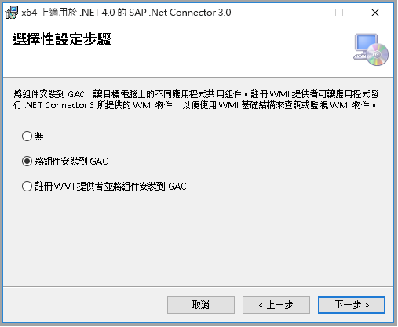

# <a name="copy-data-from-sap-business-warehouse-via-open-hub-using-azure-data-factory"></a>使用 Azure Data Factory 透過 Open Hub 從 SAP Business Warehouse 複製資料

本文概述如何使用 Azure Data Factory 中的「複製活動」，透過 Open Hub 從 SAP Business Warehouse (BW) 複製資料。 本文是根據[複製活動概觀](copy-activity-overview.md)一文，該文提供複製活動的一般概觀。

>[!TIP]
>要瞭解 ADF 對 SAP 資料整合方案的總體支援，請參閱[使用 Azure 資料工廠白皮書進行 SAP 資料整合](https://github.com/Azure/Azure-DataFactory/blob/master/whitepaper/SAP%20Data%20Integration%20using%20Azure%20Data%20Factory.pdf)，並詳細說明介紹、比較和指導。

## <a name="supported-capabilities"></a>支援的功能

此 SAP 業務倉庫通過開放中心連接器支援以下活動：

- 使用[支援的源/接收器矩陣](copy-activity-overview.md)[複製活動](copy-activity-overview.md)
- [查找活動](control-flow-lookup-activity.md)

您可以透過 Open Hub 將資料從 SAP Business Warehouse 複製到任何支援的接收資料存放區。 如需複製活動所支援作為來源/接收器的資料存放區清單，請參閱[支援的資料存放區](copy-activity-overview.md#supported-data-stores-and-formats)表格。

具體而言，此 SAP Business Warehouse Open Hub 連接器支援：

- SAP 業務倉庫**版本 7.01 或更高版本（在 2015 年之後發佈的 SAP 支援包堆疊中）。**
- 透過 Open Hub Destination 本機資料表複製資料，其下可能是 DSO、InfoCube、MultiProvider、DataSource 等等。
- 使用基本驗證來複製資料。
- 連線至應用程式伺服器。

## <a name="sap-bw-open-hub-integration"></a>SAP BW Open Hub 整合 

[SAP BW Open Hub Service](https://wiki.scn.sap.com/wiki/display/BI/Overview+of+Open+Hub+Service) 可讓您有效地從 SAP BW 中擷取資料。 下圖顯示客戶在其 SAP 系統中的常見流程之一，其資料流程為 SAP ECC -> PSA -> DSO -> Cube。

SAP BW Open Hub Destination (OHD) 會定義轉送 SAP 資料的目標。 SAP 資料傳輸流程 （DTP） 支援的任何物件都可以用作開放集線器資料來源，例如 DSO、InfoCube、DataSource 等。打開集線器目標型別 （其中存儲中繼資料 ） 可以是資料庫表（本地或遠端）和一般檔案。 此 SAP BW Open Hub 連接器支援從 BW 中的 OHD 本機資料表複製資料。 如果您使用其他類型，您可以使用其他連接器直接連線到資料庫或檔案系統。


## <a name="delta-extraction-flow"></a>增量提取流

ADF SAP BW 開放式集線器連接器`excludeLastRequest`提供`baseRequestId`兩個可選屬性：可用於處理來自打開集線器的增量負載。 

- **排除 LastRequestId：** 是否排除上次請求的記錄。 預設值為 true。 
- **基請求Id**：增量載入請求的 ID。 設定之後，將只會擷取 requestId 大於此屬性值的資料。 

總體而言，從 SAP 資訊供應商到 Azure 資料工廠 （ADF） 的提取包括兩個步驟： 

1. **SAP BW 資料傳輸流程 （DTP）** 此步驟將資料從 SAP BW 資訊供應商複製到 SAP BW 開放中心表 

1. **ADF 資料副本**在此步驟中，打開集線器表由 ADF 連接器讀取 


在第一步中，將執行 DTP。 每次執行都會創建新的 SAP 請求 ID。 請求 ID 存儲在打開中心表中，然後由 ADF 連接器用於標識增量。 這兩個步驟以非同步方式運行：DTP 由 SAP 觸發，ADF 資料拷貝通過 ADF 觸發。 

預設情況下，ADF 不會從打開中心表讀取最新的增量（選項"排除最後請求"為 true）。 因此，ADF 中的資料不是 100% 最新的，與打開中心表中的資料（缺少最後一個增量）一起。 作為回報，此過程可確保非同步提取不會丟失任何行。 即使 ADF 正在讀取打開中心表，而 DTP 仍在寫入同一表，它也能正常工作。 

通常，ADF 在暫存資料存儲（如上圖中的 Azure Blob）中，將複製的請求 ID 在上次運行時的最大複製請求 ID 存儲。 因此，ADF 不會在後續運行中第二次讀取同一請求。 同時，請注意，資料不會自動從打開中心表中刪除。

為了進行正確的增量處理，不允許在同一個打開中心表中具有來自不同 DTP 的請求 IP。 因此，您不得為每個打開中心目標 （OHD） 創建多個 DTP。 當需要從同一資訊供應商提取完整和增量時，應為同一資訊供應商創建兩個 OHD。 

## <a name="prerequisites"></a>Prerequisites

若要使用此 SAP Business Warehouse Open Hub 連接器，您必須：

- 設定 3.13 版或更新版本的「自我裝載 Integration Runtime。 有關詳細資訊[，請參閱自託管集成運行時](create-self-hosted-integration-runtime.md)文章。

- 從 SAP 的網站下載 **64 位元[ SAP .NET Connector 3.0](https://support.sap.com/en/product/connectors/msnet.html)**，並將其安裝在自我裝載的 IR 機器上。 安裝時，請在選擇性的設定步驟視窗中確定您已選取 [將組件安裝到 GAC]**** 選項，如下圖所示。 

    

- 在 Data Factory BW 連接器中使用的 SAP 使用者必須具有下列權限： 

    - RFC 和 SAP BW 的授權。 
    - 「執行」授權物件 "S_SDSAUTH" 活動的權限。

- 勾選 [技術金鑰] 選項，將 SAP Open Hub Destination 類型建立為 [資料庫資料表]****。  此外也建議您將 [從資料表中刪除資料] 保留為未勾選，但這並非必要動作。 利用 DTP (直接執行或整合到現有的程序鏈結中) 將資料從您所選擇的來源物件 (例如 Cube) 移至 Open Hub Destination 資料表。

## <a name="getting-started"></a>開始使用

> [!TIP]
>
> 有關使用 SAP BW 開放集線器連接器的演練，請參閱[使用 Azure 資料工廠載入來自 SAP 業務倉庫 （BW） 的資料](load-sap-bw-data.md)。

[!INCLUDE [data-factory-v2-connector-get-started](../../includes/data-factory-v2-connector-get-started.md)]

下列各節提供屬性的相關詳細資料，這些屬性是用來定義 SAP Business Warehouse Open Hub 連接器專屬的 Data Factory 實體。

## <a name="linked-service-properties"></a>連結服務屬性

以下是 SAP Business Warehouse Open Hub 連結服務支援的屬性：

| 屬性 | 描述 | 必要 |
|:--- |:--- |:--- |
| type | 類型屬性必須設置為 **：SapOpenHub** | 是 |
| 伺服器 | SAP BW 執行個體所在之伺服器的名稱。 | 是 |
| systemNumber | SAP BW 系統的系統編號。<br/>允許的值：以字串表示的二位數十進位數字。 | 是 |
| clientId | SAP W 系統中用戶端的用戶端識別碼。<br/>允許的值：以字串表示的三位數十進位數字。 | 是 |
| 語言 | SAP 系統使用的語言。 | 否 (預設值為 **EN**)|
| userName | 能夠存取 SAP 伺服器的使用者名稱。 | 是 |
| 密碼 | 使用者的密碼。 將此欄位標記為 SecureString，將它安全地儲存在 Data Factory 中，或[參考 Azure Key Vault 中儲存的祕密](store-credentials-in-key-vault.md)。 | 是 |
| connectVia | 用來連線到資料存放區的 [Integration Runtime](concepts-integration-runtime.md)。 如[必要條件](#prerequisites)所述，必須要有一個「自我裝載 Integration Runtime」。 |是 |

**例子：**

```json
{
    "name": "SapBwOpenHubLinkedService",
    "properties": {
        "type": "SapOpenHub",
        "typeProperties": {
            "server": "<server name>",
            "systemNumber": "<system number>",
            "clientId": "<client id>",
            "userName": "<SAP user>",
            "password": {
                "type": "SecureString",
                "value": "<Password for SAP user>"
            }
        },
        "connectVia": {
            "referenceName": "<name of Integration Runtime>",
            "type": "IntegrationRuntimeReference"
        }
    }
}
```

## <a name="dataset-properties"></a>資料集屬性

如需可用來定義資料集的區段和屬性完整清單，請參閱[資料集](concepts-datasets-linked-services.md)一文。 本節提供 SAP BW 開放中心資料集支援的屬性清單。

若要從 SAP BW Open Hub 複製資料以及將資料複製到該處，請將資料集的 type 屬性設為 **SapOpenHubTable**。 以下是支援的屬性。

| 屬性 | 描述 | 必要 |
|:--- |:--- |:--- |
| type | 類型屬性必須設為 **SapOpenHubTable**。  | 是 |
| openHubDestinationName | 要從中複製資料的 Open Hub Destination 名稱。 | 是 |

如果設置`excludeLastRequest`和`baseRequestId`資料集中，它仍然支援它，同時建議您今後在活動源中使用新模型。

**例子：**

```json
{
    "name": "SAPBWOpenHubDataset",
    "properties": {
        "type": "SapOpenHubTable",
        "typeProperties": {
            "openHubDestinationName": "<open hub destination name>"
        },
        "schema": [],
        "linkedServiceName": {
            "referenceName": "<SAP BW Open Hub linked service name>",
            "type": "LinkedServiceReference"
        }
    }
}
```

## <a name="copy-activity-properties"></a>複製活動屬性

如需可用來定義活動的區段和屬性完整清單，請參閱[管線](concepts-pipelines-activities.md)一文。 本節提供 SAP BW Open Hub 來源所支援的屬性清單。

### <a name="sap-bw-open-hub-as-source"></a>以 SAP BW Open Hub 作為來源

要從 SAP BW 開放中心複製資料，複製活動**源**部分支援以下屬性：

| 屬性 | 描述 | 必要 |
|:--- |:--- |:--- |
| type | 複製活動源**的類型**屬性必須設置為**SapOpenHubSource**。 | 是 |
| excludeLastRequest | 是否要排除最後一個要求的記錄。 | 否 (預設值為 **true**) |
| baseRequestId | 差異載入的要求識別碼。 設定之後，將只會擷取 requestId **大於**此屬性值的資料。  | 否 |

>[!TIP]
>如果您的 Open Hub 資料表僅包含單一要求識別碼所產生的資料 (例如，您一律執行完整負載並覆寫資料表中的現有資料，或您只在測試時執行 DTP 一次)，請務必取消勾選 "excludeLastRequest" 選項，以複製資料。

要加快資料載入速度，可以設置[`parallelCopies`](copy-activity-performance.md#parallel-copy)複製活動以並行從 SAP BW 開放集線器載入資料。 例如，如果設置為`parallelCopies`4，則資料工廠同時執行四個 RFC 調用，並且每個 RFC 調用從由 DTP 請求 ID 和包 ID 分區的 SAP BW 開放中心表檢索一部分資料。 當唯一 DTP 請求 ID + 包 ID 的數量大於`parallelCopies`的值 時，這適用。 將資料複製到基於檔的資料存儲中時，還會重新命令以多個檔形式寫入資料夾（僅指定資料夾名稱），在這種情況下，性能優於寫入單個檔。

**例子：**

```json
"activities":[
    {
        "name": "CopyFromSAPBWOpenHub",
        "type": "Copy",
        "inputs": [
            {
                "referenceName": "<SAP BW Open Hub input dataset name>",
                "type": "DatasetReference"
            }
        ],
        "outputs": [
            {
                "referenceName": "<output dataset name>",
                "type": "DatasetReference"
            }
        ],
        "typeProperties": {
            "source": {
                "type": "SapOpenHubSource",
                "excludeLastRequest": true
            },
            "sink": {
                "type": "<sink type>"
            },
            "parallelCopies": 4
        }
    }
]
```

## <a name="data-type-mapping-for-sap-bw-open-hub"></a>SAP BW Open Hub 的資料類型對應

從 SAP BW Open Hub 複製資料時，會使用下列從 SAP BW 資料類型對應到 Azure Data Factory 過渡期資料類型的對應。 請參閱[結構描述和資料類型對應](copy-activity-schema-and-type-mapping.md)，以了解複製活動如何將來源結構描述和資料類型對應至接收器。

| SAP ABAP 類型 | Data Factory 過渡期資料類型 |
|:--- |:--- |
| C (字串) | String |
| I (整數) | Int32 |
| F (浮點數) | Double |
| D (日期) | String |
| T (時間) | String |
| P (BCD 封裝、貨幣、小數、數量) | Decimal |
| N (Numc) | String |
| X (二進位和原始) | String |

## <a name="lookup-activity-properties"></a>查找活動屬性

要瞭解有關屬性的詳細資訊，請檢查[查找活動](control-flow-lookup-activity.md)。

## <a name="troubleshooting-tips"></a>疑難排解秘訣

**症狀：** 如果在 HANA 上運行 SAP BW，並且僅觀察到僅使用 ADF 複製活動（100 萬行）複製資料子集，則可能的原因是您在 DTP 中啟用"SAP HANA 執行"選項，在這種情況下，ADF 只能檢索第一批資料。

**解析度：** 禁用 DTP 中的"SAP HANA 執行"選項，重新處理資料，然後嘗試再次執行複製活動。

## <a name="next-steps"></a>後續步驟
如需 Azure Data Factory 中的複製活動所支援作為來源和接收器的資料存放區清單，請參閱[支援的資料存放區](copy-activity-overview.md#supported-data-stores-and-formats)。
