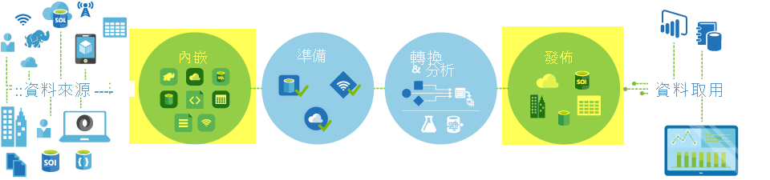

# <a name="copy-activity-in-azure-data-factory"></a>Azure Data Factory 中的複製活動

> [!div class="op_single_selector" title1="選取您要使用的 Data Factory 版本："]
> * [第 1 版](v1/data-factory-data-movement-activities.md)
> * [目前的版本](copy-activity-overview.md)

在 Azure Data Factory 中，您可以使用複製活動，在內部部署和雲端中的資料存放區之間複製資料。 複製資料之後，您可以使用其他活動進一步轉換和分析它。 您也可以使用「複製活動」來發行商業智慧（BI）和應用程式耗用量的轉換和分析結果。



複製活動會在[整合運行](concepts-integration-runtime.md)時間上執行。 針對不同的資料複製案例，您可以使用不同類型的整合執行時間：

* 當您在可從任何 IP 透過網際網路公開存取的兩個數據存放區之間複製資料時，您可以使用 Azure integration runtime 進行複製活動。 此整合執行時間是安全、可靠、可調整且[可全域使用](concepts-integration-runtime.md#integration-runtime-location)的。
* 當您要將資料複製到位於內部部署或具有存取控制（例如 Azure 虛擬網路）的網路中的資料存放區時，您必須設定自我裝載整合執行時間。

整合執行時間必須與每個來源和接收資料存放區相關聯。 如需複製活動如何判斷要使用哪一個整合執行時間的相關資訊，請參閱[判斷要使用的 IR](concepts-integration-runtime.md#determining-which-ir-to-use)。

若要將資料從來源複製到接收，執行複製活動的服務會執行下列步驟：

1. 從來源資料存放區讀取資料。
2. 執行序列化/還原序列化、壓縮/解壓縮、資料行對應等。 它會根據輸入資料集、輸出資料集和複製活動的設定來執行這些作業。
3. 將資料寫入接收/目的地資料存放區。


## <a name="supported-data-stores-and-formats"></a>支援的資料存放區和格式

[!INCLUDE [data-factory-v2-supported-data-stores](../../includes/data-factory-v2-supported-data-stores.md)]

### <a name="supported-file-formats"></a>支援的檔案格式

[!INCLUDE [data-factory-v2-file-formats](../../includes/data-factory-v2-file-formats.md)] 

您可以使用「複製活動」在兩個以檔案為基礎的資料存放區之間依原樣複製檔案，在此情況下，資料會有效率地複製，而不會進行任何序列化或還原序列化。 此外，您也可以剖析或產生特定格式的檔案，例如，您可以執行下列動作：

* 從內部部署 SQL Server 資料庫複製資料，並以 Parquet 格式寫入 Azure Data Lake Storage Gen2。
* 從內部部署檔案系統複製文字（CSV）格式的檔案，並以 Avro 格式寫入 Azure Blob 儲存體。
* 從內部部署檔案系統複製壓縮檔案、將其即時解壓縮，然後將解壓縮的檔案寫入 Azure Data Lake Storage Gen2。
* 從 Azure Blob 儲存體複製 Gzip 壓縮文字（CSV）格式的資料，並將其寫入 Azure SQL Database。
* 許多需要序列化/還原序列化或壓縮/解壓縮的活動。

## <a name="supported-regions"></a>支援區域

啟用複製活動的服務可在[Azure 整合執行時間位置](concepts-integration-runtime.md#integration-runtime-location)所列的區域和地理區域中全域取得。 全域可用的拓撲可確保進行有效率的資料移動，通常可避免發生跨區域躍點的情況。 請參閱[依區域的產品](https://azure.microsoft.com/regions/#services)，以檢查特定區域中 Data Factory 和資料移動的可用性。

## <a name="configuration"></a>組態

[!INCLUDE [data-factory-v2-connector-get-started](../../includes/data-factory-v2-connector-get-started.md)]

一般而言，若要在 Azure Data Factory 中使用複製活動，您需要：

1. **建立來源資料存放區和接收資料存放區的連結服務。** 您可以在本文的[支援的資料存放區和格式](#supported-data-stores-and-formats)一節中找到支援的連接器清單。 如需設定資訊和支援的屬性，請參閱連接器文章的「連結服務屬性」一節。 
2. **建立來源和接收的資料集。** 如需設定資訊和支援的屬性，請參閱來源和接收連接器文章的「資料集屬性」章節。
3. **建立具有複製活動的管線。** 下一節提供範例。

### <a name="syntax"></a>語法

複製活動的下列範本包含完整的支援屬性清單。 請指定適合您案例的屬性。

```json
"activities":[
    {
        "name": "CopyActivityTemplate",
        "type": "Copy",
        "inputs": [
            {
                "referenceName": "<source dataset name>",
                "type": "DatasetReference"
            }
        ],
        "outputs": [
            {
                "referenceName": "<sink dataset name>",
                "type": "DatasetReference"
            }
        ],
        "typeProperties": {
            "source": {
                "type": "<source type>",
                <properties>
            },
            "sink": {
                "type": "<sink type>"
                <properties>
            },
            "translator":
            {
                "type": "TabularTranslator",
                "columnMappings": "<column mapping>"
            },
            "dataIntegrationUnits": <number>,
            "parallelCopies": <number>,
            "enableStaging": true/false,
            "stagingSettings": {
                <properties>
            },
            "enableSkipIncompatibleRow": true/false,
            "redirectIncompatibleRowSettings": {
                <properties>
            }
        }
    }
]
```

#### <a name="syntax-details"></a>語法詳細資料

| 屬性 | 描述 | 必要項？ |
|:--- |:--- |:--- |
| type | 若為複製活動，請將設定為 `Copy` | 是 |
| 輸入 | 指定您所建立的資料集，以指向來源資料。 複製活動僅支援單一輸入。 | 是 |
| 輸出 | 指定您所建立的資料集，以指向接收資料。 複製活動僅支援單一輸出。 | 是 |
| typeProperties | 指定要設定複製活動的屬性。 | 是 |
| source | 指定要用來抓取資料的複製來源類型和對應的屬性。<br/>如需詳細資訊，請參閱[支援的資料存放區和格式](#supported-data-stores-and-formats)中所列連接器文章中的「複製活動屬性」一節。 | 是 |
| 接收 | 指定複製接收類型和用於寫入資料的對應屬性。<br/>如需詳細資訊，請參閱[支援的資料存放區和格式](#supported-data-stores-and-formats)中所列連接器文章中的「複製活動屬性」一節。 | 是 |
| 轉譯程式 | 指定從來源到接收的明確資料行對應。 當預設複製行為不符合您的需求時，就會套用此屬性。<br/>如需詳細資訊，請參閱[複製活動中的架構對應](copy-activity-schema-and-type-mapping.md)。 | 否 |
| dataIntegrationUnits | 指定代表[Azure 整合運行](concepts-integration-runtime.md)時間用於資料複製之耗電量的量值。 這些單位先前稱為雲端資料移動單位（DMU）。 <br/>如需詳細資訊，請參閱[資料整合單位](copy-activity-performance.md#data-integration-units)。 | 否 |
| parallelCopies | 指定在從來源讀取資料，並將資料寫入至接收時，複製活動所要使用的平行處理原則。<br/>如需詳細資訊，請參閱[平行複製](copy-activity-performance.md#parallel-copy)。 | 否 |
| 保留 | 指定在資料複製期間是否保留中繼資料/Acl。 <br/>如需詳細資訊，請參閱[保留中繼資料](copy-activity-preserve-metadata.md)。 |否 |
| enableStaging<br/>stagingSettings | 指定是否要將暫時資料暫存在 Blob 儲存體中，而不是直接將資料從來源複製到接收。<br/>如需實用案例和設定詳細資料的相關資訊，請參閱[分段複製](copy-activity-performance.md#staged-copy)。 | 否 |
| enableSkipIncompatibleRow<br/>redirectIncompatibleRowSettings| 選擇當您將資料從來源複製到接收時，如何處理不相容的資料列。<br/>如需詳細資訊，請參閱[容錯](copy-activity-fault-tolerance.md)。 | 否 |

## <a name="monitoring"></a>監視

您可以透過視覺化和程式設計方式來監視 Azure Data Factory 中的複製活動執行。 如需詳細資訊，請參閱[監視複製活動](copy-activity-monitoring.md)。

## <a name="incremental-copy"></a>增量複製

Data Factory 可讓您以累加方式將差異資料從來源資料存放區複製到接收資料存放區。 如需詳細資訊，請參閱[教學課程：以累加方式複製資料](tutorial-incremental-copy-overview.md)。

## <a name="performance-and-tuning"></a>效能和微調

[複製活動監視](copy-activity-monitoring.md)體驗會顯示每個活動執行的複製效能統計資料。 [複製活動的效能和擴充性指南](copy-activity-performance.md)會說明透過 Azure Data Factory 中的複製活動，影響資料移動效能的主要因素。 它也會列出測試期間觀察到的效能值，並討論如何將複製活動的效能優化。

## <a name="resume-from-last-failed-run"></a>從上一次失敗的執行繼續

複製活動支援在您以檔案為基礎的存放區之間以二進位格式複製大量檔案時，從上次失敗執行繼續，並選擇保留來源到接收的資料夾/檔案階層（例如，將資料從 Amazon S3 遷移至 Azure Data Lake Storage Gen2。 它適用于下列以檔案為基礎的連接器： [Amazon S3](connector-amazon-simple-storage-service.md)、 [azure Blob](connector-azure-blob-storage.md)、 [Azure Data Lake Storage Gen1](connector-azure-data-lake-store.md)、 [Azure Data Lake Storage Gen2](connector-azure-data-lake-storage.md)、 [Azure 檔案儲存體](connector-azure-file-storage.md)、[檔案系統](connector-file-system.md)、 [FTP](connector-ftp.md)、 [Google 雲端儲存體](connector-google-cloud-storage.md)、 [HDFS](connector-hdfs.md)和[SFTP](connector-sftp.md)。

您可以利用下列兩種方式來使用複製活動繼續：

- **活動層級重試：** 您可以在複製活動上設定重試計數。 在管線執行期間，如果此複製活動執行失敗，下一個自動重試將從上次試用的失敗點開始。
- **從失敗的活動重新執行：** 完成管線執行之後，您也可以在 ADF UI 監視視圖或以程式設計方式，從失敗的活動觸發重新執行。 如果失敗的活動是複製活動，管線將不只會從此活動重新執行，還會從先前執行的失敗點繼續。

    

請注意下列幾點：

- 繼續發生在檔案層級。 複製檔案時，如果複製活動失敗，則在下一次執行時，將會重新複製此特定檔案。
- 若要讓 [繼續] 正常運作，請不要變更 [重新執行] 之間的複製活動設定。
- 當您從 Amazon S3、Azure Blob、Azure Data Lake Storage Gen2 和 Google Cloud Storage 複製資料時，複製活動可以從任意數目的複製檔案繼續。 雖然以檔案為基礎的其餘連接器做為來源，但目前的複製活動支援從有限數量的檔案繼續，通常是在數十千的範圍內，而且會根據檔案路徑的長度而有所不同;在重新執行期間，將會重新複製超過此數目的檔案。

對於非二進位檔案複製的其他案例，複製活動會從開頭開始重新執行。

## <a name="preserve-metadata-along-with-data"></a>保留中繼資料以及資料

將資料從來源複製到接收時，在類似 data lake 遷移的案例中，您也可以選擇使用複製活動來保留中繼資料和 Acl 以及資料。 如需詳細資訊，請參閱[保留中繼資料](copy-activity-preserve-metadata.md)。

## <a name="schema-and-data-type-mapping"></a>結構描述和資料類型對應

如需複製活動如何將您的來源資料對應至接收的相關資訊，請參閱[架構和資料類型對應](copy-activity-schema-and-type-mapping.md)。

## <a name="fault-tolerance"></a>容錯

根據預設，當來源資料列與接收資料列不相容時，複製活動會停止複製資料並傳回失敗。 若要讓複製成功，您可以將複製活動設定為略過並記錄不相容的資料列，並只複製相容的資料。 如需詳細資訊，請參閱[複製活動的容錯](copy-activity-fault-tolerance.md)。

## <a name="next-steps"></a>後續步驟
請參閱下列快速入門、教學課程和範例：

- [在相同的 Azure Blob 儲存體帳戶中，將資料從一個位置複製到另一個位置](quickstart-create-data-factory-dot-net.md)
- [將資料從 Azure Blob 儲存體複製到 Azure SQL Database](tutorial-copy-data-dot-net.md)
- [將資料從內部部署 SQL Server 資料庫複製到 Azure](tutorial-hybrid-copy-powershell.md)
