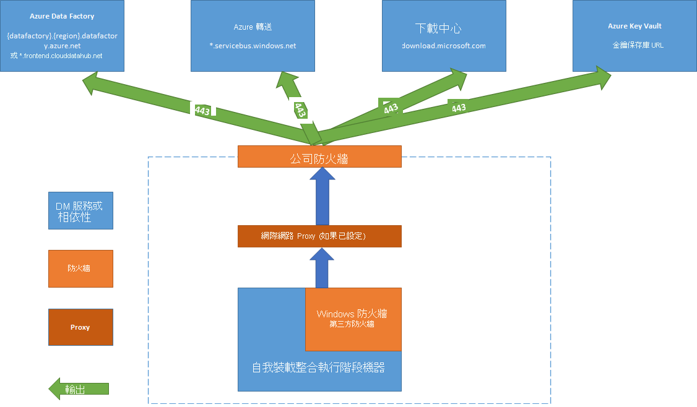

# <a name="create-and-configure-a-self-hosted-integration-runtime"></a>建立和設定自我裝載整合執行階段

整合執行階段 (IR) 是 Azure Data Factory 所使用的計算基礎結構，可提供跨不同網路環境的資料整合功能。 有關 IR 的詳細資訊，請參閱[集成運行時概述](concepts-integration-runtime.md)。

自託管的集成運行時可以在雲資料存儲和私人網路絡中的資料存儲之間運行複製活動。 它還可以針對本地網路或 Azure 虛擬網路中的計算資源調度轉換活動。 安裝自託管集成運行時需要本地電腦或私人網路絡內的虛擬機器。  

本文介紹如何創建和配置自承載的 IR。

[!INCLUDE [updated-for-az](../../includes/updated-for-az.md)]

## <a name="setting-up-a-self-hosted-integration-runtime"></a>設置自託管集成運行時

要創建和設置自託管的集成運行時，請使用以下過程。

### <a name="create-a-self-hosted-ir-via-azure-powershell"></a>通過 Azure PowerShell 創建自託管 IR

1. 可以為此任務使用 Azure PowerShell。 範例如下：

    ```powershell
    Set-AzDataFactoryV2IntegrationRuntime -ResourceGroupName $resourceGroupName -DataFactoryName $dataFactoryName -Name $selfHostedIntegrationRuntimeName -Type SelfHosted -Description "selfhosted IR description"
    ```
  
2. [下載](https://www.microsoft.com/download/details.aspx?id=39717)並在本機電腦上安裝自我裝載整合執行階段。

3. 擷取驗證金鑰，並使用該金鑰註冊自我裝載整合執行階段。 以下是 PowerShell 範例︰

    ```powershell

    Get-AzDataFactoryV2IntegrationRuntimeKey -ResourceGroupName $resourceGroupName -DataFactoryName $dataFactoryName -Name $selfHostedIntegrationRuntimeName  

    ```

### <a name="create-a-self-hosted-ir-via-azure-data-factory-ui"></a>通過 Azure 資料工廠 UI 創建自託管 IR

使用以下步驟使用 Azure 資料工廠 UI 創建自託管 IR。

1. 在 Azure 資料工廠 UI 的 **"讓我們開始"** 頁上，選擇最左側窗格上的 **"作者"** 選項卡。

   

1. 選擇最左側窗格底部的 **"連接**"，並在 **"連接"** 視窗中選擇 **"集成"運行時**。 選擇 **"新建**"。

   

1. 在 **"集成運行時設置**"視窗中，選擇 **"執行資料移動並將活動調度到外部計算**"，然後選擇"**繼續**"。

1. 輸入 IR 的名稱，然後選擇 **"創建**"。

1. 選擇**選項 1**下的連結以打開電腦上的快速設置。 或者按照**選項 2**下的步驟手動設置。 以下說明基於手動設置：

   

    1. 複製並粘貼身份驗證金鑰。 選擇 **"下載並安裝集成運行時**"。

    1. 在本機 Windows 電腦上下載自我裝載的整合執行階段。 執行安裝程式。

    1. 在**註冊集成運行時（自託管）** 頁上，粘貼之前保存的金鑰，然後選擇"**註冊**"。
    
       

    1. 在 [新增 Integration Runtime (自我裝載) 節點]**** 頁面上，選取 [完成]****。

1. 成功註冊自託管的集成運行時後，您將看到以下視窗：

    

### <a name="set-up-a-self-hosted-ir-on-an-azure-vm-via-an-azure-resource-manager-template"></a>通過 Azure 資源管理器範本在 Azure VM 上設置自承載 IR

您可以使用["創建自主機 IR 範本](https://github.com/Azure/azure-quickstart-templates/tree/master/101-vms-with-selfhost-integration-runtime)"在 Azure 虛擬機器上自動執行自託管的 IR 設置。 該範本提供了一種在 Azure 虛擬網路內具有功能齊全的自託管 IR 的簡單方法。 只要將節點計數設置為 2 或更高，IR 就具有高可用性和可擴充性功能。

### <a name="set-up-an-existing-self-hosted-ir-via-local-powershell"></a>通過本地 PowerShell 設置現有的自託管 IR

可以使用命令列設置或管理現有的自承載 IR。 此用法特別有助於自動安裝和註冊自承載的 IR 節點。

Dmgcmd.exe 包含在自託管安裝程式中。 它通常位於 C：程式檔\微軟集成運行時\3.0\Shared_資料夾中。 此應用程式支援各種參數，並且可以通過使用批次處理腳本進行自動化的命令列調用。

使用應用程式如下所示：

```powershell
dmgcmd [ -RegisterNewNode "<AuthenticationKey>" -EnableRemoteAccess "<port>" ["<thumbprint>"] -EnableRemoteAccessInContainer "<port>" ["<thumbprint>"] -DisableRemoteAccess -Key "<AuthenticationKey>" -GenerateBackupFile "<filePath>" "<password>" -ImportBackupFile "<filePath>" "<password>" -Restart -Start -Stop -StartUpgradeService -StopUpgradeService -TurnOnAutoUpdate -TurnOffAutoUpdate -SwitchServiceAccount "<domain\user>" ["<password>"] -Loglevel <logLevel> ]
```

以下是應用程式的參數和屬性的詳細資訊： 

| 屬性                                                    | 描述                                                  | 必要 |
| ----------------------------------------------------------- | ------------------------------------------------------------ | -------- |
| **註冊新節點**"`<AuthenticationKey>`"                     | 使用指定的身份驗證金鑰註冊自託管的集成運行時節點。 | 否       |
| **註冊新節點**"`<AuthenticationKey>`" "`<NodeName>`"      | 使用指定的身份驗證金鑰和節點名稱註冊自託管的集成運行時節點。 | 否       |
| **啟用遠端存取**"`<port>`" ["`<thumbprint>`"]            | 啟用當前節點上的遠端存取以設置高可用性群集。 或者直接針對自託管的 IR 啟用設置憑據，而無需通過 Azure 資料工廠。 使用來自同一網路中遠端電腦**的 New-AzDataFactoryV2LinkService加密憑據**Cmdlet 來執行後者。 | 否       |
| **啟用遠端存取容器**"`<port>`" ["`<thumbprint>`"] | 當節點在容器中運行時，啟用對當前節點的遠端存取。 | 否       |
| **禁用遠端存取**                                         | 禁用對當前節點的遠端存取。 多節點設置需要遠端存取。 即使禁用遠端存取 **，New-AzDataFactoryV2LinkService 加密證書**PowerShell Cmdlet 仍然有效。 只要 Cmdlet 與自承載的 IR 節點在同一台電腦上執行，此行為就為 true。 | 否       |
| **鑰匙**"`<AuthenticationKey>`"                                 | 覆蓋或更新以前的身份驗證金鑰。 小心此操作。 如果金鑰是新的集成運行時，則以前的自託管 IR 節點可以離線。 | 否       |
| **生成備份檔案**"`<filePath>`" "`<password>`"            | 為當前節點生成備份檔案。 備份檔案包括節點金鑰和資料存儲憑據。 | 否       |
| **導入備份檔案**"`<filePath>`" "`<password>`"              | 從備份檔案還原節點。                          | 否       |
| **重新啟動**                                                     | 重新開機自託管的集成執行階段主機服務。   | 否       |
| **開始**                                                       | 啟動自託管的集成執行階段主機服務。     | 否       |
| **停止**                                                        | 停止自託管的集成執行階段主機服務。        | 否       |
| **啟動升級服務**                                         | 啟動自託管集成運行時升級服務。       | 否       |
| **停止升級服務**                                          | 停止自託管集成運行時升級服務。        | 否       |
| **打開自動更新**                                            | 打開自託管集成運行時自動更新。        | 否       |
| **關閉自動更新**                                           | 關閉自託管的集成運行時自動更新。       | 否       |
| **交換器服務帳戶**"`<domain\user>`" ["`<password>`"]           | 將 DIAHost 服務設置為作為新帳戶運行。 對系統帳戶和虛擬帳戶使用空密碼""。 | 否       |


## <a name="command-flow-and-data-flow"></a>命令流程和資料流程

在本地和雲之間移動資料時，活動使用自託管集成運行時在本地資料來源和雲之間傳輸資料。

以下是使用自託管 IR 進行複製的資料流程步驟的高級摘要：


1. 資料開發人員使用 PowerShell Cmdlet 在 Azure 資料工廠中創建自託管的集成運行時。 目前，Azure 門戶不支援此功能。
1. 資料開發人員為本地資料存儲創建連結服務。 開發人員通過指定服務應用於連接到資料存儲的自託管集成運行時實例來這樣做。
1. 自我裝載整合執行階段節點會使用 Windows 資料保護應用程式開發介面 (DPAPI) 將加密，並將認證儲存在本機上。 如果有多個節點設定為高可用性，則該認證會進一步同步處理到其他節點。 每個節點都會使用 DPAPI 來加密認證，並將其儲存在本機上。 認證同步處理無需資料開發人員介入，並且由自我裝載 IR 處理。
1. Azure 資料工廠與自託管的集成運行時進行通信，以計畫和管理作業。 通信通過使用共用[Azure 服務匯流排中繼](https://docs.microsoft.com/azure/service-bus-relay/relay-what-is-it#wcf-relay)連接的控制通道進行。 當需要運行活動作業時，資料工廠將請求與任何憑據資訊一起排隊。 如果憑據尚未存儲在自託管的集成運行時，則這樣做。 自託管的集成運行時在輪詢佇列後啟動作業。
1. 自託管的集成運行時在本機存放區和雲存儲之間複製資料。 複製的方向取決於資料管道中如何配置複製活動。 對於此步驟，自託管集成運行時通過安全的 HTTPS 通道直接與基於雲的存儲服務（如 Azure Blob 存儲）進行通信。

## <a name="considerations-for-using-a-self-hosted-ir"></a>使用自我裝載 IR 的考量

- 您可以將單個自託管集成運行時用於多個本地資料來源。 您還可以與同一 Azure 活動目錄 （Azure AD） 租戶中的另一個資料工廠共用它。 如需詳細資訊，請參閱[共用自我裝載整合執行階段](#create-a-shared-self-hosted-integration-runtime-in-azure-data-factory)。
- 只能在任何一台電腦上安裝一個自託管集成運行時的實例。 如果您有兩個數據工廠需要訪問本地資料來源，請使用[自託管 IR 共用功能](#create-a-shared-self-hosted-integration-runtime-in-azure-data-factory)共用自承載 IR，或者在兩臺本地電腦上安裝自承載 IR，每個資料工廠一個。  
- 自託管的集成運行時不需要與資料來源位於同一台電腦上。 但是，將自託管的集成運行時靠近資料來源可縮短自託管集成運行時連接到資料來源的時間。 我們建議您在與承載本地資料來源的電腦上安裝自託管集成運行時。 當自託管的集成運行時和資料來源位於不同的電腦上時，自託管的集成運行時不會與資源的資料來源競爭。
- 您可以在不同電腦上有多個自我裝載整合執行階段，但它們皆連接至相同的內部部署資料來源。 例如，如果您有兩個為兩個數據工廠提供服務的自託管集成運行時，則可以在兩個數據工廠中註冊相同的本地資料來源。
- 如果電腦上已經安裝了閘道以服務 Power BI 方案，請在另一台電腦上安裝資料工廠的獨立託管集成運行時。
- 使用自託管集成運行時支援 Azure 虛擬網路中的資料整合。
- 即使您使用 Azure ExpressRoute，也應該將資料來源視為在防火牆後的內部部署資料來源。 使用自託管集成運行時將服務連接到資料來源。
- 使用自託管的集成運行時，即使資料存儲位於 Azure 基礎結構作為服務 （IaaS） 虛擬機器上的雲中也是如此。
- 在啟用 FIPS 相容加密的 Windows 伺服器上安裝的自託管集成運行時中，任務可能會失敗。 若要解決此問題，請在伺服器上停用符合 FIPS 規範的加密。 要禁用符合 FIPS 的加密，請將以下註冊表子鍵的值從 1（啟用）更改為 0（`HKLM\System\CurrentControlSet\Control\Lsa\FIPSAlgorithmPolicy\Enabled`禁用）：

## <a name="prerequisites"></a>Prerequisites

- 支援的 Windows 版本包括：
  + Windows 7 Service Pack 1
  + Windows 8.1
  + Windows 10
  + Windows Server 2008 R2 SP1
  + Windows Server 2012
  + Windows Server 2012 R2
  + Windows Server 2016
  + Windows Server 2019
   
   不支援在網域控制站上安裝自託管集成運行時。
- 必須要有 .NET Framework 4.6.1 或更新版本。 如果您要在 Windows 7 電腦上安裝自我裝載整合執行階段，必須安裝 .NET Framework 4.6.1 或更新版本。 如需詳細資訊，請參閱 [.NET Framework 系統需求](/dotnet/framework/get-started/system-requirements) 。
- 自託管集成運行時電腦的建議最小配置是具有 4 個內核、8 GB RAM 和 80 GB 可用硬碟空間的 2-GHz 處理器。
- 如果主機休眠，則自託管的集成運行時不回應資料請求。 因此，安裝自我裝載整合執行階段之前，請先在電腦上設定適當的電源計劃。 如果電腦配置為休眠，則自託管的集成運行時安裝程式會提示一條消息。
- 您必須是電腦上的管理員才能成功安裝和配置自承載的集成運行時。
- 複製活動運行以特定頻率進行。 機器上的處理器和 RAM 使用方式遵循相同的模式，峰值和閒置時間。 資源使用方式還在很大程度上取決於移動的資料量。 如果有多個複製作業正在進行，您會看到資源使用量在尖峰時段增加。
- 在以 Parquet、ORC 或 Avro 格式提取資料時，任務可能會失敗。 有關 Parquet 的更多，請參閱[Azure 資料工廠中的 Parquet 格式](https://docs.microsoft.com/azure/data-factory/format-parquet#using-self-hosted-integration-runtime)。 檔創建在自託管集成電腦上運行。 要按預期工作，檔創建需要以下先決條件：
    - [視覺C++ 2010 可再分配](https://download.microsoft.com/download/3/2/2/3224B87F-CFA0-4E70-BDA3-3DE650EFEBA5/vcredist_x64.exe)包裝 （x64）
    - JAVA 運行時 （JRE） 版本 8 來自 JRE 提供程式，如[採用 OpenJDK](https://adoptopenjdk.net/)。 確保設置`JAVA_HOME`環境變數。

## <a name="installation-best-practices"></a>安裝最佳做法

您可以通過從[Microsoft 下載中心](https://www.microsoft.com/download/details.aspx?id=39717)下載託管標識設置包來安裝自託管的集成運行時。 有關分步說明，請參閱文章["在本地和雲之間移動資料](tutorial-hybrid-copy-powershell.md)"。

- 為自託管集成運行時在主機上配置電源計劃，以便電腦不會休眠。 如果主機電腦休眠，自我裝載整合執行階段就會離線。
- 定期備份與自託管集成運行時關聯的憑據。
- 要自動執行自託管的 IR 設置操作，請參閱[通過 PowerShell 設置現有的自託管 IR](#setting-up-a-self-hosted-integration-runtime)。  

## <a name="install-and-register-a-self-hosted-ir-from-microsoft-download-center"></a>從 Microsoft 下載中心安裝和註冊自託管的 IR

1. 瀏覽至 [Microsoft 整合執行階段下載頁面](https://www.microsoft.com/download/details.aspx?id=39717)。
1. 選擇 **"下載**"，選擇 64 位版本，然後選擇 **"下一步**"。 不支援 32 位版本。
1. 直接運行託管標識檔，或將其保存到硬碟磁碟機並運行它。
1. 在 **"歡迎"** 視窗中，選擇一種語言並選擇 **"下一步**"。
1. 接受「Microsoft 軟體授權條款」，然後選取 [下一步]****。
1. 選取 [資料夾]**** 來安裝自我裝載整合執行階段，接著按一下 [下一步]****。
1. 在 **"準備安裝"** 頁上，選擇 **"安裝**"。
1. 選擇 **"完成"** 以完成安裝。
1. 使用 PowerShell 獲取身份驗證金鑰。 擷取驗證金鑰的 PowerShell 範例：

    ```powershell
    Get-AzDataFactoryV2IntegrationRuntimeKey -ResourceGroupName $resourceGroupName -DataFactoryName $dataFactoryName -Name $selfHostedIntegrationRuntime
    ```

1. 在電腦上運行的 Microsoft 集成運行時組態管理員的**寄存器集成運行時（自託管）** 視窗中，執行以下步驟：

    1. 將驗證金鑰貼到文字區域。

    1. (選擇性) 選取 [顯示驗證金鑰]**** 以查看金鑰文字。

    1. 選取 [註冊]****。

## <a name="high-availability-and-scalability"></a>高可用性與延展性

您可以將自託管的集成運行時與 Azure 中的多個本地電腦或虛擬機器相關聯。 這些電腦稱為節點。 一個自我裝載整合執行階段最多可與四個節點建立關聯。 在為邏輯閘道安裝了閘道的本地電腦上具有多個節點的好處是：

* 自託管集成運行時的可用性更高，因此不再是大資料解決方案或與 Data 工廠集成的雲資料整合中的單點故障。 當您最多使用四個節點時，此可用性有助於確保連續性。
* 提升在內部部署和雲端資料存放區之間移動資料時的效能和輸送量。 如需詳細資訊，請參閱[效能比較](copy-activity-performance.md)。

您可以通過從[下載中心](https://www.microsoft.com/download/details.aspx?id=39717)安裝自託管的集成運行時軟體來關聯多個節點。 然後，使用從**New-AzDataFactoryV2集成運行時金鑰**Cmdlet 獲取的身份驗證金鑰之一進行註冊，如[教程](tutorial-hybrid-copy-powershell.md)中所述。

> [!NOTE]
> 您無需創建新的自託管集成運行時來關聯每個節點。 您可以將自我裝載整合執行階段安裝在另一部電腦上，並使用相同的驗證金鑰進行註冊。

> [!NOTE]
> 在添加另一個節點以實現高可用性和可擴充性之前，請確保在第一個節點上啟用了對 Intranet 的**遠端存取**選項。 為此，請選擇**Microsoft 集成運行時組態管理員** > **設置** > **對 Intranet 的遠端存取**。

### <a name="scale-considerations"></a>調整考量

#### <a name="scale-out"></a>相應放大

當處理器使用率高且自承載 IR 上的可用記憶體較低時，請添加新節點以説明跨電腦擴展負載。 如果活動因超時或自承載的 IR 節點離線而失敗，則將節點添加到閘道會有所説明。

#### <a name="scale-up"></a>相應增加

當處理器和可用 RAM 未充分利用，但併發作業的執行達到節點的限制時，通過增加節點可以運行的併發作業數來擴展。 由於自承載的 IR 已超載，您可能還希望在活動超時時進行擴展。 您可以增加一個節點的容量上限，如下圖所示：  


### <a name="tlsssl-certificate-requirements"></a>TLS/SSL 憑證需求

以下是用於保護集成運行時節點之間通信的 TLS/SSL 憑證的要求：

- 憑證必須是受信任的 X509 v3 公開憑證。 我們建議您使用由公共合作夥伴憑證授權單位 （CA） 頒發的證書。
- 每個整合執行階段節點都必須信任此憑證。
- 我們不推薦主題替代名稱 （SAN） 證書，因為只使用最後一個 SAN 項。 將忽略所有其他 SAN 項。 例如，如果您有一個 SAN 證書，其 SAN 的 SAN **node1.domain.contoso.com並且****node2.domain.contoso.com**，則只能在完全限定的功能變數名稱 （FQDN） **node2.domain.contoso.com**的電腦上使用此證書。
- 證書可以使用 Windows Server 2012 R2 支援的任何金鑰大小來用於 TLS/SSL 憑證。
- 不支援使用 CNG 金鑰的證書。  

> [!NOTE]
> 使用此證書：
>
> - 加密自承載的 IR 節點上的埠。
> - 用於狀態同步的節點到節點通信，包括跨節點連結服務的憑據同步。
> - 當 PowerShell Cmdlet 用於本地網路中的連結服務憑據設置時。
>
> 如果您的私人網路絡環境不安全，或者您希望保護私人網路絡中節點之間的通信，我們建議您使用此證書。
>
> 從自託管 IR 傳輸到其他資料存儲中的資料移動始終發生在加密通道中，無論是否設置了此證書。

## <a name="create-a-shared-self-hosted-integration-runtime-in-azure-data-factory"></a>在 Azure 資料工廠中創建共用自託管集成運行時

您可以重複使用您已經在資料處理站中設定的現有自我裝載整合執行階段基礎結構。 這種重用允許您通過引用現有的共用自承載 IR，在不同的資料工廠中創建連結的自託管集成運行時。

要查看此功能的介紹和演示，請觀看以下 12 分鐘視頻：

> [!VIDEO https://channel9.msdn.com/Shows/Azure-Friday/Hybrid-data-movement-across-multiple-Azure-Data-Factories/player]

### <a name="terminology"></a>詞彙

- **共用 IR**：在物理基礎結構上運行的原始自託管 IR。  
- **連結的 IR**：引用另一個共用 IR 的 IR。 連結的 IR 是邏輯 IR，使用另一個共用自承載 IR 的基礎結構。

### <a name="methods-to-share-a-self-hosted-integration-runtime"></a>共用自託管集成運行時的方法

要與多個資料工廠共用自託管的集成運行時，請參閱[創建共用自託管集成運行時](create-shared-self-hosted-integration-runtime-powershell.md)以瞭解詳細資訊。

### <a name="monitoring"></a>監視

#### <a name="shared-ir"></a>共用 IR


#### <a name="linked-ir"></a>連結紅外


### <a name="known-limitations-of-self-hosted-ir-sharing"></a>自我裝載整合執行階段共用的已知限制

* 創建連結 IR 的資料工廠必須具有[託管標識](https://docs.microsoft.com/azure/active-directory/managed-service-identity/overview)。 預設情況下，在 Azure 門戶或 PowerShell Cmdlet 中創建的資料工廠具有隱式創建的託管標識。 但是，當資料工廠通過 Azure 資源管理器範本或 SDK 創建時，必須顯式設置**標識**屬性。 此設置可確保資源管理器創建包含託管標識的資料工廠。

* 支援此功能的資料工廠 .NET SDK 必須是版本 1.1.0 或更高版本。

* 要授予許可權，您需要共用 IR 所在的資料工廠中的"擁有者"角色或繼承的擁有者角色。

* 共用功能僅適用于同一 Azure AD 租戶中的資料工廠。

* 對於 Azure AD[來賓使用者](https://docs.microsoft.com/azure/active-directory/governance/manage-guest-access-with-access-reviews)，UI 中的搜索功能（使用搜索關鍵字列出所有資料工廠）[不起作用](https://msdn.microsoft.com/library/azure/ad/graph/howto/azure-ad-graph-api-permission-scopes#SearchLimits)。 但是，只要來賓使用者是資料工廠的擁有者，就可以在沒有搜索功能的情況下共用 IR。 對於需要共用 IR 的資料工廠的託管標識，請在 **"分配許可權"** 框中輸入該託管標識，並在"資料工廠 UI 中**添加**"。

  > [!NOTE]
  > 此功能僅在資料工廠 V2 中可用。

## <a name="notification-area-icons-and-notifications"></a>通知區域圖示和通知

如果將游標移到通知區域中的圖示或消息上，則可以看到有關自託管集成運行時狀態的詳細資訊。


## <a name="ports-and-firewalls"></a>埠和防火牆

需要考慮兩個防火牆：

- 在組織中央路由器上運行*的公司防火牆*
- 在安裝自託管集成運行時的本地電腦上配置為守護進程的視窗*防火牆*



在公司防火牆層級，您需要設定下列網域和輸出連接埠：

[!INCLUDE [domain-and-outbound-port-requirements](../../includes/domain-and-outbound-port-requirements.md)]

在 Windows 防火牆級別或電腦級別，這些出站埠通常處於啟用狀態。 如果不是，則可以在自託管的集成運行時電腦上配置域和埠。

> [!NOTE]
> 根據您的源和接收器，您可能需要在公司防火牆或 Windows 防火牆中允許其他域和出站埠。
>
> 對於某些雲資料庫（如 Azure SQL 資料庫和 Azure 資料湖），您可能需要在其防火牆配置上允許自託管集成運行時電腦的 IP 位址。

### <a name="copy-data-from-a-source-to-a-sink"></a>將資料從來源複製到接收器

確保在公司防火牆、自託管集成運行時電腦的 Windows 防火牆和資料存儲本身上正確啟用防火牆規則。 啟用這些規則可以讓自託管的集成運行時成功連接到源和接收器。 請為複製作業所涉及的每個資料存放區啟用規則。

例如，要從本地資料存儲複製到 SQL 資料庫接收器或 Azure SQL 資料倉儲接收器，請執行以下步驟：

1. 允許 Windows 防火牆和企業防火牆在埠 1433 上進行出站 TCP 通信。
1. 配置 SQL 資料庫的防火牆設置，將自託管集成運行時電腦的 IP 位址添加到允許的 IP 位址清單中。

> [!NOTE]
> 如果您的防火牆不允許出站埠 1433，則自託管的集成運行時無法直接存取 SQL 資料庫。 在這種情況下，可以使用[暫存副本](copy-activity-performance.md)到 SQL 資料庫和 SQL 資料倉儲。 在這種情況下，只需 HTTPS（埠 443）進行資料移動。

## <a name="proxy-server-considerations"></a>Proxy 伺服器考量

如果您的公司網路環境使用 Proxy 伺服器來存取網際網路，請將自我裝載整合執行階段設定為使用適當的 Proxy 設定。 您可以在初始註冊階段期間設定 Proxy。


配置後，自託管集成運行時使用代理伺服器連接到雲服務的源和目標（使用 HTTP 或 HTTPS 協定）。 這就是在初始設置期間選擇 **"更改"連結**的原因。


有三個組態選項：

- **不要使用代理**：自託管的集成運行時不會顯式使用任何代理連接到雲服務。
- **使用系統代理**：自託管集成運行時使用在 diahost.exe.config 和 diawp.exe.config 中配置的代理設置。如果這些檔未指定代理配置，則自託管集成運行時無需通過代理即可直接連接到雲服務。
- **使用自訂代理**：將 HTTP 代理設置配置為用於自託管集成運行時，而不是使用 diahost.exe.config 和 diawp.exe.config 中的配置。**位址**和**埠**值是必需的。 **使用者名**和**密碼**值是可選的，具體取決於代理的身份驗證設置。 自我裝載整合執行階段上的所有設定都會使用 Windows DPAPI 加密，並儲存在本機電腦上。

保存更新的代理設置後，集成執行階段主機服務將自動重新開機。

註冊自託管集成運行時後，如果要查看或更新代理設置，請使用 Microsoft 集成運行時組態管理員。

1. 開啟 [Microsoft Integration Runtime 管理員]****。
1. 選取 [設定]**** 索引標籤。
1. 在**HTTP 代理**下，選擇 **"更改**"連結以打開 **"設置 HTTP 代理"** 對話方塊。
1. 選取 [下一步]****。 然後，您將看到一條警告，要求您有權保存代理設置並重新啟動集成執行階段主機服務。

您可以使用組態管理員工具查看和更新 HTTP 代理。


> [!NOTE]
> 如果使用 NTLM 身份驗證設置代理伺服器，則集成執行階段主機服務將在域帳戶下運行。 如果稍後更改域帳戶的密碼，請記住更新服務的配置設置並重新啟動服務。 由於此要求，我們建議您使用不需要頻繁更新密碼的專用域帳戶訪問代理伺服器。

### <a name="configure-proxy-server-settings"></a>設定 Proxy 伺服器設定

如果為 HTTP 代理選擇 **"使用系統代理**"選項，則自託管集成運行時將使用 diahost.exe.config 和 diawp.exe.config 中的代理設置。當這些檔指定不指定代理時，自託管集成運行時直接連接到雲服務，而無需通過代理。 下列程序說明如何更新 diahost.exe.config 檔案：

1. 在檔資源管理器中，將 C：_程式檔\Microsoft 集成運行時\3.0_shared_diahost.exe.config 作為原始檔案的備份進行安全副本。
1. 打開以管理員身份運行的記事本。
1. 在記事本中，打開文字檔 C：\程式檔\微軟集成運行時\3.0_shared_diahost.exe.config。
1. 查找預設**system.net**標記，如以下代碼所示：

    ```xml
    <system.net>
        <defaultProxy useDefaultCredentials="true" />
    </system.net>
    ```
    接著，您可以新增 Proxy 伺服器詳細資料，如以下範例所示：

    ```xml
    <system.net>
        <defaultProxy enabled="true">
              <proxy bypassonlocal="true" proxyaddress="http://proxy.domain.org:8888/" />
        </defaultProxy>
    </system.net>
    ```

    代理標記允許其他屬性指定所需的設置，如`scriptLocation`。 有關[\<語法\>，請參閱代理元素（網路設置）。](https://msdn.microsoft.com/library/sa91de1e.aspx)

    ```xml
    <proxy autoDetect="true|false|unspecified" bypassonlocal="true|false|unspecified" proxyaddress="uriString" scriptLocation="uriString" usesystemdefault="true|false|unspecified "/>
    ```
1. 將設定檔保存在其原始位置。 然後重新開機自託管的集成執行階段主機服務，該服務將選取更改。

   要重新開機服務，請使用控制台中的服務小程式。 或從「整合執行階段組態管理員」中，選取 [停止服務]**** 按鈕，然後再選取 [啟動服務]****。

   如果服務未啟動，則可能會在編輯的應用程式佈建檔中添加了不正確的 XML 標記語法。

> [!IMPORTANT]
> 別忘了同時更新 diahost.exe.config 和 diawp.exe.config。

您還需要確保 Microsoft Azure 位於公司的允許清單中。 可以從[微軟下載中心](https://www.microsoft.com/download/details.aspx?id=41653)下載有效的 Azure IP 位址清單。

### <a name="possible-symptoms-for-issues-related-to-the-firewall-and-proxy-server"></a>與防火牆和代理伺服器相關的問題的可能症狀

如果您看到以下錯誤訊息，則可能是防火牆或代理伺服器配置不當。 此類配置可防止自託管集成運行時連接到資料工廠以進行身份驗證。 請參閱上一節，以確保您的防火牆和 Proxy 伺服器的設定皆正確。

* 當您嘗試註冊自託管的集成運行時時，您會收到以下錯誤訊息："註冊此集成運行時節點失敗！ 確認身份驗證金鑰有效，並且整合服務主機服務在此電腦上運行。
* 當您開啟「Integration Runtime 組態管理員」時，您會看到「已中斷連線」**** 或「正在連線」**** 狀態。 當您查看 Windows 事件日誌時，在**事件檢視器** > **應用程式和服務日誌** > **Microsoft 集成運行時**下，您將看到如下所示的錯誤訊息：

    ```
    Unable to connect to the remote server
    A component of Integration Runtime has become unresponsive and restarts automatically. Component name: Integration Runtime (Self-hosted).
    ```

### <a name="enable-remote-access-from-an-intranet"></a>啟用從 Intranet 遠端存取

如果使用 PowerShell 加密來自網路電腦的憑據，而不是安裝自託管集成運行時的位置，則可以啟用來自 Intranet 的**遠端存取**選項。 如果運行 PowerShell 在安裝自託管集成運行時的電腦上加密憑據，則無法**啟用來自 Intranet 的遠端存取**。

在添加另一個節點以實現高可用性和可擴充性之前，從 Intranet 啟用**遠端存取**。  

當您運行自託管的集成運行時安裝程式版本 3.3 或更高版本時，預設情況下，自託管集成運行時安裝程式禁用自託管集成運行時電腦上的來自 Intranet 的**遠端存取**。

當您使用來自合作夥伴或其他方的防火牆時，可以手動打開端口 8060 或使用者配置的埠。 如果在設置自託管的集成運行時遇到防火牆問題，請使用以下命令安裝自託管的集成運行時，而無需配置防火牆：

```
msiexec /q /i IntegrationRuntime.msi NOFIREWALL=1
```

如果選擇不在自託管集成運行時電腦上打開端口 8060，請使用"設置憑據"應用程式以外的機制來配置資料存儲憑據。 例如，您可以使用**新阿茲達工廠V2連結服務加密證書**電源外殼 Cmdlet。

## <a name="next-steps"></a>後續步驟

有關分步說明，請參閱[教程：將本地資料複製到雲](tutorial-hybrid-copy-powershell.md)。
