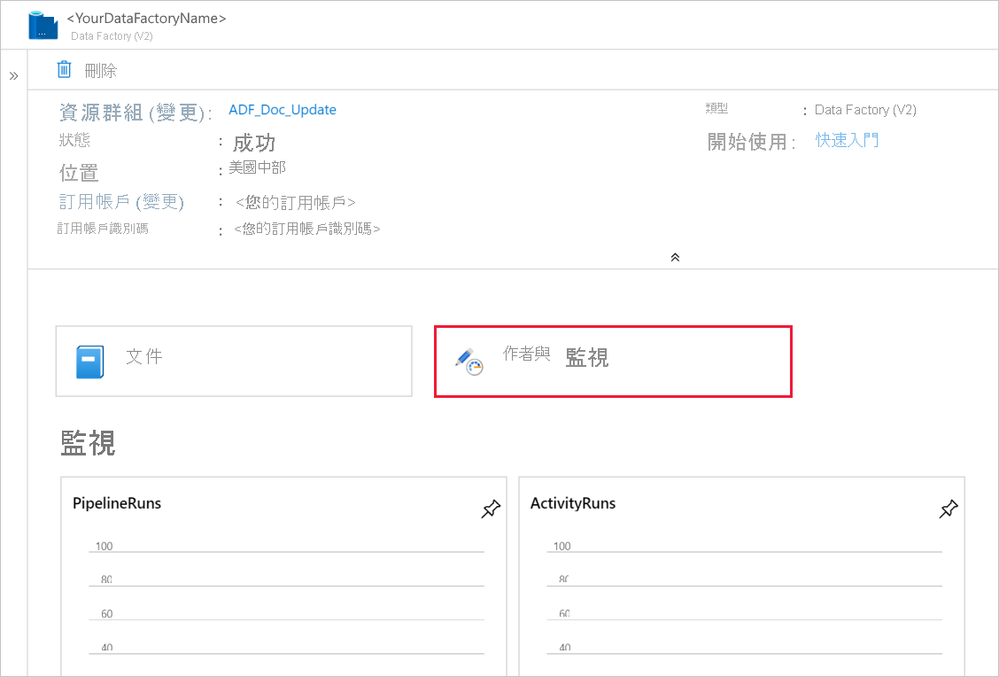

# 使用 Azure Data Factory 將資料載入 Azure Synapse 分析

[!INCLUDE[appliesto-adf-asa-md](includes/appliesto-adf-asa-md.md)]

[Azure Synapse Analytics （先前稱為 SQL DW）](../synapse-analytics/sql-data-warehouse/sql-data-warehouse-overview-what-is.md)是一種雲端式的向外延展資料庫，能夠處理大量的資料，包括關聯式和非關聯式。 Azure Synapse 分析建基於大規模平行處理（MPP）架構，針對企業資料倉儲工作負載進行優化。 它透過單獨調整儲存體和計算的彈性，來提供雲端彈性。

當您使用 Azure Data Factory 時，立即開始使用 Azure Synapse 分析比以往更容易。 Azure Data Factory 是完全受控的雲端式資料整合服務。 您可以使用此服務，以現有系統的資料填入 Azure Synapse 分析，並在建立分析解決方案時節省時間。

Azure Data Factory 提供將資料載入 Azure Synapse 分析的下列優點：

* **容易設定**：直覺式的 5 步驟精靈，無須任何指令碼。
* **支援豐富的資料存放區**：內建各種內部部署和雲端式資料存放區的支援。 如需詳細清單，請參閱[支援的資料存放區](copy-activity-overview.md#supported-data-stores-and-formats)的資料表。
* **安全且符合規範**：資料會透過 HTTPS 或 ExpressRoute 傳輸。 具有全域服務，可確保資料絕不會離開地理界限。
* **使用 polybase 的無與倫比效能**： PolyBase 是將資料移至 Azure Synapse 分析最有效率的方式。 使用暫存 Blob 功能來讓您能夠從所有類型的資料存放區 (包括 Azure Blob 儲存體和 Data Lake Store) 高速載入資料。 （Polybase 預設支援 Azure Blob 儲存體和 Azure Data Lake 存放區）。如需詳細資訊，請參閱[複製活動效能](copy-activity-performance.md)。

本文說明如何使用 Data Factory 資料複製工具，將_資料從 Azure SQL Database 載入至 Azure Synapse 分析_。 您可以依照類似的步驟，從其他類型的資料存放區複製資料。

> [!NOTE]
> 如需詳細資訊，請參閱[使用 Azure Data Factory 將資料複製到 Azure Synapse 分析或從其複製資料](connector-azure-sql-data-warehouse.md)。

## 必要條件

* Azure 訂用帳戶：如果您沒有 Azure 訂用帳戶，請在開始前建立[免費帳戶](https://azure.microsoft.com/free/)。
* Azure Synapse 分析：資料倉儲會保存從 SQL 資料庫複製的資料。 如果您沒有 Azure Synapse 分析，請參閱[建立 Azure Synapse 分析](../sql-data-warehouse/sql-data-warehouse-get-started-tutorial.md)中的指示。
* Azure SQL Database：本教學課程會從 Azure SQL Database 中的「艾德作品 LT 範例」資料集複製資料。 您可以遵循在[Azure SQL Database 中建立範例資料庫](../azure-sql/database/single-database-create-quickstart.md)中的指示，在 SQL Database 中建立此範例資料庫。
* Azure 儲存體帳戶：大量複製作業會使用 Azure 儲存體作為「暫存」__ Blob。 如果您沒有 Azure 儲存體帳戶，請參閱[建立儲存體帳戶](../storage/common/storage-account-create.md)中的指示。

## 建立 Data Factory

1. 在左側功能表上，選取 [建立資源] > [資料 + 分析] > [資料處理站]：

2. 在 [**新增 data factory** ] 頁面上，提供下列專案的值：

    * **名稱**：輸入*LoadSQLDWDemo*作為 [名稱]。 您的 data factory 名稱必須是 * 全域唯一的。 如果您收到「Data factory 名稱 ' LoadSQLDWDemo ' 無法使用」錯誤，請為資料處理站輸入不同的名稱。 例如，您可以使用_**您的名稱**_**ADFTutorialDataFactory**。 請嘗試再次建立資料處理站。 如需 Data Factory 成品的命名規則，請參閱 [Data Factory 命名規則](naming-rules.md)。
    * 訂用帳戶：選取用來在其中建立資料處理站的 Azure 訂用帳戶。 
    * **資源群組**：從下拉式清單中選取現有的資源群組，或選取 [新建] 選項，然後輸入資源群組的名稱。 若要了解資源群組，請參閱 [使用資源群組管理您的 Azure 資源](../azure-resource-manager/management/overview.md)。  
    * **版本**：選取 [V2]。
    * **位置**：選取資料處理站的位置。 只有受到支援的位置會顯示在下拉式清單中。 資料處理站所使用的資料存放區可位於其他位置和區域。 這些資料存放區包含 Azure Data Lake Store、Azure 儲存體、Azure SQL Database 等等。

3. 選取 [建立]。
4. 建立完成後，請移至資料處理站。 您會看到如下圖所示的 [Data Factory] 首頁：

   

   選取 [編寫與監視] 圖格，以在另一個索引標籤中啟動資料整合應用程式。

## 將資料載入 Azure Synapse 分析

1. 在 [**開始**使用] 頁面中，選取 [**資料複製**] 圖格以啟動 [資料複製] 工具。

1. 在 [**屬性**] 頁面中，指定 [工作**名稱**] 欄位的 **[Copyfromsqltosqldw** ，然後選取 **[下一步]**。

    

1. 在 [來源資料存放區]**** 頁面中，完成下列步驟：
    >[!TIP]
    >在本教學課程中，您會使用*SQL 驗證*做為來源資料存放區的驗證類型，但您可以選擇其他支援的驗證方法： [*服務主體*] 和 [*受控識別*] （如有需要）。 如需詳細資訊，請參閱[本文](https://docs.microsoft.com/azure/data-factory/connector-azure-sql-database#linked-service-properties)的對應章節。
    >若要安全地儲存資料存放區的秘密，也建議您使用 Azure Key Vault。 如需詳細說明，請參閱[本文](https://docs.microsoft.com/azure/data-factory/store-credentials-in-key-vault)。

    a. 按一下 [ **+ 建立新**連線]。

    b. 從資源庫選取 [Azure SQL Database]****，然後選取 [繼續]****。 您可以在搜尋方塊中輸入 "SQL"，以篩選連接器。

    

    c. 在 [**新增連結服務**] 頁面中，從下拉式清單中選取您的伺服器名稱和資料庫名稱，然後指定使用者名稱和密碼。 按一下 [**測試連接**] 以驗證設定，然後選取 [**建立**]。

    

    d. 選取新建立的連結服務作為來源，然後按 [下一步]。

1. 在 [選取要從中複製資料的資料表或使用自訂查詢]**** 頁面中，輸入 **SalesLT** 以篩選資料表。 選擇 [ **（全選）** ] 方塊以使用複製的所有資料表，然後選取 **[下一步]**。

    

1. 在 [套用**篩選**] 頁面上，指定您的設定，或選取 **[下一步]**。

1. 在 [目的地資料存放區]**** 頁面中，完成下列步驟：
    >[!TIP]
    >在本教學課程中，您會使用*SQL 驗證*做為目的地資料存放區的驗證類型，但您可以選擇其他支援的驗證方法： [*服務主體*] 和 [*受控識別*] （如有需要）。 如需詳細資訊，請參閱[本文](https://docs.microsoft.com/azure/data-factory/connector-azure-sql-data-warehouse#linked-service-properties)的對應章節。
    >若要安全地儲存資料存放區的秘密，也建議您使用 Azure Key Vault。 如需詳細說明，請參閱[本文](https://docs.microsoft.com/azure/data-factory/store-credentials-in-key-vault)。

    a. 按一下 [+ 建立新連線] 以新增連線

    b. 從資源庫選取 [ **Azure Synapse 分析] （先前稱為 [SQL DW]）** ，然後選取 [**繼續**]。 您可以在搜尋方塊中輸入 "SQL"，以篩選連接器。

    

    c. 在 [**新增連結服務**] 頁面中，從下拉式清單中選取您的伺服器名稱和資料庫名稱，然後指定使用者名稱和密碼。 按一下 [**測試連接**] 以驗證設定，然後選取 [**建立**]。

    

    d. 選取新建立的連結服務作為接收端，然後按 [下一步]。

1. 在 [資料表對應]**** 頁面上檢閱內容，然後選取 [下一步]****。 隨即會顯示智慧型資料表對應。 來源資料表會根據資料表名稱來對應至目的地資料表。 如果有某個來源資料表未存在於目的地中，Azure Data Factory 預設會建立具有相同名稱的目的地資料表。 您也可以將來源資料表對應至現有的目的地資料表。

   > [!NOTE]
   > 當 SQL Server 或 Azure SQL Database 為來源時，適用于 Azure Synapse 分析接收的自動建立資料表。 如果您從其他來源資料存放區複製資料，您必須先在接收 Azure Synapse 分析中預先建立架構，然後再執行資料複製。

   

1. 在 [資料**行對應**] 頁面中，檢查內容，然後選取 **[下一步]**。 系統會根據資料行名稱來進行智慧型資料表對應。 如果您讓 Data Factory 自動建立資料表，而來源和目的地存放區之間有不相容的問題時，系統便會轉換資料類型。 如果來源和目的地資料行之間有不支援的資料類型轉換，您就會在對應的資料表旁看到一則錯誤訊息。

    

1. 在 [設定]**** 頁面中，完成下列步驟：

    a. 在 [暫存設定]**** 區段中，按一下 [+ 新增]**** 以新增暫存儲存體。 在使用 PolyBase 將資料載入至 Azure Synapse 分析之前，會使用儲存體來暫存資料。 複製完成之後，會自動清除 Azure Blob 儲存體中的中期資料。

    b. 在 [**新增連結服務**] 頁面中，選取您的儲存體帳戶，然後選取 [**建立**] 以部署連結服務。

    c. 在 [進階設定]**** 區段中，取消選取 [使用類型預設值]**** 選項，然後選取 [下一步]****。

    

1. 在 [**摘要**] 頁面中，檢查設定，然後選取 **[下一步]**。

    

1. 在**部署頁面**上選取 [監視]**** 來監視管線 (工作)。 
 
1. 請注意，系統會自動選取左側的 [監視] 索引標籤。 當管線執行成功完成時，請選取 [**管線名稱**] 欄底下的 [ **[copyfromsqltosqldw** ] 連結，以查看活動執行詳細資料或重新執行管線。

    

1. 若要切換回 [管線執行] 視圖，請選取頂端的 [**所有管線執行**] 連結。 選取 [重新整理] 即可重新整理清單。

    

1. 若要監視每個複製活動的執行詳細資料，請在活動執行視圖中，選取 [**活動名稱**] 下的 [**詳細資料**] 連結（眼鏡圖示）。 您可以監視詳細資料，例如從來源複製到接收的資料量、資料輸送量、具有對應期間的執行步驟，以及使用的設定。
    

    

## 後續步驟

請繼續閱讀下列文章，以瞭解 Azure Synapse Analytics 支援：

> [!div class="nextstepaction"]
>[Azure Synapse 分析連接器](connector-azure-sql-data-warehouse.md)
