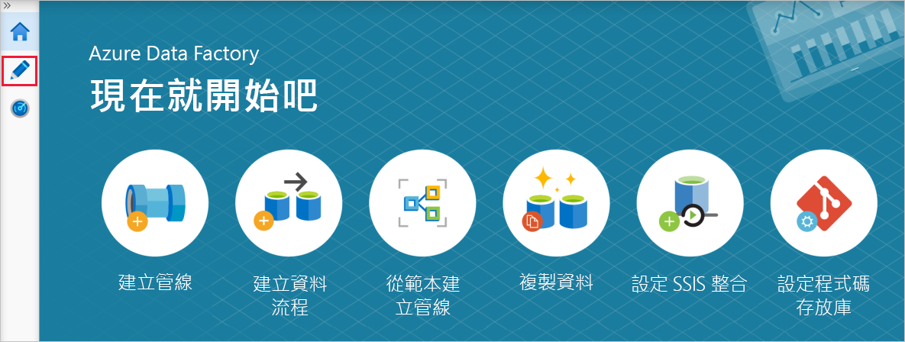
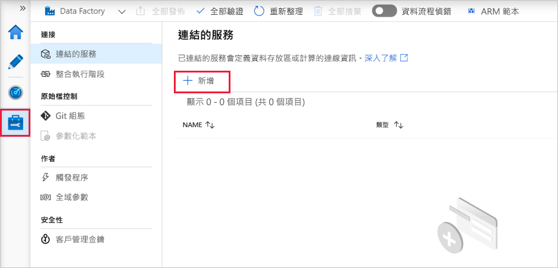

# <a name="copy-multiple-tables-in-bulk-by-using-azure-data-factory-in-the-azure-portal"></a>在 Azure 入口網站中使用 Azure Data Factory 大量複製多份資料表

[!INCLUDE[appliesto-adf-asa-md](includes/appliesto-adf-asa-md.md)]

本教學課程示範如何**從 Azure SQL Database 將多個資料表複製到 Azure Synapse Analytics (先前為 SQL DW)** 。 您也可以在其他複製案例中套用相同模式。 例如，將資料表從 SQL Server/Oracle 複製到 Azure SQL Database/Azure Synapse Analytics (先前為 SQL DW)/Azure Blob，將不同的路徑從 Blob 複製到 Azure SQL Database 資料表。

> [!NOTE]
> - 如果您不熟悉 Azure Data Factory，請參閱 [Azure Data Factory 簡介](introduction.md)。

概括而言，本教學課程包含下列步驟：

> [!div class="checklist"]
> * 建立資料處理站。
> * 建立 Azure SQL Database、Azure Synapse Analytics (先前為 SQL DW) 和 Azure 儲存體連結服務。
> * 建立 Azure SQL Database 和 Azure Synapse Analytics (先前為 SQL DW) 資料集。
> * 建立管線來查閱要複製的資料表和其他管線，以執行實際的複製作業。 
> * 啟動管線執行。
> * 監視管線和活動執行。

本教學課程使用 Azure 入口網站。 若要了解如何使用其他工具/SDK 來建立資料處理站，請參閱[快速入門](quickstart-create-data-factory-dot-net.md)。 

## <a name="end-to-end-workflow"></a>端對端工作流程
在此案例中，您在 Azure SQL Database 中有一些要複製到 Azure Synapse Analytics (先前為 SQL DW) 的資料表。 以下是發生在管線中工作流程中步驟的邏輯順序：


* 第一個管線會查閱需要複製到接收資料存放區的資料表清單。  或者，您可以維護中繼資料資料表，其中列出要複製到接收資料存放區的所有資料表。 然後，管線會觸發另一個管線，它會逐一查看資料庫中的每個資料表，並執行資料複製作業。
* 第二個管線會執行實際的複製。 它會使用資料表的清單作為參數。 對於清單中的每個資料表，使用[透過 Blob 儲存體和 PolyBase 暫存複製](connector-azure-sql-data-warehouse.md#use-polybase-to-load-data-into-azure-synapse-analytics)，將 Azure SQL Database 中的特定資料表複製到 Azure Synapse Analytics (先前為 SQL DW) 中的對應資料表，可獲得最佳效能。 在此範例中，第一個管線會將資料表清單傳遞作為參數的值。 

如果您沒有 Azure 訂用帳戶，請在開始前建立[免費帳戶](https://azure.microsoft.com/free/)。

## <a name="prerequisites"></a>必要條件
* **Azure 儲存體帳戶**。 Azure 儲存體帳戶會在大量複製作業中用做暫存 Blob 儲存體。 
* **Azure SQL Database**。 此資料庫包含來源資料。 
* **Azure Synapse Analytics (先前為 SQL DW)** 。 此資料倉儲保存從 SQL Database 複製的資料。 

### <a name="prepare-sql-database-and-azure-synapse-analytics-formerly-sql-dw"></a>準備 SQL Database 和 Azure Synapse Analytics (先前為 SQL DW)

**準備來源 Azure SQL Database**：

遵循[在 Azure SQL Database 中建立資料庫](../azure-sql/database/single-database-create-quickstart.md)一文，在 SQL Database 中建立具有 Adventure Works LT 範例資料的資料庫。 本教學課程會將此範例資料庫中的所有資料表複製到 Azure Synapse Analytics (先前為 SQL DW)。

**準備接收 Azure Synapse Analytics (先前為 SQL DW)** ：

1. 如果您沒有 Azure Synapse Analytics (先前為 SQL DW) 工作區，請參閱[開始使用 Azure Synapse Analytics](..\synapse-analytics\get-started.md) 一文，以取得其建立步驟。

1. 在 Azure Synapse Analytics (先前為 SQL DW) 中建立對應的資料表結構描述。 在稍後步驟中，您可以使用 Azure Data Factory 來移轉/複製資料。

## <a name="azure-services-to-access-sql-server"></a>Azure 服務存取 SQL Server

對於 SQL Database 和 Azure Synapse Analytics (先前為 SQL DW)，均應允許 Azure 服務存取 SQL Server。 請確定您已為伺服器**開啟** [允許 Azure 服務和資源存取此伺服器] 設定。 此設定可允許 Data Factory 服務從您的 Azure SQL Database 讀取資料，並將資料寫入至 Azure Synapse Analytics (先前為 SQL DW)。 

若要確認並開啟此設定，請移至您的伺服器 > [安全性] > [防火牆與虛擬網路] > 將 [允許 Azure 服務和資源存取此伺服器] 設定為 [開啟]。

## <a name="create-a-data-factory"></a>建立 Data Factory

1. 啟動 **Microsoft Edge** 或 **Google Chrome** 網頁瀏覽器。 目前，只有 Microsoft Edge 和 Google Chrome 網頁瀏覽器支援 Data Factory UI。
1. 移至 [Azure 入口網站](https://portal.azure.com)。 
1. 在 Azure 入口網站功能表左側，選取 [建立資源] > [分析] > [資料處理站]。 
   ![在 [新增] 窗格中選取資料處理站](./media/doc-common-process/new-azure-data-factory-menu.png)
1. 在 [新增資料處理站] 頁面上，輸入 **ADFTutorialBulkCopyDF** 作為 [名稱]。 
 
   Azure Data Factory 的名稱必須是 **全域唯一的**。 如果您在名稱欄位看到下列錯誤，請變更資料處理站的名稱 (例如 yournameADFTutorialBulkCopyDF)。 請參閱 [Data Factory - 命名規則](naming-rules.md)一文，以了解 Data Factory 成品的命名規則。
  
    ```text
    Data factory name "ADFTutorialBulkCopyDF" is not available
    ```
1. 選取您要在其中建立資料處理站的 Azure **訂用帳戶**。 
1. 針對 [資源群組]，請執行下列其中一個步驟︰
     
   - 選取 [使用現有的] ，然後從下拉式清單選取現有的資源群組。 
   - 選取 [建立新的] ，然後輸入資源群組的名稱。   
         
     若要了解資源群組，請參閱 [使用資源群組管理您的 Azure 資源](../azure-resource-manager/management/overview.md)。  
1. 針對 [版本] 選取 [V2]。
1. 選取 Data Factory 的 [位置]  。 如需目前可使用 Data Factory 的 Azure 區域清單，請在下列頁面上選取您感興趣的區域，然後展開 [分析] 以找出 [Data Factory]：[依區域提供的產品](https://azure.microsoft.com/global-infrastructure/services/)。 資料處理站所使用的資料存放區 (Azure 儲存體、Azure SQL Database 等) 和計算 (HDInsight 等) 可位於其他區域。
1. 按一下 [建立]。
1. 在建立完成後，選取 [前往資源]，以瀏覽至 [資料處理站] 頁面。 
   
1. 按一下 [編寫與監視] 圖格，以在另一個索引標籤中啟動 Data Factory 使用者介面應用程式。
1. 在 [現在就開始吧] 頁面上，切換至左面板中的 [編寫] 索引標籤，如下圖所示：

     

## <a name="create-linked-services"></a>建立連結的服務
您建立的連結服務會將您的資料存放區和計算連結到資料處理站。 連結服務具有連線資訊，可供 Data Factory 服務在執行階段中用來連線至資料存放區。 

在本教學課程中，您會將 Azure SQL Database、Azure Synapse Analytics (先前為 SQL DW)、Azure Blob 儲存體資料存放區連結至您的資料處理站。 Azure SQL Database 是來源資料存放區。 Azure Synapse Analytics (先前為 SQL DW) 是接收/目的地資料存放區。 而在使用 PolyBase 將資料載入 Azure Synapse Analytics (先前為 SQL DW) 之前，會使用 Azure Blob 儲存體暫存資料。 

### <a name="create-the-source-azure-sql-database-linked-service"></a>建立來源 Azure SQL Database 連結服務
在此步驟中，您會建立連結服務，將 Azure SQL Database 中的資料庫連結至資料處理站。 

1. 從左窗格中開啟 [[管理] 索引標籤](https://docs.microsoft.com/azure/data-factory/author-management-hub)。

1. 在 [連結的服務] 頁面上，選取 [+ 新增] 以建立新的連結服務。

   
1. 在 [新增連結服務] 視窗中，選取 [Azure SQL Database]，然後按一下 [繼續]。 
1. 在 [新增連結服務 (Azure SQL Database)] 視窗中，執行下列步驟： 

    a. 輸入 **AzureSqlDatabaseLinkedService** 作為 [名稱]。

    b. 在 [伺服器名稱] 選取您的伺服器
    
    c. 針對 [資料庫名稱]，選取您的資料庫。 
    
    d. 輸入 [使用者名稱] 以連線至您的資料庫。 
    
    e. 輸入使用者的 [密碼]。 

    f. 若要使用指定資訊測試您的資料庫連線，按一下 [測試連線]。
  
    g. 按一下 [建立] 以儲存連結服務。


### <a name="create-the-sink-azure-synapse-analytics-formerly-sql-dw-linked-service"></a>建立接收 Azure Synapse Analytics (先前為 SQL DW) 連結服務

1. 在 [連線] 索引標籤上，再次按一下工具列上的 [+ 新增]。 
1. 在 [新增連結服務] 視窗中，選取 [Azure Synapse Analytics (先前為 SQL DW)]，然後按一下 [繼續]。 
1. 在 [新增連結服務 (Azure Synapse Analytics (先前為 SQL DW) )] 視窗中，執行下列步驟： 
   
    a. 輸入 **AzureSqlDWLinkedService** 作為 **[名稱]** 。
     
    b. 在 [伺服器名稱] 選取您的伺服器
     
    c. 針對 [資料庫名稱]，選取您的資料庫。 
     
    d. 輸入 [使用者名稱] 以連線至您的資料庫。 
     
    e. 輸入使用者的 [密碼]。 
     
    f. 若要使用指定資訊測試您的資料庫連線，按一下 [測試連線]。
     
    g. 按一下 [建立]。

### <a name="create-the-staging-azure-storage-linked-service"></a>建立暫存 Azure 儲存體連結服務
在本教學課程中，您會使用 Azure Blob 儲存體作為暫時的暫存區域，讓 PolyBase 獲得更好的複製效能。

1. 在 [連線] 索引標籤上，再次按一下工具列上的 [+ 新增]。 
1. 在 [新增連結服務] 視窗中，選取 [Azure Blob 儲存體]，然後按一下 [繼續]。 
1. 在 [新增連結服務 (Azure Blob 儲存體)] 視窗中，執行下列步驟： 

    a. 輸入 **AzureStorageLinkedService** 作為 [名稱]。                                                 
    b. 在 [儲存體帳戶名稱] 選取您的 **Azure 儲存體帳戶**。
    
    c. 按一下 [建立]。

## <a name="create-datasets"></a>建立資料集
在本教學課程中，您會建立來源和接收資料集，其指定儲存資料的位置。 

輸入資料集 **AzureSqlDatabaseDataset** 會參照 **AzureSqlDatabaseLinkedService**。 連結服務會指定連接字串以連線至資料庫。 資料集會指定資料庫的名稱，以及包含來源資料的資料表。 

輸出資料集 **AzureSqlDWDataset** 會參照 **AzureSqlDWLinkedService**。 連結服務會指定用以連線至 Azure Synapse Analytics (先前為 SQL DW) 的連接字串。 資料集會指定資料庫，以及作為資料複製目的地的資料表。 

在本教學課程中，並沒有在資料集定義中對來源和目的地 SQL 資料表執行硬式編碼。 而是在執行階段由 ForEach 活動將資料表名稱傳遞給複製活動。 

### <a name="create-a-dataset-for-source-sql-database"></a>建立來源 SQL Database 的資料集

1. 按一下左窗格中的 [+] (加號)，然後按一下 [資料集]。 

    
1. 在 [新增資料集] 視窗中選取 [Azure SQL Database]，然後按一下 [繼續]。 
    
1. 在 [設定屬性] 視窗中，於 [名稱] 底下輸入 **AzureSqlDatabaseDataset**。 於 [連結服務] 底下，選取 [AzureSqlDatabaseLinkedService]。 然後按一下 [確定] 。

1. 切換至 [連線] 索引標籤，然後針對 [資料表] 選取任何資料表。 此資料表是空的資料表。 建立管線時，您可以指定來源資料集的查詢。 查詢可用來從您的資料庫擷取資料。 或者，您可以按一下 [編輯] 核取方塊，然後輸入 **dbo.dummyName** 作為資料表名稱。 
 

### <a name="create-a-dataset-for-sink-azure-synapse-analytics-formerly-sql-dw"></a>建立接收 Azure Synapse Analytics (先前為 SQL DW) 的資料集

1. 按一下左窗格中的 [+] (加號)，然後按一下 [資料集]。 
1. 在 [新增資料集] 視窗中，選取 [Azure Synapse Analytics (先前為 SQL DW)]，然後按一下 [繼續]。
1. 在 [設定屬性] 視窗中，於 [名稱] 底部輸入 **AzureSqlDWDataset**。 於 [連結服務] 底下，選取 [AzureSqlDWLinkedService]。 然後按一下 [確定] 。
1. 切換至 [參數] 索引標籤，按一下 [+ 新增]，並輸入 **DWTableName** 作為參數名稱。 再按一下 [+ 新增]，然後輸入 **DWSchema** 作為參數名稱。 如果您從頁面複製/貼上此名稱，請確定 *DWTableName* 和 *DWSchema* 的結尾處沒有**尾端空白字元**。 
1. 切換至 [連線] 索引標籤， 

    1. 針對 [資料表]，核取 [編輯] 選項。 選取第一個輸入方塊，並按一下下方的 [新增動態內容] 連結。 在 [新增動態內容] 頁面中，在 [參數] 下方按一下將會自動填入 Top 運算式文字方塊 `@dataset().DWSchema` 的 **DWSchema**，然後按一下 [完成]。  
    
        

    1. 選取第二個輸入方塊，並按一下下方的 [新增動態內容] 連結。 在 [新增動態內容] 頁面中，在 [參數] 下方按一下將會自動填入 Top 運算式文字方塊 `@dataset().DWTableName` 的 **DWTAbleName**，然後按一下 [完成]。 
    
    1. 為資料集的 **tableName** 屬性設定的值，會作為引數傳遞給 **DWSchema** 和 **DWTableName** 參數。 ForEach 活動會逐一查看資料表清單，並逐一傳遞給複製活動。 
    

## <a name="create-pipelines"></a>建立管線
在本教學課程中，您將建立兩個管線：**IterateAndCopySQLTables** 和 **GetTableListAndTriggerCopyData**。 

**GetTableListAndTriggerCopyData** 管線會執行兩個動作：

* 請查閱 Azure SQL Database 系統資料表，以取得要複製的資料表清單。
* 觸發 **IterateAndCopySQLTables** 管線以進行實際的資料複製。

**IterateAndCopySQLTables** 管線會採用資料表清單作為參數。 對於清單中每的個資料表，其會使用暫存的複製和 PolyBase，將 Azure SQL Database 資料表中的資料複製到 Azure Synapse Analytics (先前為 SQL DW)。

### <a name="create-the-pipeline-iterateandcopysqltables"></a>建立 IterateAndCopySQLTables 管線

1. 按一下左窗格中的 [+] (加號)，然後按一下 [管線]。

    
 
1. 在 [一般] 面板中的 [屬性] 下，針對 [名稱] 指定 **IterateAndCopySQLTables**。 然後按一下右上角的 [屬性] 圖示來摺疊面板。

1. 切換至 [參數] 索引標籤，執行下列動作： 

    a. 按一下 [+ 新增]。 
    
    b. 輸入 **tableList** 作為參數的 [名稱]。
    
    c. 針對 [類型] 選取 [陣列]。

1. 在 [活動] 工具箱中，展開 [反覆項目與條件]，並將 **ForEach** 活動拖放至管線設計工具介面。 您也可以在 [活動] 工具箱中搜尋活動。 

    a. 在 [一般] 索引標籤底部，輸入 **IterateSQLTables** 作為 [名稱]。 

    b. 切換至 [設定] 索引標籤，按一下 [項目] 的輸入方塊，然後按一下下方的 [新增動態內容] 連結。 

    c. 在 [新增動態內容] 頁面中，摺疊 [系統變數] 和 [函式] 區段，在 [參數] 下方按一下將會在 Top 運算式文字方塊中自動填入 `@pipeline().parameter.tableList` 的 **tableList**。 然後按一下 [ **完成**]。 

    
    
    d. 切換至 [活動] 索引標籤，按一下**鉛筆圖示**，將子活動新增至 [ForEach] 活動。
    

1. 在 [活動] 工具箱中展開 [移動和傳輸]，並將 [資料複製] 活動拖放到管線設計工具介面中。 請注意頂端的階層連結功能表。 **IterateAndCopySQLTable** 是管線名稱，**IterateSQLTables** 是 ForEach 活動名稱。 設計工具是在活動範圍內。 若要從 ForEach 編輯器切換回「管線」編輯器，您可以按一下階層連結功能表中的連結。 

    

1. 切換至 [來源] 索引標籤，執行下列步驟：

    1. 選取 [AzureSqlDatabaseDataset] 作為 [來源資料集]。 
    1. 針對 [使用查詢]，選取 [查詢] 選項。 
    1. 按一下 [查詢] 輸入方塊 -> 選取下方的 [新增動態內容] -> 針對 [查詢] 輸入下列運算式 -> 選取 [完成]。

        ```sql
        SELECT * FROM [@{item().TABLE_SCHEMA}].[@{item().TABLE_NAME}]
        ``` 


1. 切換至 [接收] 索引標籤，執行下列步驟： 

    1. 選取 [AzureSqlDWDataset] 作為 [接收資料集]。
    1. 按一下 DWTableName 參數的 [值] 輸入方塊 -> 選取下方的 [新增動態內容]，輸入 `@item().TABLE_NAME` 運算式作為指令碼 -> 選取 [完成]。
    1. 按一下 DWSchema 參數的 [值] 輸入方塊 -> 選取下方的 [新增動態內容]，輸入 `@item().TABLE_SCHEMA` 運算式作為指令碼 -> 選取 [完成]。
    1. 針對 [複製方法]，選取 [PolyBase]。 
    1. 清除 [使用類型預設值] 選項。 
    1. 按一下 [預先複製指令碼] 輸入方塊 -> 選取下方的 [新增動態內容] -> 輸入下列運算式作為指令碼 -> 選取 [完成]。 

        ```sql
        TRUNCATE TABLE [@{item().TABLE_SCHEMA}].[@{item().TABLE_NAME}]
        ```

        
1. 切換至 [設定] 索引標籤，並執行下列步驟： 

    1. 選取 [啟用暫存] 的核取方塊。
    1. 選取 [AzureStorageLinkedService] 作為 [存放區帳戶連結服務]。

1. 若要驗證管線設定，請按一下頂層管線工具列上的 [驗證]。 確定沒有任何驗證錯誤。 若要關閉 [管線驗證報告]，按一下 **>>** 。

### <a name="create-the-pipeline-gettablelistandtriggercopydata"></a>建立 GetTableListAndTriggerCopyData 管線

此管線會執行兩個動作：

* 請查閱 Azure SQL Database 系統資料表，以取得要複製的資料表清單。
* 觸發管線 "IterateAndCopySQLTables" 以進行實際的資料複製。

1. 按一下左窗格中的 [+] (加號)，然後按一下 [管線]。
1. 在 [一般] 面板中的 [屬性] 底下，將管線的名稱變更為 **GetTableListAndTriggerCopyData**。 

1. 在 [活動] 工具箱中展開 [一般]，並將 [查閱] 活動拖放至管線設計工具介面，然後執行下列步驟：

    1. 輸入 [LookupTableList] 作為 [名稱]。 
    1. 針對 [描述]，輸入**從我的資料庫擷取資料表清單**。

1. 切換至 [設定] 索引標籤，並執行下列步驟：

    1. 選取 [AzureSqlDatabaseDataset] 作為 [來源資料集]。 
    1. 針對 [使用查詢]，選取 [查詢]。 
    1. 輸入下列 SQL 查詢作為 [查詢]。

        ```sql
        SELECT TABLE_SCHEMA, TABLE_NAME FROM information_schema.TABLES WHERE TABLE_TYPE = 'BASE TABLE' and TABLE_SCHEMA = 'SalesLT' and TABLE_NAME <> 'ProductModel'
        ```
    1. 清除 [僅第一個資料列] 欄位的核取方塊。

        
1. 將 [執行管線] 活動從 [活動] 工具箱拖放至管線設計工具介面，並將名稱設定為 **TriggerCopy**。

1. 若要將**查閱**活動**連線**至**執行管線**活動，請將連結至查閱活動的**綠色方塊**拖曳至「執行管線」活動的左邊。

    

1. 切換至 [執行管線] 活動的 [設定] 索引標籤，並執行下列步驟： 

    1. 選取 [IterateAndCopySQLTables] 作為 [叫用的管線]。 
    1. 清除 [等待完成] 核取方塊。
    1. 在 [參數] 區段中按一下 [值] 下方的輸入方塊 -> 選取下方的 [新增動態內容] -> 輸入 `@activity('LookupTableList').output.value` 作為資料表名稱值 -> 選取 [完成]。 您正在將查閱活動的結果清單設定為第二個管線的輸入。 結果清單包含資料表清單，這些資料表中的資料必須複製到目的地。 

        

1. 若要驗證管線，按一下工具列上的 [驗證]。 確認沒有任何驗證錯誤。 若要關閉 [管線驗證報告]，按一下 **>>** 。

1. 若要將實體 (資料集、管線等等) 發佈至 Data Factory 服務，請按一下位於視窗頂端的 [全部發佈]。 等待發佈成功。 

## <a name="trigger-a-pipeline-run"></a>觸發管線執行

1. 移至管線 **GetTableListAndTriggerCopyData**，按一下頂端管線工具列上的 [新增觸發程序]，然後按一下 [立即觸發]。 

1. 確認在 [管線執行] 頁面上的執行，然後選取 [完成]。

## <a name="monitor-the-pipeline-run"></a>監視管道執行

1. 切換至 [監視] 索引標籤。按一下 [重新整理] 直到您看到這兩個管線在您的解決方案中執行。 繼續重新整理清單，直到您看到 [成功] 狀態。 

1. 若要檢視與 **GetTableListAndTriggerCopyData** 管線相關聯的活動執行，請按一下該管線的管線名稱連結。 您應該會看到這個管線執行有兩個活動執行。 
    
1. 若要檢視 [查閱] 活動的輸出，請在 [活動名稱] 資料行底下按一下該活動旁的 [輸出] 連結。 您可以將 [輸出] 視窗最大化及還原。 檢閱之後，按一下 [X] 可關閉 [輸出] 視窗。

    ```json
    {
        "count": 9,
        "value": [
            {
                "TABLE_SCHEMA": "SalesLT",
                "TABLE_NAME": "Customer"
            },
            {
                "TABLE_SCHEMA": "SalesLT",
                "TABLE_NAME": "ProductDescription"
            },
            {
                "TABLE_SCHEMA": "SalesLT",
                "TABLE_NAME": "Product"
            },
            {
                "TABLE_SCHEMA": "SalesLT",
                "TABLE_NAME": "ProductModelProductDescription"
            },
            {
                "TABLE_SCHEMA": "SalesLT",
                "TABLE_NAME": "ProductCategory"
            },
            {
                "TABLE_SCHEMA": "SalesLT",
                "TABLE_NAME": "Address"
            },
            {
                "TABLE_SCHEMA": "SalesLT",
                "TABLE_NAME": "CustomerAddress"
            },
            {
                "TABLE_SCHEMA": "SalesLT",
                "TABLE_NAME": "SalesOrderDetail"
            },
            {
                "TABLE_SCHEMA": "SalesLT",
                "TABLE_NAME": "SalesOrderHeader"
            }
        ],
        "effectiveIntegrationRuntime": "DefaultIntegrationRuntime (East US)",
        "effectiveIntegrationRuntimes": [
            {
                "name": "DefaultIntegrationRuntime",
                "type": "Managed",
                "location": "East US",
                "billedDuration": 0,
                "nodes": null
            }
        ]
    }
    ```    
1. 若要切換回 [管線執行] 檢視，請按一下階層連結功能表頂端的 [所有管線執行] 連結。 按一下 [IterateAndCopySQLTables] 連結 (位於 [管線名稱] 資料行底下)，以檢視管線的活動執行。 請注意在**查閱**活動輸出中，每個資料表都有一個**複製**活動執行。 

1. 確認資料已複製到您在本教學課程中使用的目標 Azure Synapse Analytics (先前為 SQL DW)。 

## <a name="next-steps"></a>後續步驟
在本教學課程中，您已執行下列步驟： 

> [!div class="checklist"]
> * 建立資料處理站。
> * 建立 Azure SQL Database、Azure Synapse Analytics (先前為 SQL DW) 和 Azure 儲存體連結服務。
> * 建立 Azure SQL Database 和 Azure Synapse Analytics (先前為 SQL DW) 資料集。
> * 建立管線來查詢要複製的資料表和其他管線，以執行實際的複製作業。 
> * 啟動管線執行。
> * 監視管線和活動執行。

進入下列教學課程，以了解如何將資料累加從來源複製到目的地：
> [!div class="nextstepaction"]
>[以累加方式複製資料](tutorial-incremental-copy-portal.md)
