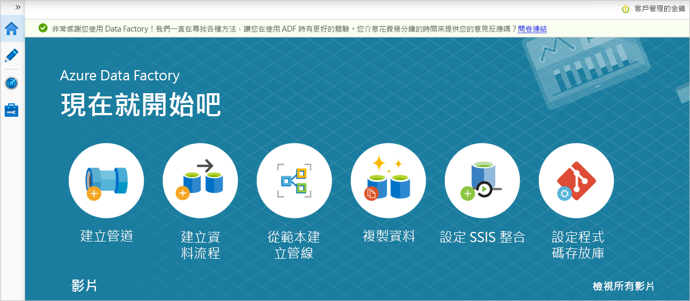

# <a name="copy-data-securely-from-azure-blob-storage-to-a-sql-database-by-using-private-endpoints"></a>使用私人端點將資料從 Azure Blob 儲存體安全地複製到 SQL 資料庫

[!INCLUDE[appliesto-adf-xxx-md](includes/appliesto-adf-xxx-md.md)]

在本教學課程中，您會使用 Azure Data Factory 使用者介面 (UI) 建立資料處理站。 此資料處理站中的管線會將資料從 Azure Blob 儲存體安全地複製到 Azure SQL 資料庫 (兩者都只允許存取選取的網路)，方法是使用 [Azure Data Factory 受控虛擬網路](managed-virtual-network-private-endpoint.md)中的私人端點。 本教學課程中的設定模式從以檔案為基礎的資料存放區複製到關聯式資料存放區。 如需支援作為來源和接收的資料存放區清單，請參閱[支援的資料存放區和格式](https://docs.microsoft.com/azure/data-factory/copy-activity-overview)資料表。

> [!NOTE]
> 如果您不熟悉 Data Factory，請參閱 [Data Factory 簡介](https://docs.microsoft.com/azure/data-factory/introduction)。

在本教學課程中，您會執行下列步驟：

* 建立資料處理站。
* 建立具有複製活動的管線。


## <a name="prerequisites"></a>必要條件
* **Azure 訂用帳戶**。 如果您沒有 Azure 訂用帳戶，請在開始前建立[免費 Azure 帳戶](https://azure.microsoft.com/free/)。
* **Azure 儲存體帳戶**。 您會使用 Blob 儲存體作為*來源*資料存放區。 如果您沒有儲存體帳戶，請參閱[建立 Azure 儲存體帳戶](https://docs.microsoft.com/azure/storage/common/storage-account-create?tabs=azure-portal)，按照步驟建立此帳戶。 請確定儲存體帳戶只允許從選取的網路存取。 
* **Azure SQL Database**。 您會使用資料庫作為*接收*資料存放區。 如果您沒有 Azure SQL 資料庫，請參閱[建立 SQL 資料庫](https://docs.microsoft.com/azure/sql-database/sql-database-get-started-portal)，按照步驟來建立 SQL 資料庫。 請確定 SQL Database 帳戶只允許從選取的網路進行存取。 

### <a name="create-a-blob-and-a-sql-table"></a>建立 Blob 和 SQL 資料表

現在，請執行下列步驟，準備本教學課程中的 Blob 儲存體和 SQL 資料庫。

#### <a name="create-a-source-blob"></a>建立來源 Blob

1. 開啟記事本。 複製下列文字，並在磁碟上將其儲存為 **emp.txt** 檔案：

    ```
    FirstName,LastName
    John,Doe
    Jane,Doe
    ```

1. 在 Blob 儲存體中，建立名為 **adftutorial** 的容器。 在此容器中建立名為 **input** 的資料夾。 然後，將 **emp.txt** 檔案上傳至 **input** 資料夾。 請使用 Azure 入口網站或 [Azure 儲存體總管](https://storageexplorer.com/)之類的工具執行這些工作。

#### <a name="create-a-sink-sql-table"></a>建立接收 SQL 資料表

使用下列 SQL 指令碼，在您的 SQL 資料庫中建立 **dbo.emp** 資料表：

    ```sql
    CREATE TABLE dbo.emp
    (
        ID int IDENTITY(1,1) NOT NULL,
        FirstName varchar(50),
        LastName varchar(50)
    )
    GO

    CREATE CLUSTERED INDEX IX_emp_ID ON dbo.emp (ID);
    ```

## <a name="create-a-data-factory"></a>建立 Data Factory
在此步驟中，您可以建立資料處理站，並啟動 Data Factory 使用者介面，在資料處理站中建立管線。

1. 開啟 Microsoft Edge 或 Google Chrome。 目前，只有 Microsoft Edge 和 Google Chrome 網頁瀏覽器支援 Data Factory UI。

1. 在左側功能表上，選取 [建立資源] > [分析] > [資料處理站]。

1. 在 [新增資料處理站] 頁面的 [名稱] 下，輸入 **ADFTutorialDataFactory**。

   Azure Data Factory 的名稱必須是 *全域唯一的*。 如果您收到有關名稱值的錯誤訊息，請輸入不同的資料處理站名稱 (例如 yournameADFTutorialDataFactory)。 如需 Data Factory 成品的命名規則，請參閱 [Data Factory 命名規則](https://docs.microsoft.com/azure/data-factory/naming-rules)。

1. 選取您要在其中建立資料處理站的 Azure **訂用帳戶**。

1. 針對 [資源群組]，採取下列其中一個步驟︰

    - 選取 [使用現有的] ，然後從下拉式清單選取現有的資源群組。
    - 選取 [建立新的] ，然後輸入資源群組的名稱。 
     
    若要了解資源群組，請參閱[使用資源群組管理您的 Azure 資源](https://docs.microsoft.com/azure/azure-resource-manager/management/overview)。 

1. 在 [版本] 下，選取 [V2]。

1. 在 [位置] 下，選取資料處理站的位置。 只有受到支援的位置會出現在下拉式清單中。 資料處理站所使用的資料存放區 (例如 Azure 儲存體和 SQL Database) 和計算 (例如 Azure HDInsight) 可位於其他區域。

1. 選取 [建立]  。

1. 建立完成後，您會在通知中心看到通知。 選取 [移至資源]，以移至 **Data Factory** 頁面。

1. 選取 [編寫與監視]，以在個別索引標籤中啟動 Data Factory 使用者介面。

## <a name="create-an-azure-integration-runtime-in-data-factory-managed-virtual-network"></a>在 Data Factory 受控虛擬網路中建立 Azure 整合執行階段
在此步驟中，您會在 Data Factory 受控虛擬網路中建立 Azure Integration Runtime。

1. 在 Data Factory 入口網站中，移至**管理**，然後選取 [新增] 以建立新的 Azure Integration Runtime。

   
1. 選擇建立 **Azure** 整合執行階段。

   
1. 在 [虛擬網路設定 (預覽)] 中，選取 [啟用]。

   
1. 選取 [建立]。

## <a name="create-a-pipeline"></a>建立管線
在此步驟中，您會在資料處理站中建立具有「複製」活動的管線。 複製活動會將資料從 Blob 儲存體複製到 SQL Database。 在[快速入門教學課程](https://docs.microsoft.com/azure/data-factory/quickstart-create-data-factory-portal)中，您已依照下列步驟建立管線：

1. 建立連結服務。
1. 建立輸入和輸出資料集。
1. 建立管道。

在本教學課程中，您首先會建立管線。 然後，您會在需要連結服務和資料集以設定管線時，建立這些項目。

1. 在 [現在就開始吧] 頁面中，選取 [建立管線]。

   
1. 在管線的屬性窗格中，輸入 **CopyPipeline** 作為管線名稱。

1. 在**活動** 工具箱中展開**移動和轉換**類別，並將**複製資料**活動從工具箱中拖曳至管線設計工具介面。 輸入 **CopyFromBlobToSql** 作為名稱。

    

### <a name="configure-a-source"></a>設定來源

>[!TIP]
>在本教學課程中，您會使用**帳戶金鑰**作為來源資料存放區的驗證類型。 如有需要，您也可以選擇其他支援的驗證方法，例如 **SAS URI**、**服務主體**和**受控識別**。 如需詳細資訊，請參閱[使用 Azure Data Factory 複製和轉換 Azure Blob 儲存體中的資料](https://docs.microsoft.com/azure/data-factory/connector-azure-blob-storage#linked-service-properties)中對應的章節。
>
>若要安全地儲存資料存放區的祕密，也建議您使用 Azure Key Vault。 如需詳細資訊和圖例，請參閱[在 Azure Key Vault 中儲存認證](https://docs.microsoft.com/azure/data-factory/store-credentials-in-key-vault)。

#### <a name="create-a-source-dataset-and-linked-service"></a>建立來源資料集和已連結的服務

1. 移至 [來源] 索引標籤。選取 [+ 新增] 以建立來源資料集。

1. 在 [新增資料集] 對話方塊中，選取 [Azure Blob 儲存體]，然後選取 [繼續]。 來源資料位於 Blob 儲存體中，因此您選取 [Azure Blob 儲存體] 作為來源資料集。

1. 在 [選取格式] 對話方塊中，選取您資料的格式類型，然後選取 [繼續]。

1. 在 [設定屬性] 對話方塊中，輸入 **SourceBlobDataset** 作為**名稱**。 選取**第一個資料列作為標頭**的核取方塊。 在 [已連結的服務] 文字方塊下，選取 [+ 新增]。

1. 在 [新增已連結的服務 (Azure Blob 儲存體)] 對話方塊中輸入 **AzureStorageLinkedService** 作為**名稱**，然後從 [儲存體帳戶名稱] 清單中選取您的儲存體帳戶。 

1. 請務必啟用**互動式製作**。 可能需要約一分鐘的時間才能啟用。

    

1. 選取 [測試連線]。 當儲存體帳戶只允許從**選取的網路**存取，而且需要 Data Factory 來建立應該在使用其之前核准的私人端點時，就會發生失敗。 在錯誤訊息中，您應該會看到一個連結，可讓您建立私人端點，以供您建立受控私人端點。 另一個替代方式是直接前往**管理**索引標籤，並遵循[下一節](#create-a-managed-private-endpoint)中的指示建立受控私人端點。

   > [!NOTE]
   > 並非所有資料處理站執行個體圴可使用**管理**索引標籤。 如果您沒有看到該索引標籤，可以選取 [作者] > [連線] > [私人端點] 來存取私人端點。
1. 讓對話方塊保持開啟，然後移至儲存體帳戶。

1. 遵循[本節](#approval-of-a-private-link-in-a-storage-account)的指示來核准私人連結。

1. 返回對話方塊。 選取 [測試連線]，然後選取 [建立] 以部署已連結的服務。

1. 建立已連結的服務之後，您會回到**設定屬性**頁面。 在 [檔案路徑] 旁，選取 [瀏覽]。

1. 移至 **adftutorial/input** 資料夾，選取 **emp.txt** 檔案，然後選取 [確定]。

1. 選取 [確定]。 系統會自動前往管線頁面。 在**來源** 索引標籤中，確認已選取 [SourceBlobDataset]。 若要預覽此頁面上的資料，請選取 [預覽資料]。

    

#### <a name="create-a-managed-private-endpoint"></a>建立受控私人端點

如果您未在測試連線時選取超連結，請遵循路徑。 現在您需要建立受控私人端點，以連線至所建立的已連結服務。

1. 移至**管理**索引標籤。

   > [!NOTE]
   > 並非所有 Data Factory 執行個體圴可使用**管理**索引標籤。 如果您沒有看到該索引標籤，可以選取 [作者] > [連線] > [私人端點] 來存取私人端點。

1. 移至**受控私人端點**區段。

1. 在**受控私人端點**之下選取 [+新增]。

    ![顯示 [受控私人端點新增] 按鈕的螢幕擷取畫面。](./media/tutorial-copy-data-portal-private/new-managed-private-endpoint.png) 

1. 從清單中選取 **Azure Blob 儲存體**圖格，然後選取 [繼續]。

1. 輸入建立之儲存體帳戶的名稱。

1. 選取 [建立]。

1. 在等候幾秒鐘之後，您應該會看到建立的私人連結需要核准。

1. 選取之前建立的私人端點。 您會看到超連結，引導您在儲存體帳戶層級核准私人端點。

     

#### <a name="approval-of-a-private-link-in-a-storage-account"></a>在儲存體帳戶中核准私人連結
1. 在儲存體帳戶中，移至**設定**區段下的**私人端點連線**。

1. 選取您建立的私人端點核取方塊，然後選取 [核准]。

    

1. 新增描述，然後選取 [是]。
1. 回到 Data Factory 中**管理**索引標籤的**受控私人端點**區段。
1. 大約一或兩分鐘後，您應該會看到 Data Factory UI 中出現私人端點的核准狀態。


### <a name="configure-a-sink"></a>設定接收
>[!TIP]
>在本教學課程中，您會使用 **SQL 驗證**作為接收資料存放區的驗證類型。 如有需要，您也可以選擇其他支援的驗證方法，例如 **服務主體**和**受控識別**。 如需詳細資訊，請參閱[使用 Azure Data Factory 複製和轉換 Azure SQL Database 中的資料](https://docs.microsoft.com/azure/data-factory/connector-azure-sql-database#linked-service-properties)中對應的章節。
>
>若要安全地儲存資料存放區的祕密，也建議您使用 Azure Key Vault。 如需詳細資訊和圖例，請參閱[在 Azure Key Vault 中儲存認證](https://docs.microsoft.com/azure/data-factory/store-credentials-in-key-vault)。

#### <a name="create-a-sink-dataset-and-linked-service"></a>建立接收資料集和已連結的服務
1. 移至 [接收] 索引標籤，然後選取 [+ 新增] 以建立接收資料集。

1. 在**新增資料集**對話方塊的搜尋方塊中，輸入 **SQL** 以篩選連接器。 選取 [Azure SQL Database]，然後選取 [繼續]。 在本教學課程中，您會將資料複製到 SQL 資料庫。

1. 在 [設定屬性] 對話方塊中，輸入 **OutputSqlDataset** 作為**名稱**。 從 [已連結的服務] 下拉式清單中，選取 [+ 新增]。 資料集必須與連結的服務相關聯。 連結服務具有連接字串，可供 Data Factory 在執行階段中用來連線到 SQL 資料庫。 資料集會指定要作為資料複製目的地的容器、資料夾和檔案 (選擇性)。

1. 在 [新增已連結的服務 (Azure SQL Database)] 對話方塊中，執行下列步驟：

    1. 在 [名稱] 下，輸入 **AzureSqlDatabaseLinkedService**。
    1. 在 [伺服器名稱] 下，選取您的 SQL Server 執行個體。
    1. 請務必啟用**互動式製作**。
    1. 在 [資料庫名稱] 下，選取您的 SQL 資料庫。
    1. 在 [使用者名稱] 下，輸入使用者名稱。
    1. 在 [密碼] 下，輸入使用者的密碼。
    1. 選取 [測試連線]。 由於 SQL 伺服器只允許從**選取的網路**存取，而且需要 Data Factory 來建立應該在使用其之前核准的私人端點，因此應該會發生失敗的情況。 在錯誤訊息中，您應該會看到一個連結，可讓您建立私人端點，以供您建立受控私人端點。 另一個替代方式是直接前往**管理**索引標籤，並遵循下一節中的指示建立受控私人端點。
    1. 讓對話方塊保持開啟，然後移至您選取的 SQL 伺服器。
    1. 遵循[本節](#approval-of-a-private-link-in-sql-server)的指示來核准私人連結。
    1. 返回對話方塊。 選取 [測試連線]，然後選取 [建立] 以部署已連結的服務。

1. 如此會自動前往**設定屬性**對話方塊。 在 [資料表] 中，選取 **[dbo].[emp]** 。 然後選取 [確定]。

1. 移至含有管線的索引標籤，然後在**接收資料集**中確認已選取 **OutputSqlDataset**。

    

您可以藉由遵循[複製活動中的結構描述對應](https://docs.microsoft.com/azure/data-factory/copy-activity-schema-and-type-mapping)，選擇性地將來源的結構描述對應至目的地的相對應結構描述。

#### <a name="create-a-managed-private-endpoint"></a>建立受控私人端點

如果您未在測試連線時選取超連結，請遵循路徑。 現在您需要建立受控私人端點，以連線至所建立的已連結服務。

1. 移至**管理**索引標籤。
1. 移至**受控私人端點**區段。
1. 在**受控私人端點**之下選取 [+新增]。

    ![顯示 [受控私人端點新增] 按鈕的螢幕擷取畫面。](./media/tutorial-copy-data-portal-private/new-managed-private-endpoint.png) 

1. 從清單中選取 **Azure SQL Database** 圖格，然後選取 [繼續]。
1. 輸入您選取的 SQL 伺服器名稱。
1. 選取 [建立]  。
1. 在等候幾秒鐘之後，您應該會看到建立的私人連結需要核准。
1. 選取之前建立的私人端點。 您會看到超連結，引導您在 SQL 伺服器層級核准私人端點。


#### <a name="approval-of-a-private-link-in-sql-server"></a>在 SQL Server 中核准私人連結
1. 在 SQL 伺服器中，移至**設定**區段下的**私人端點連線**。
1. 選取您建立的私人端點核取方塊，然後選取 [核准]。
1. 新增描述，然後選取 [是]。
1. 回到 Data Factory 中**管理**索引標籤的**受控私人端點**區段。
1. 系統應該需要一或兩分鐘的時間，才會核准您的私人端點。

#### <a name="debug-and-publish-the-pipeline"></a>偵錯和發佈管線

您可以先對管線執行偵錯，再將成品 (連結服務、資料集和管線) 發佈至 Data Factory 或您自己的 Azure Repos Git 存放庫。

1. 若要對管線進行偵錯，請選取工具列上的 [偵錯]。 您可以在視窗底部的 [輸出] 索引標籤中檢視管線執行的狀態。
1. 當管線可成功執行後，請在頂端的工具列中選取 [全部發佈]。 此動作會將您已建立的實體 (資料集和管線) 發佈至 Data Factory。
1. 請靜待 [發佈成功] 訊息顯示。 若要查看通知訊息，請選取右上角的 [顯示通知] (鐘形按鈕)。


#### <a name="summary"></a>摘要
此範例中的管線會使用 Data Factory 受控虛擬網路中的私人端點，將資料從 Blob 儲存體複製到 SQL Database。 您已了解如何︰

* 建立資料處理站。
* 建立具有複製活動的管線。

